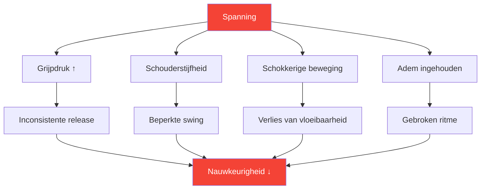
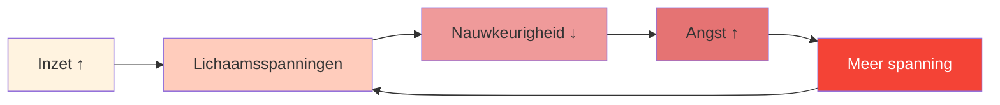

# Spanning en precisie: de verborgen verbinding

> &quot;Je kunt niet tegelijkertijd gespannen en nauwkeurig zijn. Dat is fysiek onmogelijk.&quot;

Je kent het wel: die cruciale worp waarbij je lichaam zich aanspant, je grip verbetert en de bal precies terechtkomt waar je hem niet wilde hebben. Spanning is de stille moordenaar van precisie.

::: danger De verborgen vijand
**De meeste spanning is onzichtbaar voor de speler die het ervaart.** Je weet pas dat je gespannen bent als het te laat is.
:::

---

## De biomechanica van spanning

---

## Waar spanning schuilgaat

De meeste spelers zijn zich bewust van grove spanning (gespannen schouders voor een belangrijke worp). Weinigen merken echter de subtiele spanning op die de prestaties consequent negatief beïnvloedt:

| Locatie | Effect bij gooien | Hoe je het kunt opmerken |
|----------|-----------------|---------------|
| **Grip** | Inconsistente timing van de release | Balafdrukken op de handpalm |
| **Onderarm** | Verminderde beweeglijkheid van de pols | Brandend gevoel |
| **Schouder** | Beperkte zwaaihoek | De worp voelt &quot;kort&quot; aan. |
| **Nek** | Gewijzigde hoofdpositie | Stijfheid na wedstrijden |
| **Kaak** | Spanningscascade over het hele lichaam | Op elkaar geklemde tanden |
| **Adem** | Verstoord ritme | Adem inhouden |

---

## De druk-spanningspiraal

Onder druk begint een destructieve cyclus:

::: tip Doorbreek de cyclus
**Onderbreek bij stap 2** — voordat spanning de prestatie beïnvloedt. Daarom zijn routines met spanningsmetingen vóór de opname essentieel.
:::

## Je spanningspatronen opsporen

### De lichaamsscanmethode

Sluit voordat je gaat oefenen je ogen en kijk even rond:

1. Begin bij je voeten — grijp je je tenen vast?
2. Beweeg je benen omhoog — Zijn je knieën gestrekt?
3. Let op je heupen en romp — Span je je spieren aan?
4. Kijk over je schouders — Zijn er hoogteverschillen?
5. Controleer armen en handen — Is er sprake van een voortijdige greep?
6. Let op nek en gezicht — zie je spanning in je spieren?

Beoordeel de spanning op elke locatie met een score van 0-10. **Uw basiswaarde moet 2 of lager zijn.**

### De videomethode

Neem jezelf op terwijl je de bal gooit:
- Oefening met lage inzet
- Oefening met matige inzet
- Competitie met hoge inzet

Vergelijk je lichaamstaal. Waar span je je aan naarmate de spanning toeneemt?

### De partnermethode

Vraag een teamgenoot om te observeren:
- Je gezichtsuitdrukking vlak voor belangrijke worpen
- Je houding verandert onder druk.
- Je ademhalingspatronen
- Uw greepgedrag

Externe waarnemers zien wat wij niet kunnen voelen.

## Releasetechnieken

### Snelontgrendelaars (te gebruiken tijdens wedstrijden)

**De definitieve uitslag**
- Een korte, krachtige hand- en armdruk.
- Vrijgave van wachtpatronen
- Duurt 2-3 seconden

**De Uitademingsdruppel**
- Adem diep in
- Laat bij het uitademen bewust je schouders zakken.
- Ontspan tegelijkertijd de spanning in je kaak.

**De Grip Reset**
- Open je hand volledig
- Spreid je vingers wijd uit.
- Pak opnieuw vast met de minimaal noodzakelijke kracht.

### Diepe releases (gebruik tijdens training/voorafgaand aan wedstrijden)

**Progressieve spierontspanning**
- Span elke spiergroep bewust aan (5 seconden).
- Laat volledig los (15 seconden)
- Merk het verschil op.
- Werk aan je hele lichaam.

**Verband tussen ademhaling en lichaam**
- Langzaam ademhalen (4 tellen in, 6 tellen uit)
- Ontspan bij elke uitademing een lichaamsdeel.
- Ga door tot je hele lichaam ontspannen is.

## De pre-opname-integratie

Integreer spanningsbewustzijn in je voorbereiding op de opname:

### Voordat je de cirkel betreedt
- Snelle lichaamsscan (2 seconden)
- Eén loslatende uitademing
- Zorg voor een ontspannen greep.

### In de Cirkel
- Laatste adem om tot rust te komen
- Zachte focus op het doel
- Begin de worp vanuit een ontspannen houding.

### Na de worp
- Let op waar de spanning zich heeft opgebouwd.
- Schud indien nodig uit.
- Reset voor de volgende worp

## Training in spanningsbewustzijn

### Oefening 1: De minimale greep

Zoek de minimale grijpdruk waarbij de controle behouden blijft:
- Begin met een stevige grip en gooi 5 ballen.
- Verminder je grip met 20% — gooi 5 ballen
- Ga door met het verlagen van de reductie totdat de controle verloren gaat.
- Ga een niveau terug — dit is je optimale grip.

De meeste spelers grijpen 40-60% harder dan nodig.

### Oefening 2: Druksimulatie

Oefen onder kunstmatige druk en houd daarbij de spanning in de gaten:
- Verbind consequenties aan oefenworpen.
- Let op waar spanning ontstaat.
- Oefen het loslaten terwijl je je blijft concentreren.
- Verhoog geleidelijk de druktolerantie

### Oefening 3: De ontspannen aanwijsstok

Beoordeel jezelf op twee dimensies:
- Technisch resultaat (waar landde de bal?)
- Spanningsniveau (hoe ontspannen was je?)

**Doel:** Beide tegelijkertijd maximaliseren. Veel spelers moeten in eerste instantie genoegen nemen met iets mindere resultaten, omdat ze moeten leren om ontspannen te gooien.

## Protocol voor de wedstrijddag

### Voorafgaand aan de wedstrijd
- 10 minuten progressieve ontspanning
- Lichaamsscan om spanningspatronen te identificeren
- Schudroutine

### Tussen de uiteinden
- Korte opruimactie
- Eén loslatende ademhaling
- Spanningscontrole vóór kritieke worpen

### Tijdens het gooien
- Vertrouw op je voorbereiding op de foto.
- De ontgrendelingstechniek is voorgeprogrammeerd.
- Tijdens de uitvoering moet je niet bewust controle uitoefenen.

## Veelgemaakte fouten

::: warning Vermijd deze
- **Overmatige ontspanning** — Enige activering is noodzakelijk
- **Bewuste controle tijdens het gooien** — Verstoort de flow
- **Alleen ontspannen bij grote worpen** — Moet consistent zijn
- **Ademhaling negeren** — Ademhaling en spanning zijn met elkaar verbonden.
- **De routine overhaasten** — Het loslaten van spanning kost tijd.
:::

## Het voordeel op lange termijn

Spelers die de kunst van het omgaan met spanning beheersen:
- Presteer consistenter onder druk
- Ervaar minder fysieke vermoeidheid
- Sneller herstellen van fouten
- Geniet meer van de competitie.

---

## Gerelateerde inhoud

- [Module Spanningsmanagement](/en/education/tension/) — Complete education
- [Fysieke voorbereiding](/en/education/tension/physical) — Lichaamsgereedheid
- [Drukmanagement](/en/articles/pressure-management) — Mentale aspecten

