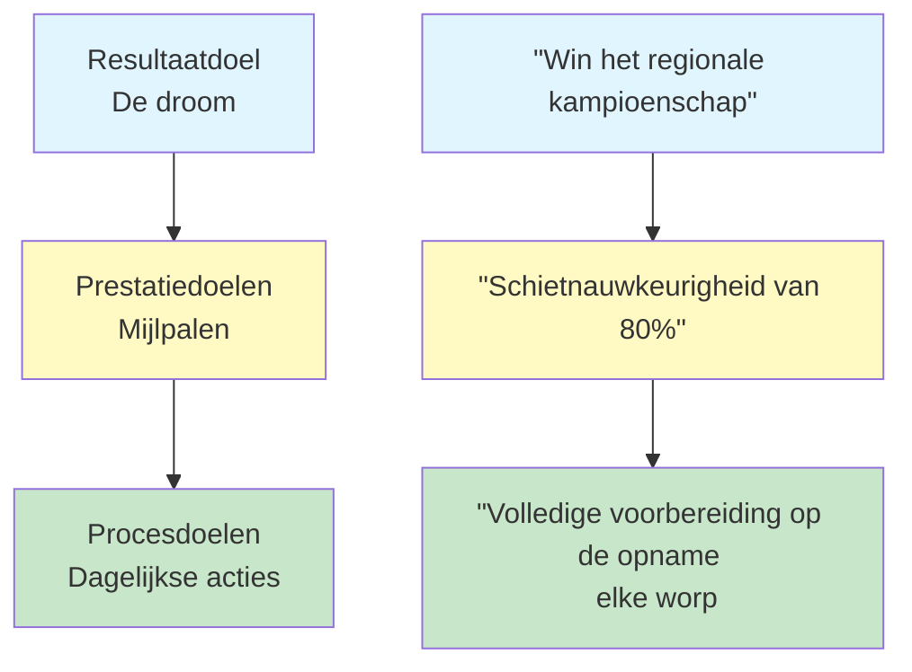

# Doelstellingen formuleren voor pétanque-spelers

Duidelijke doelen zijn je kompas. Ze geven richting aan je training, motiveren je wanneer het moeilijk wordt en stellen je in staat je vooruitgang te meten. Zonder doelen gooi je maar wat rond. Met doelen werk je ergens naartoe.

::: tip Het kernprincipe
**Een doel zonder plan is slechts een wens.** Stel duidelijke doelen, verdeel ze in kleinere stappen, focus op wat je wél kunt beïnvloeden en houd je voortgang bij.
:::

## Waarom doelen belangrijk zijn

Doelen dienen meerdere doeleinden:
- **Aanwijzingen:** Weet waaraan je moet werken
- **Motivatie:** Iets hebben om naar te streven
- **Meten:** Houd je voortgang bij
- **Aandachtspunt:** Geef prioriteit aan je beperkte tijd.

Voor de zelfstandige speler zijn doelen bijzonder belangrijk. Zonder een coach die je aanspoort, worden je doelen je leidraad.

## De drie soorten doelen

Niet alle doelen zijn gelijk. Inzicht in de verschillende soorten doelen helpt je betere doelen te stellen.

### 1. Resultaatdoelen
**Wat:** Het gewenste eindresultaat
**Voorbeeld:** &quot;Win het regionale kampioenschap&quot;
**Controleniveau:** Laag - afhankelijk van tegenstanders, omstandigheden en geluk.

### 2. Prestatiedoelen
**Wat:** Specifieke prestatienormen
**Voorbeeld:** &quot;Behaal een nauwkeurigheid van 80% bij schietoefeningen&quot;
**Controleniveau:** Gemiddeld - hangt grotendeels van jou af.

### 3. Procesdoelen
**Wat:** Handelingen en gedragingen die je zelf in de hand hebt
**Voorbeeld:** &quot;Voltooi mijn voorbereidingsroutine bij elke worp&quot;
**Controleniveau:** Hoog - geheel naar uw eigen keuze.

### De doelhiërarchie

::: warning Kerninzicht
**Richt je aandacht vooral op de procesdoelen.** Die heb je zelf in de hand en leiden tot de gewenste resultaten.

- **Resultaatdoelen:** Weinig controle, veel motivatie
- **Prestatiedoelen:** Gemiddelde controle, meetbare vooruitgang
- **Procesdoelen:** Hoge mate van controle, dagelijkse focus ← **Focus hier**
:::

## Het SMART-raamwerk

::: info Checklist voor SMART-doelen
Elk doel zou moeten zijn:
- ✅ **Specifiek** - Duidelijk en goed gedefinieerd
- ✅ **M**emetbaar - Je kunt je voortgang bijhouden
- ✅ **A**haalbaar - Uitdagend maar mogelijk
- ✅ **R**elevant - Afgestemd op je grotere geheel
- ✅ **Tijdgebonden** - Heeft een deadline
:::

### S - Specifiek
❌ &quot;Word beter in schieten&quot;
✅ &quot;Verbeter mijn nauwkeurigheid bij directe treffers vanaf 8 meter&quot;

### M - Meetbaar
❌ &quot;Schiet nauwkeuriger&quot;
✅ &quot;Behaal minimaal 24/30 punten bij de schietoefening met de ladder&quot;

### A - Haalbaar
❌ &quot;Mis nooit een schot&quot; (onmogelijk)
✅ &quot;Verbeter je nauwkeurigheid met 10% in 8 weken&quot; (uitdagend maar realistisch)

### R - Relevant
❌ &quot;Een marathon lopen&quot; (niet direct gerelateerd)
✅ &quot;Verbeter je balans en stabiliteit voor een betere worp&quot; (ondersteunt je spel)

### T - Tijdsgebonden
❌ &quot;Ooit zal het beter met me gaan&quot;
✅ &quot;Voor 15 maart zal ik bereiken...&quot;

## Voorbeelden van doelen bij pétanque

| Type | Slecht doel | SMART-doel |
|------|-----------|------------|
| Resultaat | &quot;Win meer&quot; | &quot;Bereik de halve finales van het voorjaarstoernooi&quot; |
| Prestatie | &quot;Beter aanwijzen&quot; | &quot;Behaal 70% van de punten binnen 50 cm op een afstand van 8 m&quot; |
| Proces | &quot;Oefen meer&quot; | &quot;Voltooi 3 gerichte trainingssessies per week&quot; |

## Het opdelen van grote doelen

Grote doelen kunnen overweldigend aanvoelen. Verdeel ze in kleinere onderdelen:

### Voorbeeld: &quot;Win het clubkampioenschap (over 12 maanden)&quot;

**Jaardoel:** Clubkampioenschap winnen

**Doelstellingen per kwartaal:**
- Vraag 1: Verbeter de schietnauwkeurigheid tot 75%.
- Vraag 2: Ontwikkel een consistente routine vóór de opname.
- Vraag 3: Beheers situaties onder druk
- Vraag 4: Topprestaties en wedstrijdvoorbereiding

**Maandelijkse doelen (Q1):**
- Maand 1: Stel de basislijn vast en identificeer de zwakke punten.
- Maand 2: Focus op de schiettechniek
- Maand 3: Verhoog de druk tijdens schietoefeningen

**Wekelijkse doelen (maand 2):**
- Week 1: 3 schietsessies, videoanalyse
- Week 2: Werken aan het geïdentificeerde technische probleem
- Week 3: De afstand geleidelijk vergroten
- Week 4: Test de voortgang en pas het plan aan.

## Je doelen verbinden met je &#39;waarom&#39;.

Doelen werken beter wanneer ze verbonden zijn met een dieperliggende motivatie.

Stel jezelf de volgende vraag:
- Waarom wil ik dit bereiken?
- Wat zal het voor mij betekenen?
- Hoe zal ik me voelen als het me lukt?
- Wat motiveert mij om te verbeteren?

Schrijf je antwoorden op. Kijk er nog eens naar terug als je motivatie afneemt.

## In deze sectie

- **[SMART-doelen in detail](/en/education/goals/smart-goals)** - Een diepgaande analyse van het formuleren van effectieve doelen
- **[Je trainingsplan opstellen](/en/education/goals/planning)** - Zet doelen om in actie

## Samenvatting: Regels voor het stellen van doelen

::: tip Regel #1: De controleregel
**Richt je op procesdoelen (wat je kunt beïnvloeden) in plaats van op resultaatdoelen.**
Procesdoelen leiden tot prestatiedoelen, die op hun beurt leiden tot resultaatdoelen.
:::

::: tip Regel #2: De SMART-regel
**Doelen moeten specifiek, meetbaar, haalbaar, relevant en tijdgebonden zijn.**
Vage doelen leiden tot vage resultaten. SMART-doelen zorgen voor vooruitgang.
:::

::: tip Regel #3: De ineenstortingsregel
**Grote doelen vereisen mijlpalen op kwartaal-, maand- en weekniveau.**
Deel grote doelen op in kleine, uitvoerbare stappen die je deze week kunt voltooien.
:::

::: tip Regel #4: De verbindingsregel
**Verbind je doelen met je diepere &quot;waarom&quot;.**
Als je motivatie verdwijnt, houdt je &quot;waarom&quot; je op de been.
:::

## Belangrijkste conclusie

> Een doel zonder plan is slechts een wens.

Stel duidelijke doelen. Verdeel ze in kleinere stappen. Concentreer je op wat je wél kunt beïnvloeden. Houd je voortgang bij.

