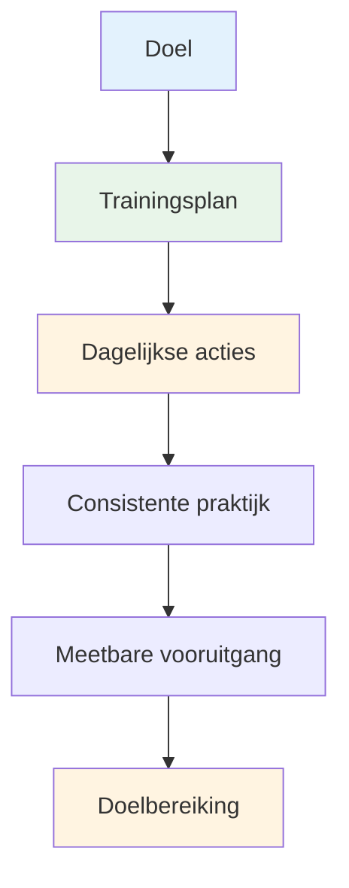

# Je trainingsplan opstellen

Doelen zonder plan blijven slechts wensen. Deze gids helpt je om je doelen om te zetten in een gestructureerd trainingsplan dat daadwerkelijk werkt.

::: tip Het Grote Idee
**Doelen zonder plan zijn slechts wensen.** Een gestructureerd trainingsplan zet je doelen om in dagelijkse acties die leiden tot echte vooruitgang.
:::

## De 8 fasen van zelfgestuurde ontwikkeling

### Fase 1: Stel je kompas in (Doelen)
Je hebt al geleerd over SMART-doelen. Plaats ze nu in een hiërarchie:

1. **Langetermijndoel** (1-2 jaar): Jouw droom
2. **Jaarlijks doel**: Doelstelling voor dit jaar
3. **Doelstellingen per kwartaal**: mijlpalen per 3 maanden
4. **Maandelijkse doelen**: Specifieke aandachtsgebieden
5. **Wekelijkse doelen**: Trainingsdoelen

### Fase 2: Beoordeel uw middelen

Voordat je begint met plannen, moet je eerlijk evalueren wat je hebt:

| Hulpbron | Vragen om te stellen |
|----------|-----------------|
| **Tijd** | Hoeveel uur per week kun je realistisch gezien trainen? |
| **Locatie** | Heb je toegang tot een goede piste? Hoe is de kwaliteit van het oppervlak? |
| **Apparatuur** | Beschikt u over geschikte boules? Meetinstrumenten? Video-opnameapparatuur? |
| **Kennis** | Wat zijn je technische sterke en zwakke punten? |
| **Fysieke conditie** | Zijn er beperkingen? Zijn er gebieden die verbetering behoeven? |

Wees eerlijk. Een realistisch plan is beter dan een ambitieuze fantasie.

### Fase 3: Kies je oefeningen

Kies oefeningen die direct aansluiten bij je doelen:

**Ter verbetering van de aanwijsvaardigheden:**
- Nauwkeurig aanwijzen van gemarkeerde zones
- Oefeningen met variatie in afstand
- Verschillende ondergronden

**Tip voor betere opnames:**
- Schietladder (oplopende afstanden)
- Schieten over een obstakel (gedwongen hoge boog)
- Oefening met bewegend doelwit

**Voor mentale ontwikkeling:**
- Oefening van de voorbereiding op de opname
- Visualisatiesessies
- Druksimulatie

**Breng balans in je programma:**
- Technische werkzaamheden (richten, filmen)
- Mentale training (mindfulness, visualisatie)
- Fysieke conditie (balans, flexibiliteit)
- Wedstrijdspel (vaardigheden toepassen)

### Fase 4: Stel je planning samen

Stel een realistisch weekschema op:

| Dag | Ochtend | Middag | Avond | Focus |
|-----|---------|-----------|---------|-------|
| ma | - | Technisch: Aanwijzen | Lichte mobiliteit | Precisie |
| di | - | Technisch: Opnames | - | Vermogen/nauwkeurigheid |
| wo | - | Mentale training | - | Mindfulness |
| Do | - | Gemengd: Spelscenario&#39;s | Lichte mobiliteit | Sollicitatie |
| vr | - | Technisch: Zwakte | - | Verbetering |
| Zat | Wedstrijd of competitie | - | - | Prestatie |
| Zon | Rest | Wekelijkse evaluatie | Planning | Herstel |

**Belangrijkste principes:**
- Geef prioriteit aan mentale training (dit wordt vaak verwaarloosd).
- Neem rustdagen mee in de planning.
- Breng verschillende vaardigheden in balans.
- Behoud flexibiliteit voor het leven.

### Fase 5: Bereid je voor op obstakels

Er zullen dingen misgaan. Houd daar rekening mee.

| Risico | Waarschijnlijkheid | Invloed | Back-upplan |
|------|------------|--------|-------------|
| Tijdgebrek | Hoog | Medium | Zorg dat je een &quot;minimale sessie&quot; klaar hebt (20 minuten). |
| Slecht weer | Medium | Medium | Binnenvisualisatie, videostudie |
| Lage motivatie | Hoog | Medium | Keer terug naar het &quot;waarom&quot;, stel kleinere doelen en neem een pauze. |
| Lichte verwonding | Medium | Hoog | Focus op mentale training, vaardigheden die niet aangetast zijn. |
| Geen oefenpartner | Medium | Laag | Solo-oefeningen, zelfanalyse via video |

### Fase 6: Houd je voortgang bij

Wat gemeten wordt, kan beheerd worden.

**Houd een trainingsdagboek bij:**
- Datum en duur
- Voltooide oefeningen
- Uitslagen/resultaten
- Hoe je je voelde (energie, focus, flow)
- Technische notities
- Weer/omstandigheden

**Wekelijkse evaluatievragen:**
- Heb ik mijn geplande sessies afgerond?
- Welke scores heb ik behaald?
- Wat voelde goed? Wat was moeilijk?
- Heb je wel eens een flow-ervaring gehad?
- Wat moet ik aanpassen?

### Fase 7: Blijf gemotiveerd

Motivatie fluctueert. Ontwikkel systemen om die motivatie te behouden:

**Interne motivatie:**
- Verbind je met je &quot;waarom&quot;.
- Vier de kleine successen.
- Merk na verloop van tijd verbetering op.
- Vind plezier in het proces.

**Externe ondersteuning:**
- Trainingspartners (zelfs af en toe)
- Deel je doelen met iemand.
- Sluit je aan bij online communities
- Volg reeksen en consistentie

**Wanneer de motivatie afneemt:**
- Doe in ieder geval een korte sessie (iets is beter dan niets).
- Verander je omgeving.
- Bekijk je voortgang
- Denk terug aan successen uit het verleden.
- Neem indien nodig een geplande pauze.

### Fase 8: Evalueren en aanpassen

Je plan moet zich ontwikkelen:

**Wekelijks:** Snelle evaluatie, kleine aanpassingen
**Maandelijks:** Evalueer de voortgang richting de maandelijkse doelen en pas de focus aan.
**Kwartaaloverzicht:** Grote evaluatie, vaststellen van de doelen voor het volgende kwartaal
**Jaarlijks:** Volledige evaluatie, nieuw jaarplan

**Vragen ter beoordeling:**
- Boek ik vooruitgang in het bereiken van mijn doelen?
- Is mijn training effectief?
- Heb ik andere oefeningen nodig?
- Zijn mijn doelen nog steeds relevant?
- Wat heb ik geleerd?

## Voorbeeld van een 8-wekenplan

**Doel:** De schietnauwkeurigheid met 15% verbeteren.

| Week | Focus | Belangrijke sessies |
|------|-------|--------------|
| 1 | Basislijn | Test het huidige niveau, videoanalyse |
| 2 | Techniek | Identificeer en werk aan het belangrijkste probleem. |
| 3 | Herhaling | Schietoefeningen met een hoog volume |
| 4 | Test | Tussentijdse beoordeling, aanpassen |
| 5 | Variatie | Verschillende afstanden en hoeken |
| 6 | Druk | Voeg consequenties toe aan oefeningen. |
| 7 | Integratie | Spelachtige scenario&#39;s |
| 8 | Eindtoets | Verbetering meten |

## Belangrijkste conclusie

> Maak een plan voor je werk en voer dat plan vervolgens uit. Maar wees wel bereid om je aan te passen.

Het beste plan is een plan dat je ook daadwerkelijk volgt. Begin eenvoudig, blijf consequent en pas het aan naarmate je meer leert.

