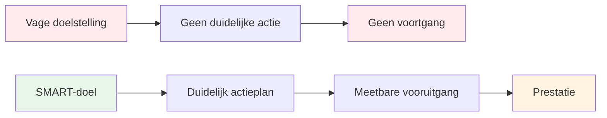

# SMART-doelen voor pétanque
<AdBanner />

Het SMART-raamwerk zet vage wensen om in concrete doelen. Laten we elk element eens nader bekijken, met specifieke voorbeelden voor pétanque.

::: tip Het Grote Idee
**Vage doelen leiden tot vage resultaten.** SMART-doelen creëren duidelijkheid, actie en meetbare vooruitgang. Transformeer &quot;Ik wil beter worden&quot; in specifieke doelen die je daadwerkelijk kunt bereiken.
:::

## S - Specifiek

Een specifiek doel geeft antwoord op deze vragen:
- Wat wil ik precies bereiken?
- Waar zal dit gebeuren?
- Welke aspecten spelen hierbij een rol?

### Doelen concreet maken

| Onduidelijk | Specifiek |
|-------|----------|
| &quot;Mijn aanwijsvaardigheid verbeteren&quot; | &quot;Mijn richtnauwkeurigheid op grindoppervlakken op afstanden van 7-9 meter verbeteren&quot; |
| &quot;Word mentaal sterker&quot; | &quot;Ontwikkel een consistente routine vóór elke worp die ik gebruik.&quot; |
| &quot;Win meer wedstrijden&quot; | &quot;Win minstens 60% van mijn competitieve wedstrijden dit seizoen&quot; |

### Specificiteitschecklist
- [ ] Kan iemand anders precies begrijpen wat ik probeer te doen?
- [ ] Heb ik de voorwaarden (afstand, ondergrond, situatie) gedefinieerd?
- [ ] Is er maar één interpretatie van dit doel?

## M - Meetbaar

Als je het niet kunt meten, kun je het niet beheren. Meetbare doelen stellen je in staat de voortgang te volgen en te weten wanneer je succes hebt geboekt.

### Manieren om pétanque-doelen te meten

**Kwantitatieve meetmethoden:**
- Behaalde punten tijdens oefeningen (bijv. 24/30)
- Nauwkeurigheid in percentages (bijv. 75% trefkans)
- Afstand tot het doel (bijv. gemiddeld 30 cm van de krik)
- Consistentie (bijv. 3 succesvolle sessies achter elkaar)

**Het gebruik van trainingsoefeningen als meetinstrument:**

| Oefening | Wat het meet | Doelvoorbeeld |
|-------|-----------------|----------------|
| Schietladder | Schietnauwkeurigheid onder druk | Bereik een hoogte van 10 meter binnen 30 boules. |
| Richtingsnauwkeurigheid | Richtingsnauwkeurigheid naar de zone | 24/30 punten |
| Afstandsvariatie | Diepteregeling | 80% binnen 50 cm |

### Uw metingen bijhouden
Houd een eenvoudig logboek bij:
- Datum
- Oefening/drill
- Score/resultaat
- Omstandigheden (oppervlakte, weer)
- Notities

## A - Haalbaar (maar uitdagend)

Doelen moeten je uitdagen, maar niet onmogelijk zijn.

### Het juiste niveau vinden

**Te makkelijk:** &quot;Oefen één keer deze maand&quot;
- Geen groei, geen motivatie

<AdInArticle />

**Te moeilijk:** &quot;Mis nooit een schot&quot;
- Onmogelijk, leidt tot frustratie

**Precies goed:** &quot;Verbeter je schietnauwkeurigheid met 15% in 8 weken&quot;
- Uitdagend maar realistisch, met de nodige inspanning.

### Vragen om de haalbaarheid te toetsen
- Hebben anderen op mijn niveau dit ook bereikt?
- Beschik ik over de benodigde tijd en middelen?
- Ligt dit (grotendeels) binnen mijn macht?
- Ben ik bereid te doen wat nodig is?

### Ambitieuze doelen
Het is prima om ambitieuze langetermijndoelen te hebben. Zorg er alleen voor dat je kortetermijndoelen haalbare stappen zijn om die doelen te bereiken.

## R - Relevant

Je doelen moeten aansluiten bij je grotere visie.

### Relevantievragen
- Draagt dit doel bij aan mijn algehele ontwikkeling?
- Is dit op dit moment de juiste prioriteit?
- Past dit binnen de tijd en middelen die ik tot mijn beschikking heb?
- Word ik werkelijk gemotiveerd door dit doel?

### Voorbeeld: Relevantie controleren

**Situatie:** Je wilt op nationaal niveau meedoen aan wedstrijden.

**Relevante doelen:**
- Verbeter de schietnauwkeurigheid (dit heeft direct invloed op de resultaten)
- Ontwikkel mentale routines (helpt in stressvolle situaties)
- Verhoog de trainingsfrequentie (dit zorgt voor snellere vaardigheidsontwikkeling).

**Minder relevante doelen:**
- Leer trucshots (leuk, maar geen prioriteit voor wedstrijden).
- Koop dure nieuwe jeu de boules (materiaal is niet je beperkende factor).

## T - Tijdsgebonden

Deadlines creëren urgentie en maken planning mogelijk.

### Tijdslimieten vaststellen

| Doeltype | Typisch tijdsbestek |
|-----------|------------------|
| Lange termijn | 1-3 jaar |
| Jaarlijks | 12 maanden |
| Driemaandelijks | 3 maanden |
| Maandelijks | 4 weken |
| Wekelijks | 7 dagen |
| Sessie | Individuele praktijk |

### Voorbeeld tijdlijn

**Langetermijndoel (2 jaar):** Kwalificatie voor selectie voor het nationale team

**Jaarlijks:** Eindig in de top 10 van de regionale ranglijst

**Kwartaal (Q1):**
- Stel een consistente trainingsroutine vast.
- Verbeter je schietnauwkeurigheid tot 70%.

**Maandelijks (januari):**
- Week 1: Huidige niveau beoordelen, uitgangspunten vaststellen
- Week 2-3: Focus op de schiettechniek
- Week 4: Test en meet de voortgang

**Wekelijks:**
- Maandag: Technische schietsessie
- Woensdag: Aanwijzen en spelsituaties
- Vrijdag: Mentale training en visualisatie
- Weekend: Wedstrijd of oefensessie

## Alles samenvoegen

### Werkblad voor het stellen van doelen

**Mijn doel (eerste versie):**
_________________________________

**Specifiek - Wat precies?**
_________________________________

**Meetbaar - Hoe weet ik dat?**
_________________________________

**Haalbaar - Is het realistisch?**
_________________________________

**Relevant - Waarom is dit belangrijk?**
_________________________________

**Tijdsgebonden - Voor wanneer?**
_________________________________

**Mijn SMART-doel (definitieve versie):**
_________________________________

### Voorbeeld voltooid

**Eerste versie:** &quot;Verbeter je schietvaardigheid&quot;

**SMART-versie:** &quot;Uiterlijk 30 april behaal ik een score van 24/30 of hoger op de schietladderoefening (6-10 meter met obstakels) in drie opeenvolgende trainingssessies, zoals gemeten in mijn trainingslogboek.&quot;

## Belangrijkste conclusie

> SMART-doelen zetten dromen om in plannen en plannen in resultaten.

Neem de tijd om je doelen goed te formuleren. Een duidelijk omschreven doel is al het halve werk.

<AdBanner />
