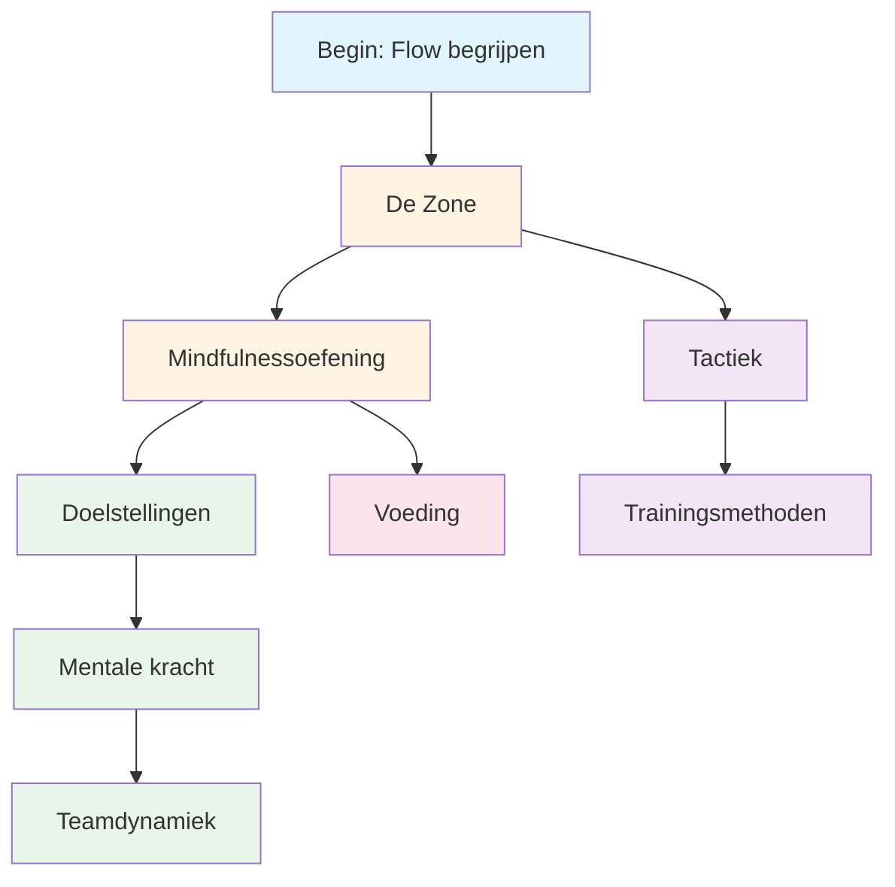

# Onderwijs

Welkom bij het Pétanque Academy Educatieprogramma. Hier leren topspelers de mentale aspecten van het spel te beheersen.

::: tip Kernprincipe
Op topniveau wordt **mentale training belangrijker dan technische training**. De verhouding keert om naarmate je je ontwikkelt: beginners hebben 90% technische training nodig, experts 80% mentale training.
:::

## Waarom mentale training belangrijk is

Op topniveau is technische vaardigheid slechts het begin. Onderzoek toont aan dat de mentale instelling net zo belangrijk kan zijn als fysieke vaardigheid in precisiesporten zoals pétanque. Het verschil tussen goede spelers en geweldige spelers zit vaak in hun mentaliteit.

> &quot;Sport is 100% mentaal. De geest is de drijvende kracht achter alle fysieke vaardigheden.&quot;

## Jouw leertraject

Hieronder vindt u het aanbevolen traject binnen ons onderwijsprogramma:

**Aanbevolen volgorde:**
1. **Basisprincipes:** Begin met The Zone en Mindfulness.
2. **Structuur:** Voeg methoden voor doelstellingen en training toe.
3. **Wedstrijd:** Ontwikkel mentale kracht en tactieken
4. **Teamspel:** Beheers teamdynamiek
5. **Optimalisatie:** Fijn afstellen met voeding

## Onze leerroutes

### 🎯 [De Zone (Flow State)](/en/education/the-zone/)
Leer wat &quot;de zone&quot; werkelijk is en hoe je die kunt bereiken. Begrijp de wetenschap achter flowtoestanden en ontdek praktische technieken om optimaal te presteren wanneer het er het meest toe doet.

### 🧘 [Mindfulness](/en/education/mindfulness/)
Beheers de kunst van het aanwezig zijn. Leer wetenschappelijk bewezen technieken om je geest tot rust te brengen, je concentratie te verbeteren en snel te herstellen van fouten.

### 📊 [Doelstellingen formuleren](/en/education/goals/)
Stel een routekaart op voor je ontwikkeling. Leer het SMART-raamwerk, aangepast voor pétanque, en ontwikkel een trainingsplan dat daadwerkelijk werkt.

### 💪 [Mentale Kracht](/en/education/mental-strength/)
Ontwikkel de mentale weerbaarheid die nodig is voor wedstrijden. Leer omgaan met druk, overwin angst en ontwikkel routines die leiden tot topprestaties.

### 🤝 [Teamdynamiek](/en/education/team-player/)
Word de teamgenoot met wie iedereen wil spelen. Leer meer over communicatie, vertrouwen en hoe je kunt bijdragen aan een winnende teamcultuur.

### ♟️ [Tactieken](/en/education/tactics/)
Denk strategisch na over elke situatie. Leer besluitvorming op basis van waarschijnlijkheid en wanneer je risico&#39;s moet nemen.

### 🏋️ [Trainingsmethoden](/en/education/training/)
Train slimmer, niet alleen harder. Leer hoe je je training kunt structureren voor maximale verbetering.

### 🥗 [Voeding](/en/education/nutrition/)
Geef je hersenen de brandstof voor optimale prestaties. Leer hoe je je energieniveau en focus stabiel houdt tijdens wedstrijden.

## De reis van techniek naar flow

Naarmate je je als speler ontwikkelt, keert de verhouding tussen training en mentale training om: mentale training wordt belangrijker, niet minder belangrijk.

| Niveau | Verhouding (Technologie:Mentale vaardigheden) | Hoofddoel |
|-------|---------------------|-------------------|
| **Beginner** | 90 : 10 | Bouw de machine |
| **Tussenliggend** | 70 : 30 | Stabiliseer de vaardigheid |
| **Geavanceerd** | 50 : 50 | Vertrouw op de machine |
| **Deskundige** | 20:80 | Vrijheid van uitvoering |

Je kunt een beginner niet trainen zoals een expert (beginners missen de benodigde neurale verbindingen), en je kunt een expert niet trainen zoals een beginner (een hoge technische belasting leidt tot overmatig nadenken).

## Beknopt overzicht: Belangrijkste principes uit elk onderdeel

| Sectie | Kernprincipe | Belangrijkste conclusie |
|---------|---------------|--------------|
| **De Zone** | Schakel over van de analytische naar de automatische modus. | &quot;Er bestaan geen technieken die altijd een perfecte boule opleveren. Maar er is een mentale toestand waarin perfecte boules vanzelfsprekend worden.&quot; |
| **Mindfulness** | Kies waar je je aandacht op wilt richten. | &quot;Mindfulness gaat niet over het leegmaken van je geest. Het gaat over het kiezen waar je je aandacht op richt.&quot; |
| **Doelstellingen formuleren** | Focus op wat je wél kunt beheersen | &quot;Een doel zonder plan is slechts een wens.&quot; |
| **Mentale kracht** | Presteer goed ondanks de zenuwen. | *&quot;Mentale kracht gaat niet over het uitschakelen van zenuwen of het nooit maken van fouten. Het gaat erom goed te presteren ondanks die zenuwen.&quot;* |
| **Teamdynamiek** | Vertrouwen en communicatie winnen wedstrijden. | &quot;De beste teams zijn niet altijd de meest bekwame, maar de teams die het beste als team spelen.&quot; |
| **Tactiek** | Besluitvorming wint het van techniek. | &quot;Op topniveau zit het verschil zelden in de techniek, maar in de besluitvorming.&quot; |
| **Opleiding** | Kwaliteit boven kwantiteit | *Train slimmer, niet alleen harder.* |
| **Voeding** | Stabiele energie = stabiele prestaties | *&quot;Je hersenen zijn een precisie-instrument. Geef ze de juiste brandstof.&quot;* |

## Alle belangrijke regels en conclusies

::: details Klik om uit te breiden: Volledige lijst met principes
Dit is uw beknopte handleiding. Voeg dit gedeelte toe aan uw bladwijzers en raadpleeg het regelmatig.

### De zoneregels
1. **De Switch-regel:** Analyseer vóór de cirkel, voer uit in de cirkel, observeer erna.
2. **De Omkeerregel:** Naarmate de vaardigheid toeneemt, wordt mentale training belangrijker dan technische training.
3. **De Vertrouwensregel:** Je bewuste geest plant, je onderbewuste voert uit.

### Mindfulnessregels
1. **De Bewustzijnsregel:** Observeer zonder oordeel.
2. **De SOAS-regel:** Stop, Observeer, Accepteer, Laat los
3. **De huidige regel:** Je kunt alleen dit moment, deze worp, beheersen.

### Regels voor het stellen van doelen
1. **De Controleregel:** Focus op procesdoelen (wat je kunt beheersen) in plaats van op resultaatdoelen.
2. **De SMART-regel:** Doelen moeten specifiek, meetbaar, haalbaar, relevant en tijdgebonden zijn.
3. **De opdelingsregel:** Grote doelen vereisen mijlpalen op kwartaal-, maand- en weekniveau.

### Regels voor mentale kracht
1. **De Routineregel:** Consistente voorbereidingsroutines leiden tot topprestaties.
2. **De resetregel:** Ontwikkel een resetroutine van 10 seconden na het maken van fouten.
3. **De zelfvertrouwenscyclus:** Betere voorbereiding → Meer zelfvertrouwen → Betere prestaties

### Tactische regels
1. **De waarschijnlijkheidsregel:** Kies worpen waarbij de kans op succes het risico rechtvaardigt.
2. **De regel voor het beheersen van de jacks:** Het team dat de jackpositie beheerst, heeft het voordeel.
3. **De afstandsregel:** Korte afstand is gunstig voor schieten, lange afstand is gunstig voor richten.
4. **De Stijlregel:** Dwing het spel in de sterkste speelstijl van je team.
5. **De Boule Management Regel:** Soms is het beter om 1 punt tegen te krijgen dan 3 punten te riskeren.

### Regels voor teamdynamiek
1. **De communicatieregel:** Duidelijke, positieve communicatie schept vertrouwen.
2. **De ondersteuningsregel:** Hoe je reageert op fouten van teamgenoten is belangrijker dan je vaardigheid.
3. **De rolregel:** Ken je rol en voer deze volledig uit.

### Trainingsregels
1. **De specificiteitsregel:** Train wat je wilt verbeteren.
2. **De Variatieregel:** Ongeplande oefening is effectiever dan gestructureerde oefening voor het overdragen van wedstrijdprestaties.
3. **De herstelregel:** Rust is wanneer aanpassing plaatsvindt

### Voedingsregels
1. **De stabiliteitsregel:** Vermijd pieken en dalen in de bloedsuikerspiegel.
2. **De hydratatieregel:** Zelfs 2% uitdroging kan de prestaties negatief beïnvloeden.
3. **De timingregel:** Eet 2-3 uur voor de wedstrijd.
:::

## Begin je reis

::: tip Aanbevolen startpunt
Begin met [The Zone](/en/education/the-zone/) om de basis van topprestaties te begrijpen, en verken vervolgens [Mindfulness](/en/education/mindfulness/) voor praktische technieken die je direct kunt toepassen.
:::
