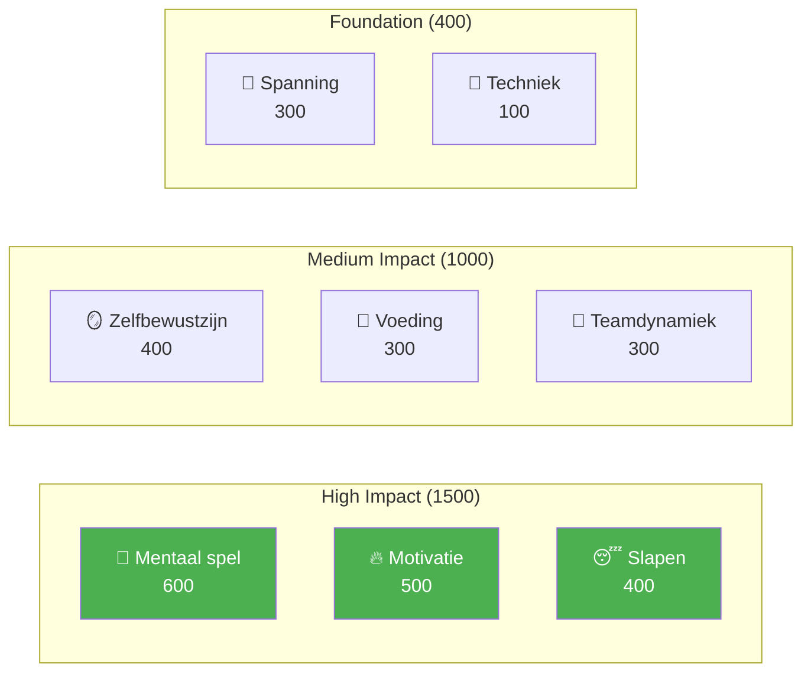

# Elite spelersontwikkeling

Welkom bij het Pétanque Academy Educatieprogramma — het complete spelersontwikkelingssysteem gebaseerd op 8 prestatiefactoren.

::: tip Kernprincipe
Op topniveau wordt **mentale training belangrijker dan technische training**. Merk op dat techniek het laagste gewicht heeft – niet omdat het er niet toe doet, maar omdat iedereen op topniveau een goede techniek heeft. Het verschil zit hem in de mentale aspecten.
:::

---

## Het 8-factoren prestatiemodel

Ons curriculum is opgebouwd rond 8 kernfactoren, gewogen naar hun impact op topprestaties:

| Factor | Gewicht | Beschrijving |
|--------|--------|-------------|
| 🧠 [**Mentale Spel**](/en/education/mental-game/) | **600** | Denkpatronen, focus, flow-toestanden, zelfspraak |
| 🔥 [**Motivatie**](/en/education/motivation/) | **500** | Gedrevenheid, doelgerichtheid, doorzettingsvermogen |
| 😴 [**Slaap &amp; Herstel**](/en/education/sleep/) | **400** | Slaapkwaliteit, herstel, rust vóór de wedstrijd |
| 🪞 [**Zelfbewustzijn**](/en/education/self-awareness/) | **400** | Nauwkeurige zelfperceptie, herkenning van blinde vlekken |
| 🥗 [**Voeding**](/en/education/nutrition/) | **300** | Bloedsuikerstabiliteit, hydratatie, brandstof voor de wedstrijd |
| 🤝 [**Teamdynamiek**](/en/education/team-dynamics/) | **300** | Communicatie, vertrouwen, duidelijkheid over rollen |
| 💆 [**Spanningsmanagement**](/en/education/tension/) | **300** | Fysieke spanning, ontspanning, ademhalingsoefeningen |
| 🎯 [**Techniek**](/nl/onderwijs/techniek/) | **100** | Fysieke mechanica, werprepertoire |

**Totaal: 2.900 punten**

---

## Waarom deze gewichten?

De gewichten weerspiegelen de **impact op topniveau**:

> &quot;Bij het regionale kampioenschap maakt techniek het verschil tussen de beste 50%. Bij het nationale kampioenschap heeft iedereen in de zaal een uitstekende techniek. Wat hen onderscheidt, is al het andere.&quot;

---

## Onderzoek elke factor

### 🧠 Mentale vaardigheden (600 punten)

**De belangrijkste factor voor topprestaties.**

Je vermogen om je gedachten te beheersen, je concentratie te behouden en in een flow-toestand te komen.

- [De Zone](/en/education/mental-game/the-zone/) — Flow-toestanden begrijpen en bereiken
- [Mentale kracht](/en/education/mental-game/mental-strength/) — Omgaan met druk, voorbereiding op een schot
- [Mindfulness](/en/education/mental-game/mindfulness/) — Focus op het huidige moment, herstel van fouten

### 🔥 Motivatie (500 punten)

**Wat motiveert jou om elke dag, elk jaar beter te worden?**

- [Doelstellingen formuleren](/en/education/motivation/) — SMART-doelen, focus op proces versus resultaat
- [Psychologie van motivatie](/en/education/motivation/motivation) — Intrinsieke versus extrinsieke motivatie, Zelfdeterminatietheorie
- [Motivatie behouden](/en/education/motivation/maintaining) — Burnoutpreventie, plateaubeheersing

### 😴 Slaap &amp; Herstel (400 punten)

**Vaak over het hoofd gezien, maar enorm impactvol.**

Slaapkwaliteit heeft een directe invloed op reactietijd, besluitvorming en emotionele regulatie.

- [Slaapwetenschap voor atleten](/en/education/sleep/) — Waarom slaap belangrijk is voor precisiesporten
- [Slaapgewoonten ontwikkelen](/en/education/sleep/habits) — Praktische slaaphygiëne
- [Slaap &amp; Competitie](/en/education/sleep/competition) — Protocollen voorafgaand aan het evenement, reismanagement

### 🪞 Zelfbewustzijn (400 punten)

**Je kunt niet verbeteren wat je niet kunt zien.**

Een accurate zelfperceptie maakt gerichte verbetering mogelijk.

- [Het voordeel van zelfbewustzijn](/en/education/self-awareness/) — Waarom zelfkennis belangrijk is
- [Feedback krijgen](/en/education/self-awareness/feedback) — Externe perspectieven
- [Videoanalyse](/en/education/self-awareness/video) — Video gebruiken voor zelfontdekking

### 🥗 Voeding (300 punten)

**Stabiele energie = stabiele prestaties.**

Je hersenen zijn een precisie-instrument – geef ze de juiste voeding.

- [Voeding voor optimale prestaties](/en/education/nutrition/) — Bloedsuiker, hydratatie, wedstrijdvoeding

### 🤝 Teamdynamiek (300 punten)

**De beste teams zijn niet altijd de meest bekwame.**

Communicatie en vertrouwen wegen vaak zwaarder dan individueel talent.

- [Een geweldige teamgenoot zijn](/en/education/team-dynamics/) — Teamcultuur en ondersteuning
- [Teamcommunicatie](/en/education/team-dynamics/communication) — Duidelijke, positieve communicatie

### 💆 Spanningsmanagement (300 punten)

**Spanning is de vijand van precisie.**

Je kunt niet tegelijkertijd gespannen en nauwkeurig zijn.

- [Spanning begrijpen](/en/education/tension/) — Fysieke versus mentale spanning
- [Ontspanningstechnieken](/en/education/tension/techiques) — PMR, ademhaling, snelle resets
- [Wedstrijdmanagement](/en/education/tension/competition) — Protocollen voor en tijdens de wedstrijd

### 🎯 Techniek (100 punten)

**De fundering is noodzakelijk, maar niet voldoende.**

Op topniveau is techniek een vanzelfsprekendheid. De onderscheidende kenmerken staan hierboven beschreven.

- [Techniekoverzicht](/en/education/technique/) — Fysische mechanica
- [Trainingsmethoden](/en/education/technique/training/) — Doelgerichte oefening
- [Tactiek](/en/education/technique/tactics/) — Strategische besluitvorming

---

## Het ontwikkelingstraject

Naarmate je je als speler ontwikkelt, keert je trainingsverhouding om:

| Niveau | Verhouding (Technologie:Mentale vaardigheden) | Focus |
|-------|---------------------|-------|
| **Beginner** | 90 : 10 | Bouw de machine |
| **Tussenliggend** | 70 : 30 | Stabiliseer de vaardigheid |
| **Geavanceerd** | 50 : 50 | Vertrouw op de machine. |
| **Deskundige** | 20:80 | Vrijheid van uitvoering |

Je kunt een beginner niet trainen zoals een expert (beginners missen de benodigde neurale verbindingen), en je kunt een expert niet trainen zoals een beginner (een hoge technische belasting leidt tot overmatig nadenken).

---

## Snel naslagwerk: Kernprincipes

::: details Klik om uit te breiden: Volledige lijst met principes

### Mentale spelregels
1. **De Switch-regel:** Analyseer vóór de cirkel, voer uit in de cirkel, observeer erna.
2. **De Vertrouwensregel:** Je bewuste geest plant, je onderbewuste voert uit.
3. **De huidige regel:** Je kunt alleen dit moment, deze worp, beheersen.

### Motivatieregels
1. **De controleregel:** Focus op procesdoelen in plaats van resultaatdoelen.
2. **De SMART-regel:** Doelen moeten specifiek, meetbaar, haalbaar, relevant en tijdgebonden zijn.
3. **De intrinsieke regel:** Innerlijke motivatie overleeft externe beloningen.

### Slaapregels
1. **De regel van consistentie:** Elke dag op hetzelfde tijdstip opstaan, ook in het weekend.
2. **De Bufferregel:** Ontspanningsroutine 60 minuten of langer voor het slapengaan
3. **De wedstrijdregel:** Slaap extra in de week ervoor, niet alleen de nacht ervoor.

### Regels voor zelfbewustzijn
1. **De feedbackregel:** Zoek actief naar externe perspectieven.
2. **De videoregel:** Wat je voelt is niet hetzelfde als de werkelijkheid — neem het op en bekijk het later terug.
3. **De blinde vlekregel:** Een laag zelfbewustzijn beïnvloedt alle andere beoordelingen.

### Voedingsregels
1. **De stabiliteitsregel:** Vermijd pieken en dalen in de bloedsuikerspiegel.
2. **De hydratatieregel:** Zelfs 2% uitdroging kan de prestaties negatief beïnvloeden.
3. **De timingregel:** Eet 2-3 uur voor de wedstrijd.

### Regels voor teamdynamiek
1. **De communicatieregel:** Duidelijke, positieve communicatie schept vertrouwen.
2. **De ondersteuningsregel:** Hoe je op fouten reageert, is belangrijker dan je vaardigheid.
3. **De rolregel:** Ken je rol en voer deze volledig uit.

### Spanningsregels
1. **De Ontspanningsregel:** Je kunt niet tegelijkertijd gespannen en nauwkeurig zijn.
2. **De Yerkes-Dodson-regel:** Vind je optimale opwindingszone
3. **De resetregel:** 10 seconden resetten voor elke worp.

### Techniekregels
1. **De specificiteitsregel:** Train wat je wilt verbeteren.
2. **De Variatieregel:** Willekeurige oefening is beter dan geblokte oefening.
3. **De herstelregel:** Rust is wanneer aanpassing plaatsvindt
:::

---

## Begin je reis

::: tip Aanbevolen startpunt
Begin met [Mentale Spel](/en/education/mental-game/) om de basis van topprestaties te begrijpen. Verken vervolgens [Slaap](/en/education/sleep/) — dit is vaak de verbetering met het hoogste rendement voor spelers in ontwikkeling.
:::

