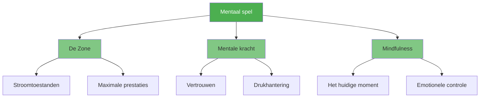

# Mentaal spel

::: tip De belangrijkste factor
**Gewicht: 600 punten** — De mentale kant heeft de grootste impact op je prestaties. Beheers je geest, en de rest volgt vanzelf.
:::

Het mentale aspect omvat alles wat er zich tussen je oren afspeelt: je gedachten, focus, zelfvertrouwen en innerlijke dialoog. Topspelers beschikken niet alleen over een betere techniek, maar hebben ook meer controle over hun mentale toestand.

## De drie pijlers

### 🎯 [De Zone](/en/education/mental-game/the-zone/)
Bereik de flowtoestand waarin presteren moeiteloos aanvoelt. Leer wat flow triggert en hoe je er consistent in terechtkomt.

- [Inleiding tot De Zone](/en/education/mental-game/the-zone/)
- [Technische training versus flowtraining](/en/education/mental-game/the-zone/technical-vs-flow)
- [De Zone Betreden](/en/education/mental-game/the-zone/entering-the-zone)

### 💪 [Mentale Kracht](/en/education/mental-game/mental-strength/)
Ontwikkel psychologische veerkracht om onder druk te presteren. Bouw zelfvertrouwen op, leer omgaan met tegenslagen en bewaar je kalmte.

- [Mentale kracht opbouwen](/en/education/mental-game/mental-strength/)
- [Omgaan met druk](/en/education/mental-game/mental-strength/handling-pressure)
- [Voorbereidingsroutine](/en/education/mental-game/mental-strength/pre-shot-routine)

### 🧘 [Mindfulness](/en/education/mental-game/mindfulness/)
Ontwikkel bewustzijn van het huidige moment om gefocust te blijven en snel te herstellen van fouten.

- [Inleiding tot Mindfulness](/en/education/mental-game/mindfulness/)
- [Mindfulnesstechnieken](/en/education/mental-game/mindfulness/techniques)
- [Dagelijkse oefening](/en/education/mental-game/mindfulness/daily-practice)

## Waarom mentale kracht het belangrijkst is

| Aspect | Technische training | Mentale training |
|--------|-------------------|-----------------|
| **In de praktijk** | Je kunt het schot maken. | Je kunt het schot maken. |
| **In competitie** | De techniek kan onder druk falen. | Mentale vaardigheden zorgen ervoor dat de prestaties behouden blijven. |
| **Het verschil** | Fysieke vaardigheden zijn vereist. | Mentale vaardigheid is de vermenigvuldigingsfactor. |

::: warning De veelgemaakte fout
De meeste spelers besteden 90% van hun tijd aan techniek en 10% aan mentale vaardigheden. Topspelers draaien deze verhouding vaak om zodra ze de basis onder de knie hebben.
:::

## Waar te beginnen?

**Nieuw in mentale training?** Begin met [The Zone](/en/education/mental-game/the-zone/) om te begrijpen hoe topprestaties aanvoelen.

**Heb je moeite met druk?** Ga naar [Mentale Kracht](/en/education/mental-game/mental-strength/) voor praktische technieken.

**Dwalen je gedachten af tijdens wedstrijden?** [Mindfulness](/en/education/mental-game/mindfulness/) helpt je om in het moment te blijven.

## Gerelateerde bronnen

- [Zelfbewustzijn](/en/education/self-awareness/) — Ken jezelf om sneller vooruit te komen
- [Spanningsmanagement](/en/education/tension/) — Lichamelijke ontspanning bevordert mentale helderheid
- [Beoordelingstool](/en/education/) — Evalueer je mentale spel en ontvang persoonlijke aanbevelingen

