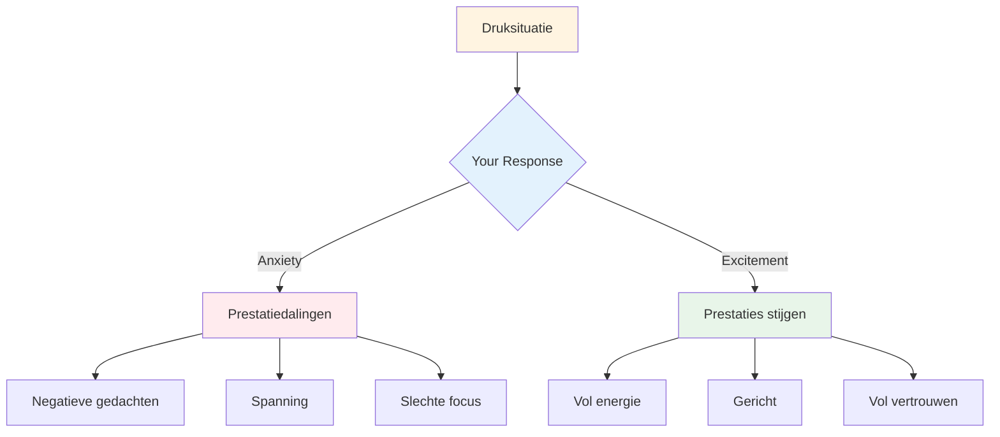

# Omgaan met druk

Druk hoort bij competitie. Het doel is niet om die druk volledig te elimineren – dat is onmogelijk. Het doel is om ondanks de druk goed te presteren en die zelfs in je voordeel te gebruiken.

::: tip Het Grote Idee
**Druk verdwijnt niet met ervaring - je leert er alleen beter mee omgaan.** De beste spelers zijn niet kalm; ze zijn bedreven in het productief inzetten van hun opwinding.
:::

## Druk begrijpen

### Wat veroorzaakt druk?
- Hoge inzet (belangrijke wedstrijd, beslissende worp)
- Bekeken worden (door publiek, teamgenoten)
- Verwachtingen (van jezelf en van anderen)
- Onzekerheid (krappe score, onbekende tegenstanders)
- Tijd (die opraakt, te lang wachten)

### Wat druk met je lichaam doet
Wanneer je druk voelt, reageert je lichaam als volgt:
- De hartslag neemt toe.
- De ademhaling wordt oppervlakkig.
- Spieren gespannen
- Handen kunnen schudden
- De focus wordt smaller (soms te veel).

Dit is je lichaam dat zich voorbereidt op actie. Dat is niet erg - het is energie die je kunt gebruiken.

## Herkadering van de druk

### Druk als opwinding

De fysieke gewaarwordingen van angst en opwinding zijn vrijwel identiek. Het verschil zit hem in de manier waarop je ze interpreteert.

**Interpretatie van angst:** &quot;Ik ben nerveus, er zou iets ergs kunnen gebeuren&quot;
**Interpretatie van enthousiasme:** &quot;Ik ben vol energie, dit is belangrijk voor me.&quot;

**Probeer dit eens:** Als je druk voelt, zeg dan tegen jezelf: &quot;Ik ben enthousiast&quot; in plaats van &quot;Ik ben nerveus.&quot;

### Druk uitoefenen als privilege

Alleen belangrijke momenten creëren druk. Als je die druk voelt, bevind je je in een belangrijke situatie.

> &quot;Druk ervaren is een voorrecht - het komt alleen toe aan degenen die het verdienen.&quot; - Billie Jean King

## Technieken voor momenten onder hoge druk

### 1. Ademhalingsoefeningen

Je ademhaling is de snelste manier om je gemoedstoestand te veranderen.

**De 4-7-8-techniek:**
1. Adem 4 tellen in.
2. Houd 7 tellen vast
3. Adem 8 tellen uit.
4. Herhaal dit 2-3 keer.

**Snel resetten (in de cirkel):**
- Eén langzame, diepe ademhaling
- Voel je voeten op de grond.
- Laat je schouders zakken tijdens het uitademen.

### 2. Fysieke aarding

Maak contact met je fysieke sensaties om uit je hoofd te komen:
- Voel het gewicht van de boule.
- Let op waar je voeten zich op de grond bevinden.
- Knijp in je niet-werpende hand en laat los.
- Rol je schouders naar achteren

### 3. Focus versmalling

In stressvolle momenten, concentreer je alleen op wat er echt toe doet:
- Niet de score
- Niet het publiek
- Niet wat er zou kunnen gebeuren
- Alleen deze worp, dit doel, dit moment.

**Aanwijswoorden:** &quot;Hier. Nu. Dit.&quot;

### 4. Procesgerichtheid

Verschuiving van resultaat naar proces:

**Resultaatgerichtheid (schept druk):**
- &quot;Ik moet dit maken&quot;
- &quot;Als ik mis, verliezen we.&quot;
- &quot;Iedereen kijkt toe&quot;

**Procesfocus (vermindert de druk):**
- &quot;Volg mijn routine&quot;
- &quot;Zie het doel&quot;
- &quot;Vertrouw op mijn training&quot;

### 5. De linkerhandse knijpbeweging

Voor rechtshandige spelers: knijp 10-15 seconden in je linkerhand.
- Activeert de rechter hersenhelft.
- Vermindert analytisch overdenken.
- Helpt bij het verkrijgen van toegang tot automatische uitvoering

Gebruik dit wanneer je merkt dat je te veel nadenkt.

## Voorbereiding op druk

### Simuleer druk in de praktijk.

Je kunt niet omgaan met wedstrijddruk als je die nooit tijdens de training ervaart.

**Manieren om oefendruk te creëren:**
- Stel consequenties vast (bijvoorbeeld push-ups voor missers, koffie kopen voor je partner).
- Creëer scenario&#39;s die absoluut noodzakelijk zijn.
- Oefen met publiek.
- Tijdsdruk (shot clock)
- Vermoeidheid (oefenen als je moe bent)

### Visualisatie

Oefen stressvolle situaties mentaal:
1. Sluit je ogen
2. Stel je een stresssituatie gedetailleerd voor.
3. Voel de druksensaties
4. Zie jezelf ermee omgaan.
5. Voer het mentaal succesvol uit.

Doe dit regelmatig, niet alleen vlak voor wedstrijden.

### Bouw een geschiedenis van druk op.

Houd bij wanneer je goed met druk bent omgegaan:
- Wat was de situatie?
- Hoe voelde je je?
- Wat heb je gedaan?
- Wat was de uitkomst?

Neem dit nog eens door vóór wedstrijden om jezelf eraan te herinneren: &quot;Dit heb ik al eerder gedaan.&quot;

## Tijdens de wedstrijd

### Voordat de druk wordt opgeworpen
1. Neem even afstand en haal diep adem.
2. Herinner jezelf aan je routine.
3. Focus op het proces, niet op het resultaat.
4. Gebruik je triggerwoord of aanwijzing.

### In de Cirkel
1. Voer je oefening precies uit zoals je die hebt geoefend.
2. Focus extern (doelwit, niet lichaam)
3. Vertrouw op je training.
4. Zonder aarzeling vrijgeven

### Na de worp
- Accepteer het resultaat zonder oordeel.
- Als het goed is: korte bevestiging, verdergaan
- Als het fout is: SOAS-methode, reset voor de volgende worp

## Veelgemaakte fouten bij het gebruik van een drukknop

| Fout | Betere aanpak |
|---------|----------------|
| Haasten | Doe het rustig aan, volg de volledige routine. |
| Overmatig nadenken | Externe focus, vertrouwenstraining |
| Veranderende techniek | Blijf bij wat je kent. |
| Focus op resultaat | Focus op het proces |
| De zenuwen bedwingen | Accepteer en gebruik de energie. |

## Belangrijkste conclusie

> De druk verdwijnt niet met ervaring. Je leert er alleen beter mee omgaan.

De beste spelers zijn niet kalm, maar bedreven in het productief gebruiken van hun opwinding.

