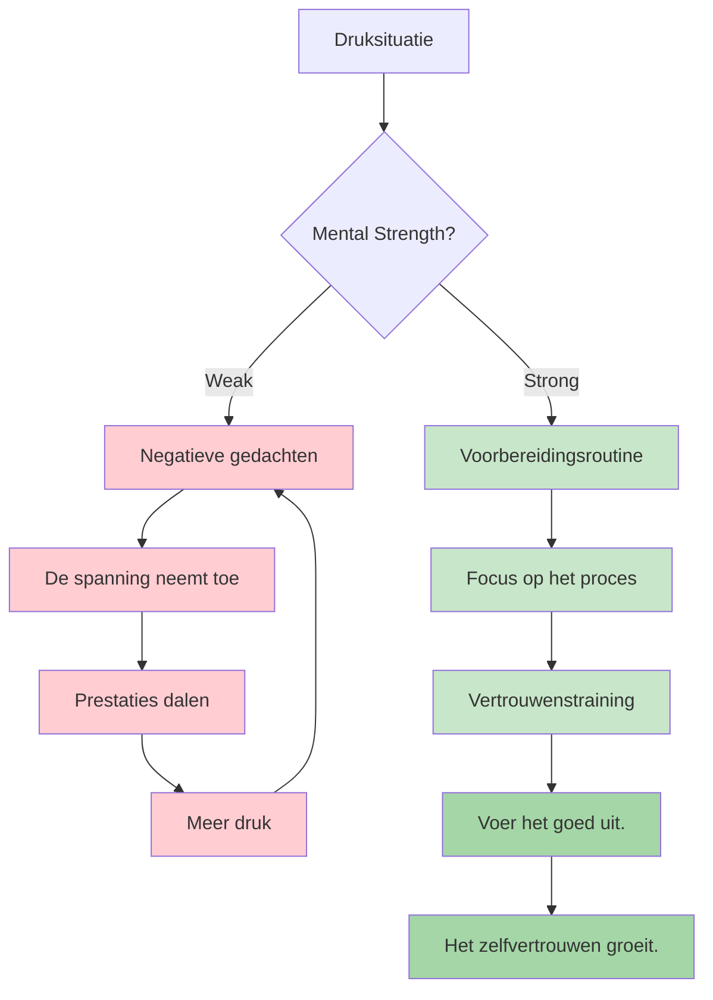
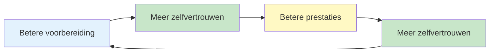

# Mentale kracht

Mentale kracht is wat spelers die goed presteren tijdens de training onderscheidt van spelers die goed presteren wanneer het erop aankomt. Het is het vermogen om met druk om te gaan, tegenslagen te verwerken en de focus te behouden tijdens lange wedstrijden.

::: tip Het kernprincipe
**Mentale kracht gaat niet over het uitschakelen van zenuwen of het nooit maken van fouten. Het gaat erom goed te presteren ondanks die fouten.** Je kunt niet controleren wat er gebeurt. Je kunt wel controleren hoe je erop reageert.
:::

## Wat is mentale kracht?

Mentale kracht omvat:
- **Zelfvertrouwen:** Geloven in je eigen kunnen.
- **Focus:** De aandacht gericht houden op wat belangrijk is.
- **Veerkracht:** Herstellen van fouten
- **Kalmte bewaren:** Rustig blijven onder druk
- **Motivatie:** Het volhouden van inspanning gedurende langere tijd

Dit zijn geen vaststaande eigenschappen, maar vaardigheden die je kunt ontwikkelen.

## De mentale eisen van pétanque

Petanque kent unieke mentale uitdagingen:

| Uitdaging | Waarom het moeilijk is |
|-----------|--------------|
| Tijd tussen worpen | Gelegenheid voor negatieve gedachten |
| Zichtbare resultaten | Iedereen ziet je fouten |
| Teamopstelling | De druk om partners niet teleur te stellen |
| Lange wedstrijden | Mentale vermoeidheid gedurende vele uren |
| Spannende wedstrijden | Er staat veel op het spel bij individuele worpen. |
| Momentumschommelingen | Een emotionele achtbaan. |

## Mentale kracht opbouwen

### 1. Ontwikkel zelfvertrouwen

Zelfvertrouwen komt voort uit:
- **Voorbereiding:** Weten dat je het werk al gedaan hebt
- **Succes uit het verleden:** Terugdenken aan momenten waarop je goed presteerde
- **Positieve zelfspraak:** Hoe je tegen jezelf praat
- **Lichaamstaal:** Rechtop staan, doelgericht bewegen

**Vertrouwensversterkers:**
- Houd een succesdagboek bij
- Visualiseer succesvolle prestaties
- Bereid je grondig voor op wedstrijden.
- Gebruik zelfverzekerde lichaamstaal (het heeft invloed op je gemoedstoestand).

### 2. Beheers je zelfspraak

De stem in je hoofd is ontzettend belangrijk.

**Destructieve zelfspraak:**
- &quot;Ik mis deze altijd.&quot;
- &quot;Ik ga stikken&quot;
- &quot;Mijn teamgenoten rekenen op me&quot; (druk)
- &quot;Dat was vreselijk&quot;

**Constructieve zelfspraak:**
- &quot;Ik heb deze worp al eerder gemaakt.&quot;
- &quot;Vertrouw op mijn training&quot;
- &quot;Eén worp tegelijk&quot;
- &quot;Volgende worp, een nieuwe start&quot;

**Verander je innerlijke dialoog:**
1. Let op wat je tegen jezelf zegt.
2. Betwist negatieve beweringen.
3. Vervang door realistische, nuttige alternatieven.
4. Oefen tot het automatisch gaat.

### 3. Bouw veerkracht op

Veerkracht is het vermogen om te herstellen van tegenslagen.

**De veerkrachtige mentaliteit:**
- Fouten zijn informatie, geen mislukking.
- Eén slechte worp bepaalt niet wie je bent.
- Tegenslagen zijn tijdelijk.
- Je kunt altijd goed reageren op wat er gebeurt.

**Het opbouwen van veerkracht:**
- Oefen het herstellen van fouten tijdens de training.
- Gebruik de SOAS-methode (Stop, Observe, Accept, Slip).
- Focus op de reactie, niet op de gebeurtenis.
- Ontwikkel een kort geheugen voor slechte worpen.

### 4. Beheer je energie

Mentale kracht vereist energiemanagement:

**Fysieke energie:**
- Slaap goed voor wedstrijden.
- Eet gezond (stabiele bloedsuikerspiegel)
- Zorg dat je voldoende drinkt.
- Beweeg tussen de spellen (blijf niet te lang zitten).

**Mentale energie:**
- Neem pauzes wanneer dat mogelijk is.
- Analyseer de situatie tussen de worpen niet te veel.
- Bewaar je intense concentratie voor de momenten dat je het echt nodig hebt.
- Volg herstelroutines.

## De vertrouwen-competentie-cyclus

::: info De positieve cyclus

**Bouw het als volgt op:**
1. Kwalitatief hoogwaardige praktijk (bouwt competentie op)
2. Voortgang bijhouden (vergroot het zelfvertrouwen)
3. Succesvolle prestaties (versterkt beide)
:::

## In deze sectie

- **[Omgaan met druk](/nl/education/mental-game/mental-strength/handling-pressure)** - Technieken voor situaties met hoge inzet
- **[Voorbereidingsroutine](/nl/education/mental-game/mental-strength/pre-shot-routine)** - Je prestatietrigger opbouwen

## Samenvatting: Regels voor mentale kracht

::: tip Regel #1: De routineregel
**Consistente voorbereidingsroutines leiden tot topprestaties.**
Steeds dezelfde routine = betrouwbare trigger voor een flowtoestand
:::

::: tip Regel #2: De resetregel
**Ontwikkel een routine van 10 seconden om na een fout de situatie te herstellen.**
Fysieke reset (diep ademhalen, schouderrollen) + mentale reset (SOAS-methode)
:::

::: tip Regel #3: De vertrouwenslusregel
**Betere voorbereiding → Meer zelfvertrouwen → Betere prestaties.**
De cyclus werkt twee kanten op. Bouw hem op door kwalitatief goede oefening en het bijhouden van de voortgang.
:::

::: tip Regel #4: De zelfspraakregel
**Praat tegen jezelf zoals je tegen een teamgenoot zou praten.**
Ondersteunend, constructief, gericht op wat er moet gebeuren (niet op wat er mis is gegaan).
:::

::: tip Regel nr. 5: De regel voor energiebeheer
**Bewaar je intense concentratie voor de momenten dat je die nodig hebt.**
Analyseer niet te veel tussen de worpen door. Spaar je mentale energie voor de uitvoering.
:::

## Belangrijkste conclusie

> Mentale kracht gaat niet over het uitschakelen van zenuwen of het nooit maken van fouten. Het gaat erom goed te presteren ondanks die zenuwen.

Je kunt niet bepalen wat er gebeurt. Je kunt wel bepalen hoe je erop reageert.

