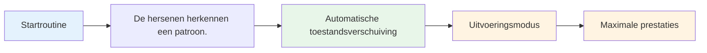

# Je voorbereiding op de fotosessie opbouwen

Je voorbereiding op een worp is een van de krachtigste mentale hulpmiddelen. Het is een consistente reeks handelingen die je voorbereidt op elke worp en je optimale prestatietoestand activeert.

::: tip Het Grote Idee
**Je routine is je toegangspoort tot de zone.** Een consistente routine vóór een schot geeft je hersenen het signaal: &quot;Het is tijd om te presteren.&quot; Door herhaling wordt het een automatische trigger voor topprestaties.
:::

## Waarom routines werken

### Consistentie schept zelfvertrouwen.
Als je steeds hetzelfde doet, elimineer je variabelen. Je lichaam weet wat er gaat komen. Dit creëert een gevoel van controle en vertrouwdheid, zelfs in onbekende situaties.

### Routines activeren toestanden
Door herhaling raakt je routine gekoppeld aan je prestatievermogen. Het starten van de routine zet automatisch de mentale omschakeling naar de uitvoeringsmodus in gang.

### Routines blokkeren afleidingen.
Een routine geeft je geest iets om zich op te concentreren. Er is geen ruimte voor zorgen over de score, het publiek of wat er zou kunnen gebeuren.

### Routines helpen bij het beheersen van opwinding.
Een goed opgezette routine helpt je energieniveau te reguleren: het kalmeert je als je te energiek bent en helpt je je te concentreren als je je futloos voelt.

## Elementen van een effectieve routine

### Fase 1: Beoordeling (buiten de cirkel)

Voordat je naar binnen gaat, verzamel eerst de volgende informatie:
- Lees het terrein (hellingen, obstakels, ondergrond).
- Beoordeel de situatie (score, posities van de boules)
- Kies je doelwit en landingsplek.
- Bepaal het type worp (wijzen, schieten, lobben, rollen)

**Dit is de plek waar nagedacht wordt.** Neem hier de tijd.

### Fase 2: Overgang (De cirkel betreden)

De omschakeling van denken naar doen:
- Fysieke actie (stap op een consistente manier in de cirkel)
- Mentale aanwijzing (een woord of zin die &quot;uitvoeringsmodus&quot; aangeeft)
- Ademhaling (één bewuste ademhaling om jezelf te centreren)

**Dit is de schakelaar.** De analyse stopt hier.

### Fase 3: Opzetten (in de cirkel)

Bereid je lichaam voor:
- Een consistente houding (altijd dezelfde)
- Gripcontrole (voel de boule)
- Afstemming op het doel
- Fysieke trigger (een kleine beweging die je zelf maakt)

### Fase 4: Visualisatie (Kort)

Bekijk de worp voordat je hem maakt:
- Stel je de baan van de bal voor (maximaal 2-3 seconden).
- Voel de succesvolle worp
- Maak visueel contact met je doelgroep.

### Fase 5: Uitvoering

Gooi de bal:
- Externe focus (alleen doel)
- Vertrouw op je lichaam.
- Zonder aarzeling vrijgeven
- Ga er natuurlijk mee door

## Het opbouwen van je persoonlijke routine

### Stap 1: Observeer wat je al doet

Je hebt waarschijnlijk al een bepaalde routine. Let op:
- Wat doe je voordat je een goede worp maakt?
- Wat voelt voor jou natuurlijk aan?
- Wat helpt jou om je te concentreren?

### Stap 2: Ontwerp je routine

Maak een reeks die het volgende bevat:
- [ ] Beoordelingsfase
- [ ] Duidelijk overgangsmoment
- [ ] Consistente fysieke opstelling
- [ ] Korte visualisatie
- [ ] Uitvoeringstrigger

### Stap 3: Schrijf het op

Wees specifiek. Bijvoorbeeld:

1. **Beoordeling:** Terrein analyseren, landingsplek kiezen
2. **Overgang:** Stap met je linkervoet eerst in de cirkel en zeg &quot;vertrouwen&quot;.
3. **Voorbereiding:** Voeten op schouderbreedte, grip controleren, schouders uitlijnen
4. **Visualiseer:** Zie het pad, voel de bevrijding
5. **Uitvoering:** Ogen op het doel, gooien

### Stap 4: Oefen consequent.

Pas je routine toe op ELKE worp tijdens de training:
- Gemakkelijke worpen
- Moeilijke worpen
- Als je moe bent
- Als je fris bent

De routine moet automatisch worden.

### Stap 5: Verfijn in de loop van de tijd

Je routine zal zich ontwikkelen. Let op wat werkt en pas het aan. Maar verander je routine niet tijdens de wedstrijd, alleen tussen de onderdelen.

## Routine timing

Je routine moet een vaste hoeveelheid tijd in beslag nemen:
- Te snel: Je hebt haast en bent niet goed voorbereid.
- Te traag: Je denkt te veel na en verliest je flow.
- Precies goed: genoeg tijd om je voor te bereiden, maar niet zoveel dat je te veel nadenkt.

**Gebruikelijke timing:**
- Beoordeling: 5-10 seconden
- Overgang + Instellen: 3-5 seconden
- Visualisatie + uitvoering: 3-5 seconden
- **Totaal: 10-20 seconden**

## Veelvoorkomende routinefouten

| Fout | Probleem | Oplossing |
|---------|---------|----------|
| Touwtjespringen tijdens de training | Routine is niet automatisch. | Gebruik het bij elke worp. |
| Te ingewikkeld | Moeilijk te onthouden onder druk | Vereenvoudig tot de essentie. |
| Nadenken tijdens de uitvoering | Verstoort de automatische werking | Duidelijk overgangspunt |
| Inconsistente timing | Schept onzekerheid | Oefen met een constant tempo. |
| Verandering midden in de wedstrijd | Wekt twijfel op. | Blijf bij wat je kent. |

## Routinematige probleemoplossing

**Als je haast hebt:**
- Voeg een ademhaling toe tijdens de overgang.
- Vertraag je voorbereidingsbewegingen.
- Neem even een pauze voordat je je visualiseert.

**Als je te veel nadenkt:**
- Verkort de routine
- Gebruik een sterker overgangssignaal.
- Richt je meer op de buitenwereld.

**Als je inconsistent bent:**
- Maak een video van jezelf om het te controleren.
- Oefen de oefening zonder te gooien.
- Vraag feedback aan een partner.

## Voorbeelden van routines

### Eenvoudige routine
1. Kies een doel
2. Stap naar binnen, adem in.
3. Grijpen, uitlijnen
4. Zie je het, gooi het weg.

### Gedetailleerde routine
1. Bestudeer het terrein, kies een landingsplek.
2. Stap eerst met je linkervoet naar binnen.
3. Zeg &quot;soepel&quot; inwendig.
4. Adem in, schouders zakken
5. Voeten neerzetten, grip controleren
6. Richt je schouders op het doel.
7. Bekijk het pad (2 seconden)
8. De blik is gericht op het doelwit.
9. Gooien

## Belangrijkste conclusie

> Je routine is je anker. In de chaos is het je constante factor.

Bouw het zorgvuldig op. Oefen het voortdurend. Vertrouw er volledig op.

