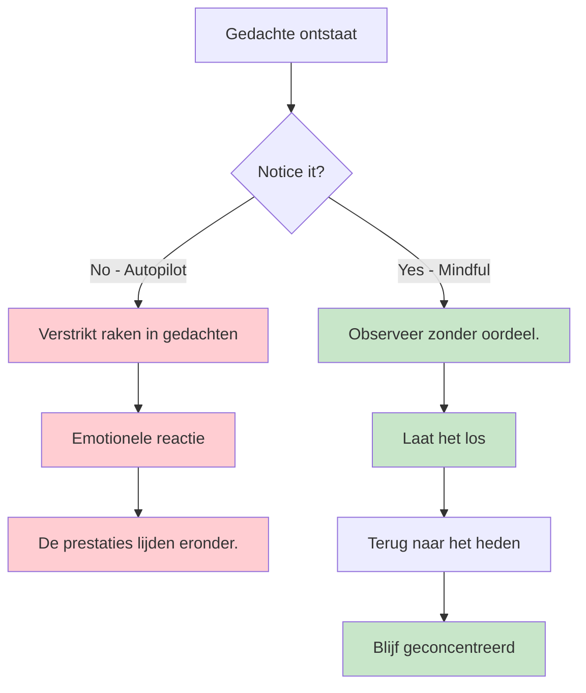
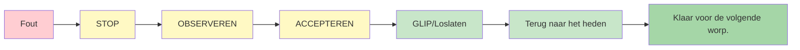

# Mindfulness voor pétanque-spelers

Mindfulness is een van de krachtigste hulpmiddelen die sporters tot hun beschikking hebben. Het is niet mystiek of ingewikkeld – het is simpelweg de oefening om zonder oordeel aandacht te besteden aan het huidige moment.

::: tip Het kernprincipe
**Mindfulness gaat niet over het leegmaken van je geest. Het gaat over het kiezen waar je je aandacht op richt.** Je kunt niet voorkomen dat gedachten opkomen, maar je kunt er wel voor kiezen om ze niet te volgen.
:::

## Wat is mindfulness?

Mindfulness betekent volledig aanwezig en bewust zijn van:
- Waar je bent
- Wat je doet
- Hoe voel je je?

...zonder overweldigd te raken door wat er om je heen gebeurt of er impulsief op te reageren.

Voor pétanque-spelers betekent dit:
- Volledig aanwezig zijn bij elke worp.
- Gedachten opmerken zonder erin verstrikt te raken.
- Snel herstellen van fouten
- Kalm blijven onder druk

## De wetenschap erachter

Mindfulness is niet zomaar een filosofie; het wordt ondersteund door gedegen onderzoek:

### Effecten op je hersenen
- **Vermindert de activiteit in de amygdala** (het alarmsysteem van je hersenen).
- **Versterkt de prefrontale cortex** (besluitvorming en concentratie) - dit helpt je helder te denken tijdens het plannen.
- **Verbetert je vermogen om je gedachten tot rust te brengen** wanneer nodig - essentieel voor het bereiken van een flow-toestand tijdens het uitvoeren van taken.
- **Verbetert de verbindingen** tussen hersengebieden
- **Zorgt voor blijvende structurele veranderingen** door regelmatige oefening.

### Effecten op de prestaties
| Voordeel | Hoe het je spel verbetert |
|---------|----------------------|
| Stressvermindering | Lager cortisolgehalte, stabielere handen |
| Betere focus | Minder afleiding, duidelijkere beslissingen |
| Emotionele controle | Laat slechte worpen niet uit de hand lopen |
| Sneller herstel | Herstel snel van fouten. |
| Verbeterde slaap | Betere rust, betere prestaties |

## Waarom pétanque-spelers mindfulness nodig hebben

Petanque kent unieke mentale uitdagingen:

1. **Tijd tussen de worpen** - Volop gelegenheid voor negatieve gedachten
2. **Zichtbare fouten** - Iedereen ziet het als je iets mist.
3. **Teamdruk** - Jouw worp heeft invloed op je partners.
4. **Lange wedstrijden** - Mentale vermoeidheid na vele uren
5. **Spannende wedstrijden** - Hoge druk op beslissende momenten

Mindfulness helpt je om hiermee om te gaan.

## De kernvaardigheid: oordeelloos bewustzijn

Het sleutelwoord is &quot;niet-oordelend&quot;.

::: danger Oordelend denken (voegt emotionele lading toe)
❌ &quot;Dat was een vreselijke worp&quot;
❌ &quot;Ik mis deze altijd&quot;
❌ &quot;Mijn teamgenoten moeten gefrustreerd zijn&quot;

**Resultaat:** Een spiraal van negatieve emoties, spanning en slechtere prestaties.
:::

::: tip Niet-oordelend bewustzijn (alleen observeren)
✅ &quot;De worp ging links van het doel&quot;
✅ &quot;Ik merk dat ik me gespannen voel&quot;
✅ &quot;Mijn gedachten dwalen af naar de partituur&quot;

**Resultaat:** Heldere observatie, snel herstel, behoud van concentratie
:::

**Het verschil?** Oordelen voegt emotionele lading toe en lokt reacties uit. Bewustzijn observeert alleen en stelt je in staat om vaardig te reageren.

## Aan de slag

Je hoeft geen uren te mediteren. Begin met deze eenvoudige oefeningen:

### 1. Bewust ademhalen (2 minuten)
- Neem plaats
- Concentreer je op je ademhaling.
- Als je gedachten afdwalen (en dat zullen ze), keer dan rustig terug naar je ademhaling.
- Geen oordeel over ronddwalen - kom gewoon terug

### 2. Lichaamsscan (5 minuten)
- Merk de sensaties in je voeten op.
- Richt je aandacht langzaam omhoog langs je lichaam.
- Observeer gewoon – probeer niets te veranderen.
- Merk spanningsgebieden op zonder ertegen te vechten.

### 3. Momenten van mindfulness
- Kies een alledaagse activiteit (koffie drinken, wandelen).
- Doe het met volle aandacht.
- Merk alle sensaties op die daarbij betrokken zijn.
- Als je gedachten afdwalen, keer dan terug naar de activiteit.

## Aandacht in competitieverband

### Voor de wedstrijd
- Neem 2-3 minuten de tijd voor bewuste ademhaling.
- Formuleer een intentie voor hoe je wilt spelen (niet het resultaat, maar het proces).
- Merk eventuele nervositeit op zonder te proberen die te elimineren.

### Tijdens de wedstrijd
- Gebruik je voorbereidingsroutine als een ankerpunt voor mindfulness.
- Tussen de worpen door, richt je aandacht weer op het heden.
- Merk op dat je gedachten hebt over de score/uitkomst, en laat ze vervolgens los.

### Na fouten

::: warning De SOAS-methode (uw resettool)
**S**top - Pauzeer voordat je reageert
**O**bserve - Wat is er gebeurd? Wat voel ik?
**A**accepteren - Het is gebeurd. Het is voorbij.
**S**lip (Loslaten) - Laat het los, keer terug naar het nu

**Benodigde tijd:** 10 seconden
**Gebruik het:** Na elke fout, slechte stuit of frustrerend moment
:::

## In deze sectie

- **[Technieken](/en/education/mental-game/mindfulness/techniques)** - Praktische oefeningen die je kunt gebruiken
- **[Dagelijkse oefening](/en/education/mental-game/mindfulness/daily-practice)** - Mindfulness integreren in je leven

## Samenvatting: Regels voor mindfulness

::: tip Regel #1: De Bewustwordingsregel
**Observeer zonder oordeel.**
Observeer gedachten en gevoelens zonder ze als goed of slecht te bestempelen.
:::

::: tip Regel #2: De SOAS-regel
**Stop, observeer, accepteer, laat los.**
Je resetfunctie van 10 seconden na een fout. Gebruik hem elke keer.
:::

::: tip Regel #3: De huidige regel
**Je kunt alleen dit moment, deze worp, beheersen.**
Het verleden ligt achter ons. De toekomst bestaat nog niet. Leef in het hier en nu.
:::

::: tip Regel #4: De oefenregel
**Begin klein: 2-5 minuten per dag.**
Consistentie is belangrijker dan duur. Dagelijkse oefening bouwt de vaardigheid op.
:::

## Belangrijkste conclusie

> Mindfulness gaat niet over het leegmaken van je geest. Het gaat erom te kiezen waar je je aandacht op richt.

Je kunt niet voorkomen dat gedachten opkomen. Maar je kunt er wel voor kiezen om ze niet te volgen en er niet in mee te sleuren.

