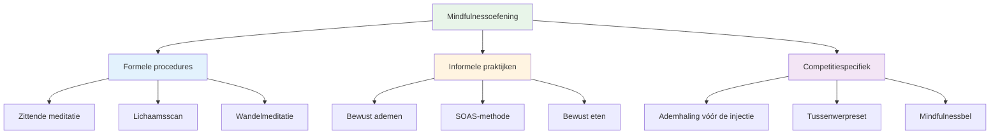

# Mindfulness-technieken

Hier volgen praktische technieken die je kunt gebruiken om mindfulness te ontwikkelen. Begin met één of twee en bouw het daarna uit.

::: tip Het Grote Idee
**Mindfulness is een vaardigheid, geen talent.** Net als richten of schieten, wordt het beter door te oefenen. Begin klein, wees consequent en de voordelen stapelen zich na verloop van tijd op.
:::

## Formele procedures

Dit zijn speciale mindfulness-sessies - tijd die specifiek is gereserveerd voor oefening.

### Zittende meditatie

De basis van mindfulness-oefeningen.

**Hoe doe je het:**
1. Ga comfortabel zitten (op een stoel of op de grond).
2. Sluit je ogen of verzacht je blik.
3. Concentreer je op je ademhaling - het gevoel van lucht die in- en uitstroomt.
4. Wanneer gedachten opkomen, neem ze dan waar zonder oordeel.
5. Breng je aandacht weer rustig terug naar je ademhaling.
6. Begin met 5 minuten en bouw dit op tot 15-20 minuten.

**Tips:**
- Gedachten zullen opkomen - dat is normaal.
- Elke keer dat je merkt dat je bent afgedwaald en terugkeert, ontwikkel je die vaardigheid.
- Oordeel jezelf niet omdat je ronddwaalt.
- Consistentie is belangrijker dan duur.

### Lichaamsscan

Ontwikkelt het bewustzijn van fysieke gewaarwordingen.

**Hoe doe je het:**
1. Ga liggen of zit comfortabel.
2. Begin bij je voeten - let op eventuele sensaties.
3. Richt je aandacht langzaam omhoog: enkels, kuiten, knieën...
4. Observeer zonder te proberen iets te veranderen.
5. Als je spanning voelt, adem dan diep in en uit in dat gebied.
6. Ga verder naar de bovenkant van je hoofd
7. Duurt 10-20 minuten

**Voor pétanque:** Helpt je spanning te herkennen voordat deze je worp beïnvloedt.

### Wandelmeditatie

Mindfulness in beweging - een geweldige voorbereiding op de piste.

**Hoe doe je het:**
1. Loop langzaam en doelbewust.
2. Voel elk onderdeel van de stap: tillen, bewegen, neerzetten.
3. Let op de sensaties in je voeten en benen.
4. Wanneer je gedachten afdwalen, keer dan terug naar de fysieke gewaarwordingen.
5. 5-10 minuten is voldoende.

## Informele praktijken

Deze methoden integreren mindfulness in dagelijkse activiteiten.

### Bewust ademen

De eenvoudigste techniek - altijd beschikbaar.

**De oefening:**
- Neem 3 langzame, bewuste ademhalingen.
- Concentreer je volledig op het gevoel.
- Gebruik het gedurende de dag als resetknop.

**Wanneer te gebruiken:**
- Voordat je de cirkel betreedt
- Wanneer je merkt dat de stress toeneemt
- Tussen de wedstrijden door
- Elk overgangsmoment

### De SOAS-methode

Jouw hulpmiddel om moeilijke momenten aan te kunnen.

| Stap | Actie | Voorbeeld |
|------|--------|---------|
| **Stop | Pauzeer, reageer niet. | Geef de moed niet op na een misser. |
| **O**bserve | Let op wat er gebeurt. | &quot;Ik voel me gefrustreerd. Mijn kaken staan strak.&quot; |
| **Accepteren | Erken het zonder te vechten. | &quot;Zo voel ik me nu.&quot; |
| **S**lip | Laat het los, ga verder. | Ontspan, keer terug naar het heden. |

**Oefen dit in het dagelijks leven** zodat het tijdens wedstrijden automatisch gaat.

### Bewust eten

Een verrassend krachtige methode.

**Hoe doe je het:**
- Eet één maaltijd zonder afleiding (geen telefoon, geen tv).
- Let op de kleuren, geuren en texturen.
- Kauw langzaam en proef volop.
- Merk op wanneer je tevreden bent.

**Waarom het belangrijk is:** Het ontwikkelt de algemene vaardigheid om aandacht te besteden.

### Zintuiglijke waarneming

Volledig betrokken zijn bij je omgeving.

**De 5-4-3-2-1-techniek:**
- Let op 5 dingen die je kunt zien.
- Let op 4 dingen die je kunt horen.
- Merk drie dingen op die je kunt voelen.
- Let op twee dingen die je kunt ruiken.
- Merk één ding op dat je kunt proeven.

**Gebruik dit:** Wanneer je gedachten alle kanten op schieten voor een belangrijke wedstrijd.

## Wedstrijdspecifieke technieken

### De ademhaling vóór de injectie

Integreer ademhalingsoefeningen in je routine:

1. Haal één keer bewust adem voordat je de cirkel betreedt.
2. Voel je voeten op de grond.
3. Laat je schouders zakken tijdens het uitademen.
4. Begin dan met je routine.

### Tussenwerpreset

Wat te doen tijdens het wachten:

- Let op waar je aandacht naartoe gaat.
- Als het over de score/het resultaat gaat, bevestig dit dan en ga terug naar de huidige situatie.
- Richt je aandacht op iets neutraals (je ademhaling, het gevoel van een boule).
- Blijf fysiek ontspannen

### De &quot;Mindfulnessbel&quot;

Gebruik triggers om jezelf eraan te herinneren in het moment te zijn:

- Elke keer dat je een boule oppakt
- Als je het geluid hoort van de krik die wordt gegooid
- Wanneer je de cirkel betreedt
- Wanneer een spel eindigt

Elke trigger = één bewuste ademhaling.

## Je praktijk opbouwen

### Week 1-2: Basis
- Dagelijks 5 minuten zittende meditatie
- 3 bewuste ademhalingen voor elke maaltijd
- Oefen SOAS een keer uit voor het geval er iets kleins misgaat.

### Week 3-4: Uitbreiding
- Verhoog de meditatietijd naar 10 minuten.
- Voeg twee keer per week een lichaamsscan toe.
- Gebruik mindfulness-beltriggers tijdens het oefenen.

### Week 5+: Integratie
- 15-20 minuten dagelijkse oefening
- Volledige integratie in de voorbereidingsroutine.
- SOAS wordt een automatische reactie op fouten.

## Gemeenschappelijke uitdagingen

| Uitdaging | Oplossing |
|-----------|----------|
| &quot;Ik kan niet stoppen met denken&quot; | Dat is niet de bedoeling. Merk het gewoon op en ga terug. |
| &quot;Ik heb geen tijd&quot; | Begin met 3 minuten. Iedereen heeft 3 minuten. |
| &quot;Ik val in slaap&quot; | Probeer te zitten in plaats van te liggen, of oefen eerder op de dag. |
| &quot;Het voelt zinloos&quot; | Voordelen komen met consistentie. Vertrouw op het proces. |
| &quot;Ik vergeet te oefenen&quot; | Stel een dagelijkse herinnering in. Koppel deze aan een bestaande gewoonte. |

## Belangrijkste conclusie

> Mindfulness is een vaardigheid. Net als elke andere vaardigheid, wordt het beter door te oefenen.

Begin klein. Wees consequent. De voordelen stapelen zich op na verloop van tijd.

