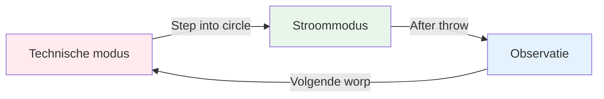
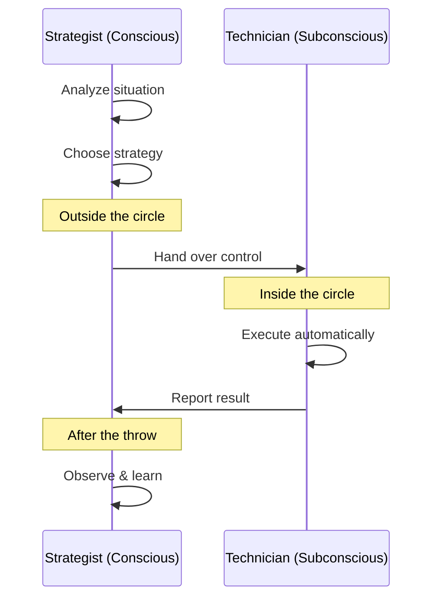

# De Zone: Het Flow-syndroom begrijpen

Heb je wel eens een spel gehad waarbij alles gewoon perfect verliep? Waarbij je niet hoefde na te denken over je techniek en elke boule precies landde waar je hem wilde hebben? Dat is &quot;de zone&quot; - en leren om die zone consistent te bereiken, is wat topspelers onderscheidt van de rest.

::: tip Het Grote Idee
**In een flowtoestand kom je tot rust, terwijl je analytische brein het overneemt.** Je kunt niet door na te denken in die toestand komen - je moet loslaten.
:::

## Wat is de zone?

De zone, ook wel &#39;flow-toestand&#39; genoemd, is een mentale toestand waarin je volledig opgaat in wat je doet. De tijd lijkt te vertragen. Je bewegingen voelen moeiteloos aan. Je denkt niet na over techniek - je bent gewoon aan het *doen*.

Wetenschappers noemen deze toestand **transiënte hypofrontaliteit**. Simpel gezegd komt het erop neer dat het analytische deel van je hersenen (de prefrontale cortex) tot rust komt, waardoor je aangeleerde instincten het overnemen.

### De twee hersenmodi

**Technische modus (planning):**
- Analyseer de situatie
- Kies je strategie
- Bepaal welke worp je wilt maken

**Stroommodus (uitvoering):**
- Vertrouw op je training.
- Richt je uitsluitend op het doel.
- Laat je lichaam het werk automatisch uitvoeren.

**Observatie (Leren):**
- Observeer het resultaat zonder oordeel.
- Leer van wat er is gebeurd.
- Reset voor de volgende worp

## De paradox van pétanque

De uitdaging is als volgt: bij pétanque heb je veel tijd om na te denken tussen de worpen. In tegenstelling tot snelle sporten waarbij je direct moet reageren, heb je tijd om naar de cirkel te lopen, de situatie in te schatten en je worp voor te bereiden.

Deze &quot;tijd om na te denken&quot; is zowel een zegen als een vloek:
- **Cadeau:** Je kunt strategieën plannen en slimme beslissingen nemen.
- **Vloek:** Je kunt te veel nadenken en daardoor je natuurlijke talenten belemmeren.

De topspeler leert deze tijd verstandig te gebruiken: nadenken tijdens de planning en vervolgens &quot;uitschakelen&quot; tijdens de uitvoering.

## Twee spelmodi

Je hersenen werken in twee verschillende modi:

| Functie | Technische modus | Stroommodus |
|---------|---------------|-----------|
| **Wanneer te gebruiken** | Training, het leren van nieuwe vaardigheden | Concurrentie, uitvoering |
| **Hersenactiviteit** | Sterk analytisch denkvermogen | Stil, automatisch |
| **Focus** | Intern (lichaamsmechanica) | Extern (doelwit) |
| **Gevoel** | Met inspanning, bewust | Moeiteloos, natuurlijk |

De belangrijkste vaardigheid is leren om op het juiste moment tussen deze modi te schakelen.

## Het &quot;omschakelingsmoment&quot;

::: warning De Switch-regel
**Voor de kring:** Analyseer, bedenk een strategie en beslis welke worp je gaat maken.
**In de cirkel:** Laat de analyse los, vertrouw op je training en focus alleen op het doel.
**Na de worp:** Bekijk het resultaat zonder oordeel.
:::

De omschakeling vindt plaats wanneer je de cirkel betreedt. Dit is de belangrijkste vaardigheid in pétanque op topniveau.

Zie het zo: je bewuste geest is de **strateeg** die het plan maakt, en je onderbewuste geest is de **technicus** die het uitvoert. De strateeg moet een stapje terug doen en de technicus zijn werk laten doen.

## Waarom overmatig nadenken de prestaties negatief beïnvloedt

Wanneer je tijdens de uitvoering bewust je bewegingen controleert, verstoor je de automatische processen die je hebt aangeleerd. Dit wordt &quot;blokkeren&quot; genoemd - en het overkomt iedereen.

::: danger Tekenen dat je te veel nadenkt
- ❌ Denken aan de armpositie tijdens het gooien
- ❌ Piekeren over de uitkomst voordat je het loslaat
- ❌ Gevoel van spanning of mechanische bewegingen
- ❌ Twijfelen aan jezelf in de kring
:::

::: tip De oplossing
De oplossing is niet om *minder* na te denken, maar om op het **juiste moment** aan de **juiste dingen** te denken.

✅ **Juist denken:** &quot;Ik zie het doel duidelijk&quot;
❌ **Verkeerde gedachte:** &quot;Houd mijn elleboog recht&quot;
:::

## In deze sectie

Leer hoe je de zone beheerst:

- **[Technische vs. Flow Training](/en/education/mental-game/the-zone/technical-vs-flow)** - Begrijpen wanneer je je op techniek moet concentreren en wanneer je los moet laten
- **[De zone bereiken](/en/education/mental-game/the-zone/entering-the-zone)** - Praktische technieken om de flowtoestand te bereiken

## Samenvatting: De zoneregels

::: tip Regel #1: De Wisselregel
**Analyseer vóór de oefening, voer uit tijdens de oefening en observeer erna.**
Je bewuste geest maakt plannen, je onderbewuste voert ze uit.
:::

::: tip Regel #2: De inversieregel
**Naarmate de vaardigheden toenemen, wordt mentale training belangrijker dan technische training.**
Beginners: 90% technisch / 10% mentaal
Experts: 20% technisch / 80% mentaal
:::

::: tip Regel #3: De vertrouwensregel
**Perfecte uitvoering bereik je niet door alleen maar na te denken.**
Vertrouw op je training. Concentreer je op het doel, niet op je techniek.
:::

## Belangrijkste conclusie

> Er bestaan geen technieken die altijd een perfecte boule opleveren. Maar er is een mentale toestand waarin perfecte boules vanzelfsprekend worden.

Je techniek is het fundament. De zone is waar dat fundament kunst wordt.

