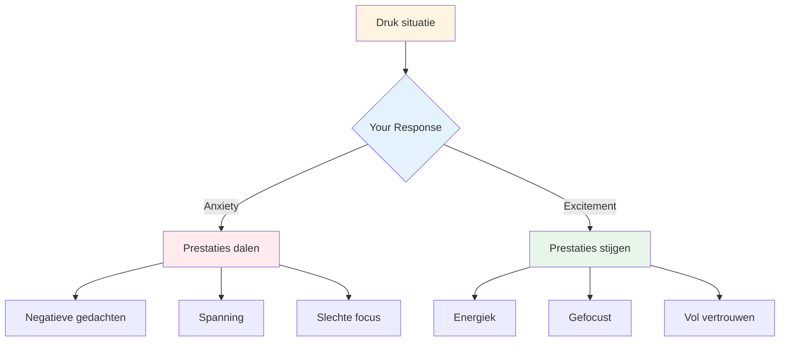

# Omgaan met druk

Druk is onderdeel van competitie. Het doel is niet om het te elimineren; dat is onmogelijk. Het doel is om desondanks goed te presteren en het zelfs in je voordeel te gebruiken.

::: tip Het grote idee
**Druk verdwijnt niet met ervaring; je wordt er alleen maar beter in.** De beste spelers zijn niet kalm; ze zijn bedreven in het productief gebruiken van hun opwinding.
:::

## Druk begrijpen

### Wat zorgt voor druk?
- Hoge inzet (belangrijk spel, beslissende worp)
- Bekeken worden (publiek, teamgenoten)
- Verwachtingen (die van jou en die van anderen)
- Onzekerheid (close score, onbekende tegenstanders)
- Tijd (raakt op, te lang wachten)

### Wat druk met je lichaam doet
Wanneer u druk voelt, reageert uw lichaam:
- De hartslag neemt toe
- De ademhaling wordt oppervlakkig
- Spieren gespannen
- Handen kunnen trillen
- Focus vernauwt (soms te veel)

Dit is je lichaam dat zich voorbereidt op actie. Het is niet slecht – het is energie die je kunt gebruiken.

## Druk herformuleren

### Druk als opwinding

De fysieke sensaties van angst en opwinding zijn vrijwel identiek. Het verschil is hoe je ze interpreteert.

**Angstinterpretatie:** "Ik ben nerveus, er kan iets ergs gebeuren"
**Opwinding interpretatie:** "Ik heb energie, dit is belangrijk voor mij"

**Probeer dit:** Als je druk voelt, zeg dan tegen jezelf: "Ik ben opgewonden" in plaats van "Ik ben nerveus."

### Druk als voorrecht

Alleen belangrijke momenten creëren druk. Als je het voelt, zit je in een situatie die er toe doet.

> "Druk is een voorrecht; het komt alleen degenen toe die het verdienen." -Billie Jean King

## Technieken voor hogedrukmomenten

### 1. Adembeheersing

Je ademhaling is de snelste manier om je toestand te veranderen.

**De 4-7-8 techniek:**
1. Adem in gedurende 4 tellen
2. Houd 7 tellen vast
3. Adem uit gedurende 8 tellen
4. Herhaal 2-3 keer

**Snelle reset (in de cirkel):**
- Eén langzame, diepe ademhaling
- Voel je voeten op de grond
- Laat je schouders zakken bij het uitademen

### 2. Fysieke aarding

Maak contact met fysieke sensaties om uit je hoofd te komen:
- Voel het gewicht van de boule
- Let op je voeten op de grond
- Knijp in de niet-werpende hand en laat deze weer los
- Rol je schouders naar achteren

### 3. Focusvernauwing

Concentreer u op drukmomenten alleen op wat belangrijk is:
- Niet de uitslag
- Niet het publiek
- Niet wat er zou kunnen gebeuren
- Alleen deze worp, dit doel, dit moment

**Betekeniswoorden:** "Hier. Nu. Dit."

### 4. Procesfocus

Verschuiving van uitkomst naar proces:

** Resultaatgerichtheid (creëert druk):**
- "Ik moet dit maken"
- ‘Als ik mis, verliezen we’
- "Iedereen kijkt"

**Procesfocus (vermindert druk):**
- "Volg mijn routine"
- "Zie het doel"
- "Vertrouw op mijn training"

### 5. De linkerknijp

Voor rechtshandige spelers: knijp 10-15 seconden in uw linkerhand:
- Activeert de rechter hersenhelft
- Vermindert analytisch overdenken
- Helpt toegang te krijgen tot automatische uitvoering

Gebruik dit als je merkt dat je te veel nadenkt.

## Voorbereiden op druk

### Simuleer druk in de praktijk

Je kunt niet tegen wedstrijddruk als je die tijdens de training nooit ervaart.

**Manieren om oefendruk te creëren:**
- Gevolgen instellen (push-ups bij missers, koffie kopen voor partner)
- Creëer ‘must-make’-scenario’s
- Oefen met een publiek
- Tijdsdruk (schotklok)
- Vermoeidheid (oefenen als je moe bent)

### Visualisatie

Repeteer mentaal situaties onder hoge druk:
1. Sluit je ogen
2. Stel je een drukscenario in detail voor
3. Voel de druksensaties
4. Zie jezelf er goed mee omgaan
5. Voer het succesvol uit in gedachten

Doe dit regelmatig, niet alleen vóór wedstrijden.

### Bouw een drukgeschiedenis op

Houd bij hoe vaak u goed met druk omging:
- Wat was de situatie?
- Hoe voelde je je?
- Wat heb je gedaan?
- Wat was het resultaat?

Bekijk dit vóór de wedstrijden om jezelf eraan te herinneren: "Ik heb dit eerder gedaan."

## Tijdens de competitie

### Vóór de drukworp
1. Doe een stap achteruit, haal diep adem
2. Herinner jezelf aan je routine
3. Focus op het proces, niet op het resultaat
4. Gebruik uw triggerwoord of signaal

### In de Cirkel
1. Voltooi je routine precies zoals je oefent
2. Focus extern (doel, niet lichaam)
3. Vertrouw op je training
4. Laat los zonder aarzeling

### Na de worp
- Accepteer het resultaat zonder oordeel
- Indien goed: korte bevestiging, verder gaan
- Indien slecht: SOAS-methode, resetten voor de volgende worp

## Veel voorkomende drukfouten

|  | Fout | Betere aanpak |  |
|---------|----------------|
|  | Haasten | Vertraag, gebruik volledige routine |  |
|  | Overdenken | Externe focus, vertrouwenstraining |  |
|  | Veranderende techniek | Blijf bij wat je weet |  |
|  | Gericht op resultaat | Focus op proces |  |
|  | Vechten tegen zenuwen | Accepteer en gebruik de energie |  |

## Sleutel afhaalmaaltijd

> Druk verdwijnt niet met ervaring. Je wordt er alleen maar beter in om ermee te presteren.

De beste spelers zijn niet kalm; ze zijn bedreven in het productief gebruiken van hun opwinding.

