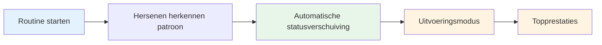

# Bouw uw pre-shot-routine op
<AdBanner />

Je pre-shot-routine is een van de krachtigste hulpmiddelen in je mentale spel. Het is een consistente reeks acties die je op elke worp voorbereidt en je beste prestatiestatus activeert.

::: tip Het grote idee
**Je routine is jouw toegangspoort tot de zone.** Een consistente pre-shot-routine geeft aan je hersenen het signaal: "Het is tijd om uit te voeren." Bij herhaling wordt het een automatische trigger voor topprestaties.
:::

## Waarom routines werken

### Consistentie schept vertrouwen
Als je elke keer hetzelfde doet, verwijder je variabelen. Je lichaam weet wat er gaat komen. Dit creëert een gevoel van controle en vertrouwdheid, zelfs in onbekende situaties.

### Routines veroorzaken toestanden
Door herhaling wordt uw routine gekoppeld aan uw prestatiestatus. Door de routine te starten, begint automatisch de mentale verschuiving naar de uitvoeringsmodus.

### Routines blokkeren afleidingen
Een routine geeft je geest iets om zich op te concentreren. Er is geen ruimte voor zorgen over de partituur, het publiek of wat er zou kunnen gebeuren.

### Routines beheren opwinding
Een goed ontworpen routine helpt je energieniveau te reguleren - kalmeert je als je te opgewonden bent en concentreert je als je plat bent.

## Elementen van een effectieve routine

### Fase 1: Assessment (buiten de cirkel)

Verzamel informatie voordat u ingrijpt:
- Lees het terrein (hellingen, obstakels, ondergrond)
- Beoordeel de situatie (score, bouleposities)
- Kies uw doel en landingsplaats
- Bepaal het type worp (richten, schieten, lob, rollen)

**Dit is waar het denken plaatsvindt.** Neem hier de tijd.

### Fase 2: Transitie (de cirkel betreden)

De verschuiving van denken naar doen:
- Fysieke actie (op een consistente manier in de cirkel stappen)
- Mentale cue (een woord of zin die de ‘uitvoeringsmodus’ aangeeft)
- Adem (één bewuste ademhaling om jezelf te centreren)

**Dit is de schakelaar.** De analyse stopt hier.

### Fase 3: Opstelling (in de cirkel)

Bereid je lichaam voor:
- Consistente houding (elke keer hetzelfde)
- Gripcheck (voel de boule)
- Afstemming op doel
- Fysieke trigger (een kleine beweging die van jou is)

### Fase 4: Visualisatie (kort)

Bekijk de worp voordat je hem maakt:
- Stel je het pad van de bal voor (maximaal 2-3 seconden)
- Voel de succesvolle worp
- Maak visueel verbinding met uw doelgroep

### Fase 5: Uitvoering

Maak de worp:
- Externe focus (alleen doel)
- Vertrouw op je lichaam
- Laat het zonder aarzeling los
- Volg het op natuurlijke wijze

<AdInArticle />

## Bouw uw persoonlijke routine op

### Stap 1: Observeer wat u al doet

Waarschijnlijk heb je al wat routine. Kennisgeving:
- Wat doe je vóór goede worpen?
- Wat voelt voor jou natuurlijk?
- Wat helpt jou focussen?

### Stap 2: Ontwerp uw routine

Maak een reeks die het volgende omvat:
- [ ] Beoordelingsfase
- [ ] Duidelijk overgangsmoment
- [ ] Consistente fysieke opstelling
- [ ] Korte visualisatie
- [ ] Uitvoeringstrigger

### Stap 3: Schrijf het op

Wees specifiek. Voorbeeld:

1. **Beoordeel:** Lees terrein, kies landingsplaats
2. **Overgang:** Stap in de cirkel met de linkervoet eerst, zeg "vertrouwen"
3. **Opstelling:** Voeten op schouderbreedte, gripcontrole, schouders uitlijnen
4. **Visualiseer:** Zie het pad, voel de bevrijding
5. **Uitvoeren:** Ogen op doel gericht, werpen

### Stap 4: Oefen religieus

Gebruik je routine bij ELKE worp in de praktijk:
- Gemakkelijke worpen
- Moeilijke worpen
- Als je moe bent
- Als je fris bent

De routine moet automatisch worden.

### Stap 5: Verfijn in de loop van de tijd

Je routine zal evolueren. Merk op wat werkt en pas het aan. Maar verander het niet tijdens de competitie - alleen tussen evenementen.

## Routinematige timing

Je routine moet een consistente hoeveelheid tijd in beslag nemen:
- Te snel: je haast je, je bent niet goed voorbereid
- Te langzaam: je denkt te veel na en verliest de flow
- Precies goed: genoeg tijd om je voor te bereiden, niet zozeer dat je teveel nadenkt

**Typische timing:**
- Beoordeling: 5-10 seconden
- Overgang + setup: 3-5 seconden
- Visualisatie + uitvoering: 3-5 seconden
- **Totaal: 10-20 seconden**

## Veelvoorkomende routinefouten

|  | Fout | Probleem | Oplossing |  |
|---------|---------|----------|
|  | Overslaan in de praktijk | Routine is niet automatisch | Gebruik het elke worp |  |
|  | Te ingewikkeld | Moeilijk te onthouden onder druk | Vereenvoudig tot de essentie |  |
|  | Meedenken tijdens de uitvoering | Verstoort de automatische prestaties | Duidelijk overgangspunt |  |
|  | Inconsistente timing | Creëert onzekerheid | Oefen met een consistent tempo |  |
|  | Wisselend midden in de competitie | Introduceert twijfel | Blijf bij wat je weet |  |

## Routinematige probleemoplossing

**Als je haast hebt:**
- Voeg een adempauze toe bij de overgang
- Vertraag uw opstellingsbewegingen
- Pauzeer vóór de visualisatie

**Als je te veel nadenkt:**
- Verkort de routine
- Gebruik een sterkere overgangskeu
- Focus meer extern

**Als je inconsistent bent:**
- Maak een video van jezelf om te controleren
- Oefen de routine zonder te gooien
- Feedback krijgen van een partner

## Voorbeeldroutines

### Eenvoudige routine
1. Kies doel
2. Stap in, adem in
3. Vastpakken, uitlijnen
4. Zie het, gooi het

### Gedetailleerde routine
1. Lees het terrein af, kies de landingsplaats
2. Stap eerst met de linkervoet
3. Zeg intern "glad".
4. Eén ademhaling, schouders zakken
5. Voeten zetten, controle van de grip
6. Lijn de schouders uit met het doel
7. Zie het pad (2 seconden)
8. Ogen gericht op het doel
9. Gooi

## Sleutel afhaalmaaltijd

> Je routine is je anker. In chaos is het jouw constante.

Bouw het zorgvuldig op. Oefen het altijd. Vertrouw er volledig op.

<AdBanner />
