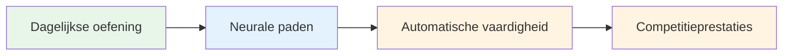
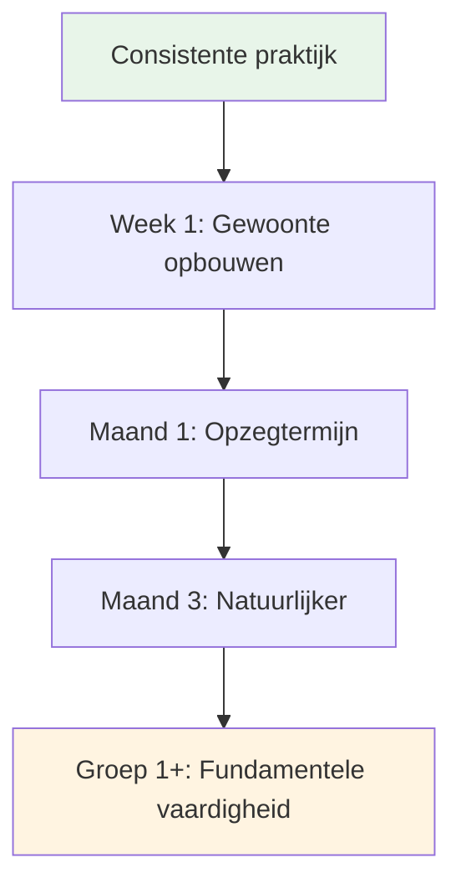

# Een dagelijkse mindfulness-praktijk opbouwen

De voordelen van mindfulness komen voort uit consistente oefening. Zo maak je het onderdeel van je leven.

::: tip Het Grote Idee
**Consistentie is belangrijker dan intensiteit.** Vijf minuten per dag is beter dan een uur per week. Begin klein, wees consequent en de voordelen stapelen zich na verloop van tijd op.
:::

## Waarom dagelijkse oefening belangrijk is

::: info Mindfulness is net als fysieke fitheid.
- ❌ Je wordt niet fit van één sportschoolsessie
- ✅ Regelmatig oefenen zorgt voor blijvende verandering
- ✅ De effecten stapelen zich op na verloop van tijd.
- ✅ Met consistentie wordt het makkelijker
:::

::: tip Onderzoeksonderbouwing
Onderzoek toont aan dat zelfs **3 minuten per dag** meetbare voordelen oplevert. Maar je moet het wel regelmatig doen.
:::

## Je routine creëren

### Stap 1: Kies je tijdstip

Kies een vast tijdstip dat in jouw leven past:

| Tijd | Voordelen | Overwegingen |
|------|------------|----------------|
| **Ochtend** | Zet de toon voor de dag, minder onderbrekingen. | Ik moet vroeger opstaan. |
| **Middag** | Het onderbreekt de dag, zorgt voor een goede concentratie. | Mogelijk vergeet ik het, planningsconflicten |
| **Avond** | Kom tot rust en reflecteer op de dag. | Mogelijk moe en minder alert. |
| **Voor de training** | Directe verbinding met jeu de boules | Afhankelijk van het trainingsschema |

**Beste aanpak:** Koppel het aan een bestaande gewoonte (na de koffie, voor de lunch, enz.)

### Stap 2: Begin klein

Streef er niet naar om het op de eerste dag al 30 minuten vol te houden.

**Aanbevolen vervolgstappen:**
- Week 1-2: 3-5 minuten
- Week 3-4: 5-10 minuten
- Maand 2: 10-15 minuten
- Vanaf maand 3: 15-20 minuten

Het is beter om elke dag 5 minuten te doen dan één keer per week 30 minuten.

### Stap 3: Creëer je eigen ruimte

Je hebt geen aparte meditatieruimte nodig, maar een vaste plek is wel handig:
- Zoek een rustige plek (of gebruik een koptelefoon).
- Comfortabele zitplaatsen
- Minimale afleiding
- Indien mogelijk steeds naar dezelfde plek.

### Stap 4: Verwijder obstakels

Maak het oefenen gemakkelijk:
- Zet je telefoon op stil.
- Zeg tegen familie/huisgenoten dat ze je niet mogen storen.
- Zorg dat alles klaar ligt (kussen, timer).
- Wacht niet op &quot;perfecte&quot; omstandigheden.

## Voorbeelden van dagelijkse schema&#39;s

### Minimale oefening (5 minuten)
- Ochtend: 3 minuten bewust ademhalen
- Gedurende de dag: 3 momenten van mindfulness met een bel
- &#39;s Avonds: 2 minuten lichaamsbewustzijn voor het slapengaan

### Standaard oefening (15 minuten)
- Ochtend: 10 minuten zittende meditatie
- Middag: 2 minuten bewust ademhalen
- Avond: 3 minuten lichaamsscan

### Intensieve oefening (30 minuten)
- Ochtend: 15 minuten zittende meditatie
- Middag: 5 minuten wandelmeditatie
- Avond: 10 minuten lichaamsscan
- Bovendien: bewust eten tijdens één maaltijd.

## Integratie met pétanque-training

### Voor de training
- 5 minuten zittende meditatie
- Formuleer een doel voor de sessie.
- Lichaamsscan om eventuele spanning op te merken.

### Tijdens de training
- Gebruik de routine vóór de injectie als mindfulness-oefening.
- Pas SOAS toe na fouten
- Blijf in het moment tussen de worpen door.

### Na de training
- 3 minuten reflectie (zonder oordeel)
- Noteer eventuele flow-momenten.
- Bewust ademen om de overgang te maken.

## Uw praktijk bijhouden

Door alles bij te houden, blijft de consistentie behouden:

### Eenvoudig logboek
| Datum | Duur | Type | Notities |
|------|----------|------|-------|
| ma | 10 min | Zittend | Mijn hoofd zit vol met gedachten |
| di | 10 min | Zittend | Rustiger vandaag |
| wo | 5 min | Lichaamsscan | Ik voelde spanning in mijn schouders. |

### Wat te volgen
- Heb je geoefend? (Ja/Nee)
- Hoe lang?
- Welk type?
- Korte toelichting op ervaring (optioneel)

### Apps die helpen
- Hoofdruimte
- Kalm
- Inzicht Timer
- Eenvoudige gewoonte-trackers

## Het overwinnen van veelvoorkomende obstakels

### &quot;Ik heb geen tijd&quot;
- Je hebt 3 minuten
- Het gaat om prioriteiten, niet om tijd.
- Probeer te linken naar bestaande activiteiten

### &quot;Ik vergeet het steeds&quot;
- Stel een dagelijks alarm in.
- Koppelen aan een bestaande gewoonte
- Plaats een visuele herinnering op een plek waar je die kunt zien.

### &quot;Ik doe het niet goed&quot;
- Er bestaat geen &quot;juiste&quot; manier.
- Als je oplet, doe je het al.
- Afdwalende gedachten zijn normaal en te verwachten.

### &quot;Ik zie geen resultaten&quot;
- De voordelen zijn in eerste instantie subtiel.
- Houd een dagboek bij om veranderingen in de loop van de tijd op te merken.
- Vertrouw op het onderzoek - het werkt.

### &quot;Het is saai&quot;
- Verveling is gewoon weer een ervaring om te observeren.
- Probeer verschillende technieken.
- Onthoud waarom je het doet.

## Tekenen van vooruitgang

Je merkt misschien geen dramatische veranderingen, maar let op het volgende:
- Jezelf betrappen wanneer je gedachten afdwalen (sneller)
- Sneller herstellen van frustraties
- Spanning signaleren voordat deze oploopt
- Je meer aanwezig voelen tijdens de wedstrijden
- Beter slapen
- Minder reactief op slechte worpen

## Het lange spel

Mindfulness is een levenslange oefening. Topsporters zeggen vaak dat het de meest waardevolle vaardigheid is die ze ooit hebben ontwikkeld.

**Maand 1:** De gewoonte opbouwen
**Maanden 2-3:** Beginnen de voordelen te merken
**Maanden 4-6:** Natuurlijker worden
**Vanaf het eerste jaar:** Een fundamenteel onderdeel van wie je bent

## Belangrijkste conclusie

> Consistentie is belangrijker dan intensiteit. Vijf minuten per dag is beter dan een uur per week.

Begin vandaag nog. Begin klein. Houd vol.

