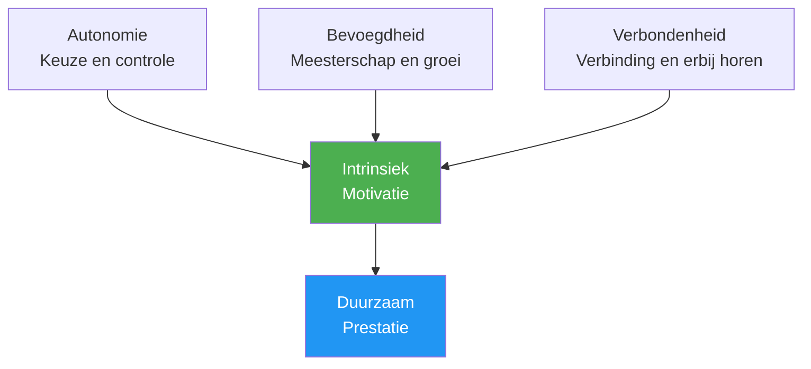

# Psychologie van motivatie

Begrijpen WAAROM je gemotiveerd bent – en niet alleen dát je gemotiveerd bent – helpt je een duurzame drijfveer op te bouwen die niet afhankelijk is van resultaten.

---

## Intrinsieke versus extrinsieke motivatie

### Extrinsieke motivatie

Motivatie die wordt gedreven door externe beloningen of druk:

| Bron | Voorbeeld |
|--------|---------|
| **Trofeeën/medailles** | &quot;Ik wil het kampioenschap winnen&quot; |
| **Ranglijsten** | &quot;Ik wil bij de top 10 van mijn regio horen.&quot; |
| **Herkenning** | &quot;Ik wil dat anderen me als een goede speler zien.&quot; |
| **Vermijd kritiek** | &quot;Ik wil mijn team niet teleurstellen.&quot; |
| **Financieel** | &quot;Ik wil prijzen winnen&quot; |

**Kenmerken:**
- Kan een sterke initiële motivatie bieden.
- Neemt vaak af in de loop van de tijd.
- Afhankelijk van factoren waar u geen controle over heeft.
- Kan het plezier bederven.

### Intrinsieke motivatie

Motivatie vanuit de activiteit zelf:

| Bron | Voorbeeld |
|--------|---------|
| **Meesterschap** | &quot;Ik vind het heerlijk om vooruitgang te boeken.&quot; |
| **Stroom** | &quot;De tijd vliegt voorbij als ik aan het spelen ben&quot; |
| **Uitdaging** | &quot;Ik vind het leuk om mezelf te testen met problemen.&quot; |
| **Uitdrukking** | &quot;Pétanque geeft me de mogelijkheid om uit te drukken wie ik ben.&quot; |
| **Vreugde** | &quot;Ik vind het gewoon geweldig om dit spel te spelen.&quot; |

**Kenmerken:**
- Duurzamer op de lange termijn
- Onafhankelijk van de resultaten
- Verbonden met diepere voldoening
- Verbetert de prestaties op natuurlijke wijze

::: tip Het onderzoek
Onderzoek toont consequent aan dat **intrinsieke motivatie leidt tot betere prestaties, meer doorzettingsvermogen en een groter welzijn** dan extrinsieke motivatie alleen.
:::

---

## Zelfdeterminatietheorie (SDT)

De zelfdeterminatietheorie (SDT), ontwikkeld door Deci en Ryan, identificeert drie fundamentele psychologische behoeften die intrinsieke motivatie aansturen:

### 1. Autonomie

**De behoefte om controle te hebben over je keuzes**

| Ondersteunt autonomie | Ondermijnt autonomie |
|-------------------|---------------------|
| Je trainingsfocus kiezen | Precies te horen krijgen wat je moet doen |
| Je eigen doelen stellen | Externe druk om te presteren |
| Beslissen hoe te oefenen | Gedwongen deelname |
| Inspraak hebben in teambeslissingen | Het controleren van coaches/teamgenoten |

**Voor pétanque:**
- Kies aan welke aspecten je wilt werken.
- Bepaal je eigen ontwikkelingspad.
- Neem zelf tactische beslissingen.
- Bepaal zelf je trainingsschema.

### 2. Competentie

**De behoefte om je effectief en bekwaam te voelen**

| Ondersteunt competentie | Ondermijnt de competentie |
|---------------------|----------------------|
| Passende uitdagingen | Taken die te makkelijk of te moeilijk zijn |
| Duidelijke feedback over de voortgang | Geen feedback of alleen negatieve reacties. |
| Zichtbare verbetering | Stagnatie zonder verklaring |
| Competitie op het niveau van de deelnemer | Voortdurende overmatching |

**Voor pétanque:**
- Houd uw verbeteringsstatistieken bij.
- Zoek naar passende concurrentieniveaus.
- Vier de kleine successen.
- Vraag om specifieke feedback (niet alleen om resultaten).

### 3. Verwantschap

**De behoefte aan verbinding met anderen**

| Ondersteunt verbondenheid | Ondermijnt de onderlinge verbondenheid |
|----------------------|------------------------|
| Positieve teamrelaties | Isolatie |
| Gedeelde doelen met teamgenoten | Puur individuele focus |
| Gemeenschapsgevoel | Uitsluiting of conflict |
| Mentorschap (geven/ontvangen) | Relaties die uitsluitend gebaseerd zijn op concurrentie |

**Voor pétanque:**
- Bouw echte teamverbindingen op.
- Zoek trainingspartners
- Doe mee aan de activiteiten van de clubgemeenschap.
- Deel je kennis met anderen.

---

## De SDT-formule

```
Autonomy + Competence + Relatedness = Intrinsic Motivation
```

Wanneer aan alle drie de behoeften is voldaan, komt intrinsieke motivatie vanzelf tot bloei.



---

## Spectrum van motivatietypen

De zelfdeterminatietheorie (SDT) beschrijft motivatie op een spectrum van extern tot intern:

| Type | Beschrijving | Voorbeeld | Kwaliteit |
|------|-------------|---------|---------|
| **Amotivatie** | Geen motivatie | &quot;Waarom zou je de moeite nemen?&quot; | ❌ |
| **Externe** | Voor beloningen/om straf te vermijden | &quot;Ik ga een trofee winnen&quot; | ⭐ |
| **Geïntrojecteerd** | Innerlijke druk, schuldgevoel | &quot;Ik zou moeten oefenen&quot; | ⭐⭐ |
| **Geïdentificeerd** | Waardevolle uitkomst | &quot;Dit helpt me om te verbeteren&quot; | ⭐⭐⭐ |
| **Geïntegreerd** | In lijn met waarden | &quot;Dit is wie ik ben&quot; | ⭐⭐⭐⭐ |
| **Intrinsiek** | Puur genieten | &quot;Ik vind dit geweldig&quot; | ⭐⭐⭐⭐⭐ |

**Doel:** Verschuif je motivatie naar het intrinsieke uiteinde van het spectrum.

---

## Zelfevaluatie: Uw motivatieprofiel

Beoordeel elke stelling (1 = Helemaal niet, 5 = Volledig):

**Externe indicatoren:**
| Stelling | Score |
|-----------|-------|
| Ik speel voornamelijk om toernooien te winnen. | /5 |
| Erkenning van anderen is erg belangrijk voor mij. | /5 |
| Zonder competitief succes zou ik mijn interesse verliezen. | /5 |
| **Extrinsiek totaal** | /15 |

**Intrinsieke indicatoren:**
| Stelling | Score |
|-----------|-------|
| Ik zou zelfs spelen als er geen wedstrijden waren. | /5 |
| Het gevoel van vooruitgang geeft me energie. | /5 |
| Ik verlies de tijd uit het oog tijdens het spelen. | /5 |
| **Intrinsiek totaal** | /15 |

**Interpretatie:**
- Een hogere intrinsieke totale motivatie = duurzamere motivatie
- Evenwicht is prima, maar zorg ervoor dat intrinsieke waarden groter zijn dan extrinsieke waarden.
- Als externe motivatie sterker is dan interne motivatie, herontdek dan je liefde voor het spel.

---

## Verschuiving naar intrinsieke motivatie

### Herontdek de vreugde

- **Onthoud waarom je bent begonnen** — Wat trok je in eerste instantie aan?
- **Speel zonder inzet** — Af en toe een sessie &quot;gewoon voor de lol&quot;.
- **Geniet van de momenten** — Merk op wanneer je van het spel geniet.

### Focus op meesterschap

- **Stel leerdoelen**, niet alleen resultaatdoelen.
- **Vier de verbetering** ongeacht het resultaat.
- **Omarm uitdagingen** als groeikansen.

### Bouw autonomie op

- **Maak je eigen keuzes** over training
- **Neem de regie over je eigen ontwikkelingspad**
- **Weersta externe druk** om op bepaalde manieren te trainen.

### Bouw verbindingen op

- **Investeer in relaties** die verder gaan dan concurrentie.
- **Deel kennis** met spelers in ontwikkeling.
- **Vind jouw gemeenschap** binnen de sport.

---

## Gerelateerde inhoud

- [Doelstellingen formuleren](/nl/education/motivation/) — Effectieve doelen stellen
- [Motivatie behouden](/nl/education/motivation/maintaining) — Duurzaamheid op lange termijn
- [De Zone](/nl/education/mental-game/the-zone/) — Intrinsieke motivatie en flow
- [Teamdynamiek](/nl/education/team-dynamics/) — Verbondenheid in een teamcontext

