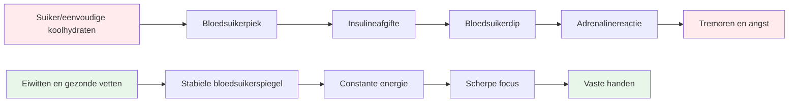

# Voeding voor topprestaties

Pétanque is een precisiesport, geen duursport. Je voedingsbehoeften zijn anders dan die van een marathonloper of een voetballer. Het belangrijkste is **stabiele brandstofvoorziening voor je hersenen** - je geest scherp houden en je handen stabiel gedurende een lange wedstrijddag.

::: tip Het Grote Idee
**Je hersenen zijn je belangrijkste hulpmiddel bij pétanque. Geef ze stabiele brandstof, geen energie die schommelt tussen pieken en dalen.** Focus op eiwitten, gezonde vetten en voldoende hydratatie. Vermijd suikerpieken.
:::

## De uitdaging voor de precisie-atleet

In tegenstelling tot intensieve sporten vereist pétanque geen enorme glycogeenvoorraden of snelle energieaanvulling. Wat het wel vereist, is:

- **Stabiele bloedsuikerspiegel** - geen pieken of dalen
- **Constante mentale helderheid** - focus die de hele dag aanhoudt.
- **Vaste handen** - geen trillingen of beven
- **Rustige zenuwen** - lage angst- en stressreactie

Uw voedingsstrategie moet zich richten op deze factoren, niet op de pure energieproductie.

## Het probleem met suiker en enkelvoudige koolhydraten

Veel atleten kiezen standaard voor een koolhydraatrijk dieet. Voor pétanque-spelers kan dit echter juist een negatieve invloed hebben op hun prestaties.

### De bloedsuiker-achtbaan

Wanneer je suiker of eenvoudige koolhydraten eet:
1. De bloedsuikerspiegel stijgt snel.
2. Insuline wordt vrijgegeven om het te verlagen.
3. Bloedsuikerdip (hypoglykemie)
4. Je lichaam maakt adrenaline aan om dit te compenseren.
5. Je ervaart trillingen, angst en concentratieproblemen.

**Dit is precies het tegenovergestelde van wat je nodig hebt voor precisie.**

### Symptomen van een instabiele bloedsuikerspiegel

| Symptoom | Impact op prestaties |
|---------|----------------------|
| Trillende handen | Inconsistente release |
| Moeite met concentreren | Slechte besluitvorming |
| Prikkelbaarheid | Teamconflicten, gebrek aan zelfbeheersing |
| Vermoeidheid na de maaltijd | Middagdip |
| Spanning | Drukgevoeligheid |
| Hersenmist | Langzaam tactisch denken |

## Een betere aanpak: stabiele energie

Het doel is om je hersenen constant van brandstof te voorzien, zonder de schommelingen die je daarbij ervaart.

### Kernprincipes

1. **Geef prioriteit aan eiwitten en gezonde vetten** - Ze leveren langdurige, constante energie.
2. **Kies complexe koolhydraten boven enkelvoudige** - Als je koolhydraten eet, kies dan voor koolhydraten die langzaam verteren.
3. **Vermijd pieken in de bloedsuikerspiegel** - Vooral voor en tijdens wedstrijden.
4. **Zorg dat je voldoende drinkt** - Uitdroging heeft een aanzienlijk negatief effect op je concentratie.
5. **Eet regelmatig** - Zorg dat je niet te hongerig wordt.

### Voedingsmiddelen die helpen

| Voedseltype | Voorbeelden | Waarom het werkt |
|-----------|----------|--------------|
| Eiwit | Eieren, noten, kaas, vlees | Langzame vertering, stabiele energie |
| Gezonde vetten | Avocado, olijfolie, noten | Duurzame brandstof |
| Complexe koolhydraten | Groenten, peulvruchten | Vezels vertragen de opname. |
| Fruit met een laag suikergehalte | Bessen, appels | Voedingsstoffen zonder piek. |

### Voedingsmiddelen die je beter kunt beperken

| Voedseltype | Voorbeelden | Waarom het problematisch is |
|-----------|----------|---------------------|
| Suiker | Snoep, frisdrank, gebak | Snelle piek en vervolgens een snelle daling |
| Wit brood/pasta | Sandwiches, pastagerechten | Snelle omzetting naar suiker |
| Vruchtensap | Sinaasappelsap, smoothies | Geconcentreerde suiker |
| Energiedrankjes | De meeste commerciële merken | Suiker + cafeïne-dip |

## Voeding op de wedstrijddag

### Voor de wedstrijd

**2-3 uur van tevoren:**
- Een evenwichtige maaltijd met eiwitten, vetten en groenten.
- Vermijd koolhydraten met een hoog koolhydraatgehalte, omdat die slaperigheid kunnen veroorzaken.
- Bijvoorbeeld: eieren met groenten, of salade met kip.

**1 uur van tevoren:**
- Een lichte snack indien nodig.
- Noten, kaas of een kleine portie eiwit.
- Vermijd alles wat suiker bevat.

### Tijdens de wedstrijd

**Tussen de wedstrijden door:**
- Water (het allerbelangrijkste)
- Kleine eiwitrijke snacks (noten, kaas, vlees)
- Vermijd suikerrijke snacks en dranken.

**Tekenen dat je moet eten:**
- Moeite met concentreren
- Prikkelbaarheid
- Ik voel me wankel.
- Hoofdpijn

### Na de wedstrijd

- Vul je energie weer aan met een evenwichtige maaltijd.
- Hydrateer volledig.
- Beloon jezelf niet met suiker, want dat zal je herstel belemmeren.

## Hydratatie

Uitdroging beïnvloedt de cognitieve functies nog voordat je dorst voelt.

### Richtlijnen

- **Begin goed gehydrateerd** - Drink gedurende de dag vóór de wedstrijd voldoende water.
- **Tijdens het spelen** - Drink regelmatig kleine slokjes water, wacht niet tot je dorst hebt.
- **Vermijd overmatige cafeïne** - Het werkt vochtafdrijvend.
- **Let op de volgende signalen:** - Hoofdpijn, donkere urine, vermoeidheid

### Hoe veel?

Een algemene richtlijn: streef naar lichtgele urine. Is de urine donker, dan moet je meer drinken.

## De koolhydraatarme optie

Sommige precisiesporters volgen een koolhydraatarm of ketogeen dieet. De theorie erachter:

**Mogelijke voordelen:**
- Zeer stabiele bloedsuikerspiegel (geen pieken mogelijk)
- Constante mentale helderheid
- Verminderde angst en trillingen
- Geen energiedipjes in de middag

**Aandachtspunten:**
- Vereist een aanpassingsperiode (1-2 weken).
- Niet geschikt voor iedereen
- Vereist planning en toewijding.
- Raadpleeg eerst een zorgverlener.

Dit is een geavanceerde strategie - niet voor iedereen nodig, maar het overwegen waard als een stabiele bloedsuikerspiegel voor u een belangrijk aandachtspunt is.

## Praktische tips

### Makkelijke wedstrijdsnacks
- Gemengde noten (ongezouten)
- Hardgekookte eieren
- Kaasblokjes
- Gedroogd rundvlees of kalkoen
- Groenten met hummus
- olijven

### Wat je moet vermijden
- Snacks uit de automaat
- Suikerhoudende sportdranken
- Gebak en andere lekkernijen
- Snoep en chocoladerepen
- De meeste &quot;energierepen&quot; (controleer het suikergehalte).

## Belangrijkste conclusie

> Bij pétanque zijn je hersenen je belangrijkste hulpmiddel. Geef ze stabiele brandstof, geen energie die je in een achtbaan kunt stoppen.

Focus op eiwitten, gezonde vetten en voldoende water drinken. Vermijd schommelingen in je bloedsuikerspiegel. Je concentratie, kalmte en vaste hand zullen je er dankbaar voor zijn.

