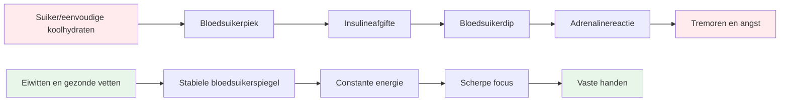
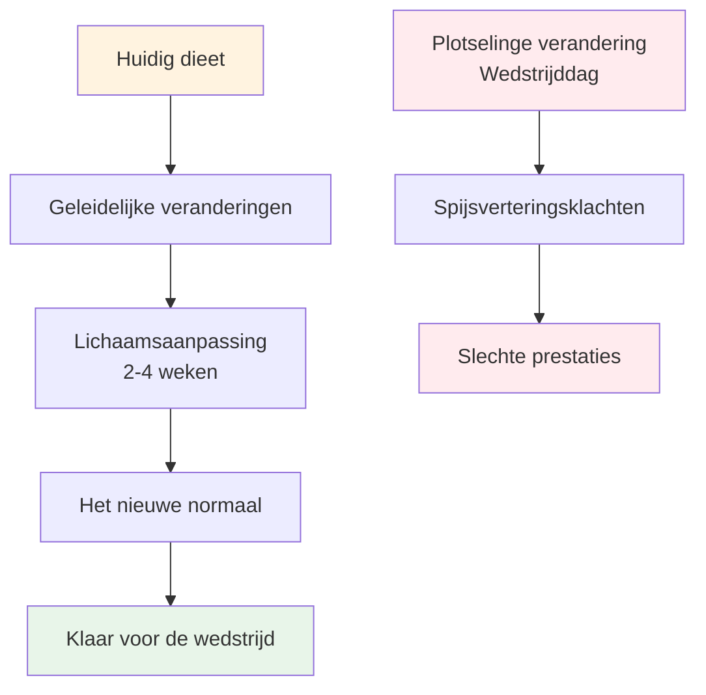

# Voeding voor topprestaties
<AdBanner />


Pétanque is een precisiesport, geen duursport. Je voedingsbehoeften zijn anders dan die van een marathonloper of een voetballer. Het belangrijkste is **stabiele brandstofvoorziening voor je hersenen** - je geest scherp houden en je handen stabiel gedurende een lange wedstrijddag.

::: tip Het Grote Idee
**Your brain is your most important tool in pétanque. Feed it stable fuel, not roller coaster energy.** Focus on protein, healthy fats, and staying hydrated. Avoid sugar spikes.
:::



## De uitdaging voor de precisie-atleet

In tegenstelling tot intensieve sporten vereist pétanque geen enorme glycogeenvoorraden of snelle energieaanvulling. Wat het wel vereist, is:

- **Stabiele bloedsuikerspiegel - geen pieken of dalen.**
- **Constante mentale helderheid - focus die de hele dag aanhoudt.**
- **Vaste handen - geen trillingen of beven**
- **Rustige zenuwen - lage angst- en stressreactie**

Uw voedingsstrategie moet zich richten op deze factoren, niet op de pure energieproductie.

## Het probleem met suiker en enkelvoudige koolhydraten

Veel atleten kiezen standaard voor een koolhydraatrijk dieet. Voor pétanque-spelers kan dit echter juist een negatieve invloed hebben op hun prestaties.

### De bloedsuiker-achtbaan

Wanneer je suiker of eenvoudige koolhydraten eet:
1. De bloedsuikerspiegel stijgt snel.
2. Insuline wordt vrijgegeven om het te verlagen.
3. Dalende bloedsuikerspiegel (hypoglykemie)
4. Je lichaam maakt adrenaline aan om dit te compenseren.
5. Je ervaart trillingen, angst en concentratieproblemen.

**This is the opposite of what you need for precision.**

### Symptomen van een instabiele bloedsuikerspiegel

| Symptoom | Impact op prestaties |
|---------|----------------------|
| Trillende handen | Inconsistente release |
| Moeite met concentreren | Slechte besluitvorming |
| Prikkelbaarheid | Teamconflicten, gebrek aan zelfbeheersing |
| Vermoeidheid na de maaltijd | Middagdip |
| Spanning | Drukgevoeligheid |
| Hersenmist | Langzaam tactisch denken |

## Een betere aanpak: stabiele energie

Het doel is om je hersenen constant van brandstof te voorzien, zonder de schommelingen die je daarbij ervaart.

### Kernprincipes

1. **Geef prioriteit aan eiwitten en gezonde vetten** - Deze leveren langzame, constante energie.
2. **Kies complexe koolhydraten boven enkelvoudige** - Als je koolhydraten eet, kies dan voor koolhydraten die langzaam verteren.
3. **Vermijd pieken in de bloedsuikerspiegel** - Vooral voor en tijdens wedstrijden.
4. **Zorg dat je voldoende drinkt** - Uitdroging heeft een aanzienlijk negatief effect op de concentratie.
5. **Eet regelmatig** - Zorg dat je niet te hongerig wordt.

### Voedingsmiddelen die helpen

| Voedselsoort | Voorbeelden | Waarom het werkt |
|-----------|----------|--------------|
| Eiwit | Eieren, noten, kaas, vlees | Langzame vertering, stabiele energie |
| Gezonde vetten | Avocado, olijfolie, noten | Duurzame brandstof |
| Complexe koolhydraten | Groenten, peulvruchten | Vezels vertragen de opname. |
| Fruit met een laag suikergehalte | Bessen, appels | Voedingsstoffen zonder piek. |

### Voedingsmiddelen die je beter kunt beperken

| Voedselsoort | Voorbeelden | Waarom het problematisch is |
|-----------|----------|---------------------|
| Suiker | Snoep, frisdrank, gebak | Snelle piek en vervolgens een snelle daling |
| Wit brood/pasta | Sandwiches, pastagerechten | Snelle omzetting naar suiker |
| Vruchtensap | Sinaasappelsap, smoothies | Geconcentreerde suiker |
| Energiedrankjes | De meeste commerciële merken | Suiker + cafeïne-dip |

## Voeding op de wedstrijddag

### Voor de wedstrijd

**2-3 hours before:**
- Een evenwichtige maaltijd met eiwitten, vetten en groenten.
- Vermijd koolhydraten met een hoog koolhydraatgehalte, omdat die slaperigheid kunnen veroorzaken.
- Bijvoorbeeld: eieren met groenten, of salade met kip.

**1 hour before:**
- Een lichte snack indien nodig.
- Noten, kaas of een kleine portie eiwit.
- Vermijd alles wat suiker bevat.

### Tijdens de wedstrijd

**Between games:**
- Water (het allerbelangrijkste)
- Kleine eiwitrijke snacks (noten, kaas, vlees)
- Vermijd suikerrijke snacks en dranken.

**Signs you need to eat:**
- Moeite met concentreren
- Prikkelbaarheid
- Ik voel me wankel.
- Hoofdpijn

### Na de wedstrijd

- Vul je energie weer aan met een evenwichtige maaltijd.
- Hydrateer volledig.
- Beloon jezelf niet met suiker, want dat zal je herstel belemmeren.

## Hydratatie

Uitdroging beïnvloedt de cognitieve functies nog voordat je dorst voelt.

### Richtlijnen

- **Begin gehydrateerd - Drink gedurende de dag vóór de wedstrijd voldoende water.**
- **Tijdens het spelen: drink regelmatig kleine slokjes water, wacht niet tot je dorst hebt.**
- **Vermijd overmatige cafeïne - het werkt vochtafdrijvend.**
- **Let op de volgende signalen: hoofdpijn, donkere urine, vermoeidheid**

### Hoe veel?

Een algemene richtlijn: streef naar lichtgele urine. Is de urine donker, dan moet je meer drinken.

## De koolhydraatarme optie

Sommige precisiesporters volgen een koolhydraatarm of ketogeen dieet. De theorie erachter:

**Potential benefits:**
- Zeer stabiele bloedsuikerspiegel (geen pieken mogelijk)
- Constante mentale helderheid
- Verminderde angst en trillingen
- Geen energiedipjes in de middag

**Considerations:**
- Vereist een aanpassingsperiode (1-2 weken).
- Niet geschikt voor iedereen
- Vereist planning en toewijding.
- Raadpleeg eerst een zorgverlener.

<AdInArticle />

Dit is een geavanceerde strategie - niet voor iedereen nodig, maar het overwegen waard als een stabiele bloedsuikerspiegel voor u een belangrijk aandachtspunt is.

## Voeding als oefening: je lichaam trainen

::: warning Kritisch concept
**Mat är inte bara bränsle - det är något du övar med.** Just like you practice your throw, you must practice your nutrition to get your body comfortable with competition-day eating.
:::

### Waarom goede voedingspraktijken belangrijk zijn

Je spijsverteringsstelsel is trainbaar. Wat je regelmatig eet, wordt wat je lichaam verwacht en het beste verwerkt. Als je alleen op wedstrijddagen eiwitten en groenten eet, zal je lichaam zich daar niet aan aanpassen.

**The problem:**
- Het eten van onbekende voedingsmiddelen op de wedstrijddag kan spijsverteringsproblemen veroorzaken.
- Je lichaam heeft tijd nodig om zich aan nieuwe eetpatronen aan te passen.
- Stress + onbekend voedsel = mogelijke maagproblemen
- Prestatieangst is al erg genoeg zonder daar nog spijsverteringsangst aan toe te voegen.

**The solution:**
- Oefen je wedstrijdvoeding tijdens de training.
- Maak van de voeding die je op de wedstrijddag eet een vast onderdeel van je dagelijkse routine.
- Train je lichaam om zich prettig te voelen bij voedingsmiddelen met een stabiele energiebalans.

### Het aanpassingsproces



Wanneer je je dieet verandert:
1. **Week 1-2:** Je lichaam went aan de nieuwe voeding en kan anders aanvoelen.
2. **Week 3-4:** Aanpassing vindt plaats, nieuwe voedingsmiddelen voelen normaal aan.
3. **Week 5+:** Je lichaam is gewend aan en verwerkt deze voedingsmiddelen efficiënt.

**This is why you can't just "eat healthy" on competition day and expect optimal results.**

### Hoe je je voedingspatroon in de praktijk kunt brengen

#### 1. Begin tijdens de training

**Practice your competition-day eating during training sessions:**
- Eet dezelfde maaltijd vóór de training als vóór de wedstrijd.
- Neem dezelfde snacks mee als naar een toernooi.
- Let op hoe je lichaam reageert.
- Pas het aan op basis van wat werkt.

**Example training day:**
```
2-3 hours before: Eggs with vegetables (same as competition)
During training: Water + nuts (same as competition)
After training: Balanced meal with protein
```

#### 2. Maak er je normale routine van.

**Don't have a "competition diet" and a "regular diet"** - this creates two problems:
- Je lichaam past zich nooit volledig aan aan een van beide.
- Wedstrijdvoeding voelt onbekend en stressvol aan.

**Instead:**
- Maak energierijke voedingsmiddelen onderdeel van je dagelijkse routine.
- Je lichaam wordt efficiënter in het gebruik van eiwitten en vetten.
- De wedstrijddag voelt normaal aan, niet anders dan anders.
- Geen onaangename verrassingen voor de spijsvertering.

#### 3. Testen en verfijnen

**Use training to experiment:**

| Test | Waarop te letten | Aanpassen |
|------|----------------|--------|
| Timing van de maaltijd vóór de training | Energieniveau, concentratie | Vind het optimale venster voor jou. |
| Verschillende eiwitbronnen | Spijsvertering, comfort | Bepaal wat het beste werkt. |
| Soorten snacks | Aanhoudende energie | Vind jouw favoriete snacks |
| Hydratatiehoeveelheden | Concentratie, toiletpauzes | Evenwichtige inname |

**Keep a simple log:**
- Wat je gegeten hebt en wanneer.
- Hoe voelde je je tijdens de training?
- Energieniveau en concentratie
- Spijsverteringsproblemen

#### 4. Creëer comfort en zelfvertrouwen

**The psychological benefit:**

Als je je voedingsschema honderden keren hebt geoefend tijdens je training:
- Je weet precies hoe je lichaam zal reageren.
- Geen zorgen over voedselkeuzes
- Een zorg minder op de wedstrijddag.
- Vertrouwen in je voorbereiding

**This is the same principle as practicing your throw** - repetition builds comfort and reliability.

### Algemene aanpassingsuitdagingen

::: details Overstappen van een koolhydraatrijk naar een energiestabiel dieet

**Challenge:** You're used to bread, pasta, and sugary snacks

**Adaptation period:** 2-4 weeks

**What to expect:**
- Week 1: Je kunt je anders voelen, je hebt trek in vertrouwde gerechten.
- Week 2: Energieniveau stabiliseert, trek in ongezonde snacks neemt af
- Week 3-4: Het nieuwe normaal, het lichaam gaat efficiënt om met vetten en eiwitten.

**How to practice:**
- Begin met één maaltijd tegelijk.
- Vervang eerst de enkelvoudige koolhydraten door complexe koolhydraten.
- Verhoog geleidelijk de inname van eiwitten en gezonde vetten.
- Oefen dit eerst tijdens trainingen met een lage inzet.
:::

::: details Voedingsmiddelen vinden die bij jou passen

**Challenge:** Not everyone digests the same foods well

**What to test:**
- Verschillende eiwitbronnen (eieren versus vlees versus noten)
- Tijdstip van de maaltijden (2 uur versus 3 uur van tevoren)
- Portiegrootte (te veel = loom, te weinig = hongerig)
- Specifieke voedingsmiddelen die ongemak veroorzaken

**Practice approach:**
- Probeer één variabele tegelijk.
- Geef voor elke test 2-3 trainingssessies.
- Noteer wat je het beste gevoel geeft.
- Stel je eigen &quot;wedstrijdmenu&quot; samen.
:::

::: details Omgaan met voedselomgevingen tijdens toernooien

**Challenge:** Tournaments often have limited food options

**Practice solution:**
- Neem altijd je eigen snacks mee (oefen dit maar vast).
- Verken locaties indien mogelijk van tevoren.
- Zorg voor back-upopties waarvan je weet dat ze werken.
- Oefen met eten in verschillende omgevingen.

**Mental preparation:**
- Vertrouw niet op het eten dat ter plaatse wordt geserveerd.
- Beschouw voedsel als onderdeel van je uitrusting.
- Pak het in zoals je je jeu de boules inpakt.
:::

### Het 30-dagen voedingsplan

**Goal:** Make stable-energy eating your comfortable normal

**Week 1-2: Foundation**
- Vervang één maaltijd per dag door een eetpatroon zoals bij een wedstrijd.
- Oefen met voeding vóór de training.
- Begin met het meenemen van snacks naar de training.
- Let op hoe je lichaam reageert.

**Week 3-4: Expansion**
- Eet twee maaltijden per dag met een stabiele energiebalans.
- Oefen tijdens de trainingen het volledige eetpatroon van de wedstrijddag.
- Verfijn je snackkeuzes.
- Stel je lijst met favoriete gerechten samen.

**Week 5+: Mastery**
- Een stabiel energieniveau in je voeding wordt je nieuwe normaal.
- Het lichaam is volledig aangepast.
- De wedstrijddag voelt als routine.
- Vertrouwen in je voeding

### Jouw wedstrijdvoedingspakket

**Practice packing this for every training session:**

**Pre-competition (2-3 hours before):**
- [ ] Eiwitbron (eieren, vlees of noten)
- [ ] Groenten of salade
- [ ] Gezonde vetten (avocado, olijfolie, kaas)

**During competition:**
- [ ] Waterfles (navulbaar)
- [ ] Gemengde noten (kleine porties)
- [ ] Hardgekookte eieren (indien koel te bewaren)
- [ ] Kaasblokjes of strengkaas
- [ ] Gedroogd vlees
- [ ] Reserve snacks

**The more you practice with this kit, the more automatic it becomes.**

## Praktische tips

### Makkelijke wedstrijdsnacks
- Gemengde noten (ongezouten)
- Hardgekookte eieren
- Kaasblokjes
- Gedroogd rundvlees of kalkoen
- Groenten met hummus
- olijven

### Wat je moet vermijden
- Snacks uit de automaat
- Suikerhoudende sportdranken
- Gebak en andere lekkernijen
- Snoep en chocoladerepen
- De meeste &quot;energierepen&quot; (controleer het suikergehalte).

## Belangrijkste conclusie

> Bij pétanque is je brein je belangrijkste instrument. Geef het stabiele brandstof, geen energie die je in een achtbaan kunt stoppen. En oefen je voeding net zoals je je worp oefent: herhaling zorgt voor vertrouwen en betrouwbaarheid.

Focus op eiwitten, gezonde vetten en voldoende hydratatie. Vermijd suikerpieken. **Het allerbelangrijkste: zorg ervoor dat je je dagelijkse voeding aanhoudt zoals je die op de wedstrijddag eet.** Je lichaam heeft oefening nodig om optimaal te presteren.

**Remember:** You wouldn't show up to a tournament with a throwing technique you've never practiced. Don't show up with a nutrition strategy you've never practiced either.

<AdBanner />
