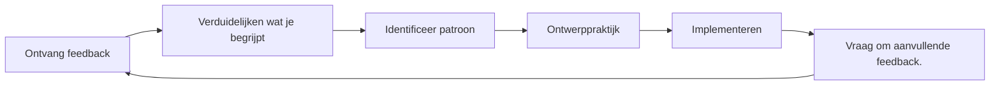

# Feedback ontvangen en gebruiken

Feedback is een van de krachtigste instrumenten voor ontwikkeling, maar tegelijkertijd een van de meest onderbenutte. Op deze pagina leer je hoe je actief feedback kunt vragen, constructief kunt ontvangen en kunt omzetten in concrete verbeteringen.

---

## Waarom we feedback afwijzen

Voordat je leert om feedback te vragen, is het belangrijk te begrijpen waarom dat moeilijk is:

### Ego-bescherming

Je hersenen interpreteren kritiek op je prestaties als een bedreiging voor je identiteit. Dit roept verdedigingsreacties op:
- De feedback negeren
- Redenen vinden waarom de persoon ongelijk heeft
- Het voorkomen van soortgelijke situaties in de toekomst

### Bevestigingsbias

We zoeken van nature naar informatie die bevestigt wat we al geloven. Als je denkt dat je een goede aanwijzer bent, zul je je succesvolle punten herkennen en de missers verklaren.

### De verschuiving naar een groeimindset

::: tip Feedback herformuleren
**Vaste mindset:** &quot;Kritiek betekent dat ik gebrekkig ben&quot;
**Groeimindmentaliteit:** &quot;Feedback is informatie die me helpt te verbeteren.&quot;

Het verschil zit hem niet in de positiviteit, maar in de nauwkeurigheid. Feedback is gebaseerd op data, niet op oordelen.
:::

---

## Bronnen van objectieve feedback

### 1. Kwantitatieve gegevens

Cijfers liegen niet en verzachten de waarheid niet:

| Metrisch | Wat het onthult |
|--------|-----------------|
| **Aanwijsnauwkeurigheid %** | Technische basislijn en trends |
| **Nauwkeurigheid in de beginfase versus de late fase van de wedstrijd** | Vermoeidheids-/drukeffecten |
| **Succespercentage bij het schieten** | Op basis van afstand, doeltype en wedstrijdsituatie |
| **Carreau-percentage** | Effectiviteit van risicobereidheid |

### 2. Teamgenoten

Je teamgenoten zien je in competitieverband – op het moment dat je zelfbeeld het minst accuraat is:

**Wat te vragen:**
- &quot;Hoe kom ik op je over als we achterstaan?&quot;
- &quot;Wat valt u op aan mijn aanpak in spannende wedstrijden?&quot;
- &quot;Wat zou ik kunnen doen om een betere teamgenoot te zijn?&quot;

### 3. Tegenstanders

Gesprekken na de wedstrijd met vertrouwde tegenstanders kunnen veel onthullen:

**Wat te vragen:**
- &quot;Wat probeerde je in mijn spel uit te buiten?&quot;
- &quot;Was er iets aan mijn spel dat je verraste?&quot;

### 4. Coaches/Ervaren spelers

Externe expertise biedt een perspectief dat u zelf niet kunt genereren:

**Wat te vragen:**
- &quot;Wat is het grootste verschil tussen mijn potentieel en mijn huidige prestaties?&quot;
- &quot;Welk patroon zie je bij mijn missers?&quot;
- &quot;Waar zou je prioriteit aan geven als je mij zou coachen?&quot;

### 5. Videoanalyse

De meest objectieve spiegel die er is. Zie [Videoanalyse](/en/education/self-awareness/video) voor gedetailleerde protocollen.

---

## Hoe vraag je effectief om feedback?

### Het SEEK-raamwerk

**S - Specifiek**
Vraag niet: &quot;Hoe heb ik gespeeld?&quot;
Vraag: &quot;Hoe nauwkeurig was mijn werptechniek in de derde end toen we achter stonden?&quot;

**E - Voorbeelden**
Vraag: &quot;Kunt u een concreet voorbeeld geven?&quot;
Dit dwingt tot concrete feedback in plaats van generalisaties.

**E - Verkennend**
Benader het met nieuwsgierigheid, niet in de verdediging.
&quot;Ik probeer mijn blinde vlekken te begrijpen. Wat zie ik mogelijk over het hoofd?&quot;

**K - Vriendelijk (voor jezelf)**
Onthoud: feedback vragen is moedig. Je levert hard werk.

### Timing is belangrijk

| Wanneer | Het beste voor | Voorkomen |
|------|----------|-------|
| **Direct daarna** | Specifieke technische opmerkingen | Emotionele verwerking |
| **Volgende dag** | Evenwichtig perspectief, patronen | Als details vervaagd zijn |
| **Videorecensie** | Objectieve analyse | Als het de actie te lang uitstelt |

---

## Feedback ontvangen zonder in de verdediging te schieten

Wanneer je feedback krijgt, zal je brein zich willen verdedigen. Zo kun je dat onderdrukken:

### De 3-secondenregel

Wanneer je feedback ontvangt, **wacht dan 3 seconden voordat je reageert**. Dit geeft je rationele brein de tijd om na te denken voordat je emotionele brein reageert.

### De &quot;Vertel me meer&quot;-techniek

In plaats van je te verdedigen, zeg je: &quot;Vertel me daar eens meer over.&quot;

Dit:
- Koopt verwerkingstijd
- Laat zien dat je de invoer waardeert.
- Vaak onthult het het onderliggende inzicht.

### Aparte ontvangst van de evaluatie

**Stap 1:** Ontvang (luister gewoon)
**Stap 2:** Verduidelijken (zorg ervoor dat je het begrijpt)
**Stap 3:** Bedank (erken het geschenk)
**Stap 4:** Evalueer (beslis later in stilte wat je gaat doen)

Je hoeft het niet meteen eens te zijn met feedback. Je hoeft het alleen maar open te ontvangen.

---

## Het feedbackresponsprotocol

Gebruik dit bij het ontvangen van feedback:

1. &quot;Bedankt dat je me dat verteld hebt.&quot;
   - Oprechte waardering, zelfs als de feedback pijnlijk is.

2. &quot;Kunt u een concreet voorbeeld geven?&quot;
   - Van algemeen naar concreet.

3. &quot;Wat zou u me aanraden om te proberen?&quot;
   - Nodigt uit tot samenwerking bij verbetering

4. &quot;Ik ga daarover nadenken.&quot;
   - Eerlijke toezegging zonder onmiddellijke overeenkomst.

---

## Feedback omzetten in actie

Feedback zonder actie is slechts een ongemakkelijk gesprek.

### Het feedback-naar-actieproces

### Actiesjabloon

Voor elk bruikbaar feedbackpunt:

| Element | Uw antwoord |
|---------|---------------|
| **De feedback** | (Wat er gezegd werd) |
| **Het patroon** | (Welk terugkerend probleem komt hieruit naar voren?) |
| **De actie** | (Wat ga je precies oefenen?) |
| **De Maatregel** | (Hoe weet je of je vooruitgang hebt geboekt?) |
| **De tijdlijn** | (Wanneer zult u de situatie opnieuw beoordelen?) |

---

## Een feedbackcultuur creëren

### Met uw team

- **Normaal maken:** Regelmatige feedback wordt de norm, niet de uitzondering.
- **Tweewegcommunicatie:** Geef feedback om het zelf ook te kunnen ontvangen.
- **Afspraken over timing:** &quot;Laten we na de wedstrijden nabespreken&quot; versus ongevraagde kritiek
- **Focus op de details:** &quot;Ik merkte X op&quot; is beter dan &quot;Je doet altijd Y&quot;.

### Met jezelf

- **Wekelijkse zelfevaluatie:** Een vast moment om je week te evalueren.
- **Schriftelijke reflectie:** Schrijven zorgt voor helderheid.
- **Patroonherkenning:** Zoek naar terugkerende thema&#39;s in meerdere bronnen.

---

## De speler die zich verzet tegen feedback

Als je jezelf in een van deze punten herkent, geef dan prioriteit aan dit werk:

::: warning Tekenen van weerstand tegen feedback
- Je kunt altijd uitleggen waarom de feedback niet van toepassing is.
- Je vraagt alleen feedback aan mensen die het met je eens zijn.
- Je voelt je aangevallen wanneer je constructieve feedback krijgt.
- Je vermijdt mensen die je zelfbeeld ter discussie stellen.
- Je rationaliseert slechte resultaten door externe factoren toe te schrijven.
:::

Het doorbreken van deze patronen vereist bewuste inspanning, maar de beloning is een versnelde verbetering.

---

## Gerelateerde inhoud

- [Het voordeel van zelfbewustzijn](/en/education/self-awareness/) — Waarom zelfkennis belangrijk is
- [Videoanalyse](/en/education/self-awareness/video) — Objectieve zelfobservatie
- [Teamdynamiek](/en/education/team-dynamics/) — Communicatie met teamgenoten
- [Mentale kracht](/en/education/mental-game/mental-strength/) — Omgaan met moeilijke waarheden

