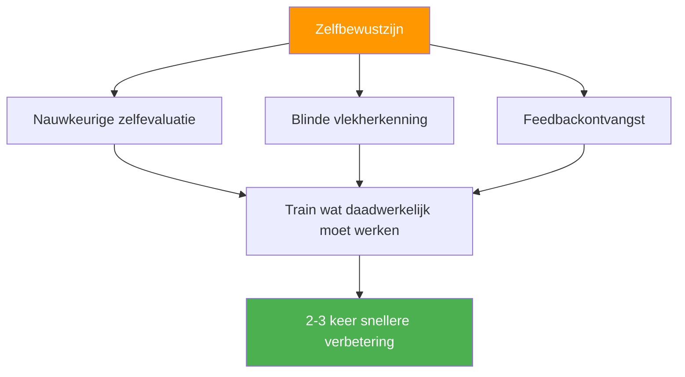

# Het voordeel van zelfbewustzijn

::: tip De meta-vaardigheid die alles vermenigvuldigt
**Gewicht: 400 punten** — Spelers met een accurate zelfperceptie verbeteren 2-3 keer sneller omdat ze trainen wat daadwerkelijk verbetering behoeft.
:::

## Waarom dit jouw verborgen vermenigvuldiger is

> &quot;Je kunt niet verbeteren wat je niet kunt zien.&quot;

De meeste spelers besteden uren aan oefenen, maar **oefenen ze wel de juiste dingen?** Zelfbewustzijn is de meta-vaardigheid die ervoor zorgt dat je trainingstijd daadwerkelijk effectief is.

### Het verbeteringsmultiplicatoreffect



Zonder zelfbewustzijn zou je bijvoorbeeld het volgende kunnen doen:
- Oefen waar je al goed in bent (voelt goed, beperkte groei)
- Mis technische gebreken die je niet kunt zien.
- Verliezen ten onrechte toeschrijven aan externe factoren
- Weersta feedback die je zou kunnen helpen.

Met zelfbewustzijn kun je:
- Identificeer daadwerkelijke zwakke punten nauwkeurig.
- Accepteer en verwerk nuttige feedback.
- Begrijp hoe druk jouw specifieke spel beïnvloedt.
- Ken je patronen onder verschillende omstandigheden.

---

## De paradox van zelfbewustzijn

::: danger De ongemakkelijke waarheid
Onderzoek toont consequent aan: Degenen die meer zelfinzicht nodig hebben, denken doorgaans dat ze een uitstekend zelfinzicht hebben. Degenen met een hoog zelfinzicht stellen zichzelf voortdurend vragen en zoeken externe input.

**Welke ben jij?**
:::

Dit wordt het **Dunning-Kruger-effect** genoemd, toegepast op zelfperceptie. Juist het gebrek aan zelfbewustzijn dat je tegenhoudt, verhindert je ook om te zien dat je zelfbewustzijn ontbreekt.

### De oplossing: externe spiegels

Omdat we niet volledig op onze innerlijke waarneming kunnen vertrouwen, hebben we externe spiegels nodig:

| Spiegel | Wat het onthult |
|--------|-----------------|
| **Videoanalyse** | De technische realiteit versus wat je denkt te doen. |
| **Prestatiegegevens** | Patronen die je misschien niet opmerkt |
| **Feedback van teamgenoten** | Hoe je wordt gezien onder druk |
| **Observatie door de coach** | Een deskundige blik op jouw spel |

---

## Het Johari-venster voor pétanque-spelers

Het Johari-venster is een psychologisch model dat in kaart brengt wat jij en anderen weten over jouw spel:

```
                    Known to Self    Unknown to Self
                   ┌────────────────┬────────────────┐
 Known to Others   │     OPEN       │     BLIND      │
                   │  Arena         │  Spot          │
                   │                │                │
                   │ Your conscious │ What others    │
                   │ skills and     │ see but you    │
                   │ tendencies     │ don't          │
                   ├────────────────┼────────────────┤
 Unknown to Others │    HIDDEN      │   UNKNOWN      │
                   │    Facade      │   Potential    │
                   │                │                │
                   │ What you know  │ Undiscovered   │
                   │ but don't      │ capabilities   │
                   │ share          │                │
                   └────────────────┴────────────────┘
```

### Uw doel: het &quot;open&quot; gebied uitbreiden.

**1. Verminder je dode hoeken**
- Zoek videoanalyse
- Vraag om specifieke feedback.
- Let op patronen in de resultaten.

**2. Meer delen (verminder verborgen items)**
- Vertel het je teamgenoten als je het moeilijk hebt.
- Bespreek je aanpak openlijk.
- Vraag om hulp wanneer dat nodig is.

**3. Ontdek je onbekende potentieel**
- Probeer nieuwe benaderingen.
- Experiment in training
- Verleg je grenzen

---

## Zelfbewustzijn versus zelfkritiek

::: warning Kritisch onderscheid
Zelfbewustzijn is **neutrale observatie** van de werkelijkheid.
Zelfkritiek is **negatief oordeel** over jezelf.

Het zijn NIET dezelfde dingen.
:::

| Zelfbewustzijn | Zelfkritiek |
|----------------|----------------|
| &quot;Ik heb vandaag drie carreaux gemist&quot; | &quot;Ik ben vreselijk slecht in carreaux&quot; |
| &quot;Ik raak gespannen in spannende wedstrijden.&quot; | &quot;Ik faal altijd onder druk.&quot; |
| &quot;Als ik moe ben, kan ik minder nauwkeurig wijzen.&quot; | &quot;Ik kan niet tegen lange toernooien.&quot; |
| &quot;Ik communiceer minder als ik verlies.&quot; | &quot;Ik ben een slechte teamgenoot als ik gestrest ben.&quot; |

**Het verschil is belangrijk omdat:**
- Zelfbewustzijn leidt tot gerichte verbetering.
- Zelfkritiek leidt tot schaamte en vermijding.
- Zelfbewustzijn is feitelijk en specifiek.
- Zelfkritiek is emotioneel en generaliserend.

---

## De drie niveaus van zelfbewustzijn

### Niveau 1: Technisch zelfbewustzijn
*&quot;Hoe presteer ik eigenlijk?&quot;*

- Nauwkeurigheid onder verschillende omstandigheden
- Technische uitvoeringspatronen
- Fysieke toestand en de invloed daarvan op de prestaties

### Niveau 2: Psychologisch zelfbewustzijn
*&quot;Hoe reageer ik hier mentaal en emotioneel op?&quot;*

- Stressreacties en -triggers
- Schommelingen in het vertrouwen
- Focuspatronen en afleidingen

### Niveau 3: Sociaal zelfbewustzijn
*&quot;Hoe beïnvloed ik anderen en hoe zien zij mij?&quot;*

- Communicatiepatronen binnen een team
- Momenten (of tekortkomingen) in leiderschap
- Hoe jouw emoties je teamgenoten beïnvloeden

---

## Zelfevaluatie: Uw huidige zelfbewustzijn

Geef jezelf een eerlijke beoordeling (1 = Nooit, 5 = Altijd):

| Vraag | Score |
|----------|-------|
| Ik kan mijn prestaties in verschillende situaties nauwkeurig voorspellen. | /5 |
| Ik weet welke omstandigheden ervoor zorgen dat ik ondermaats presteer. | /5 |
| Ik begrijp hoe mijn teamgenoten mij onder druk zien. | /5 |
| Ik sta open voor kritische feedback en verwerk deze. | /5 |
| Mijn zelfbeoordeling komt overeen met de beoordeling van mijn coach/teamgenoten. | /5 |
| Ik kan mijn prestaties objectief analyseren zonder emotionele reacties. | /5 |
| Ik merk dat mijn eigen mentale toestand verandert tijdens wedstrijden. | /5 |

**Score:**
- **28-35:** Groot zelfbewustzijn (maar blijf bescheiden – blijf feedback zoeken)
- **21-27:** Matig zelfbewustzijn (goede basis om op voort te bouwen)
- **14-20:** Zelfbewustzijnskloof (deze module is cruciaal voor jou)
- **Onder de 14:** Belangrijke blinde vlekken (geef prioriteit aan dit werk)

---

## In deze module

### [Feedback ontvangen en gebruiken](/nl/education/self-awareness/feedback)
- Bronnen van objectieve feedback
- Hoe vraag je effectief om feedback?
- Feedback ontvangen zonder in de verdediging te schieten.
- Feedback omzetten in actie.

### [Videoanalyse voor zelfontdekking](/nl/education/self-awareness/video)
- Wat je moet opnemen en wanneer.
- Waarop te letten in je videomateriaal
- Zelfperceptie vergelijken met videorealiteit
- Videoanalyseprotocollen

---

## Snelle overwinning: De drie vragen

Stel jezelf na je volgende training of wedstrijd de volgende vraag:

1. **Wat vond ik dat ik goed gedaan heb?** (Wees specifiek)
2. **Wat zou een objectieve waarnemer zeggen?** (Maak onderscheid tussen perceptie en realiteit)
3. **Waar kijk ik liever niet naar?** (Vind je blinde vlek)

Schrijf je antwoorden op. Vergelijk ze na verloop van tijd. Er zullen patronen zichtbaar worden.

---

## Gerelateerde factoren

- [Mentale Spel](/nl/education/mental-game/) — Zelfbewustzijn ondersteunt mentale training
- [Teamdynamiek](/nl/education/team-dynamics/) — Begrijp hoe anderen jou zien.
- [Motivatie](/nl/education/motivation/) — Ken je echte drijfveren
- [Techniek](/nl/education/technique/) — Videoanalyse onthult technische waarheid

