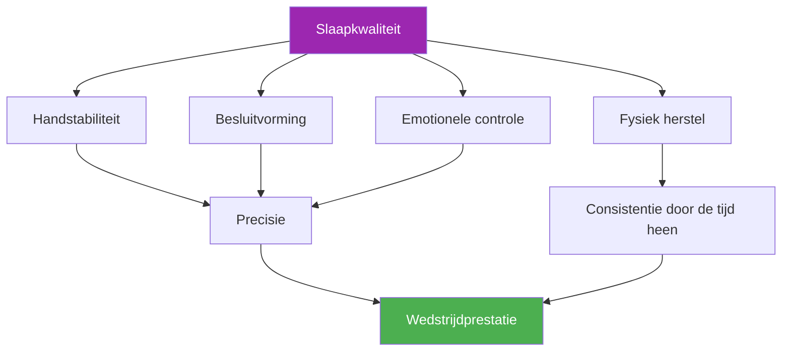

# Slaap en herstel

::: tip Een cruciale prestatiefactor
**Gewicht: 400 punten** — Slaap is de meest onderschatte factor in precisiesporten. Je handen, beslissingen en emoties zijn allemaal afhankelijk van een goede nachtrust.
:::

## Het verborgen prestatievoordeel

> &quot;De speler die het beste geslapen heeft, wint vaak.&quot;

Bij pétanque, in tegenstelling tot duursporten waar atleten soms door vermoeidheid heen kunnen &quot;bijten&quot;, is **precisie absoluut noodzakelijk**. Je vermogen om een boule tot op enkele centimeters van het cochonnet te plaatsen, hangt af van systemen die uiterst gevoelig zijn voor slaapgebrek:

- Fijne motoriek
- Besluitvorming onder druk
- Emotionele regulatie
- Geheugenconsolidatie

Deze module onthult waarom slaap wel eens uw grootste, nog onbenutte concurrentievoordeel zou kunnen zijn.

---

## Hoe slaap je spel beïnvloedt

### Handstabiliteit en motorische controle

Onderzoek toont aan dat de fijne motoriek met **10-15% per uur slaaptekort** achteruitgaat. Bij pétanque-spelers uit zich dit als volgt:

- **Verhoogde microtrillingen** — Onmerkbaar voor u, maar beïnvloedt de consistentie van de afgifte
- **Verminderde proprioceptie** — Minder bewustzijn van de grijpdruk en de armpositie.
- **Langzamere foutcorrectie** — Je lichaam kan de micro-aanpassingen die nauwkeurigheid mogelijk maken niet uitvoeren.

::: warning Waarom wijzen als eerste lijdt
Het richten van een geweer vereist de fijnste motorische controle van alle schoten. Het is vaak de eerste vaardigheid die achteruitgaat bij slaapgebrek, zelfs als je je &quot;prima voelt&quot;.
:::

### Besluitvorming en tactieken

Je prefrontale cortex – verantwoordelijk voor planning, risicobeoordeling en strategisch denken – is zeer gevoelig voor slaapgebrek:

- **Risicobeoordeling raakt verstoord** — U kunt injecties met een lagere slagingskans proberen.
- **Tactische flexibiliteit neemt af** — Het wordt moeilijker om je tijdens de wedstrijd aan te passen.
- **Het fenomeen van de &quot;beslissing om 2 uur &#39;s nachts&quot;** — Keuzes die redelijk lijken als je moe bent, blijken achteraf toch twijfelachtig.

### Emotionele regulatie

Slaapgebrek veroorzaakt **hyperactiviteit in de amygdala**, het emotionele centrum van je hersenen:

- De druk voelt intenser aan.
- Frustratie na gemiste kansen wordt versterkt.
- Het herstel na tegenslagen duurt langer.
- Teamdynamiek kan lijden onder kort lontje.

### Geheugenconsolidatie

Motorisch geheugen consolideert zich tijdens de slaap, met name tijdens de diepe slaapfasen:

- **Oefenen zonder slaap = beperkt geheugen**
- **&quot;Er een nachtje over slapen&quot; werkt echt** bij het aanpassen van technieken.
- De formule: **Goede oefening + Goede slaap = Blijvende vaardigheid**

---

## Het verband tussen slaap en prestaties

---

## De realiteit van slaaptekort

### Wat is slaaptekort?

Slaaptekort is **cumulatief**. Het missen van een uur slaap heeft niet alleen gevolgen voor die dag, maar stapelt zich op:

| Dagen | Uren kort | Totale schuld | Prestatie-impact |
|------|-------------|------------|-------------------|
| 1 | -1 uur | 1 uur | Minimaal |
| 3 | -1 uur/dag | 3 uur | Merkbaar |
| 7 | -1 uur/dag | 7 uur | Significant |
| 14 | -1 uur/dag | 14 uur | Streng |

::: danger De mythe van het weekend
Je kunt in het weekend **niet alles inhalen**. Extra slaap helpt weliswaar, maar wist de opgebouwde slaapachterstand niet uit. Consistentie is belangrijker dan af en toe lang uitslapen.
:::

### Hoeveel heb je nodig?

Het idee dat &quot;iedereen 8 uur per dag moet slapen&quot; is een mythe. De behoeften verschillen per persoon:

- **De meeste volwassenen:** 7-9 uur
- **Sommige functioneren goed gedurende:** 6-7 uur
- **Sommige vereisen:** 9+ uur

**Ontdek JOUW optimale slaapbehoefte:**
1. Tijdens een vakantie (zonder wekker) kunt u 5 tot 7 dagen lang op natuurlijke wijze slapen.
2. Noteer na de eerste inhaalfase hoe lang je slaapt.
3. Dat komt waarschijnlijk overeen met je biologische behoefte.

---

## De wetenschap in het kort

### Belangrijke slaapfasen

| Fase | Functie | Relevantie van pétanque |
|-------|----------|-------------------|
| **Diepe slaap (N3)** | Fysiek herstel, groeihormoon | Spierherstel, energieaanvulling |
| **REM-slaap** | Emotionele verwerking, geheugenconsolidatie | Behoud van motorische vaardigheden, emotionele veerkracht |
| **Lichte slaap (N1-N2)** | Overgang, onderhoud | Ondersteunt de algehele architectuur |

### Belangrijkste onderzoeksresultaten

1. **Stanford basketbalstudie** — Spelers die hun slaapduur verlengden tot 10 uur verbeterden hun nauwkeurigheid bij vrije worpen met 9% (Mah et al., 2011)
2. **Nauwkeurigheid van de tennisopslag** — Slaapgebrek verminderde de nauwkeurigheid van de opslag met 53% (Reyner &amp; Horne, 2013)
3. **Meta-analyse van reactietijd** — Zelfs één nacht slecht slapen vertraagt de reactietijd met 300% (Lim &amp; Dinges, 2010)

---

## Zelfevaluatie: Jouw slaaprealiteit

Geef jezelf een eerlijke beoordeling (1-5):

| Vraag | Score |
|----------|-------|
| Ik slaap de meeste nachten evenveel. | /5 |
| Ik val binnen 15-20 minuten in slaap. | /5 |
| Ik word &#39;s nachts zelden wakker. | /5 |
| Ik word uitgerust wakker. | /5 |
| Ik behoud de hele dag door energie. | /5 |

**Score:**
- **20-25:** Uitstekende slaapgewoonten
- **15-19:** Goed, maar er is ruimte voor verbetering.
- **10-14:** Slaap heeft waarschijnlijk invloed op je prestaties.
- **Onder de 10:** Verbetering van de slaap zou prioriteit moeten hebben.

---

## In deze module

### [Slaapprotocollen voor wedstrijden](/nl/education/sleep/competition)
- De week voor de wedstrijd
- Reis- en tijdzonebeheer
- Protocollen voor een powernap
- Noodstrategieën voor &quot;Ik kon niet slapen&quot;

### [Slaaphygiëne voor atleten](/nl/education/sleep/habits)
- De 10 basisprincipes van slaap
- Sjablonen voor avondroutines
- De 30-daagse slaapuitdaging
- Veelvoorkomende problemen oplossen

---

## Snelle winst: Vanavond

Als je verder niets doet, voer dan in ieder geval deze twee wijzigingen vanavond nog door:

1. **Stel een vaste wektijd in** — Morgen dezelfde tijd als vandaag, met een marge van maximaal 30 minuten.
2. **Geen schermen 30 minuten voor het slapengaan** — Lees, rek je uit of bereid je voor op morgen.

Deze twee veranderingen alleen al kunnen de slaapkwaliteit binnen enkele dagen verbeteren.

---

## Gerelateerde factoren

Slaap is verbonden met al het andere dat je prestaties beïnvloedt:

- [Spanningsmanagement](/nl/education/tension/) — PMR- en ontspanningstechnieken bevorderen de slaap
- [Voeding](/nl/education/nutrition/) — Maaltijdtiming en bloedsuikerspiegel beïnvloeden de slaapkwaliteit
- [Mentale Spel](/nl/education/mental-game/) — Slaap ondersteunt cognitieve functies en emotionele controle
- [Zelfbewustzijn](/nl/education/self-awareness/) — Herkennen wanneer vermoeidheid je spel beïnvloedt

