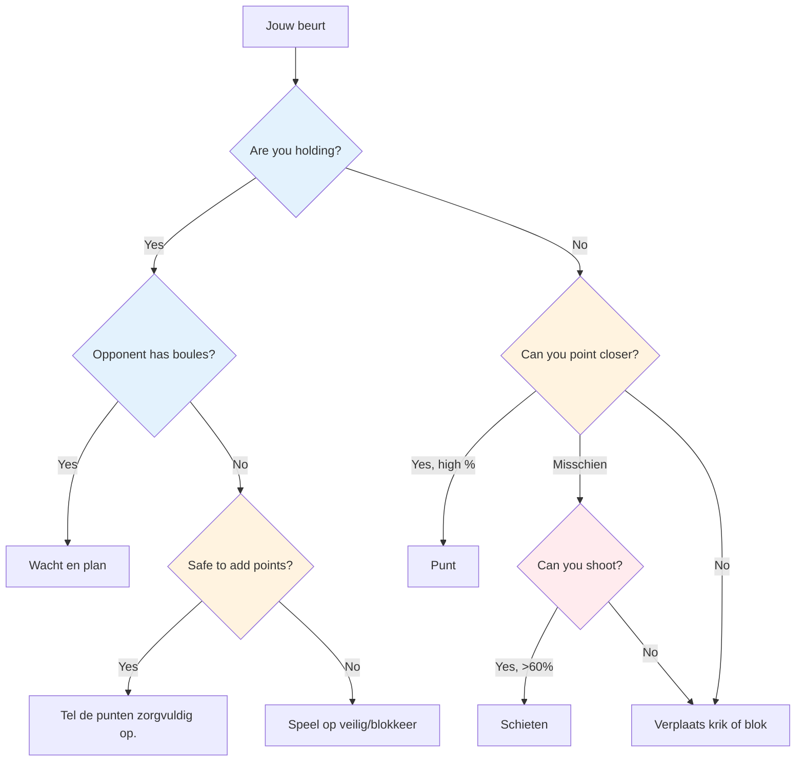
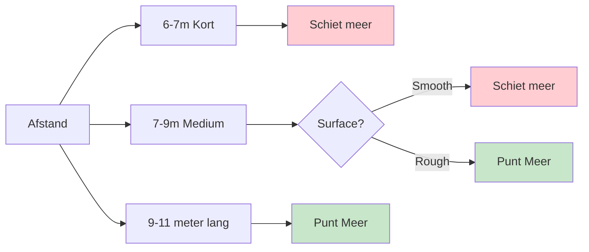

# Tactisch denken bij pétanque

Op topniveau wordt technische vaardigheid als vanzelfsprekend beschouwd. Wat winnaars onderscheidt van de rest is tactische intelligentie: weten welke worp te proberen en wanneer. De beste spelers lezen het spel meerdere zetten vooruit en benutten elk voordeel optimaal.

::: tip Het kernprincipe
**Op topniveau zit het verschil zelden in de techniek, maar in de besluitvorming.** Het team dat de minste tactische fouten maakt, wint.
:::

## Snel besluitvormingskader

## De tactische denkwijze

### Denk in waarschijnlijkheden.

Elke worp heeft een kans op succes. Goede tactiek betekent worpen kiezen waarbij:
- De kans op succes is hoog genoeg.
- De beloning rechtvaardigt het risico.
- Falen doet niet zo veel pijn.

**Voorbeeldbeslissing:**
- Moeilijk schot: 40% kans op succes, levert 3 punten op.
- Veilig punt: 80% kans op succes, 1 punt winst

Wat is beter? Dat hangt af van de score, de situatie en je zelfvertrouwen.

### Overweeg alle opties.

Overweeg voor elke worp het volgende:
1. **Aanwijzing:** Plaats een boule in de buurt van de jack
2. **Schieten:** Verwijder de boule van een tegenstander.
3. **Blokkeren:** Plaats een boule om de blokkade te blokkeren.
4. **Verplaats de krik:** Sla opzettelijk tegen de krik.
5. **Opoffering:** Accepteer een ongunstige uitgangspositie om later een betere positie te kunnen innemen.

Kies niet meteen voor de meest voor de hand liggende optie. Denk goed na over de alternatieven.

### Lees de situatie

Factoren om rekening mee te houden:
- Huidige stand (wie staat voor, en met hoeveel)
- De resterende ballen (van jou en van hen)
- Positie op het terrein
- Tegengestelde tendensen
- De sterke punten van uw team

## Kernprincipes van de tactiek

::: tip De 6 tactische principes
1. **Beheers de krik** - Positie is macht
2. **Strategie voor afstand en ondergrond** - Aanpassen aan de omstandigheden
3. **Bepaal de spelstijl** - Benut je sterke punten
4. **Beheer de afweging tussen risico en beloning** - Stem het risico af op de situatie.
5. **Gebruik je boules verstandig** - Soms geef je 1 punt weg om 3 punten te voorkomen.
6. **Denk vooruit** - Visualiseer de volgende 2-3 zetten.
:::

### Principe 1: Beheers de krik

Het team dat de jackpositie beheerst, heeft een aanzienlijk voordeel.

**Manieren om te controleren:**
- Win het recht om de boer te gooien.
- Verplaats de krik naar een geschikte ondergrond.
- Bescherm de krik tegen verschuiving.

**Strategie voor het plaatsen van jacks:**
- Korte jack: Bevordert het schieten, gemakkelijker om doelen op korte afstand te raken.
- Long jack: Richting is beter, schieten wordt moeilijker.
- Obstakels in de buurt: Creëert uitdagingen voor tegenstanders.

**Benut de zwakke punten van je tegenstander:**
- Let op hun aanwijstechniek: gebruiken ze altijd dezelfde boog of stijl?
- Als ze zich niet kunnen aanpassen (bijvoorbeeld alleen rollen, alleen lobben), plaats dan de jack zo dat ze oncomfortabele worpen moeten uitvoeren.
- Plaats de jack op afstanden of posities die hun beperkingen aan het licht brengen.
- Benut een zwakte alleen als je die zelf niet hebt - denk eerst aan de sterke punten van je eigen team.

### Principe 2: Afstands- en oppervlaktestrategie

De optimale balans tussen richten en schieten hangt sterk af van de afstand en het terrein:

::: info Afstandsstrategie
**Kort (6-7 m):** Voordelig schieten - makkelijker te raken op korte afstand
**Middelgroot (7-9 m):** Ondergrond is het belangrijkst.
- Glad oppervlak → meer foto&#39;s maken
- Ruw oppervlak → punt meer

**Lang (9-11 m):** Richten is de voorkeur - de schietnauwkeurigheid neemt aanzienlijk af.
:::

**Uw persoonlijke schietpercentage:**
- Als je een succespercentage van 75% of hoger hebt, schiet dan vaker.
- Overweeg om te schieten om de punten van de tegenstander te verminderen (zelfs als je daardoor niet de leiding neemt).
- Schieten om het aantal scorende boules van de tegenstander te verminderen (van 3 naar 1) is een waardevolle manier om de schade te beperken.

**Schieten als langetermijnstrategie:**
- Als je al je boules gebruikt, houd dan rekening met je cumulatieve succespercentage.
- Berekening: als je alle schoten raakt, verdien je aanzienlijk meer punten.
- Zelfs het missen van een paar schoten kan de punten van de tegenstander verminderen.
- Voorbeeld: Mis 1-2 schoten, maar schakel wel de dreiging uit, en win vervolgens een groot punt als je ze allemaal raakt.
- Dit is een berekend risico: accepteer wat tegenslagen voor grotere winsten als het lukt.

### Principe 3: Bepaal de spelstijl

Op topniveau kunnen de meeste spelers zowel goed richten als schieten. De kunst is om het spel te dwingen in de sterkste speelstijl van je team.

**Als je team over sterke schutters beschikt:**
- Schiet zoveel mogelijk - maak gebruik van je voordeel.
- Verspil je energie niet door te wijzen als je kunt domineren door te schieten.
- Beheers het spel door bedreigingen te elimineren voordat ze zich ophopen.
- Een korte tot middellange jack zorgt ervoor dat het schieten effectief blijft.

**Tegen gelijkwaardige schutters:**
- Maak ze geen makkelijke doelwitten door eerst te schieten.
- Speel op grote afstand om het schotpercentage van iedereen te verlagen.
- Het team dat als eerste schiet, heeft vaak de controle over de afloop.

**Als je tegenstanders meer schoten op doel hebben dan jij:**
- Speel consistent langeafstandsjack - zelfs topschutters verliezen hun schotpercentage op 10 meter en verder.
- Dwing een puntenstrijd af waarin je kunt concurreren.
- Laat ze vanuit lastige hoeken of door obstakels heen schieten.

### Principe 4: Beheer risico versus beloning

| Situatie | Risicotolerantie |
|-----------|---------------|
| Comfortabel vooruit | Laag - bescherm uw voorsprong |
| Spannende wedstrijd | Gemiddelde - berekende risico&#39;s |
| Achter aanzienlijk | Hoog - je moet risico&#39;s nemen |
| Einde | Hangt af van het verschil in scores. |

### Principe 5: Gebruik je boules verstandig

Boule-management onderscheidt topspelers:
- Als je tegenstander geen boules meer heeft, neem dan een weloverwogen beslissing: punten pakken of op veilig spelen?
- Als je achterligt, bereken dan of je realistisch gezien de achterstand nog kunt inhalen.
- Soms is het beter om 1 punt tegen te krijgen dan boules te verspillen en er 3 weg te geven.
- Houd te allen tijde bij hoeveel boules er nog over zijn - zowel die van jou als die van de tegenstander.

### Principe 6: Denk meerdere stappen vooruit

Elite denken:
- Voordat je gooit, visualiseer de volgende 2-3 boules van beide teams.
- Wat is het beste antwoord van je tegenstander als je slaagt? En als je faalt?
- Hoe bereidt deze worp je voor op je volgende worp?
- Bekijk het eindspelscenario vanuit de huidige positie.

## Veelvoorkomende tactische situaties

### Jij hebt je ballen in bezit en je tegenstander heeft nog ballen over.

Je moet wachten - het is hun beurt om te gooien. Gebruik deze tijd om:
- Analyseer wat ze waarschijnlijk zullen doen.
- Bedenk hoe je kunt reageren op hun mogelijke worpen.
- Blijf geconcentreerd en paraat.

### Jij hebt je ballen en je tegenstander heeft geen ballen meer.

Nu kun je je resterende jeu de boules spelen. **Opties:**
- Voeg meer punten toe als dat veilig kan.
- Blok om te beschermen tegen beweging van de krik
- Speel op veilig - riskeer niet dat een overwinning met twee punten verschil in een nederlaag verandert.

**Belangrijke beslissing:** Weegt het risico van het toevoegen van punten op tegen het potentieel openbreken van het spel?

### Je houdt niet vast

Je moet gooien. **Opties:**
- Punt dichterbij dan hun beste boule
- Schiet hun beste boule.
- Verplaats de jack naar je boules.
- Blokkeer om hun score te beperken (als je het punt niet kunt pakken).

**Beslissingsfactoren:** Je schietpercentage, aantal resterende boules (beide teams), huidige score

### Laatste boule-situaties

Als je de laatste boule hebt:
- Maximale druk, maar ook maximale controle.
- Neem de tijd - bekijk alle opties.
- Overweeg: richten, schieten of de krik verplaatsen?
- Voer het met volledige toewijding uit.

Wanneer de tegenstander de laatste boule heeft:
- Je hebt gedaan wat je kon - accepteer de uitkomst.
- Creëer, indien mogelijk, een situatie waarin er geen eenvoudig antwoord voor hen is.
- Meerdere bedreigingen zijn beter dan één.

## Je tegenstanders doorgronden

Op topniveau is scouting van cruciaal belang. Ken je tegenstanders voordat je tegen ze speelt.

### Voorafgaande informatie
- Wat is hun favoriete speelstijl (schietend team of aanvallersteam)?
- Wie is hun beste schutter? Pointer?
- Welke afstanden hebben hun voorkeur?
- Hoe presteren ze onder druk in finales?

### Observatie tijdens de wedstrijd
- Houd hun succespercentages gedurende de hele wedstrijd bij.
- Let op of iemand een slechte dag heeft.
- Identificeer wie goed met druk omgaat en wie niet.
- Pas de plaatsing van uw krik aan op basis van wat u observeert.

### Benut wat je vindt.
- Richt je waar mogelijk op de zwakkere spelers.
- Dwing hun zwakke schutter om te schieten, of hun zwakke aanwijzer om te wijzen.
- Als iemand het moeilijk heeft, blijf dan druk op die persoon uitoefenen.

## In deze sectie

- **[Op waarschijnlijkheid gebaseerde beslissingen](/nl/education/tactics/probability)** - Wiskunde gebruiken om betere keuzes te maken

## Samenvatting: Alle tactische regels

::: tip Regel #1: De waarschijnlijkheidsregel
**Kies worpen waarbij de kans op succes het risico rechtvaardigt.**
Overweeg de volgende factoren: slagingskans, beloning bij succes, kosten bij mislukking.
:::

::: tip Regel #2: De Jack Control Regel
**Het team dat de jackpositie beheerst, heeft een voordeel.**
Gebruik de plaatsing van de jacks om de zwakke punten van je tegenstander uit te buiten en je eigen sterke punten te benutten.
:::

::: tip Regel #3: De afstandsregel
**Op korte afstand is schieten beter, op lange afstand is richten beter.**
Middellange afstand: de kwaliteit van het wegdek bepaalt de balans
:::

::: tip Regel #4: De stijlregel
**Dwing het spel in de sterkste speelstijl van je team.**
Als je goed kunt schieten, schiet dan meer. Verspil je voordeel niet.
:::

::: tip Regel #5: De boulebeheerregel
**Soms is het beter om 1 punt tegen te krijgen dan er 3 te riskeren.**
Weet wanneer je je verlies moet nemen en je boules moet bewaren voor de volgende ronde.
:::

::: tip Regel #6: De regel van vooruitdenken
**Stel je de volgende 2-3 zetten van beide teams voor.**
Wat is hun beste reactie? Hoe bereidt dit je voor op je volgende worp?
:::

::: tip Regel #7: De scoutingregel
**Ken je tegenstanders voordat je gaat spelen.**
Houd hun voorkeuren, succespercentages en reacties onder druk bij.
:::

## Belangrijkste conclusie

> Op topniveau zit het verschil zelden in de techniek, maar in de besluitvorming. Het team dat de minste tactische fouten maakt, wint.

Analyseer het spel. Ken je sterke punten. Benut hun zwakke punten. Voer je acties vol vertrouwen uit.

