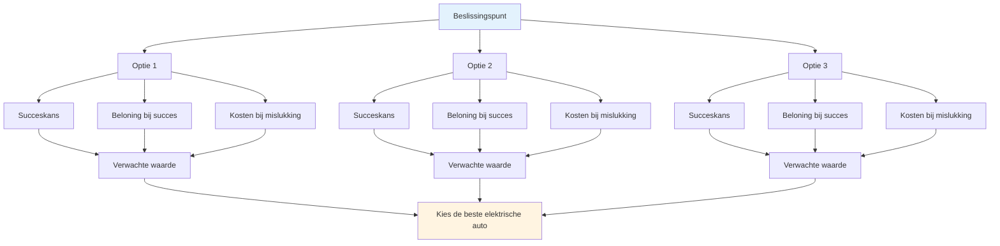

# Op waarschijnlijkheid gebaseerde besluitvorming
<AdBanner />

Bij tactisch denken op topniveau wordt gebruikgemaakt van waarschijnlijkheid om betere beslissingen te nemen. In plaats van te gokken of op je gevoel af te gaan, denk je systematisch na over je opties.

::: tip Het Grote Idee
**Denk in waarschijnlijkheden, niet in zekerheden.** De beste beslissing is niet altijd de meest agressieve of de veiligste, maar de beslissing die je de beste verwachte waarde oplevert over vele vergelijkbare situaties.
:::

## Het basiskader

Elke worp bestaat uit drie onderdelen:

| component | Vraag | Voorbeeld |
|-----------|----------|---------|
| **Kans op succes** | Hoe waarschijnlijk is het dat ik dit uitvoer? | 70% slagingskans op deze afstand |
| **Beloning bij succes** | Wat levert het mij op? | Verover het punt, win de positie |
| **Kosten bij mislukte poging** | Wat heb ik te verliezen? | Geef de tegenstander een makkelijk punt |

::: info De formule
**Verwachte waarde = (Waarschijnlijkheid × Beloning) - ((1 - Waarschijnlijkheid) × Kosten)**

Goede beslissingen maximaliseren de verwachte waarde op de lange termijn.
:::

## Denken in waarschijnlijkheden

Houd bij het kiezen tussen de verschillende opties rekening met het volgende:
- Wat is mijn realistische slagingskans voor elke optie?
- Wat win ik als het werkt?
- Wat zijn de kosten als het mislukt?
- Hoe beïnvloedt de spelsituatie mijn keuze?

De beste optie is niet altijd de meest agressieve of de veiligste, maar de optie die in veel vergelijkbare situaties het beste resultaat oplevert.

## Ken je cijfers

Om kansrekening te kunnen toepassen, moet je je werkelijke succespercentages kennen:

| Werptype | Afstand | Uw succespercentage |
|------------|----------|-------------------|
| Punt (dichtbij) | 6-7m | ___% |
| Punt (middelgroot) | 8-9m | ___% |
| Punt (lang) | 10m+ | ___% |
| Fotografeer (van dichtbij) | 6-7m | ___% |
| Schieten (medium) | 8-9m | ___% |
| Schieten (lang) | 10m+ | ___% |

<AdInArticle />

Houd dit in de praktijk bij. Wees eerlijk: de meeste spelers overschatten hun succespercentage.

## Aanpassen aan omstandigheden

Uw basistarief verandert op basis van:

| Factor | Effect op het slagingspercentage |
|--------|----------------------|
| Onbekend terrein | -10 tot -20% |
| Druksituatie | -5 tot -15% |
| Vermoeidheid | -5 tot -10% |
| Zelfvertrouwen (hoog) | +5 tot +10% |
| Recent succes | +5% |
| Recente mislukking | -5 tot -10% |

Wees realistisch over deze aanpassingen.

## Het Boule-voordeelprincipe

Als je meer boules over hebt dan je tegenstander:

**Prioriteit 1: Het punt veiligstellen**
- Zorg er allereerst voor dat je minstens één punt vasthoudt.
- Wees niet hebzuchtig voordat je de basis hebt veiliggesteld.

**Prioriteit 2: Maximaliseer punten met een berekend risico**
- Als je eenmaal winst hebt gemaakt, beoordeel dan of je nog meer punten kunt bijkopen.
- Elke extra worp is een afweging tussen risico en beloning.
- Verander een veilige overwinning met 2 punten verschil niet in een nederlaag door te veel risico te nemen.

**Nog maar weinig boules over:** Elke worp moet raak zijn. Veilige zetten zijn misschien niet genoeg - overweeg opties met een hogere beloning om uiteindelijk toch nog een kans te maken.

## Het ‘Une Boule Devant’-principe

Een boule voor de jack (tussen de jack en de tegenstander) is extreem waardevol:
- Het blokkeert directe aanwijslijnen.
- Het dwingt tegenstanders om eromheen of eroverheen te gaan.
- Het kan inkomende boules afbuigen.
- Het is een &quot;goudmijn&quot; - het is de moeite waard om te beschermen.

**Tactische implicatie:** Soms is het beter om een blokkerende boule te plaatsen dan te proberen er zo dicht mogelijk bij te komen.

## Risicotolerantie per spelstatus

### Met tijdslimiet

Bij een tijdslimiet is het scoreverschil van belang:

| Scoresituatie | Risicobenadering |
|-----------------|---------------|
| Met een voorsprong van 4+ | Zeer conservatief - bescherm het lood, laat de klok lopen |
| Met een voorsprong van 1-3 | Conservatief - geef geen punten weg |
| Gebonden | Evenwichtig - berekende risico&#39;s |
| Achterstand van 1-3 | Agressief - moet terrein winnen. |
| Achterstand van 4+ | Zeer agressief - moet risico&#39;s nemen, de tijd dringt. |

### Zonder tijdslimiet

Als er geen tijdsdruk is:
- Houd vast aan je spelplan - verander je strategie niet zomaar vanwege de score.
- De score zal schommelen - vertrouw op je aanpak.
- Overweeg alleen je spelplan aan te passen als het duidelijk niet werkt tegen deze tegenstander.
- Paniek en veranderingen achterstand maken de situatie vaak alleen maar erger.

### Aanpassingen aan het eindspel

**Als winnen aan deze kant betekent dat we de wedstrijd winnen:**
- Wees conservatiever.
- Loop niet het risico om meerdere punten weg te geven.
- Een enkel punt zou voldoende kunnen zijn.

**Als dit de wedstrijd betekent:**
- Neem grotere risico&#39;s
- Je moet meerdere punten scoren.
- Veilig spelen zal je niet redden.

## Veelvoorkomende fouten bij kansberekening

### 1. Overmoed
&quot;Die shot kan ik wel maken&quot; - maar lukt het je ook 7 van de 10 keer? Wees eerlijk.

### 2. Basisrente negeren
Je schotpercentage verandert niet omdat het moment belangrijk is.

### 3. De denkfout van de verzonken kosten
&quot;Ik heb al twee keer misgeschoten, ik moet blijven schieten&quot; - elke worp is onafhankelijk.

### 4. Vertekening van de uitkomst
Een riskante actie die lukte, bleef riskant. Een veilige actie die mislukte, was nog steeds de juiste.

### 5. De opties van de tegenstander negeren
Bedenk wat ze zullen doen na je worp, of die nu succesvol is of niet.

## Praktische toepassing

### Voor elke worp

1. **Bepaal de opties** (richten, schieten, blokkeren, enz.)
2. **Schat de kans op succes** voor elk
3. **Denk na over de mogelijke uitkomsten** (succes en mislukking)
4. **Houd rekening met de spelstatus** (score, resterende boules)
5. **Kies** de optie met de beste verwachte waarde.
6. **Zet je er volledig voor in** - geen twijfels tijdens de uitvoering.

### Intuïtie opbouwen

Na verloop van tijd wordt het denken in termen van waarschijnlijkheid intuïtief:
- Houd uw resultaten eerlijk bij.
- Evalueer beslissingen na de wedstrijden.
- Merk patronen op in uw succespercentages.
- Pas je mentale model aan.

## Belangrijkste conclusie

> Goede beslissingen leiden niet altijd tot goede resultaten. Maar goede beslissingen leiden op de lange termijn wel tot betere resultaten.

Denk in waarschijnlijkheden. Ken je getallen. Maak een verstandige keuze, geen hoopvolle.

<AdBanner />
