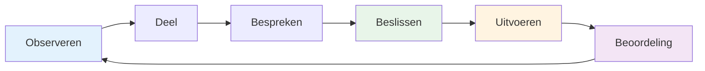

# Teamcommunicatie
<AdBanner />

Effectieve communicatie is wat een groep individuen in een team verandert. Bij pétanque, waar de strategie voortdurend verandert en de druk hoog is, kan de manier waarop je communiceert de uitkomst bepalen.

::: tip Het Grote Idee
**Communicatie is wat individuen in een team verandert.** Duidelijke, specifieke en ondersteunende communicatie onder druk onderscheidt goede teams van geweldige teams.
:::

## De communicatiecyclus

Goede teamcommunicatie volgt een cyclus:

| Stap | Actie | Voorbeeld |
|------|--------|---------|
| **Observeer** | Let op wat er gebeurt. | Terrein, posities, tegenstanders |
| **Deel** | Vertel je teamgenoten wat je ziet. | &quot;De grond loopt daar schuin naar links af.&quot; |
| **Bespreken** | Wissel perspectieven uit | &quot;Moet ik blokkeren of voor het punt gaan?&quot; |
| **Beslissen** | Overeenstemming bereiken over de aanpak | &quot;Laten we de hoge lob eens proberen.&quot; |
| **Uitvoeren** | Doe het met toewijding. | Volledige concentratie op de worp |
| **Beoordeling** | Leer van het resultaat | &quot;Dat werkte prima&quot; of &quot;Volgende keer...&quot; |

## Wanneer te communiceren

### Voor elk einde
- Beoordeel samen het terrein.
- Bespreek de algemene aanpak.
- Maak duidelijk wie er wanneer gooit.
- Zet de toon (rustig, geconcentreerd)

### Tijdens het einde
- Deel observaties (&quot;De grond helt daar naar links af&quot;)
- Coördineer de strategie (&quot;Moet ik proberen te blokkeren of voor het punt gaan?&quot;)
- Bied steun (&quot;Neem de tijd, je kunt dit&quot;).
- Pas plannen aan naarmate de situatie verandert.

### Tussen de uiteinden
- Korte nabespreking (wat werkte, wat niet)
- Mentale reset
- Bereid je voor op het volgende einde
- Blijf als team in contact.

### Na de wedstrijd
- Uitgebreide nabespreking (indien van toepassing)
- Erken de bijdragen
- Identificeer leerpunten
- Onderhoud de relatie

## Hoe te communiceren

### Wees duidelijk en specifiek.

**Vage omschrijving:** &quot;Probeer dichterbij te komen&quot;
**Clear:** &quot;Richt op de linkerkant van de jack, ongeveer 20 cm naar buiten&quot;

**Vage opmerking:** &quot;Goed geprobeerd&quot;
**Duidelijk:** &quot;Goed gewicht, net iets links van de lijn&quot;

### Wees constructief

Focus op oplossingen, niet op problemen:

**Probleemgericht:** &quot;Je schiet steeds naar rechts naast&quot;
**Oplossingsgericht:** &quot;Misschien iets meer naar links mikken om dat te compenseren?&quot;

### Wees ondersteunend

Je toon is net zo belangrijk als je woorden:
- Blijf kalm, zelfs als je gefrustreerd bent.
- Gebruik aanmoedigende lichaamstaal.
- Erken de inspanning, niet alleen de resultaten.
- Bouw op, breek niet af.

### Luister aandachtig

Communicatie is een tweewegsverkeer:
- Luister aandachtig wanneer teamgenoten spreken.
- Stel verduidelijkende vragen.
- Erken wat je hebt gehoord.
- Niet onderbreken of afwijzen.

<AdInArticle />

## Communicatie-uitdagingen

### Meningsverschil over de strategie

**Slechte aanpak:**
- Sta erop dat je je eigen weg volgt.
- Ga de verdediging in
- Geef met tegenzin toe
- Ruzie maken tijdens het spel

**Betere aanpak:**
1. Deel je perspectief duidelijk.
2. Luister volledig naar die van hen.
3. Bespreek de voor- en nadelen kort.
4. Neem gezamenlijk een besluit (of laat de beslissing over aan de aangewezen leider).
5. Ga volledig achter de beslissing staan.
6. Nabespreking na de wedstrijd

### Na een fout van een teamgenoot

**Wat ze nodig hebben:**
- Snelle bevestiging
- Toestemming om verder te gaan
- Het vertrouwen dat je ze nog steeds vertrouwt.
- Concentreer je op de volgende worp.

**Wat te zeggen:**
- &quot;Geen probleem, de volgende.&quot;
- &quot;Jammer dan, maar je krijgt de volgende.&quot;
- &quot;We zitten er nog steeds middenin.&quot;
- *Soms is een knikje of een aai al genoeg.*

**Wat je NIET moet zeggen:**
- Niets (stilte voelt als oordeel)
- &quot;Het is oké&quot; (kan afwijzend klinken)
- Alles over wat er misging (niet nu)
- Zichtbare frustratie (lichaamstaal is belangrijk)

### Wanneer je een fout maakt

**Wat te doen:**
- Korte erkenning (&quot;Mijn excuses&quot;)
- Verontschuldig je niet te vaak.
- Maak geen excuses.
- Reset en concentreer je op de volgende worp.
- Vertrouw erop dat je teamgenoten je steunen.

### Spanning binnen het team

Als de spanning tijdens een wedstrijd oploopt:
1. Erken dat het gebeurt
2. Haal even diep adem voordat je antwoordt.
3. Focus op het spel, niet op het conflict.
4. Pak het na de wedstrijd op de juiste manier aan.
5. Laat het je spel niet beïnvloeden

## Non-verbale communicatie

Een groot deel van de teamcommunicatie is non-verbaal:

### Positieve signalen
- Oogcontact
- knikken
- Duim omhoog
- Ontspannen houding
- Zich naar teamgenoten toe bewegen
- Glimlachen (indien gepast)

### Negatieve signalen (vermijd deze)
- Ogen rollen
- Zich afwenden
- Gekruiste armen
- Zuchten
- Hoofdschudden
- Gespannen lichaamstaal

**Onthoud dit:** Je teamgenoten zien alles. Jouw lichaamstaal beïnvloedt hun zelfvertrouwen en prestaties.

## Communicatievaardigheden ontwikkelen

### Oefen communicatie

Wacht niet tot de concurrentie communiceert:
- Oefen strategische discussies tijdens de training.
- Geef elkaar regelmatig feedback.
- Ontwikkel de teamtaal
- Creëer een comfortabele sfeer door open en eerlijke gesprekken te voeren.

### Teamsignalen ontwikkelen

Sommige teams ontwikkelen een soort steno:
- Handgebaren voor strategie
- Codewoorden voor situaties
- Korte zinnen met een gedeelde betekenis

### Regelmatige check-ins

Buiten de wedstrijden om:
- Hoe werken we samen?
- Wat gaat er goed?
- Wat is er nou beter?
- Zijn er nog zaken die we moeten aanpakken?

## De rol van de kapitein

Als uw team een aangewezen leider heeft:

**Verantwoordelijkheden van de kapitein:**
- Definitieve beslissing wanneer het team het oneens is.
- De toon en energie bepalen
- Het managen van teamdynamiek
- Geconcentreerd blijven onder druk

**Alle anderen:**
- Deel je perspectief
- Steun de genomen beslissing.
- Help de teamenergie te behouden.
- Neem de verantwoordelijkheid voor je rol.

## Belangrijkste conclusie

> Goede teams praten mét elkaar, niet óver elkaar. Ze communiceren met eerlijkheid, respect en een gezamenlijke inzet voor succes.

Oefen communicatie zoals je werpen oefent. Het is een vaardigheid die verbetert door aandacht.

<AdBanner />
