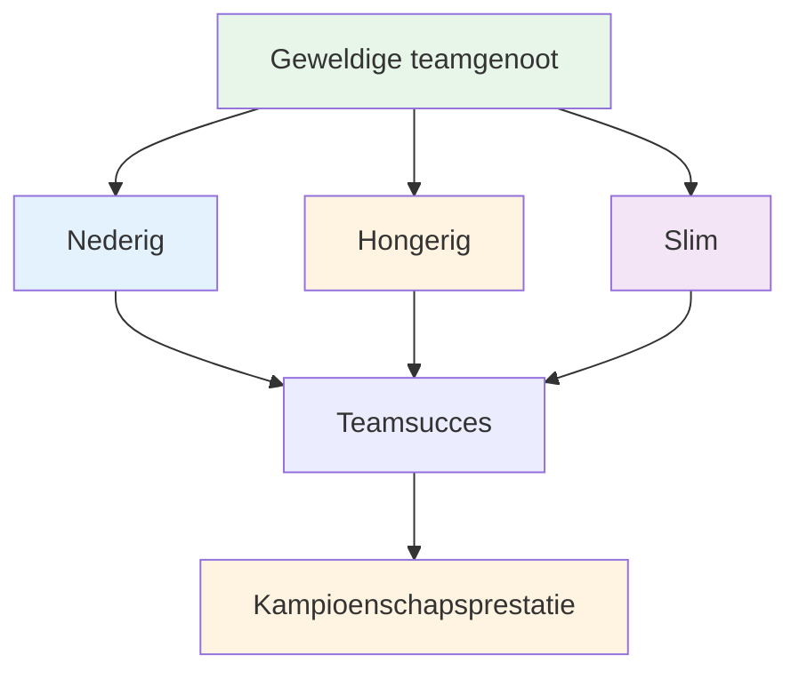

# Een geweldige teamspeler zijn
<AdBanner />

Pétanque wordt vaak in teams gespeeld - dubbels (doubles) of drietallen (triplettes). Individuele vaardigheid is belangrijk, maar de teamdynamiek kan het verschil maken tussen succes en falen. De beste teams zijn niet altijd de meest bekwame, maar juist de teams die het beste samenwerken.

::: tip Het Grote Idee
**De beste teams zijn niet altijd de meest bekwame, maar de teams die het beste samenwerken.** Bescheiden, ambitieus en emotioneel intelligent zijn, maakt je een geweldige teamgenoot.
:::

## Wat maakt iemand een geweldige teamgenoot?

Onderzoek en ervaring wijzen op drie belangrijke eigenschappen:

### 1. Bescheiden
- Geeft prioriteit aan teamsucces boven persoonlijke roem.
- Erkent de bijdragen van anderen
- Geeft fouten toe zonder excuses.
- Openstaan voor feedback en leren.
- Het hoeft niet per se de ster te zijn.

### 2. Hongerig
- Zelfgemotiveerd en gedreven
- Doet het werk zonder dat erom gevraagd wordt.
- Altijd op zoek naar verbetering
- Brengt energie in het team.
- Het leunt niet alleen op talent.

### 3. Slim (emotioneel)
- Kan situaties en mensen goed inschatten.
- Weet wanneer te spreken en wanneer te luisteren
- Beheerst zijn/haar eigen emoties
- Biedt passende ondersteuning aan teamgenoten.
- Gaat constructief om met conflicten.

## De fundamenten van teamsucces

### Gedeelde doelen en visie

Sterke teams hebben:
- Duidelijke, overeengekomen doelstellingen
- Individuele doelen afgestemd op teamdoelen
- Gedeeld begrip van hoe succes eruitziet
- Toewijding aan de gezamenlijke missie

**Vragen om met je team te bespreken:**
- Wat proberen we samen te bereiken?
- Hoe ziet succes er voor ons uit?
- Hoe dragen onze individuele doelen bij aan het team?

### Effectieve communicatie

Communicatie is essentieel voor goede teamprestaties.

**Goede teamcommunicatie:**
- Open en eerlijk
- Respectvol, zelfs bij meningsverschillen.
- Duidelijk en specifiek
- Tweewegcommunicatie (spreken én luisteren)
- Tijdig (de juiste informatie op het juiste moment)

<AdInArticle />

**Tijdens wedstrijden:**
- Bespreek de strategie vóór elk einde.
- Deel observaties over het terrein en de tegenstanders.
- Stem af wie wanneer gooit.
- Steun elkaar na worpen (goed of slecht).

### Vertrouwen en respect

Zonder vertrouwen vallen teams onder druk uiteen.

**Vertrouwen opbouwen:**
- Wees betrouwbaar (doe wat je zegt).
- Wees competent (doe je werk goed).
- Wees eerlijk (zelfs als het moeilijk is)
- Toon kwetsbaarheid (geef toe dat je het moeilijk hebt)
- Steun anderen consequent

**Respect tonen:**
- Waardeer de bijdrage van ieder individu
- Luister naar verschillende perspectieven.
- Erken de inspanning, niet alleen de resultaten.
- Beschouw ieders rol als belangrijk.

### Duidelijke rollen

Iedereen moet het volgende begrijpen:
- Hun voornaamste verantwoordelijkheden
- Hoe zij bijdragen aan het team
- Waar anderen op hen rekenen
- Wanneer moet je ingrijpen en wanneer moet je een stap terug doen?

**In drietallen:**
| Rol | Primaire focus | Kernkwaliteiten |
|------|--------------|---------------|
| Wijzer | Plaats de jeu de boules in de buurt van Jack. | Nauwkeurigheid, consistentie |
| Midden | Aanpassen aan de situatie | Veelzijdigheid, leesvaardigheid |
| Schutter | Verwijder de boules van de tegenstander | Nauwkeurigheid onder druk |

Rollen kunnen flexibel zijn, maar duidelijkheid is belangrijk.

## Teamdynamiek tijdens een wedstrijd

### Voor de wedstrijd
- Kom samen aan, warm samen op.
- Bespreek de algemene strategie
- Geef de toon aan (positief, doelgericht)
- Vraag eens hoe het met iedereen gaat.

### Tijdens de wedstrijd
- Communiceer tussen de betrokken partijen
- Blijf positief, ongeacht de score.
- Steun elkaar na gemaakte fouten
- Vier samen (kort) de successen.
- Focus je op het proces, niet op het resultaat.

### Na fouten
Wat je NIET moet doen:
- Laat je frustratie duidelijk zien.
- Kritiek geven of de schuld afschuiven
- Trek je terug of zwijg.
- Sta stil bij wat er is gebeurd.

Wat te doen:
- Snel bevestigen (&quot;geen probleem&quot;)
- Richt je aandacht op de volgende worp.
- Houd een positieve lichaamstaal aan.
- Vertrouw erop dat je teamgenoot zich herstelt.

### Na de wedstrijd
- Bespreek samen (wat werkte, wat niet)
- Erken de individuele bijdragen
- Bespreek verbeteringen voor de volgende keer.
- Onderhoud relaties, ongeacht het resultaat.

## Communicatiepatronen

### Constructieve feedback
**Arm:** &quot;Je mist steeds die schoten&quot;
**Beter:** &quot;Ik merk dat de schoten naar links gaan - zou je je houding misschien willen aanpassen?&quot;

### Ondersteunende reactie op fouten
**Slecht:** *Stilte of zichtbare frustratie*
**Beter:** &quot;Een lastige. De volgende mag je hebben.&quot;

### Strategische discussie
**Arm:** &quot;Schiet er gewoon op&quot;
**Beter:** &quot;Wat denk je - proberen te blokkeren of schieten? Ik zie voor- en nadelen aan beide kanten.&quot;

## Het opbouwen van een teamcultuur

Geweldige teams ontwikkelen gedeelde eigenschappen:
- **Waarden:** Waar wij voor staan
- **Normen:** Hoe we ons gedragen
- **Taal:** Hoe we communiceren
- **Rituelen:** Wat we samen doen

**Voorbeelden:**
- Geef elkaar altijd een hand voor en na.
- Specifieke aanmoedigende zinnen
- Samen de voorbereiding op de wedstrijd
- Na de wedstrijd een maaltijd of drankje nuttigen

## In deze sectie

- **[Teamcommunicatie](/en/education/team-player/communication)** - Gedetailleerde handleiding voor effectieve communicatie

## Belangrijkste conclusie

> De sterkte van een team hangt af van de zwakste relatie, niet van de zwakste speler.

Investeer in je teamgenoten. Bouw vertrouwen op. Communiceer goed. Win samen.

<AdBanner />
