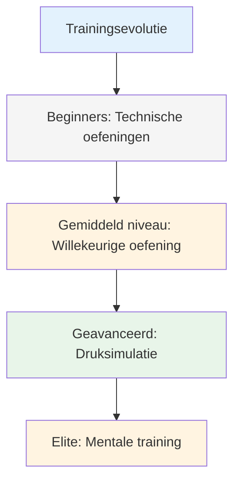
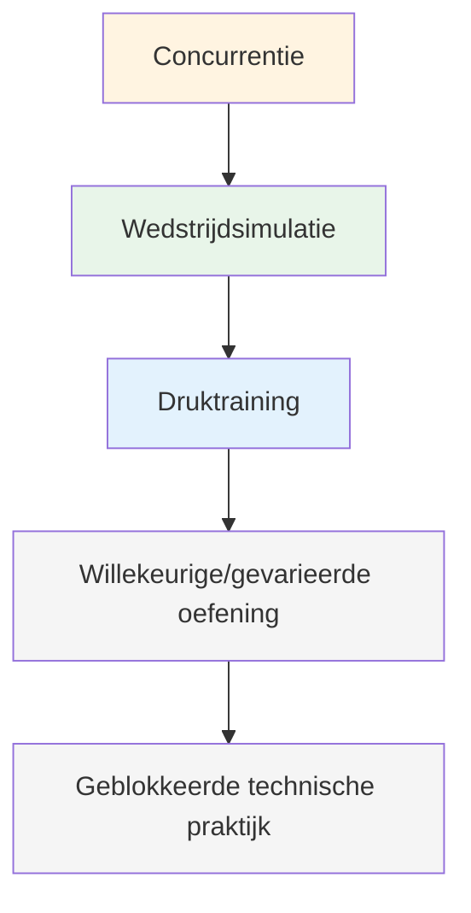

# Trainingsmethoden

Als je techniek eenmaal goed is, wat oefen je dan? Dit is waar veel spelers stagneren: ze blijven maar techniek oefenen, terwijl de echte groei ergens anders ligt.

::: tip Het Grote Idee
**De meeste spelers bereiken een plateau omdat ze zich blijven richten op techniek, terwijl de echte groei elders ligt.** Topspelers trainen aanpassingsvermogen, besluitvorming en mentale weerbaarheid – niet alleen mechanische vaardigheden.
:::

## Voorbij technische herhaling

De meeste spelers trainen door worpen te herhalen. Dat is belangrijk voor beginners, maar gevorderde spelers hebben meer nodig:

| Trainingstype | Wat het ontwikkelt | Wanneer te gebruiken |
|--------------|------------------|-------------|
| Technische oefeningen | Mechanica, vorm | Nieuwe vaardigheden leren, problemen oplossen |
| Willekeurige oefening | Aanpassingsvermogen, besluitvorming | Wedstrijdvoorbereiding |
| Druksimulatie | Mentale veerkracht | Voorafgaand aan belangrijke evenementen |
| Mentale training | Focus, herstel, zelfvertrouwen | Een voortdurend proces dat vaak wordt verwaarloosd. |

## De trainingspiramide

::: warning Veelgemaakte fout
**De meeste spelers brengen te veel tijd door aan de onderkant.** Topspelers werken op alle niveaus van de piramide, met de nadruk op de hoogste niveaus naarmate ze hogerop komen.
:::

## Geblokkeerde versus willekeurige oefening

### Geblokkeerde oefening
Herhaal dezelfde worp vele malen:
- 20 punten vanaf 7 meter
- 20 schoten op hetzelfde doel
- Dezelfde afstand, dezelfde worp

**Geschikt voor:** Beginnen met leren, zelfvertrouwen opbouwen, opwarmen
**Beperking:** Niet goed toepasbaar in wedstrijden

### Willekeurige oefening
Varieer alles:
- Elke worp over een andere afstand.
- Afwisselend richten en schieten
- Verander voortdurend je doelen.

**Geschikt voor:** wedstrijdvoorbereiding, het ontwikkelen van aanpassingsvermogen
**Gevoel:** Moeilijker, meer fouten, minder &quot;productief&quot;
**Realiteit:** Betere retentie en overdracht op de lange termijn

### Het onderzoek

Onderzoek toont consequent aan:
- Geblokkeerde oefening voelt beter aan (snelle verbetering zichtbaar)
- Willekeurige oefening leidt tot betere wedstrijdprestaties.
- Het &#39;worstelen&#39; van willekeurige oefening is waar het leren plaatsvindt.

## Druksimulatie

Je kunt niet omgaan met wedstrijddruk als je die nooit tijdens de training ervaart.

### Het creëren van oefendruk

**Gevolgen:**
- Opdrukken voor dames
- De verliezer koopt koffie.
- Punten tellen mee voor iets

**Scenario&#39;s:**
- &quot;Moet gemaakt worden&quot;-situaties
- Met een achterstand van 12-10 moeten we scoren.
- De laatste boule van het spel.

**Publiek:**
- Oefen terwijl er mensen toekijken.
- Neem jezelf op video op.
- Geef aan wat je probeert te doen.

**Vermoeidheid:**
- Oefen ook als je moe bent
- Einde van de lange sessie
- Na lichamelijke inspanning

### De schietladder

Een klassieke drukoefening:
1. Begin op 6 meter afstand.
2. Doelwit raken = één meter achteruitgaan
3. Miss = ga één meter vooruit (of begin opnieuw)
4. Doel: 10 meter bereiken

Dit zorgt voor een natuurlijke druk naarmate je vordert.

## Mentale trainingssessies

Besteed specifiek tijd aan mentale vaardigheden:

### Visualisatiesessie (15-20 min)
1. Zoek een rustige plek.
2. Sluit je ogen
3. Stel je voor dat je meedoet aan een wedstrijd.
4. Bekijk succesvolle worpen in detail.
5. Voel het zelfvertrouwen en de flow.
6. Oefen het omgaan met stressvolle momenten.

### Oefening van de voorbereiding op de opname
- Oefen je routine zonder te gooien
- Focus op de mentale overgangen.
- Ontwikkel de gewoonte van consistente voorbereiding.

### Herstelpraktijk
- Maak opzettelijk fouten tijdens het oefenen.
- Oefen je SOAS-antwoord
- Ontwikkel de gewoonte om je mentaal snel te resetten.

## Je trainingsweek structureren

### Voorbeeld: Serieuze amateur (6 uur/week)

| Dag | Duur | Focus |
|-----|----------|-------|
| Maandag | 1,5 uur | Technisch: Aanwijsoefeningen |
| Woensdag | 1,5 uur | Technisch: Schietoefeningen |
| Vrijdag | 1 uur | Mentaal: Visualisatie, routineoefening |
| Zaterdag | 2 uur | Wedstrijdspel met drukelementen |

### Voorbeeld: Competitieve speler (10 uur/week)

| Dag | Duur | Focus |
|-----|----------|-------|
| Maandag | 2 uur | Technisch: Aanwijzen (geblokkeerd → willekeurig) |
| Dinsdag | 1 uur | Mentale training + visualisatie |
| Woensdag | 2 uur | Technisch: Schieten (geblokkeerd → willekeurig) |
| Donderdag | 1 uur | Videoreview + mentale oefening |
| Vrijdag | 2 uur | Druksimulatie, spelscenario&#39;s |
| Zaterdag | 2 uur | Competitie of wedstrijd |

## Trainingsprincipes

### 1. Kwaliteit boven kwantiteit
- 30 minuten geconcentreerd bezig zijn is beter dan 2 uur gedachteloos herhalen.
- Stop wanneer de focus wegvalt
- Het is beter om er vroegtijdig mee te stoppen dan slechte gewoonten aan te leren.

### 2. Doelgerichte oefening
- Stel voor elke sessie een specifiek doel.
- Werk op de grens van je kunnen.
- Vraag om feedback (video, partner, resultaten)
- Pas je aan op basis van wat je leert.

### 3. Herstelzaken
- Rustdagen maken deel uit van de training.
- Slaap heeft een aanzienlijk effect op de prestaties.
- Mentale vermoeidheid is een reëel probleem - respecteer het.

### 4. Houd alles bij
- Houd een trainingslogboek bij.
- Noteer wat wel en wat niet werkt.
- Regelmatig evalueren
- Pas je plan aan op basis van de gegevens.

## In deze sectie

- **[Trainingsoefeningen](/nl/education/technique/training/drills)** - Specifieke oefeningen voor verschillende vaardigheden

## Belangrijkste conclusie

> De manier waarop je traint, bepaalt je prestaties. Train zoals je wilt spelen.

Varieer je training. Voeg mentale oefeningen toe. Creëer druk. Houd je voortgang bij.

