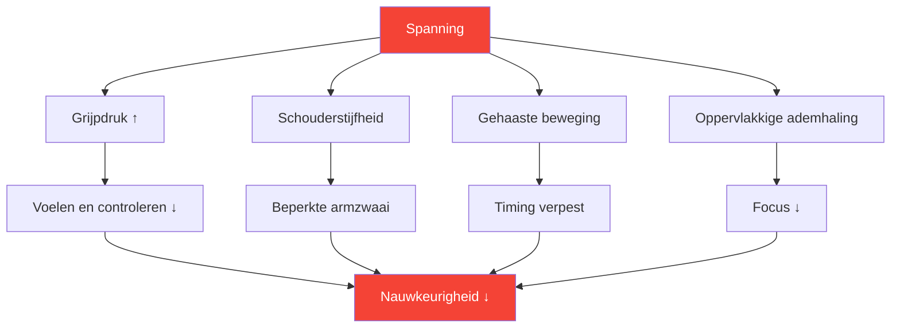

# Spanning begrijpen in precisiesporten

::: tip Spanning is de vijand van precisie.
**Gewicht: 300 punten** — Je kunt niet tegelijkertijd gespannen en nauwkeurig zijn. Leren omgaan met spanning is essentieel voor consistente prestaties.
:::

## De precisieparadox

> &quot;Hoe harder je je best doet, hoe slechter het gaat.&quot;

Dit is geen zwakte, maar natuurkunde en fysiologie. Petanque vereist ontspannen, vloeiende bewegingen. Spanning ondermijnt juist de eigenschappen die zorgen voor nauwkeurige worpen.

### Hoe spanning precisie vernietigt



---

## Fysieke versus mentale spanning

Spanning bestaat in twee met elkaar verbonden vormen:

### Fysieke spanning

Spierverkramping die direct van invloed is op je worp:

| Gebied | Effect bij gooien |
|------|-----------------|
| **Grip** | Gevoelsverlies, inconsistente release |
| **Onderarm** | Beperkte polsbeweging |
| **Schouder** | Verkorte, schokkerige armzwaai |
| **Nek** | Beperkte hoofdpositie, zicht |
| **Kaak** | Verbonden met de algehele lichaamsspanning |
| **Kern** | Evenwichts- en gewichtsoverdrachtproblemen |

### Mentale spanning

Psychologische stress die fysieke symptomen veroorzaakt:

- Razende gedachten
- Zorgen over de uitkomsten
- angst om te falen
- Drukbewustzijn
- Fouten uit het verleden worden opnieuw afgespeeld

::: warning De spanningslus
Mentale spanning → Fysieke spanning → Slechte prestaties → Meer mentale spanning

Het doorbreken van deze vicieuze cirkel is essentieel voor consistent spel.
:::

---

## De Yerkes-Dodson-wet

De relatie tussen opwinding (activatieniveau) en prestatie volgt een omgekeerde U-vormige curve:

```
Performance
    ↑
    │         ★ Optimal Zone
    │        /\
    │       /  \
    │      /    \
    │     /      \
    │    /        \
    │   /          \
    └──┴────────────┴──→ Arousal
     Low           High

   "Flat"   "Alert"   "Tense"
   Unfocused Relaxed  Anxious
```

### Te laag (onderprikkeld)
- Vlak, onscherp
- Slordige fouten
- Gebrek aan intensiteit
- De handelingen plichtmatig uitvoeren

### Te hoog (Overprikkeld)
- Gespannen, gehaast
- Overmatig nadenken
- Stevige greep, beperkte bewegingsvrijheid
- Fouten zijn niet meer te herstellen.

### Optimale zone
- Alert maar ontspannen
- Gericht maar toch vloeiend.
- Passende intensiteit
- Snel herstel

---

## Vind JOUW optimale zone

Iedere speler heeft een ander optimaal opwindingsniveau:

### Het zelfevaluatieproces

1. **Denk terug aan je beste prestaties**
   - Hoe voelde je je fysiek?
   - Hoe hoog was je energieniveau?
   - Hoe zou je je opwinding beoordelen (1-10)?

2. **Denk terug aan je slechtste prestaties**
   - Was je te vlak of te gespannen?
   - Welke fysieke symptomen merkte u op?
   - Wat veroorzaakte de suboptimale toestand?

3. **Identificeer uw patroon**
   - Heb je de neiging tot overprikkeling of juist tot onderprikkeling?
   - Welke situaties triggeren jouw patroon?
   - Wat helpt jou om weer optimaal te functioneren?

### Algemene spelersprofielen

| Profiel | Tendens | Risicosituaties | Strategie |
|---------|----------|-----------------|----------|
| **De Bezorgde** | Overmatige opwinding | Spannende wedstrijden met hoge inzet. | Ontspanningstechnieken |
| **De platte liner** | Onderprikkeling | Vroege rondes met lage inzet | Activeringstechnieken |
| **De reactor** | Variabele | Na missers verschuift het momentum. | Emotionele regulatie |
| **De Achtervolger** | Overmatige opwinding wanneer achter | Comeback, tijdsdruk | Acceptatietechnieken |

---

## Spanningssignalen herkennen

### Fysieke waarschuwingssignalen

Leer deze dingen te herkennen voordat ze je worp beïnvloeden:

| Signaal | Locatie | Actie |
|--------|----------|--------|
| **Stevige greep** | Hand | Maak de huid zacht voor elke worp. |
| **Schouders opgetrokken** | Bovenrug | Laat je vallen en rol. |
| **Geklemde kaken** | Gezicht | Open je mond een beetje |
| **Oppervlakkige ademhaling** | Borst | Diep ademhalen vanuit de buik |
| **Gehaaste beweging** | Hele lichaam | Vertraag bewust |
| **Rusteloos gewiebel** | Algemeen | Aard jezelf |

### Psychische waarschuwingssignalen

- Razende gedachten
- Negatieve zelfpraat neemt toe
- Focus op het resultaat, niet op het proces.
- Besef van de inzet/score
- Nadenken over fouten uit het verleden

---

## De spannings-prestatie zelfcontrole

Gebruik deze snelle beoordeling tussen de worpen door of tijdens pauzes:

**Fysieke scan (5 seconden):**
1. Grip → Zacht?
2. Schouders → naar beneden?
3. Kaak → Ontspannen?
4. Ademhaling → Langzaam en diep?

**Mentale scan (5 seconden):**
1. Gedachten → Ben je gefocust op het heden?
2. Energie → Optimaal bereik?
3. Volgende actie → Wissen?

::: tip Maak er een gewoonte van.
De beste spelers doen dit automatisch. Je kunt jezelf trainen om hetzelfde te doen door herhaling.
:::

---

## In deze module

### [Technieken voor het loslaten van spanning](/nl/education/tension/techniques)
- Progressieve spierontspanning (PMR)
- Snelontgrendelingstechnieken voor wedstrijden
- Ademhalingsprotocollen
- Spanning resetten vóór de worp

### [Spanning beheersen in een competitie](/nl/education/tension/competition)
- Voorbereiding voorafgaand aan de wedstrijd
- Protocollen tijdens de wedstrijd
- Noodherstel vanwege &quot;te gespannen&quot; situatie
- Herstel na een fout

---

## Snelle winst: De reset van 10 seconden

Volg voor je volgende worp dit korte protocol:

1. **Schouders** — Laat ze bewust zakken
2. **Grip** — Maak hem 20% lichter
3. **Kaak** — Ontspan, tong van het gehemelte
4. **Ademhaling** — Eén langzame, volledige uitademing

Dit duurt slechts 10 seconden en kan je volgende worp direct verbeteren.

---

## Gerelateerde factoren

- [Mentale kracht](/nl/education/mental-game/mental-strength/) — Omgaan met druk
- [Slaap en herstel](/nl/education/sleep/) — Rust vermindert de basisspanning
- [Mindfulness](/nl/education/mental-game/mindfulness/) — Bewustzijn van het huidige moment
- [De Zone](/nl/education/mental-game/the-zone/) — Optimale prestatietoestand

