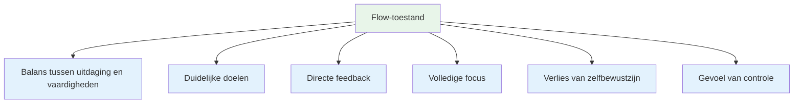
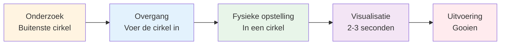
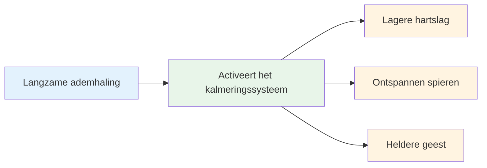
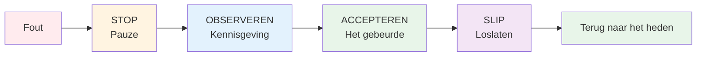

# De zone betreden: praktische technieken

De zone is niet iets wat je zomaar overkomt. Met oefening kun je leren om er consistent in te komen. Hier zijn beproefde technieken die door topsporters worden gebruikt.

::: tip Het Grote Idee
**Je kunt jezelf trainen om betrouwbaarder in een flowtoestand te komen.** De flowtoestand is geen magie, maar een vaardigheid die je ontwikkelt door middel van specifieke technieken en consistente oefening.
:::

## De zes voorwaarden voor doorstroming

Onderzoek toont aan dat flow-toestanden bepaalde voorwaarden vereisen:

| Voorwaarde | Wat het betekent | In pétanque |
|-----------|---------------|-------------|
| **Balans tussen uitdaging en vaardigheden** | Deze taak is uitdagend, maar wel haalbaar. | Concurreren op jouw niveau, niet te makkelijk en niet te onmogelijk. |
| **Duidelijke doelen** | Je weet precies wat je probeert te doen. | Specifiek doel, duidelijke intentie bij elke worp. |
| **Directe feedback** | Je ziet de resultaten van je acties. | Als de bal landt, weet je of het gelukt is. |
| **Volledige focus** | Concentreer je volledig op de taak. | Geen afleiding, alleen het hier en nu. |
| **Verlies van zelfbewustzijn** | Ik maak me geen zorgen over hoe je eruitziet. | Het maakt me niet uit wie er kijkt. |
| **Gevoel van controle** | Voel je in staat om ermee om te gaan | Vertrouw op je training en je vaardigheden. |

::: info Kerninzicht
Wanneer aan deze zes voorwaarden is voldaan, wordt flow mogelijk. Jouw taak is om deze voorwaarden bewust te creëren.
:::

## Techniek 1: De voorbereidingsroutine

Je voorbereiding op een schot is je toegangspoort tot de focuszone. Het is een consistente reeks handelingen die je hersenen het signaal geeft: &quot;Het is tijd om te handelen.&quot;

### Je routine opbouwen

Een goede routine bevat de volgende elementen:

::: details 1. Visuele beoordeling (buiten de cirkel)
- Lees het terrein
- Kies je doelwit en landingsplek.
- Bepaal het type worp.

**Dit is de plek waar nagedacht wordt.** Neem hier de tijd.
:::

::: details 2. Overgang (De cirkel betreden)
- Haal even diep adem.
- Laat de analyse los.
- Schakel over naar de uitvoeringsmodus

**Dit is de schakelaar.** De analyse stopt hier.
:::

::: details 3. Fysieke trigger (in de cirkel)
- Een consistente houdingsinstelling
- Een specifieke gripcontrole
- Een kleine beweging die natuurlijk aanvoelt.

**Zorg voor consistentie.** Elke keer hetzelfde.
:::

::: details 4. Visualisatie (Kort, 2-3 seconden)
- Volg het traject van de bal.
- Voel de succesvolle worp
- Kom in contact met je doelgroep.

**Houd het kort.** Te lang = te veel nadenken.
:::

::: details 5. Uitvoering
- Richt je uitsluitend op het doel.
- Vertrouw op je lichaam.
- Zonder aarzeling vrijgeven

**Uitsluitend externe focus.** Doel, niet techniek.
:::

### Waarom routines werken

Je routine wordt een &#39;mindfulness-bel&#39; - een signaal dat je hersentoestand verandert. Door het vaak genoeg te herhalen, zorgt het simpelweg starten van je routine ervoor dat je mentaal overschakelt naar een flow-toestand.

::: tip Praktische tip
Gebruik je routine bij ELKE worp tijdens de training, niet alleen bij wedstrijden. De routine moet automatisch gaan.
:::

## Techniek 2: Externe focus

Waar je je aandacht op richt, is van enorm belang.

| Focustype | Wat je ervan vindt | Voorbeelden van gedachten |
|------------|---------------------|------------------|
| **Intern** ❌ | Je lichaamsmechanica | &quot;Houd mijn elleboog recht&quot;  &quot;Zorg dat je het goed afmaakt&quot;  &quot;Niet te stevig vastpakken&quot; |
| **Extern** ✅ | Doel en resultaat | &quot;Land hem precies daar&quot;  &quot;Zie het pad&quot;  &quot;Raak het doel&quot; |

::: tip Onderzoeksbevinding
Onderzoek toont consequent aan dat **externe focus betere resultaten oplevert** voor ervaren spelers. Je lichaam weet wat het moet doen - laat het zijn werk doen.
:::

### Externe focus in de praktijk
- Kies een specifieke plek op de grond (niet zomaar &quot;vlakbij de krik&quot;).
- Stel je het hele traject van de bal voor.
- Houd je ogen op het doel gericht, niet op je hand.

::: warning Veelgemaakte fout
Onder druk richten spelers zich vaak op hun innerlijke zelf (&quot;Verpest mijn techniek niet&quot;). Juist dan heb je externe focus het meest nodig.
:::

## Techniek 3: De linkerhandse knijpbeweging

Deze ongebruikelijke techniek heeft een wetenschappelijke basis.

::: info De wetenschap
Knijp je linkerhand (als je rechtshandig bent) 10-15 seconden samen voordat je gooit:
- ✅ Activeert de rechterhersenhelft (ruimtelijk inzicht, intuïtie)
- ✅ Kalmeert de linkerhersenhelft (verbaal, analytisch)
- ✅ Vermindert overmatig nadenken
:::

**Hoe te gebruiken:**
1. Maak een vuist met je niet-werpende hand.
2. Knijp stevig gedurende 10-15 seconden.
3. Ontspan en begin aan je routine.
4. Gooien

::: tip Wanneer te gebruiken
Dit werkt het beste wanneer je merkt dat je te veel nadenkt of druk voelt. Het is een soort &#39;resetknop&#39; voor je hersenen.
:::

## Techniek 4: Ademhalingsoefeningen

Je ademhaling heeft direct invloed op je mentale toestand.

**Voordat je de cirkel betreedt:**
- Haal één keer rustig en diep adem.
- Adem volledig uit
- Voel hoe je schouders zakken

**Binnen de cirkel:**
- Adem natuurlijk in en uit.
- Houd je adem niet in tijdens de worp.
- Laat de uitademing samenvallen met het loslaten.

::: details De 4-7-8-techniek (voor hoge druk)
1. Adem 4 tellen in.
2. Houd 7 tellen vast
3. Adem 8 tellen uit.
4. Herhaal dit één of twee keer.

**Waarom het werkt:** Dit activeert je parasympathische zenuwstelsel (het &quot;kalmeer&quot;-systeem).
:::

## Techniek 5: Triggerwoorden

Een triggerwoord of -zin kan je gemoedstoestand direct veranderen.

::: tip Populaire triggerwoorden
- &quot;Zacht&quot;
- &quot;Vertrouwen&quot;
- &quot;Zie het, wees het&quot;
- &quot;Loslaten&quot;
- &quot;Stroom&quot;
- &quot;Eenvoudig&quot;
:::

**Hoe je die van jou kunt ontwikkelen:**
1. Denk aan een moment waarop je perfect presteerde.
2. Welk woord beschrijft dat gevoel het beste?
3. Gebruik dat woord in je routine.
4. Zeg het in stilte terwijl je je klaarmaakt om te gooien.

::: info Waarom het werkt
Door herhaling wordt het woord gekoppeld aan je optimale prestatietoestand. Het is een mentale snelkoppeling naar een flow-ervaring.
:::

## Techniek 6: Herstellen na fouten

Fouten zullen er zijn. De kunst is om te voorkomen dat één slechte worp er twee worden.

**De SOAS-methode:**

| Stap | Actie | Wat het betekent |
|------|--------|---------------|
| **Stop | Neem even een pauze, reageer niet meteen. | Gooi je handen niet in de lucht, vloek niet. |
| **O**bserve | Merk op wat er gebeurde, zonder oordeel. | &quot;De bal ging naar links&quot;, niet &quot;Ik ben vreselijk&quot;. |
| **Accepteren | Het is gebeurd, het is voorbij. | Je kunt het verleden niet veranderen. |
| **S**lip | Laat los, bevrijd jezelf. | Keer terug naar het huidige moment. |

::: warning Kritische vaardigheid
Dit vergt oefening, maar het voorkomt de neerwaartse spiraal van frustratie die de flow verstoort. Oefen SOAS in het dagelijks leven, zodat het tijdens wedstrijden automatisch gaat.
:::

## Je eigen workflow-toolkit samenstellen

Niet elke techniek werkt voor iedereen. Experimenteer en ontdek wat voor jou werkt:

| Situatie | Probeer dit eens |
|-----------|----------|
| Overmatig nadenken | Linkshandig knijpen, externe focus |
| Nervositeit/gespannen | Ademhalingsoefeningen, triggerwoord |
| Na een vergissing | SOAS-methode |
| Belangrijke worp | Volledige voorbereiding op de opname |
| Concentratie verliezen | Terug naar de basisroutine |

## Oefening baart kunst.

Deze technieken werken alleen als je ze oefent:

1. **Gebruik je routine bij elke training** - niet alleen bij wedstrijden.
2. **Simuleer druk** - creëer consequenties in de praktijk
3. **Let op wanneer je in een flow-toestand bent** - wat heeft die veroorzaakt?
4. **Evaluatie na de sessies** - wat hielp, wat niet?

## Belangrijkste conclusie

::: tip Herinneren
**De zone is geen kwestie van geluk. Het is een vaardigheid die je kunt ontwikkelen.**

Begin met je voorbereiding op de shot. Voer deze routine consequent uit. Vertrouw erop. De flow volgt vanzelf.
:::

