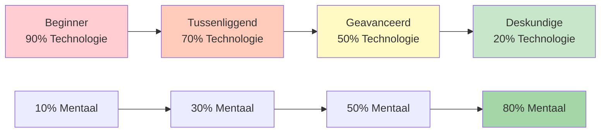

# Technische training versus flowtraining
<AdBanner />

Het is essentieel voor topsportontwikkeling om het verschil tussen technische training en flowtraining te begrijpen. Beide zijn nodig, maar ze dienen verschillende doelen en vereisen een andere aanpak.

::: tip Het kernprincipe
**Je kunt een beginner niet trainen zoals een expert** (beginners missen de benodigde neurale verbindingen), en **je kunt een expert niet trainen zoals een beginner** (een hoge technische belasting leidt tot overmatig nadenken).
:::

## Twee soorten training

::: info Technische training (expliciet leren)
**Focus:** Mechanica en vorm
**Let op:** Bewuste lichaamsbewegingen
**Methode:** Vaardigheden opsplitsen, herhaaldelijk oefenen
**Ideaal voor:** Het leren van nieuwe vaardigheden, het corrigeren van slechte gewoonten, het leggen van een basis

**Voorbeeld:** Je loslaatpunt 50 keer oefenen met behulp van videoanalyse.
:::

::: info Flowtraining (impliciet leren)
**Focus:** Resultaten, niet de techniek
**Let op:** Laat het onderbewustzijn het overnemen
**Methode:** Gevarieerde, spelachtige oefening, visualisatie
**Ideaal voor:** Wedstrijdvoorbereiding, zelfvertrouwen opbouwen, topprestaties

**Voorbeeld:** Oefenwedstrijden spelen onder druk, waarbij je je alleen concentreert op de doelen.
:::

## Het dynamische inversiemodel

De juiste trainingsverhouding is omgekeerd evenredig met de technische bekwaamheid. Naarmate je de techniek beheerst, wordt mentale training belangrijker – niet minder belangrijk.

### 1. Beginner (cognitief stadium)
- Je denkt bewust na over *wat* je moet doen.
- De bewegingen voelen onhandig aan en vergen inspanning.
- Het brein is volledig verzadigd met mechanica.
- **Verhouding:** 90% Technisch / 10% Mentaal
- **Mentale focus:** Plezier, externe focus (kijk naar het doel), geen complexe visualisatie

### 2. Tussenfase (associatieve fase)
- Je verfijnt de vaardigheid met minder bewust nadenken.
- Bewegingen verlopen soepeler, fouten nemen af.
- Je begint je eigen fouten te herkennen.
- **Verhouding:** 70% Technisch / 30% Mentaal
- **Mentale focus:** Het ontwikkelen van je voorbereidingsroutine (PPR)

### 3. Gevorderd (Autonomiedrempel)
- De vaardigheid is grotendeels geautomatiseerd.
- Je zelfbeeld loopt vaak achter op je fysieke mogelijkheden.
- De training richt zich op druksimulatie.
- **Verhouding:** 50% Technisch / 50% Mentaal
- **Mentale focus:** Visualisatie, zelfbeeld, angstbeheersing

### 4. Expert (Autonome fase)
- Technische vaardigheden zijn volledig onbewust.
- Bewuste aandacht voor de mechanica verstoort de prestaties.
- Het onderhoudsvolume is technisch gezien alles wat je nodig hebt.
- **Verhouding:** 20% Technisch / 80% Mentaal
- **Mentale focus:** Flow-toestand, strategie, het tot rust brengen van de geest

<AdInArticle />

## De voortgangstabel

| Niveau | Technologie: Mentaal | Hoofddoel |
|-------|---------------|-------------------|
| Beginner | 90 : 10 | Bouw de machine |
| Tussenliggend | 70 : 30 | Stabiliseer de vaardigheid |
| Geavanceerd | 50 : 50 | Vertrouw op de machine. |
| Deskundige | 20:80 | Vrijheid van uitvoering |

## De valstrik van de expert

Voor gevorderde en ervaren spelers is terugvallen op een te sterke technische focus gevaarlijk.

**Het probleem:** Wanneer je een vaardigheid automatiseert maar deze tijdens een wedstrijd bewust in de gaten houdt, activeer je het bewuste denken en overschrijf je het onderbewuste. Dit leidt tot prestatieangst en &quot;blokkeren&quot;.

**De wetenschap erachter:** De hoeveelheid oefening die nodig is om een vaardigheid te onderhouden is aanzienlijk lager (vaak 1/3 tot 1/9e) dan de hoeveelheid die nodig is om die vaardigheid te ontwikkelen. Experts hoeven maar minimale technische inspanning te leveren om hun vaardigheden te behouden.

**Voorbeeld van een topatleet:** Kampioenen zoals Philippe Quintais en Dylan Rocher richten zich sterk op tactische scenario&#39;s en cruciale momenten in plaats van op mechanische oefeningen.

Tekenen dat je te veel nadenkt (techniek):
- Verlamming door analyse
- Wisselvallige prestaties ondanks goede techniek.
- Slechtere resultaten in wedstrijden dan in de training.
- Het voelt &quot;mechanisch&quot; aan in plaats van vloeiend.

## Vergelijking van trainingsmethoden

| Aspect | Technische training | Flowtraining |
|--------|-------------------|---------------|
| **Oefentype** | Geblokkeerd (dezelfde vaardigheid herhaaldelijk uitvoeren) | Willekeurig (uiteenlopende vaardigheden) |
| **Feedback** | Direct, gedetailleerd | Uitgesteld, resultaatgericht |
| **Omgeving** | Gecontroleerd, voorspelbaar | Variabel, spelachtig |
| **Mentale toestand** | Analytisch, bewust | Intuïtief, automatisch |
| **Beste tijd** | Buiten het seizoen, vaardigheden ontwikkelen | Voorbereiding op de wedstrijd, onderhoud |

## Geblokkeerde versus willekeurige oefening

**Oefening met blokken:** Herhaal dezelfde worp 20 keer.
- Voelt productief aan (je ziet snel verbetering)
- Goed voor de eerste kennismaking.
- Slecht voor langdurige retentie

**Willekeurige oefening:** Varieer de afstand, het doel en het type worp.
- Voelt moeilijker aan (meer fouten)
- Beter voor de transfer van concurrentiemateriaal
- Bevordert aanpassingsvermogen en besluitvorming.

## Praktische richtlijnen

### Voor technische sessies
1. Concentreer je op ÉÉN aspect tegelijk.
2. Gebruik videoanalyse
3. Vraag feedback aan een coach of trainingspartner.
4. Accepteer dat het in het begin ongemakkelijk zal aanvoelen.
5. Houd de sessies kort (kwaliteit boven kwantiteit).

### Voor Flow-sessies
1. Creëer spelachtige druk.
2. Richt je op het doel, niet op je lichaam.
3. Voer je voorbereidingsroutine consequent uit.
4. Analyseer niet tijdens de sessie.
5. Vertrouw op je training.

## De integratie-uitdaging

De ware kunst is weten wanneer je welke modus moet gebruiken:

**Tijdens een wedstrijd:**
- Technisch denken: NOOIT tijdens de uitvoering.
- Stroommodus: ALTIJD tijdens het gooien

**Tijdens de training:**
- Technische sessies: Gepland, met een specifiek thema
- Flowsessies: spelsimulatie, druktraining

## Voorbeeld van een wekelijks saldo

| Dag | Sessietype | Focus |
|-----|-------------|-------|
| Maandag | Technisch | Richtingsnauwkeurigheid |
| Dinsdag | Technisch | Schietnauwkeurigheid |
| Woensdag | Stroom | Mentale training, visualisatie |
| Donderdag | Gemengd | Spelscenario&#39;s met focus op flow |
| Vrijdag | Technisch | Zwakke plek |
| Zaterdag | Stroom | Wedstrijdsimulatie, competitiesimulatie |
| Zondag | Rest | Herstel, reflectie |

## Samenvatting: Regels voor trainingsbalans

::: tip Regel #1: Stem de training af op het niveau.
**Beginners (90/10):** Bouw de machine - focus op de techniek
**Gemiddeld (70/30):** Stabiliseer de vaardigheid - voeg mentale inspanning toe
**Geavanceerd (50/50):** Vertrouw op de machine - balanceer beide
**Expert (20/80):** Vrijheid van prestatie - voornamelijk mentaal
:::

::: tip Regel #2: Geblokkeerde versus willekeurige oefening
**Geblokkeerde oefening** (dezelfde worp herhaaldelijk uitvoeren): Goed voor het aanleren van de eerste stappen, slecht voor het onthouden van de oefening.
**Willekeurige oefening** (gevarieerde worpen): Harder tijdens de training, beter in de wedstrijd
:::

::: tip Regel #3: De valkuil van de expert
**Voor experts:** Een hoge technische werkdruk leidt tot overmatig nadenken en blokkeren.
**Oplossing:** Minimaal technisch onderhoud, maximale mentale training
:::

## Belangrijkste conclusie

> Je kunt een beginner niet trainen zoals een expert (beginners missen de neurale verbindingen voor mentaal werk), en je kunt een expert niet trainen zoals een beginner (een hoge technische werkdruk leidt tot burn-out en overmatig nadenken).

De weg van techniek naar flow vereist een strategische omkering. Stem je training af op je ontwikkelingsfase.

<AdBanner />
