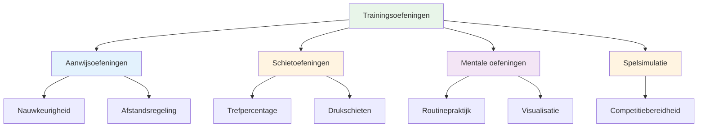

# Trainingsoefeningen
<AdBanner />

Hieronder vind je beproefde oefeningen die door topspelers worden gebruikt. Elke oefening heeft een specifiek doel - kies de oefening die het beste aansluit bij jouw ontwikkelingsbehoeften.

::: tip Het Grote Idee
**Elke oefening heeft een specifiek doel.** Gooi niet zomaar willekeurig met de boules, maar kies oefeningen die je zwakke punten aanpakken en je doelen ondersteunen. Houd je voortgang bij om je verbetering te zien.
:::

## Aanwijsoefeningen

### De steeg
**Doel:** Het isoleren van de afwerphoek en de lijnconsistentie.

**Installatie:**
- Plaats twee markeringen op 30-40 cm afstand van elkaar, op ongeveer 1 meter van de cirkel.
- Het doel bevindt zich op 7-9 meter afstand.

**Oefening:**
- Gooi door het &quot;steegje&quot; (tussen de markeringen)
- Elke worp die een marker raakt, is &quot;dood&quot;.
- Focus op een consistent afgiftepunt.

**Progressie:**
- Versmaller het steegje naarmate je beter wordt.
- Varieer de afstand tot het doel.
- Voeg een specifieke landingszone toe

### Precisiezones
**Doel:** Nauwkeurigheid ontwikkelen op specifieke gebieden

**Installatie:**
- Markeer zones rond een doelwit (bijvoorbeeld cirkels op 20 cm, 40 cm, 60 cm).
- Of gebruik natuurlijke markeringen in het terrein.

**Score:**
- Binnen 20 cm: 3 punten
- Binnen 40 cm: 2 punten
- Binnen 60 cm: 1 punt
- Buiten: 0 punten

**Oefening:**
- Gooi 10 boules en houd je score bij.
- Doel: Voortdurende verbetering gedurende de sessies

### Afstandsvariatie
**Doel:** Dieptecontrole ontwikkelen

**Installatie:**
- Plaats doelen op 6m, 7m, 8m, 9m en 10m afstand.

**Oefening:**
- Gooi naar elke afstand in willekeurige volgorde.
- Partner roept in de verte
- Focus op het aanpassen van het gewicht, niet op de techniek.

**Variatie:**
- Voeg &quot;korte&quot; en &quot;lange&quot; aanroepen toe nadat je ze hebt vrijgegeven.
- Aanpassing tijdens de vlucht is noodzakelijk (ontwikkelt gevoel).

## Schietoefeningen

### De schietladder
**Doel:** Nauwkeurigheid opbouwen onder steeds hogere druk

**Installatie:**
- Plaats een doelboule op 6 meter afstand.
- Markeer afstanden op 7m, 8m, 9m, 10m

**Oefening:**
- Begin op 6 meter afstand.
- Geraakt = één meter achteruitgaan
- Miss = één meter vooruitgaan (of opnieuw beginnen)
- Doel: 10 meter bereiken

**Variaties:**
- Strikte versie: Bij elke misser moet je terug naar 6 meter.
- Tijdsgebonden versie: Hoe ver kom je in 10 minuten?
- Teamversie: Wissel af met je partner

<AdInArticle />

### De Barrière (Blox)
**Doel:** Hoge boogschieten afdwingen

**Installatie:**
- Plaats een barrière (stok, touw of obstakel) tussen jou en het doelwit.
- De barrière moet hoog genoeg zijn om een lob te vereisen.

**Oefening:**
- Je moet de hindernis passeren om het doel te raken.
- Elke worp die de barrière raakt, is &quot;dood&quot;.
- Ontwikkelt een hoog afgiftepunt

**Waarom dit belangrijk is:**
- Bij wedstrijden is het vaak nodig om over obstakels heen te schieten.
- Vergroot de veelzijdigheid van je schietvaardigheid.

### Hindernisbaan
**Doel:** Het ontwikkelen van fotografie vanuit verschillende hoeken

**Installatie:**
- Plaats de doelboule in het midden.
- Voeg obstakels (andere boules, markeringen) eromheen toe.

**Oefening:**
- Fotografeer vanuit verschillende posities rondom de cirkel.
- Je moet de invalshoek vinden die werkt.
- Ontwikkelt het lezen van schietlijnen.

## Mentale trainingsoefeningen

### Routinematige herhaling
**Doel:** Uw voorbereiding op de foto automatiseren

**Oefening:**
- Oefen je volledige routine zonder te gooien.
- Doorloop elke stap zorgvuldig.
- Doe 10-20 herhalingen.
- Voeg vervolgens de worp toe.

**Focus:**
- Consistente timing
- Duidelijke overgang van denken naar uitvoeren
- Steeds dezelfde routine.

### Drukpunten
**Doel:** Oefenen met presteren onder druk

**Installatie:**
- Creëer een scenario dat absoluut noodzakelijk is.
- Stel consequenties vast voor het niet nakomen van een afspraak.

**Voorbeelden:**
- &quot;Maak er 3 op een rij of begin opnieuw&quot;
- &quot;Mis de oefening en doe 10 push-ups&quot;
- &quot;Maak je doelwit bekend voordat je gooit.&quot;

**Sleutel:**
- De druk moet echt aanvoelen.
- Oefen je mentale reactie op druk.
- Volg je routine precies zoals tijdens de wedstrijd.

### Herstelpraktijk
**Doel:** De gewoonte ontwikkelen om snel mentaal te resetten.

**Oefening:**
- Opzettelijk een slechte boule gooien
- Pas direct de SOAS-methode toe (Stop, Observeer, Accepteer, Glijd door).
- Gooi de volgende boule met volle overgave.

**Focus:**
- Sta niet te lang stil bij de gemiste kans.
- Reset volledig voor de volgende worp.
- Houd een positieve lichaamstaal aan.

## Spelsimulatieoefeningen

### Het genot van het milieu
**Doel:** Ritmeblokkades doorbreken, veelzijdigheid vergroten

**Oefening:**
- Wissel bij elke worp af tussen wijzen en schieten.
- Geen twee opeenvolgende worpen van hetzelfde type.
- Ontwikkelt het vermogen om van modus te wisselen.

### Scenario spelen
**Doel:** Het oefenen van tactische besluitvorming.

**Installatie:**
- Creëer realistische spelsituaties.
- Ken scores en boule-tellingen toe.

**Voorbeelden:**
- &quot;Je staat met 10-8 achter, de tegenstander heeft 2 punten, jij hebt nog 2 boules over.&quot;
- &quot;Gelijkspel 6-6, jij hebt de laatste boule, zij hebben 1 punt&quot;

**Oefening:**
- Beslis wat je gaat doen
- Voer het met volledige toewijding uit.
- Evalueer de beslissing achteraf.

### Wedstrijd spelen met regels
**Doel:** Competitiesimulatie

**Variaties:**
- Speel tot 13 (hele wedstrijd)
- Speel tot 7 (korter, meer spellen)
- &quot;Drukpunten&quot; - bepaalde doelen die dubbel zoveel waard zijn.
- &quot;Sudden death&quot; - de eerste die een end verliest, verliest het spel.

## Het bijhouden van je oefeningen

Houd voor elke oefening een logboek bij:

| Datum | Oefening | Score/Result | Notities |
|------|-------|--------------|-------|
| | | | |

**Volg de ontwikkeling over tijd:**
- Gaat het beter met je?
- Welke oefeningen helpen het meest?
- Waar loop je tegenaan?

## Een oefensessie opbouwen

### Opwarming (10 min)
- Eenvoudige worpen om los te komen
- Geen druk, voel het gewoon

### Technische focus (20-30 min)
- Een of twee oefeningen gericht op specifieke vaardigheden.
- Geblokkeerde oefening voor nieuwe vaardigheden
- Willekeurige oefening voor reeds verworven vaardigheden

### Druk-/spelsimulatie (20-30 min)
- Voeg consequenties toe
- Creëer realistische scenario&#39;s
- Oefen mentale vaardigheden

### Afkoelen (10 min)
- Gemakkelijke worpen
- Reflecteer op de sessie.
- Noteer waaraan je vervolgens moet werken.

## Belangrijkste conclusie

> Boormachines zijn gereedschappen. Kies het juiste gereedschap voor wat je wilt bouwen.

Gooi niet zomaar met de boules. Train met een doel.

<AdBanner />
