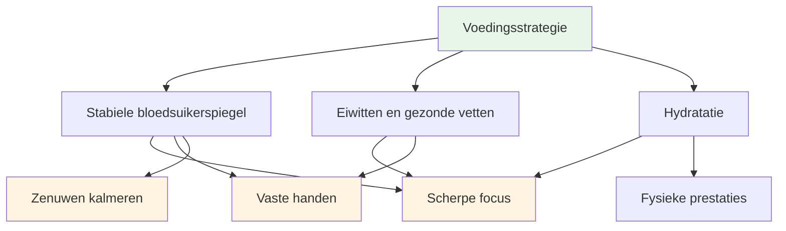
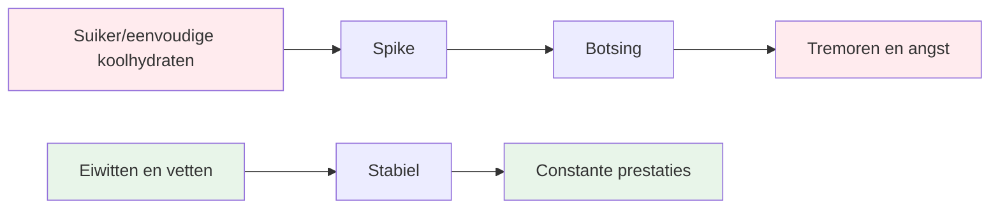
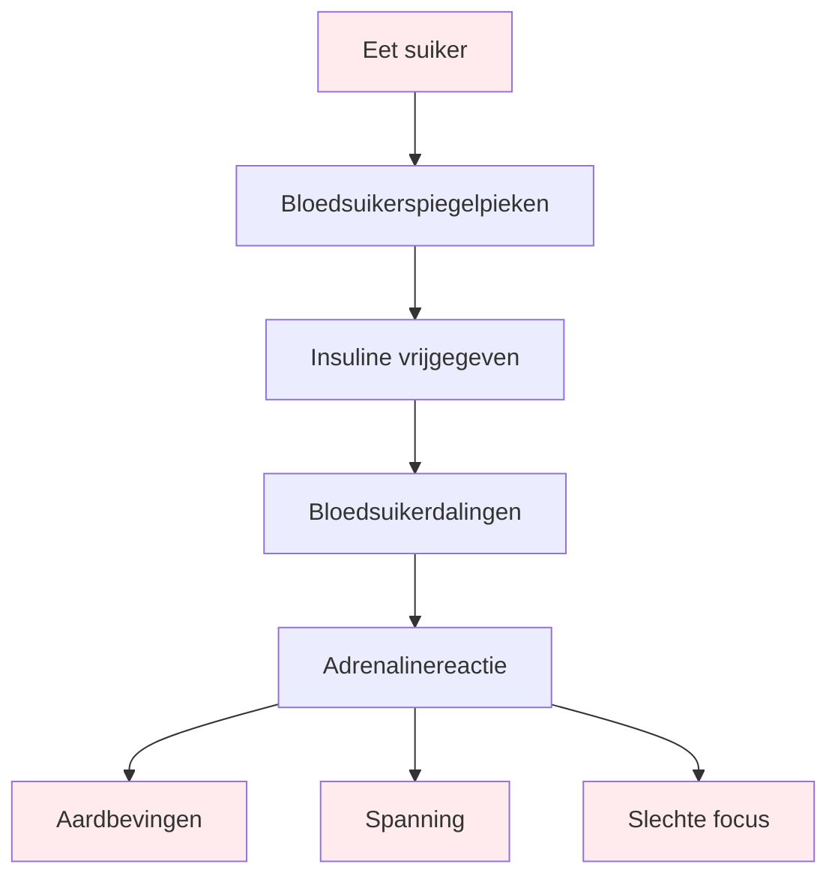

# Voeding en voedingswaarde

## Het stimuleren van precisieprestaties

Pétanque is een precisiesport. Je hersenen zijn je belangrijkste instrument – geef ze stabiele brandstof, geen energie die je in een achtbaan belandt.

::: tip Het kernprincipe
**Stabiele bloedsuiker = scherpe focus + vaste handen**

Vermijd pieken in de bloedsuikerspiegel. Geef prioriteit aan eiwitten en gezonde vetten. Zorg dat je voldoende drinkt.
:::

## Kernprincipes

### Een stabiele bloedsuikerspiegel is essentieel.

::: warning Impact van bloedsuikerdip
Suiker en enkelvoudige koolhydraten veroorzaken pieken en dalen in de bloedsuikerspiegel, wat direct gevolgen heeft voor:
- ❌ Mentale focus en helderheid
- ❌ Stabiele handen (trillingen door een daling van de bloedsuikerspiegel)
- ❌ Kwaliteit van de besluitvorming
- ❌ Emotionele stabiliteit en kalmte
:::

### Geef prioriteit aan eiwitten en gezonde vetten.

::: tip Beste voedingsmiddelen voor precisie
Vet en eiwitten zorgen voor langdurige energie zonder energiedips:
- ✅ Noten, avocado, olijfolie, eieren, kaas
- ✅ Langzame spijsvertering = constante energie de hele dag
- ✅ Geen middagdip tijdens lange toernooien
:::

### Vermijd de suikerval.

::: danger Voedingsmiddelen die je beter kunt vermijden
Wees extra voorzichtig met:
- ❌ Energierepen en -dranken (vaak rijk aan suiker)
- ❌ Vruchtensap en smoothies (bevatten geconcentreerde suiker)
- ❌ Wit brood, gebak, snacks uit de automaat
:::

## Snelgids voor de wedstrijddag

| Timing | Wat te eten | Waarom |
|--------|-------------|-----|
| **2-3 uur van tevoren** | Evenwichtige maaltijd: eiwitten, vetten, groenten | Stabiele energie zonder slaperigheid |
| **Tijdens de wedstrijd** | Water + kleine eiwitrijke snacks (noten, kaas, gedroogd vlees) | Houd je aandacht erbij en je handen stabiel. |
| **Vermijd de hele dag** | Suikerrijke snacks en dranken | Voorkom botsingen en aardbevingen. |

::: tip Snelle wedstrijdsnacks
**Neem dit mee:**
- Gemengde noten (ongezouten)
- Hardgekookte eieren
- Kaasblokjes
- Gedroogd rundvlees of kalkoen
- Groenten met hummus

**Laat deze thuis:**
- Snoep en chocolade
- Energiedrankjes
- Gebak
- Vruchtensap
:::

## De wetenschap

::: info Waarom dit belangrijk is voor pétanque
In tegenstelling tot duursporten vereist petanque:
- **Precisie** - Stabiele handen, geen trillingen
- **Mentale helderheid** - Scherpe besluitvorming gedurende de hele dag
- **Rustige zenuwen** - Minder angst onder druk

Energie uit suiker werkt al deze effecten tegen.
:::

## Meer informatie

Voor gedetailleerde voedingsstrategieën, wedstrijdprotocollen en de wetenschap achter stabiele energie:

::: tip Complete voedingsgids
→ **[Voeding voor optimale prestaties](./education/nutrition/)** - Complete handleiding in onze sectie Educatie

Inclusief:
- Gedetailleerde maaltijdplanning
- Protocollen voor de wedstrijddag
- De koolhydraatarme optie voor precisiesporters
- Hydratatiestrategieën
- Voedingsmiddelen die helpen versus voedingsmiddelen die schaden
:::

