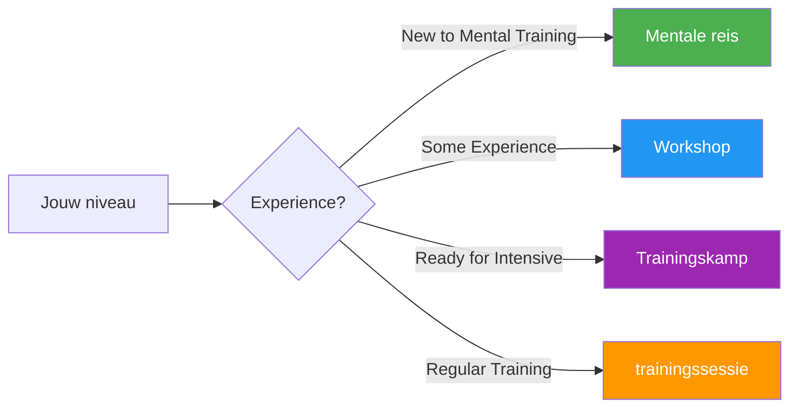

# Handleidingen en hulpmiddelen

Praktische hulpmiddelen voor spelers, coaches en clubs om gestructureerde mentale trainingsprogramma&#39;s te implementeren.

## Kies uw formaat

## Gidsformaten

### 🌱 [Mentale Reis](/nl/guides/mental-journey/)
**Voor beginners** — Introductie van 2-3 uur

Perfect voor spelers die nog niet bekend zijn met mentale training. Een laagdrempelige introductie tot de kernconcepten met praktische oefeningen.

- Duur: 2-3 uur
- Groepsgrootte: 4-12 spelers
- Materialen: Aangeleverd
- [Bekijk de gids →](/nl/guides/mental-journey/)

---

### 🎯 [Workshop](/nl/guides/workshop/)
**Voor gevorderden** — 3-4 uur durende diepgaande training

Gestructureerde workshopvorm voor clubs en teams die zich serieuzer willen verdiepen in mentale training.

- Duur: 3-4 uur
- Groepsgrootte: 6-8 spelers
- Inclusief: Coördinatorhandleiding + downloadbaar materiaal
- [Bekijk de handleiding →](/nl/guides/workshop/)

---

### 🏕️ [Trainingskamp](/nl/guides/training-camp/)
**Voor toegewijde teams** — Intensief weekendprogramma

Een compleet weekendprogramma met een mix van theorie, praktijk en competitie. Ideaal voor teams die zich voorbereiden op belangrijke toernooien.

- Duur: 2-3 dagen
- Groepsgrootte: 10-20 spelers
- Inclusief: Volledig programma + organisatiemateriaal
- [Bekijk de handleiding →](/nl/guides/training-camp/)

---

### 🔄 [Trainingssessie](/nl/guides/training-session/)
**Voor regelmatige oefening** — gestructureerde sessies van 2-4 uur

Een raamwerk voor regelmatige trainingssessies waarin mentale vaardigheden worden gecombineerd met technische oefeningen.

- Duur: 2-4 uur
- Groepsgrootte: 4 spelers (één team)
- Focus: Competitiesimulatie met reflectie
- [Bekijk de handleiding →](/nl/guides/training-session/)

---

## Sjablonen en tools

Downloadbare sjablonen ter ondersteuning van uw ontwikkeling:

### 📋 [Doelsjabloon](/nl/guides/templates/goal-template)
Gestructureerd werkblad voor het vaststellen en bijhouden van je pétanque-doelen met behulp van het SMART-raamwerk.

### 📓 [Dagboeksjabloon](/nl/guides/templates/diary-template)
Sjabloon voor een trainings- en wedstrijddagboek om de voortgang, inzichten en verbeterpunten bij te houden.

---

## Welk formaat past het beste bij jou?

| Formaat | Het beste voor | Tijdsbesteding | Diepte |
|--------|----------|-----------------|-------|
| **Mentale reis** | Eerste kennismaking | 2-3 uur | ⭐ |
| **Workshop** | Club trainingsdagen | 3-4 uur | ⭐⭐ |
| **Trainingskamp** | Teamvoorbereiding | Weekend | ⭐⭐⭐ |
| **Trainingssessie** | Voortdurende ontwikkeling | Regelmatig 2-4 uur | ⭐⭐ |

::: tip Voor coaches en clubleiders
Elke handleiding bevat materiaal voor zowel deelnemers als begeleiders/organisatoren. Zoek naar de secties &quot;Voor coördinatoren&quot; met downloadbare pdf&#39;s en presentatiesheets.
:::

## Gerelateerde bronnen

- [🎯 Beoordeling](/nl/assessment/) — Evalueer je 8 factoren en bepaal je prioriteiten
- [📚 Educatiecentrum](/nl/education/) — Een diepgaande analyse van de 8 prestatiefactoren
- [📝 Artikelen](/nl/articles/) — Onderzoek en inzichten

