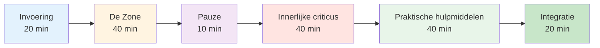

# Sessiehandleiding: Introductie tot de mentale speltechniek (2-3 uur)


## Overzicht

Deze handleiding helpt je bij het geven van een introductiesessie van 2-3 uur over mentale training voor pétanque-spelers. Perfect voor coaches, clubleiders of ervaren spelers die mentale training willen introduceren bij hun team.

::: tip Deze handleiding bestaat uit twee secties.
- **[Voor deelnemers](#voor-deelnemers)** - Wat spelers zullen leren
- **[Voor begeleiders](#voor-begeleiders)** - Hoe de sessie te leiden
:::

## Sneltoegang

| Sectie | Doel | Toegang |
|---------|---------|--------|
| **Voor deelnemers** | Wat kun je van de sessie verwachten? | [Sectie bekijken](#voor-deelnemers) |
| **Voor begeleiders** | Volledig sessieplan en tijdschema | [Sectie bekijken](#voor-facilitatoren) |
| **Sessiematerialen** | Handleidingen, dia&#39;s en werkbladen | [Materialen bekijken](/nl/guides/mental-journey/materials) |
| **Voorbereidingschecklist** | Wat je moet voorbereiden vóór de sessie | [Bekijk checklist](#voorbereiding-1-week-vooraf) |

---

## Voor deelnemers

### Wat kun je verwachten?

Deze sessie introduceert het mentale aspect van pétanque door middel van discussie, oefeningen en praktische technieken die je direct kunt toepassen.

**Je leert het volgende:**
- Waarom mentale training belangrijk is voor prestaties
- Het verschil tussen &quot;technische modus&quot; en &quot;flowmodus&quot;
- Hoe herken je je innerlijke criticus en hoe ga je ermee om?
- Eenvoudige technieken voor drukbeheersing
- Een basisroutine vóór de opname

**Wat je nodig hebt:**
- Een open houding en de bereidheid om te delen
- Notitieboekje en pen
- Jouw eigen ervaringen om over te praten
- 2-3 uur geconcentreerde tijd

### Sessiestructuur



### Belangrijke concepten die je zult onderzoeken

#### 1. De zone (stroomtoestand)
- Hoe het voelt als alles op zijn plek valt.
- Waarom nadenken over techniek de prestaties verstoort
- De &quot;omschakeling&quot; van planning naar uitvoering.

#### 2. De innerlijke criticus
- Hoe negatieve zelfpraat de prestaties beïnvloedt
- Het verschil tussen een innerlijke criticus en een innerlijke coach.
- Neutrale observatie versus hard oordeel

#### 3. Drukreactie
- Waarom je anders speelt in een wedstrijd
- Fysieke tekenen van druk
- Snelle resettechnieken

#### 4. Praktische hulpmiddelen
- 3-ademhaling reset
- Eenvoudige routine vóór de opname
- Foutcorrectieprotocol

### Wat mee te nemen

**Vereist:**
- Jijzelf en jouw ervaringen
- Bereidheid om deel te nemen

**Optioneel:**
- Voorbeelden van mentale uitdagingen waarmee je te maken krijgt
- Vragen over specifieke situaties
- Notitieboekje voor persoonlijke aantekeningen

### Na de sessie

Je ontvangt:
- Samenvatting van de belangrijkste concepten
- Oefeningen voor deze week
- Links naar gedetailleerde onderwijsmodules
- Doelsjabloon voor de ontwikkeling van mentale spellen


---

## Voor begeleiders

### Voorbereidingschecklist

**1 week van tevoren:**
- [ ] Reserveer een kamer voor 2-3 uur.
- [ ] Nodig 6-12 deelnemers uit
- [ ] Voeg de pagina&#39;s met materialen toe aan je bladwijzers (zie [Materialen](/nl/guides/mental-journey/materials))
- [ ] Lees deze handleiding aandachtig door.
- [ ] Bereid een flipchart of whiteboard voor.

**1 dag van tevoren:**
- [ ] Bevestig je aanwezigheid
- [ ] De ruimte inrichten (rondopstelling)
- [ ] Test alle technologieën (dia&#39;s, enz.).
- [ ] Materialen voorbereiden

**1 uur van tevoren:**
- [ ] Kom vroeg aan
- [ ] Plaats de stoelen in een cirkel.
- [ ] Materialen klaarzetten
- [ ] Centreer jezelf

### Jouw rol als facilitator

::: warning Belangrijk
Je bent **geen** therapeut of technisch coach. Je bent een **facilitator** die:
- Discussie over handleidingen
- Creëert een veilige ruimte
- Verbindt concepten met ervaring
- Beheert groepsdynamiek
:::

**Belangrijkste vaardigheden:**
- Actief luisteren
- Neutrale aanwezigheid
- Omgaan met verschillende persoonlijkheden
- Weten wanneer je verder moet gaan.

### Gedetailleerd sessieplan

---

#### Deel 1: Inleiding (20 minuten)

**Doelstellingen:**
- Creëer psychologische veiligheid
- Stel de verwachtingen bij.
- Maak een groepsverbinding

**Script:**

&quot;Welkom allemaal. Deze sessie gaat over het mentale aspect van pétanque - de gedachten, gevoelens en patronen die je prestaties beïnvloeden.&quot;

**Basisregels:**
1. Wat hier gedeeld wordt, blijft hier.
2. Geen oordeel vellen over de ervaringen van anderen
3. Deelname is vrijwillig.
4. Er bestaan geen foute antwoorden.

**Snelle ronde:** Naam, hoe lang je al speelt, en één mentale uitdaging waar je tegenaan loopt.

**Aantekeningen voor de begeleider:**
- Ga eerst naar het model voor kwetsbaarheid.
- Houd de introducties kort (1 minuut per persoon).
- Merk de gemeenschappelijke thema&#39;s op.
- Valideer alle antwoorden

---

#### Deel 2: De zone-/flowtoestand (40 minuten)

**Doelstellingen:**
- Begrijp flowtoestanden
- Onderscheid de technische modus versus de flowmodus.
- Leer het &quot;schakelaar&quot;-concept.

**Openingsvraag:**
&quot;Denk eens terug aan een moment waarop je je beste pétanque speelde. Hoe voelde dat? Wat was er anders?&quot;

**Discussievragen:**
1. &quot;Hoeveel van jullie hebben wel eens een wedstrijd gespeeld waarbij alles gewoon op zijn plek viel?&quot;
2. &quot;Waar dacht je aan tijdens die momenten?&quot;
3. &quot;Wat is het verschil met de situatie waarin je het moeilijk hebt?&quot;

**Belangrijkste leerpunten:**

Gebruik het whiteboard om te tekenen:
```
PLANNING MODE          →    EXECUTION MODE
(Outside circle)            (Inside circle)
- Analyze situation         - Eyes on target
- Choose strategy           - Trust training
- Decide throw type         - Automatic movement
```

**Oefening: De Omschakeling (10 minuten)**

&quot;Laten we het omschakelingsmoment oefenen:
1. Sta op
2. Stel je voor dat je buiten de cirkel staat - denk aan een slag.
3. Haal even diep adem.
4. Stap naar voren (in een denkbeeldige cirkel)
5. Laat bij elke stap de analyse los.
6. Richt je uitsluitend op een denkbeeldig doelwit.

**Nabespreking:**
- &quot;Wat viel je op?&quot;
- &quot;Was het makkelijk of moeilijk om het denken los te laten?&quot;
- &quot;Hoe zou dit in de praktijk bij echte wedstrijden toegepast kunnen worden?&quot;

---

#### Deel 3: Pauze (10 minuten)

**Acties van de begeleider:**
- Stimuleer informele discussies.
- Merk groepsenergie op
- Bereid je voor op het volgende onderdeel.

---

#### Deel 4: De innerlijke criticus (40 minuten)

**Doelstellingen:**
- Negatieve zelfspraakpatronen herkennen
- Onderscheid de innerlijke criticus van de innerlijke coach.
- Oefen neutrale observatie.

**Opening:**
&quot;We hebben allemaal een innerlijke stem die commentaar levert op onze prestaties. Soms is die stem behulpzaam, soms is ze hard. Laten we die eens onderzoeken.&quot;

**Oefening: Inventarisatie van je innerlijke criticus (15 minuten)**

Schrijf op je papier het volgende op:
1. Wat je innerlijke stem zegt na een mislukte worp.
2. Wat het zegt als je onder druk staat
3. Wat het zegt over jouw vaardigheden.

*Neem 5 minuten de tijd om te schrijven*

&quot;Wie wil er nu een voorbeeld geven?&quot;

**Aantekeningen voor de begeleider:**
- Normaliseer harde zelfpraat.
- Probeer niemand te &quot;verbeteren&quot;.
- Zoek naar gemeenschappelijke patronen.

**Les: De innerlijke criticus versus de innerlijke coach (15 minuten)**

Teken twee kolommen op het whiteboard:

| Innerlijke criticus | Innerlijke coach |
|--------------|-------------|
| &quot;Hoe kon je dat nou missen?!&quot; | &quot;Dat ging naar links&quot; |
| &quot;Je faalt altijd&quot; | &quot;Laten we het nog eens proberen&quot; |
| &quot;Je bent vreselijk&quot; | &quot;Wat kan ik leren?&quot; |

**Discussie:**
- &quot;Zie je het verschil?&quot;
- &quot;Welke stem bevordert de prestatie?&quot;
- &quot;Kun je de stem veranderen?&quot;

**Oefening: Herkaderen (10 minuten)**

&quot;Neem een uitspraak van je innerlijke criticus. Hoe zou een innerlijke coach die formuleren?&quot;

Deel voorbeelden.

---

#### Deel 5: Praktische hulpmiddelen (40 minuten)

**Doelstellingen:**
- Leer de 3-ademhaling reset.
- Stel een eenvoudige routine op vóór de opname.
- Inzicht in foutcorrectie

**Hulpmiddel 1: Reset met 3 ademhalingen (10 minuten)**

&quot;Dit is je noodresetknop. Gebruik hem als je de druk voelt oplopen.&quot;

**Tonen:**
1. Adem in gedurende 4 tellen.
2. Houd 2 tellen vast
3. Adem 6 tellen uit.
4. Herhaal dit 3 keer.

&quot;Laten we nu samen oefenen.&quot;

*Begeleid de groep door 3 cycli*

**Nabespreking:**
- &quot;Wat merkte je aan je lichaam?&quot;
- &quot;Wanneer zou je dit kunnen gebruiken?&quot;

**Tool 2: Eenvoudige voorbereidingsroutine (15 minuten)**

&quot;Een routine helpt je om consistent over te schakelen van planning naar uitvoering.&quot;

**Basisstructuur:**
```
Outside Circle (Planning):
- Look at situation
- Decide on throw
- See the result in your mind

Walking to Circle (Transition):
- One deep breath
- Let go of analysis

Inside Circle (Execution):
- Eyes on target only
- Trust your training
- Execute
```

**Oefening:**
&quot;Ontwerp je eigen routine van 3 stappen. Schrijf deze op.&quot;

Deel voorbeelden.

**Hulpmiddel 3: Protocol voor foutcorrectie (15 minuten)**

&quot;Topspelers maken niet minder fouten. Ze herstellen sneller.&quot;

**3-stappenprotocol:**
1. **Observeer** - Geef de feitelijke situatie neutraal weer (&quot;Dat ging naar links&quot;).
2. **Leren** - Informatie extraheren (&quot;Wind sterker dan ik dacht&quot;)
3. **Reset** - Ga vooruit (3 ademhalingen, blik vooruit)

**Oefening:**
&quot;Denk aan een recente fout. Doorloop de 3 stappen.&quot;

---

#### Deel 6: Integratie en afsluiting (20 minuten)

**Doelstellingen:**
- Consolideer het leerproces
- Stel actieplannen op
- Zorg voor de benodigde middelen

**Reflectievragen:**
1. &quot;Wat is één belangrijk inzicht dat je hebt opgedaan?&quot;
2. &quot;Wat ga je deze week proberen?&quot;
3. &quot;Welke vragen blijven er nog over?&quot;

**Actieplanning (10 minuten)**

&quot;Schrijf op uw werkblad:
1. Een techniek die je deze week gaat oefenen.
2. Wanneer/waar ga je het oefenen?
3. Hoe je je voortgang bijhoudt

**Bronnen:**
- Deel het samenvattingsblad uit.
- Deel de website: carreau.app
- Aanbevolen startmodule: [The Zone](/nl/education/mental-game/the-zone/)

**Afsluitende kring:**
&quot;Eén woord om te beschrijven hoe je je nu voelt.&quot;

**Tot slot:**
&quot;Mentale training is een vaardigheid zoals elke andere - het vergt oefening. Begin klein, wees geduldig met jezelf en let op wat er verandert. Bedankt voor je openheid vandaag.&quot;

---

### Tips voor begeleiders

#### Omgaan met moeilijke situaties

**Als iemand de overhand heeft:**
- &quot;Dankjewel [naam]. We horen graag van anderen.&quot;
- Gebruik gestructureerde beurtwisseling.

**Als iemand zich verzet:**
- Ga niet in discussie
- &quot;Dat is een terecht standpunt. Wat vinden anderen ervan?&quot;
- Deel hun bezorgdheid

**Als iemand emotioneel wordt:**
- Normaliseer het
- &quot;Dit raakt me echt. Bedankt voor het delen.&quot;
- Probeer het niet te repareren.

**Als de discussie vastloopt:**
- Gebruik specifieke aanwijzingen.
- Deel je eigen voorbeeld.
- Ga naar een oefening

#### Energiebeheer

**Hoog energieniveau:** Gebruik oefeningen en beweging.
**Lage energie:** Stel prikkelende vragen.
**Verspreid:** Terugbrengen naar de structuur
**Tijdsvorm:** Gebruik humor of breek de tijd af.

### Na de sessie

**Vervolgactie:**
- Stuur binnen 24 uur een samenvattende e-mail.
- Voeg links naar bronnen toe.
- Bied aan om vragen te beantwoorden
- Plan een optionele vervolgsessie in.

**Zelfreflectie:**
- Wat werkte goed?
- Wat zou je veranderen?
- Wat heeft je verrast?
- Wat heb je geleerd?


---

## Materialen

- [Deelnemershandleiding](/nl/guides/mental-journey/materials#participant-guide)
- [Facilitator Slides](/nl/guides/mental-journey/materials#facilitator-slides)
- [Samenvattingsblad](/nl/guides/mental-journey/materials#summary-sheet)
- [Oefenbladen](/nl/guides/mental-journey/materials#exercise-worksheets)

---

::: tip Klaar om te faciliteren?
1. Lees deze handleiding aandachtig door.
2. Downloadmateriaal
3. Oefen de oefeningen zelf.
4. Plan je sessie in.
5. Vertrouw op het proces.
:::

