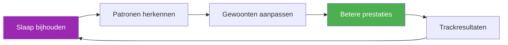

# Slaaptracker-sjabloon

> &quot;De speler die het beste geslapen heeft, wint vaak.&quot;

Houd je slaappatroon bij en koppel het aan je prestaties om je herstel te optimaliseren.

::: tip Waarom zou je je slaap bijhouden?
**Slaap is hét belangrijkste hulpmiddel voor herstel.** Topsporters die hun slaap consequent bijhouden, melden meer energie, snellere reactietijden en een beter vermogen om onder druk beslissingen te nemen.
:::

---

## Snelle dagelijkse invoer

### Kopieer dit elke dag.

---

**Datum:** ________

| **Bedtijd:** ________ | **Wakker worden:** ________ |
**Totale slaapduur:** ________ uur

**Slaapkwaliteit (1-10):** _____

**Factoren die de slaap beïnvloeden:**
- [ ] Cafeïne na 14.00 uur.
- [ ] Alcohol
- [ ] Schermtijd voor het slapengaan
- [ ] Stress/zorgen
- [ ] Geluids-/lichtoverlast
- [ ] Temperatuurproblemen
- [ ] Late maaltijd
- [ ] Ander: ________

**Ochtendenergie (1-10):** _____

**Opmerkingen:**

---

## Wekelijkse slaapsamenvatting

### Kopieer dit elke week.

---

**Week van:** ________

| Dag | Bedtijd | Wakker worden | Uren | Kwaliteit | Energie | Notities |
|-----|---------|------|-------|---------|--------|-------|
| ma | /10 | /10 |
| di | /10 | /10 |
| woensdag | /10 | /10 |
| Do | /10 | /10 |
| vr | /10 | /10 |
| Zat | /10 | /10 |
| Zon | /10 | /10 |

| **Wekelijks gemiddelde:** _____ uur | Kwaliteit: _____/10 | Energie: _____/10 |

**Beste avond:** ________ Waarom? ________

**Slechtste nacht:** ________ Waarom? ________

**Opgemerkt patroon:**

---

## Slaapprotocol voorafgaand aan de wedstrijd

### 3 dagen voor de wedstrijd

| Nacht | Streeftijd voor het naar bed gaan | Werkelijk | Uren | Kwaliteit | Notities |
|-------|----------------|--------|-------|---------|-------|
| -3 dagen |
| -2 dagen |
| -1 dag |

**Energieniveau op de wedstrijddag (1-10):** _____

**Prestatiecorrelatie:**
- Heeft slaap mijn spel beïnvloed? Ja / Nee / Misschien
- Hoe?

---

## Checklist voor de slaapomgeving

Beoordeel je slaapomgeving:

| Factor | Score (1-10) | Is verbetering nodig? |
|--------|--------------|---------------------|
| **Duisternis** |
| **Temperatuur** (16-19°C ideaal) |
| **Geluidsniveau** |
| **Matrascomfort** |
| **Kussenondersteuning** |
| **Luchtkwaliteit** |
| **Telefoon niet in de kamer** |

---

## Slaaphygiëne

Houd bij welke gewoonten je volgt:

### Avondroutine (2 uur voor het slapengaan)

- [ ] Geen cafeïne meer na 14.00 uur.
- [ ] Geen alcohol (of maximaal 1 drankje, 3 uur of langer voor het slapengaan)
- [ ] Een lichte avondmaaltijd, niet te laat
- [ ] Gedempte verlichting in huis
- [ ] Geen intensieve lichaamsbeweging
- [ ] Schermtijdbeperking (1 uur voor het slapengaan)
- [ ] Ontspanningsactiviteit (lezen, stretchen, ademhalingsoefeningen)

### Slaapkamerregels

- [ ] Kamertemperatuur 16-19°C
- [ ] Volledige duisternis (of een slaapmasker)
- [ ] Telefoon op stil, met het scherm naar beneden (of buiten de kamer).
- [ ] Vaste bedtijd (±30 min)
- [ ] Bed alleen om te slapen (niet om te werken/scrollen).

**Gewoonten die ik deze week heb gevolgd:** _____/12

---

## Correlatie tussen slaap en prestaties

Houd de gegevens 4 weken lang bij om patronen te ontdekken:

| Week | Gemiddelde slaap | Gemiddelde kwaliteit | Trainingsprestaties | Wedstrijdresultaat |
|------|-----------|-------------|---------------------|-------------------|
| 1 | uren | /10 | /10 |
| 2 | uren | /10 | /10 |
| 3 | uren | /10 | /10 |
| 4 | uren | /10 | /10 |

**Correlatie ontdekt:**

---

## Slaapprotocol voor op reis

Voor uitwedstrijden:

**Voor vertrek:**
- [ ] Pas de bedtijd 30 minuten eerder/later aan, afhankelijk van de tijdzone.
- [ ] Neem slaapbenodigdheden mee (masker, oordopjes, kussen).
- [ ] Boek een rustige kamer (ver weg van de lift/straat).

**Op de bestemming:**
- [ ] Stel de kamertemperatuur direct in.
- [ ] Blokkeer lichtbronnen
- [ ] Houd het bedtijdritueel thuis aan.
- [ ] Vermijd dutjes langer dan 20 minuten na de reis.

**Aantekeningen voor de volgende reis:**

---

---

## Snelle winst: begin vanavond nog

::: info De 3-daagse uitdaging
Houd je slaap gedurende slechts 3 dagen bij. Je zult waarschijnlijk een patroon ontdekken waarvan je het bestaan niet wist.
:::

1. **Vanavond** — Noteer je bedtijd en eventuele andere factoren
2. **Morgenochtend** — Beoordeel direct de kwaliteit en energie.
3. **Herhaal dit 3 dagen lang** — Zoek naar patronen

---

## Gerelateerde bronnen

- [Slaap &amp; Herstel Educatie](/en/education/sleep/) — De wetenschap achter slaap
- [Wedstrijdchecklist](/en/guides/templates/pre-competition-checklist) — Volledige voorbereidingsgids
- [Trainingsdagboek](/en/guides/templates/diary-template) — Houd alle aspecten van de training bij

