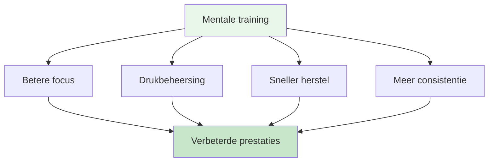

# Mentale reis voor beginners

<AdBanner />

## Welkom bij jouw reis naar een betere mentale training.

Of je nu een speler bent die zijn mentale spel wil verbeteren of een coach die mentale training wil introduceren bij zijn team, deze gids helpt je de eerste stappen te zetten in de wereld van de sportpsychologie voor pétanque.

::: tip Voor wie is dit bedoeld?
- **Spelers** die het mentale spel willen begrijpen
- **Coaches** introduceren mentale training bij hun teams.
- **Clubs** die workshops over mentale training organiseren
- **Iedereen** die nieuwsgierig is naar de psychologie van pétanque
:::

## Sneltoegang

| Bron | Doel | Toegang |
|----------|---------|--------|
| **Aan de slag** | Inleiding tot mentale spelconcepten | [Lees hieronder](#waarom-mentale-training-belangrijk-is) |
| **Sessiehandleiding** | Complete handleiding voor workshopleiders (2-3 uur) | [Bekijk de handleiding](/en/mental-journey/session-guide) |
| **Materialen** | Deelnemershandleidingen, dia&#39;s en werkbladen | [Materialen bekijken](/en/mental-journey/materials) |
| **Gerelateerde handleidingen** | Geavanceerde formaten | [Workshop](/en/workshop) • [Trainingskamp](/en/training-camp) |

## Waarom mentale training belangrijk is

Op elk niveau van pétanque heeft je mentale instelling invloed op je prestaties. De meeste spelers richten zich echter voor 90% op techniek en slechts voor 10% op mentale vaardigheden. Deze gids helpt je om die balans te vinden.

## Wat je zult leren

### Voor spelers

**Kernconcepten:**
1. **De Zone** - Inzicht in flowtoestanden en hoe je ze kunt bereiken
2. **De innerlijke criticus** - Negatieve zelfpraat herkennen en beheersen
3. **Drukrespons** - Waarom je anders speelt tijdens een wedstrijd
4. **De Omschakeling** - Van denken naar doen

**Praktische vaardigheden:**
- Eenvoudige routine vóór de opname
- 3-ademhaling resettechniek
- Foutcorrectieprotocol
- Focusankers voor de wedstrijd

### Voor coaches/gidsen

**Hoe te begeleiden:**
1. Het creëren van psychologische veiligheid
2. Het leiden van groepsdiscussies
3. De theorie met de praktijk verbinden.
4. Omgaan met verschillende persoonlijkheden

**Sessie-opzet:**
- Workshopformaat van 2-3 uur
- Discussievragen en oefeningen
- Downloadbaar materiaal
- Vervolgactiviteiten

<AdInArticle />

## Aan de slag

### Optie 1: Zelfstudie (voor spelers)

**Week 1: De basisbeginselen begrijpen**
1. Lees de module [The Zone](/en/education/the-zone/).
2. Probeer de resettechniek met 3 ademhalingen.
3. Let op wanneer je in de &quot;technische modus&quot; bent en wanneer in de &quot;flowmodus&quot;.

**Week 2: Bewustwording creëren**
1. Lees de module [Mentale Kracht](/en/education/mental-strength/).
2. Identificeer je innerlijke criticuspatronen.
3. Oefen neutrale observatie na gemaakte fouten.

**Week 3: Structuur creëren**
1. Lees de module [Mindfulness](/en/education/mindfulness/).
2. Begin met een dagelijkse oefening van 5 minuten.
3. Ontwikkel een eenvoudige routine voor de voorbereiding op de opname.

**Week 4: Integratie**
1. Breng je routine in de praktijk
2. Houd je mentale prestaties bij in [Dagboeksjabloon](/en/diary-template)
3. Stel mentale speldoelen op met behulp van [Doelsjabloon](/en/goal-template)

### Optie 2: Groepsworkshop (voor coaches)

**Voer een sessie van 2-3 uur uit:**

Gebruik onze uitgebreide [Sessiehandleiding](/en/mental-journey/session-guide), die het volgende bevat:
- Volledige sessiestructuur
- Discussievragen
- Groepsoefeningen
- Downloadbaar materiaal

**Wat je nodig hebt:**
- 6-12 deelnemers
- Rustige ruimte met zitgelegenheid in een kring.
- Whiteboard of flipchart
- Scherm of projector voor het delen van materiaal.
- 2-3 uur ononderbroken tijd

## De drie pijlers van mentale training

### 1. Bewustwording
**Wat het is:** Je gedachten, gevoelens en patronen observeren

**Waarom dit belangrijk is:** Je kunt niets veranderen als je het niet opmerkt.

**Hoe te ontwikkelen:**
- Dagelijkse mindfulness-oefening (5-10 minuten)
- Reflectie na de wedstrijd
- Een trainingsdagboek bijhouden

### 2. Acceptatie
**Wat het is:** Gedachten en gevoelens toelaten zonder oordeel

**Waarom het belangrijk is:** Het bestrijden van je innerlijke gevoelens creëert spanning.

**Hoe te ontwikkelen:**
- Neutrale observatiepraktijk
- Innerlijke coach versus innerlijke criticus
- Het loslaten van perfectionisme

### 3. Actie
**Wat het is:** Helpende reacties kiezen ondanks moeilijke gedachten.

**Waarom het belangrijk is:** Mentale training draait om goed presteren ondanks zenuwen.

**Hoe te ontwikkelen:**
- Voorbereidingsroutines
- Resetprotocollen
- Druksimulatie in de training

## Veelgestelde vragen

### &quot;Ik ben niet goed genoeg om me zorgen te hoeven maken over mentale training.&quot;
Mentale training is op elk niveau nuttig. Sterker nog, vroeg beginnen zorgt voor betere gewoonten. Je hoeft geen topsporter te zijn om te profiteren van inzicht in je eigen geest.

### &quot;Is dit niet gewoon &#39;positief denken&#39;?&quot;
Nee. Mentale training gaat over goed presteren ondanks negatieve gedachten, niet over het elimineren ervan. Het zijn praktische vaardigheden, geen positief denken.

### &quot;Hoe lang duurt het voordat de resultaten zichtbaar zijn?&quot;
Sommige technieken (zoals de 3-ademhaling reset) werken direct. Diepere veranderingen (zoals consistente flow-toestanden) vergen 2-3 maanden oefening.

### &quot;Heb ik een sportpsycholoog nodig?&quot;
Niet per se. Deze handleiding biedt praktische hulpmiddelen die je direct kunt gebruiken. Professionele hulp is waardevol voor complexere problemen, maar de meeste spelers kunnen zelfstandig aan de slag.

### &quot;Zal dit mijn techniek verbeteren?&quot;
Mentale training vervangt technische oefening niet. Maar het helpt je wel om je techniek consistent toe te passen, vooral onder druk.

## Beschikbare bronnen

### Voor spelers
- [Onderwijsmodules](/en/education/) - 8 uitgebreide handleidingen
- [Doelsjabloon](/en/goal-template) - Structureer je ontwikkeling
- [Dagboeksjabloon](/en/diary-template) - Houd je voortgang bij
- [Casestudies](/en/case-studies) - Echte voorbeelden

### Voor coaches/gidsen
- [Sessiehandleiding](/en/mental-journey/session-guide) - Complete workshop van 2-3 uur
- [Materialen voor begeleiders](/en/mental-journey/materials) - Digitale handleidingen en dia&#39;s
- [Workshophandleiding](/en/workshop) - Gevorderd 3-4 uur format
- [Trainingskampgids](/en/training-camp) - Weekendprogramma

## Volgende stappen

### Voor individuele spelers
1. **Begin met bewustwording** - Lees [The Zone](/en/education/the-zone/)
2. **Probeer één techniek** - Gebruik deze week de reset met 3 ademhalingen.
3. **Houd je ervaring bij** - Let op welke veranderingen er optreden
4. **Bouw geleidelijk op** - Voeg elke week één nieuwe vaardigheid toe.

### Voor coaches/groepen
1. **Lees de sessiehandleiding door** - Begrijp de structuur
2. **Download materialen** - Download handouts en presentaties
3. **Plan een sessie in** - Blokkeer 2-3 uur
4. **Bereid je voor** - Lees de aantekeningen van de begeleider.
5. **Voer de workshop uit** - Volg de handleiding

## Steun

**Vragen over hoe je aan de slag kunt?**
- E-mail: [patrik.wiik@gmail.com](mailto:patrik.wiik@gmail.com)
- Bekijk [Casestudies](/en/case-studies) voor voorbeelden
- Neem deel aan discussies in je club.

<AdBanner />

---

::: tip Klaar om te beginnen?
**Spelers:** Begin met de module [The Zone](/en/education/the-zone/).

**Coaches:** Ga naar [Sessiehandleiding](/en/mental-journey/session-guide)

**Download materialen:** Ga naar [Facilitatiematerialen](/en/mental-journey/materials)
:::

