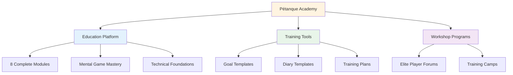
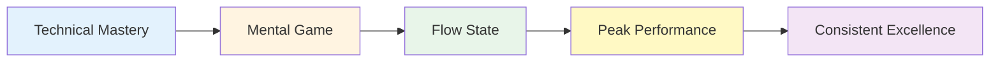

# Nieuws en updates

<AdBanner />

## Welkom bij de Pétanque Academie

::: tip Het platform is nu live! 🎉
**Pétanque Academy is nu volledig operationeel!**

We hebben een uitgebreid platform gelanceerd dat is ontworpen om top-pétanquespelers te helpen hun volledige potentieel te bereiken door middel van mentale beheersing, gestructureerde training en praktische hulpmiddelen.
:::

<AdInArticle />

## Wat is er nu beschikbaar?

### 📚 Compleet onderwijsplatform

We hebben **8 uitgebreide educatieve modules** gelanceerd die alles behandelen, van flow-ervaringen tot voeding:

| Module | Wat zit erin? | Belangrijkste kenmerken |
|--------|---------------|--------------|
| **[The Zone](/en/education/the-zone/)** | Beheersing van de flowtoestand | 4 gedetailleerde handleidingen voor het bereiken en behouden van een flow-ervaring. |
| **[Mental Strength](/en/education/mental-strength/)** | Drukbehandeling | Voorbereidingsroutines, omgaan met je innerlijke criticus |
| **[Mindfulness](/en/education/mindfulness/)** | Bewustzijn van het huidige moment | Dagelijkse oefeningen, wedstrijdtechnieken |
| **[Goals](/en/education/goals/)** | Strategische planning | SMART-doelen, hiërarchie, volgsystemen |
| **[Tactics](/en/education/tactics/)** | Spelstrategie | Besluitvorming, waarschijnlijkheid, positionering |
| **[Team Player](/en/education/team-player/)** | Samenwerkingsvaardigheden | Communicatie, vertrouwen, teamdynamiek |
| **[Training](/en/education/training/)** | Praktische methoden | Oefeningen, doelgerichte oefening, progressie |
| **[Nutrition](/en/education/nutrition/)** | Prestatiebrandstof | Bloedsuikerregulatie, wedstrijdvoeding |

### 🛠️ Praktische hulpmiddelen

**Kant-en-klare sjablonen en programma&#39;s:**

- **[Workshop](/en/workshop)** - Gestructureerde sessies van 3 uur voor mentale spelontwikkeling
- **[Trainingskamp](/en/training-camp)** - Intensieve weekendprogramma&#39;s voor topspelers
- **[Trainingssessie](/en/training-session)** - 2-3 uur aan oefenkaders
- **[Doelsjabloon](/en/goal-template)** - Compleet systeem voor het stellen en bijhouden van doelen
- **[Dagboeksjabloon](/en/diary-template)** - Dagboek voor dagelijkse oefening en reflectie

### 🎯 Technische begeleiding

De sectie **[Technisch advies](/en/technical/)** bevat:
- Complete gids voor alle pétanque-worpen
- Trajectselectiestrategieën
- Spincontroletechnieken
- Kaderwerken voor het selecteren van opnamen

### 🍽️ Voeding voor optimale prestaties

**[Eten](/en/food)** - Uitgebreide gids voor:
- Bloedsuikerregulatie voor een stabiele focus
- Voedingsstrategieën voorafgaand aan de wedstrijd
- Energieoptimalisatie voor toernooien

## Onze missie

::: tip Het volgende niveau
Topspelers beheersen de techniek al. De volgende doorbraak komt in het **mentale spel** - leren om in een flow-toestand te komen, met druk om te gaan en consistent op je best te presteren.

**Pétanque Academy biedt het complete stappenplan.**
:::

## Platformstatistieken

::: info Wat we hebben gebouwd
- ✅ **8 lesmodules** met meer dan 30 gedetailleerde handleidingen
- ✅ **5 praktische hulpmiddelen** die direct te gebruiken zijn
- ✅ **10 talen** - wereldwijd beschikbaar
- ✅ **Meer dan 100 pagina&#39;s** aan content van topniveau
- ✅ **Zeemeermindiagrammen** voor visueel leren
- ✅ **Kopieer en plak sjablonen** voor direct gebruik
:::

## Hoe begin je?

### Voor nieuwe bezoekers

**Begin met de basis:**

1. **[Ambitie](/en/ambitie)** - Begrijp de filosofie achter elite-ontwikkeling
2. **[De Zone](/en/education/the-zone/)** - Leer meer over flowtoestanden
3. **[Doelsjabloon](/en/goal-template)** - Stel je eerste gestructureerde doelen vast

### Voor ervaren spelers

**Duik in geavanceerde onderwerpen:**

1. **[Mentale kracht](/en/education/mental-strength/)** - Beheers situaties onder druk
2. **[Tactiek](/en/education/tactics/)** - Verfijn strategische besluitvorming
3. **[Workshop](/en/workshop)** - Implementeer gestructureerde mentale spelsessies

### Voor teams

**Streef naar collectieve excellentie:**

1. **[Teamspeler](/en/education/team-player/)** - Verbeter de teamdynamiek
2. **[Trainingskamp](/en/training-camp)** - Organiseer intensieve weekendtrainingen
3. **[Trainingssessie](/en/training-session)** - Structureer teampraktijken

## Wat maakt dit anders?

::: warning Waarom Pétanque Academy zich onderscheidt
**De meeste trainingen richten zich op techniek. Wij richten ons op wat topspelers daadwerkelijk nodig hebben:**

1. **Mentale spelbeheersing** - De echte onderscheidende factor op topniveau
2. **Praktische hulpmiddelen** - Niet alleen theorie, maar ook direct bruikbare sjablonen
3. **Gestructureerde programma&#39;s** - Duidelijke kaders voor workshops en kampen
4. **Op bewijs gebaseerd** - Gebaseerd op onderzoek naar sportpsychologie en flow-states.
5. **Gericht op de elite** - Ontworpen voor spelers die de basis al beheersen.
:::

## Doe mee!

**Wil je een bijdrage leveren of feedback geven?**

Bezoek onze **[Over ons](/en/about)**-pagina voor:
- Kom meer te weten over het platform.
- Deel je feedback
- Vraag specifieke inhoud aan
- Neem contact met ons op

---

::: tip Begin vandaag nog aan je reis.
Alles wat je nodig hebt om je game naar een hoger niveau te tillen, is hier al aanwezig. Kies een module, pak een sjabloon en begin met implementeren.

**Welkom bij de Pétanque Academie - waar topspelers uitzonderlijk worden.**
:::

<AdBanner />
