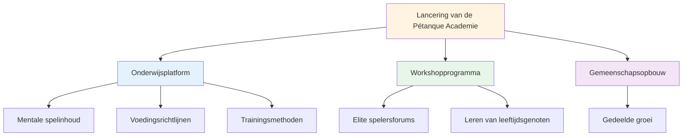
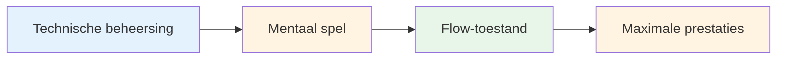

# Nieuws
<AdBanner />

## Welkom bij de Pétanque Academie

::: tip Een spannende lancering! 🎉
**Dit is de eerste startup!**

We zijn verheugd om Pétanque Academy te lanceren - een nieuw initiatief dat erop gericht is top-pétanquespelers te helpen hun volledige potentieel te bereiken.
:::

<AdInArticle />

## Wat staat ons te wachten?

::: info Blijf op de hoogte voor
- 📅 **Aankomende workshops** - Sessies in kleine groepen voor topspelers
- 📚 **Nieuwe educatieve content** - Mentale training, voeding, trainingsmethoden
- 🎯 **Community-evenementen** - Kom in contact met gelijkgestemde spelers
- 💡 **Verhalen en inzichten van spelers** - Leer van de ervaringen van anderen
:::

## Onze missie

::: tip Het volgende niveau
Topspelers beheersen de techniek al. De volgende doorbraak komt op mentaal vlak: leren om in een flow-toestand te komen, met druk om te gaan en consistent op je best te presteren.
:::

## Aan de slag

Terwijl u wacht op aankondigingen van workshops, kunt u onze uitgebreide educatieve sectie verkennen:

| Sectie | Wat je zult leren | Begin hier |
|---------|-------------------|------------|
| **De Zone** | Hoe je consistent in een flowtoestand terechtkomt | [Flow begrijpen](/en/education/the-zone/) |
| **Mentale kracht** | Omgaan met druk en routines opbouwen | [Mentale Spel](/en/education/mental-strength/) |
| **Mindfulness** | Bewustzijn van het huidige moment voor betere prestaties | [Mindfulnessoefening](/en/education/mindfulness/) |
| **Voeding** | Geef je hersenen de juiste brandstof voor een stabiele concentratie. | [Precision Nutrition](/en/education/nutrition/) |
| **Doelstellingen** | Stel zinvolle doelen en bereik ze. | [Doelstellingen formuleren](/en/education/goals/) |

::: info Ga mee op reis!
Dit is nog maar het begin. We bouwen iets bijzonders voor topspelers die de volgende stap willen zetten. Welkom bij de Pétanque Academy.
:::

<AdBanner />
