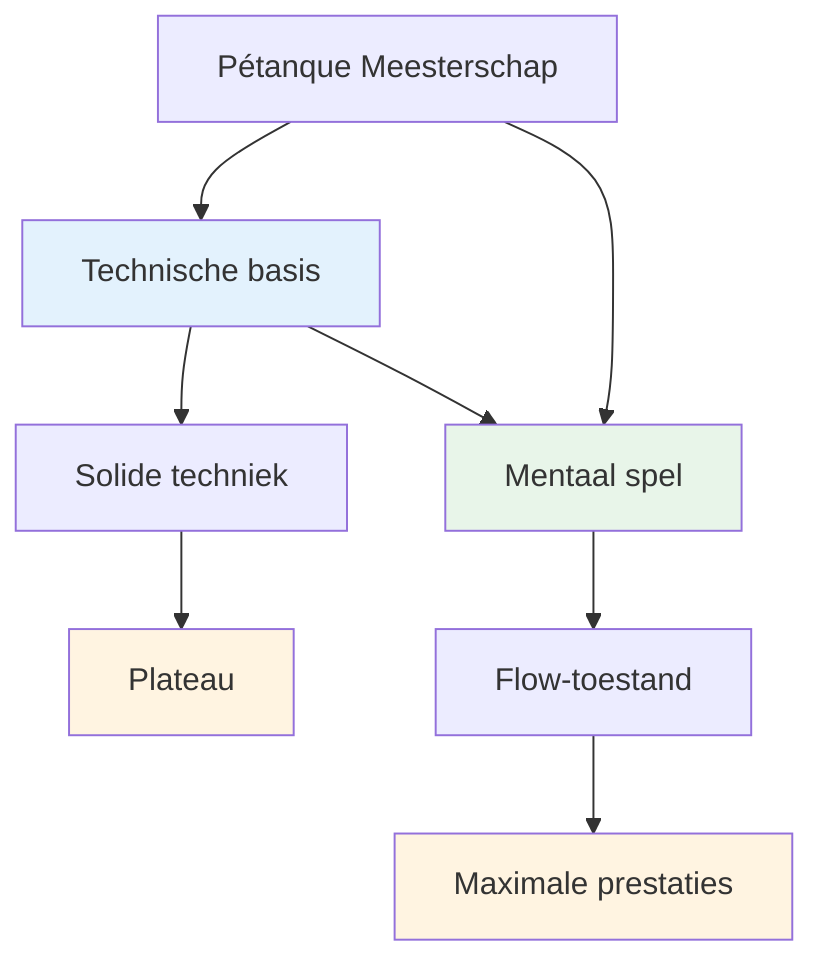

# Technisch advies
<AdBanner />

## Een opmerking over techniek

Hoewel onze primaire focus ligt op het mentale aspect en de flow-ervaring, erkennen we dat techniek de basis vormt waarop al het andere is gebouwd.

::: info Onze filosofie
**Techniek is de basis, maar flow is het plafond.** Je hebt een solide techniek nodig om het topniveau te bereiken, maar mentale beheersing is wat je verder brengt.
:::

## Ons perspectief

<AdInArticle />

::: tip Je hoeft niet alles te beheersen.
**Je hoeft niet alle technieken te beheersen**, maar inzicht in alle mogelijkheden helpt je wel:

- ✅ Weet wat mogelijk is
- ✅ Maak weloverwogen keuzes over wat je wilt ontwikkelen
- ✅ Beleef het spel op een dieper niveau.
- ✅ Begrijp wat topspelers kunnen doen
:::

::: info Het doel
Als je een technische focus hebt en je repertoire wilt uitbreiden, beschrijft dit gedeelte het einddoel: het complete scala aan worpen dat een pétanque-speler tot zijn beschikking heeft.

**Onthoud:** Het doel is niet om alles te beheersen. Het doel is om een voldoende technische basis te hebben, zodat je in de juiste flow kunt komen en je lichaam op natuurlijke wijze de juiste worp kan kiezen.
:::

## Onderwerpen

### [Palet van worpen](/en/technical/throws)
Welke worpen zijn er allemaal mogelijk? Een uitgebreid overzicht van de technische mogelijkheden bij pétanque.

::: tip Wat komt er na de techniek?
Als je eenmaal een solide techniek beheerst, komt de echte groei voort uit:
- **[De Zone](/en/education/the-zone/)** - Toegang tot flowtoestanden
- **[Mentale kracht](/en/education/mental-strength/)** - Omgaan met druk
- **[Trainingsmethoden](/en/education/training/)** - Hoe effectief te oefenen
:::

<AdBanner />
