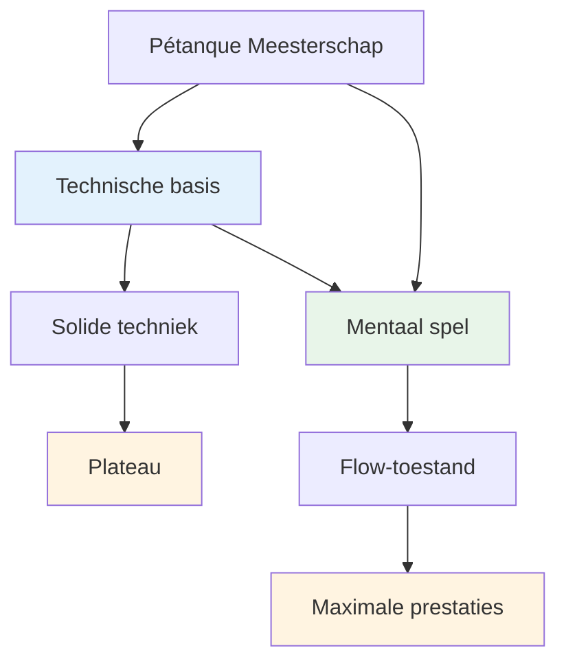
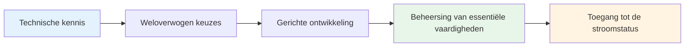

# Technisch advies

## Een opmerking over techniek

Hoewel onze primaire focus ligt op het mentale aspect en de flow-ervaring, erkennen we dat techniek de basis vormt waarop al het andere is gebouwd.

::: info Onze filosofie
**Techniek is de basis, maar flow is het plafond.** Je hebt een solide techniek nodig om het topniveau te bereiken, maar mentale beheersing is wat je verder brengt.
:::

## De meest voorkomende fout in technische training

::: info Deze sectie is voor ervaren spelers.
Als je nieuw bent in de wereld van pétanque, zul je natuurlijk je basistechniek helemaal vanaf de basis moeten ontwikkelen – en dat is een heel ander proces.

**Dit advies is voor spelers die al jaren spelen** en een gevestigde techniek hebben die natuurlijk, ontspannen en betrouwbaar aanvoelt. Je hebt je eigen manier van gooien gevonden. De vraag is nu: hoe ontwikkel je je verder?
:::

::: warning De veelvoorkomende valstrik
Wanneer ervaren spelers zich willen verbeteren, gaan ze vaak terug naar de basis: het aanpassen van hun grip, armzwaai, afwerppunt en lichaamshouding. Urenlang oefenen. Eindeloos bijstellen.

**Maar ze hebben de belangrijkste vraag overgeslagen:** Wat wil je precies dat de boule doet?
:::

Voordat je aan je techniek begint, moet je duidelijk voor ogen hebben welk **resultaat** je wilt bereiken. Niet &quot;Ik wil meer slagen maken&quot; of &quot;Ik wil consistenter zijn&quot; – dat zijn geen resultaten, maar wensen.

Een echt resultaat ziet er als volgt uit:
- &quot;Ik wil een hoge lob die binnen 20 cm van de landingsplaats stopt.&quot;
- &quot;Ik wil een vloeiende opname die naar links afbuigt op dit soort terrein.&quot;
- &quot;Ik wil een zachte devant-shot die de boule nauwelijks raakt.&quot;

**Verken eerst het [Palet van Werptechnieken](/nl/technical/throws)** om te begrijpen wat er mogelijk is. Bepaal vervolgens welke specifieke worp je aan je repertoire wilt toevoegen. Pas daarna kun je beginnen met het oefenen van de juiste bewegingen van je arm, pols en lichaam om dat resultaat te bereiken.

## De juiste manier om aan je techniek te werken

We zeggen niet dat je nooit aan je arm, pols, release of lichaamshouding moet werken. **Technische training op uitvoering is absoluut waardevol** — maar het moet wel een goed doel dienen.

::: info Het juiste doel voor technisch werk
**Correcte bedoeling:** "Ik wil een nieuwe worp aan mijn repertoire toevoegen"

**Verkeerd doel:** "Ik wil meer schoten raken" of "Ik wil consistenter zijn"
:::

Dit is de procedure:

1. **Verken het [Palet van Werptechnieken](/nl/technical/throws)** — Bepaal welke worp of techniek je aan je repertoire wilt toevoegen.
2. **Visualiseer het resultaat** — Wat moet de boule doen? Welke baan, landing, draaiing en gedrag heb je nodig?
3. **Werk vervolgens aan de uitvoering** — Nu kun je je concentreren op de arm-, pols- en lichaamshouding en de ontspanning om dat specifieke resultaat te bereiken.

Deze aanpak geeft je technische training **duidelijke richting en meetbare vooruitgang**. Je bent niet zomaar aan het &quot;oefenen&quot;, maar je breidt je vaardigheden doelbewust uit.

::: tip Voorbeeld: Een plombe toevoegen
**Doel:** Een dropshot (plombée) toevoegen aan je aanwijsrepertoire.

**Resultaatvisualisatie:** De boule moet een hoge boog maken, zachtjes landen met backspin en vrijwel direct tot stilstand komen.

**Technische focus:** Hoger afwerppunt, meer polsbeweging voor backspin, soepelere grip

**Succesmaatstaf:** Kun je deze worp uitvoeren wanneer je dat wilt? Dat is het doel.
:::

## Betere schoten versus meer schoten: het verschil begrijpen

Er is een cruciaal onderscheid dat veel spelers over het hoofd zien:

::: tip Het belangrijkste inzicht
**Wil je BETERE foto&#39;s maken?** → Werk aan je techniek

**Wil je MEER schoten maken?** → Werk aan je mentale kracht
:::

### Wat betekent dit?

**Betere schoten maken** betekent je technische vaardigheden uitbreiden:
- Nieuwe soorten worpen toevoegen (plombée, portée, demi-portée)
- Verbetering van de precisie bij specifieke schottypen
- Het ontwikkelen van nieuwe vaardigheden die je momenteel nog niet bezit.
- **Dit vereist technische vaardigheid en fysieke training.**

**Meer schoten maken** betekent uitvoeren wat je al kunt:
- Het oefenen van de slagen die je al goed kunt maken.
- Consistent presteren onder druk
- Vertrouwen op je techniek wanneer het erop aankomt.
- **Dit vereist mentale training en toegang tot een flowtoestand.**

### De realiteitscheck

Stel jezelf de volgende eerlijke vraag:
- Kun je de slag oefenen terwijl je ontspannen bent? ✅ **Dan beheers je de techniek**
- Heb je moeite om te presteren in wedstrijden? ⚠️ **Dan heb je mentale training nodig, niet meer technische oefeningen.**

::: warning Veelgemaakte fout
Veel ervaren spelers besteden jaren aan het verfijnen van hun bestaande techniek, terwijl ze in werkelijkheid de mentale kracht moeten ontwikkelen om die techniek onder druk uit te voeren.

**Je hebt geen betere armzwaai nodig. Je hebt een rustiger hoofd nodig.**
:::

### De weg vooruit

**Voor betere foto&#39;s (nieuwe mogelijkheden):**
- Verken het [Palet van worpen](/nl/technical/throws)
- Kies een specifieke nieuwe worp om te ontwikkelen.
- Oefen de technische uitvoering.

**Voor meer foto&#39;s (consistentie onder druk):**
- Werk aan [Mentale Kracht](/nl/education/mental-strength/)
- Leer hoe je toegang krijgt tot [The Zone](/nl/education/the-zone/)
- Ontwikkel [routines voor de vaccinatie](/nl/education/mental-strength/pre-shot-routine)

## Ons perspectief

::: tip Je hoeft niet alles te beheersen.
**Je hoeft niet alle technieken te beheersen**, maar inzicht in alle mogelijkheden helpt je wel:

- ✅ Weet wat mogelijk is
- ✅ Maak weloverwogen keuzes over wat je wilt ontwikkelen
- ✅ Beleef het spel op een dieper niveau
- ✅ Begrijp wat topspelers kunnen doen
:::

::: info Het doel
Als je een technische focus hebt en je repertoire wilt uitbreiden, beschrijft dit gedeelte het einddoel: het complete scala aan worpen dat een pétanque-speler tot zijn beschikking heeft.

**Onthoud:** Het doel is niet om alles te beheersen. Het doel is om een voldoende technische basis te hebben, zodat je in de juiste flow kunt komen en je lichaam op natuurlijke wijze de juiste worp kan kiezen.
:::

## Onderwerpen

### [Palet van worpen](/nl/technical/throws)
Welke worpen zijn er allemaal mogelijk? Een uitgebreid overzicht van de technische mogelijkheden bij pétanque.

::: tip Wat komt er na de techniek?
Als je eenmaal een solide techniek beheerst, komt de echte groei voort uit:
- **[De Zone](/nl/education/the-zone/)** - Toegang tot flowtoestanden
- **[Mentale kracht](/nl/education/mental-strength/)** - Omgaan met druk
- **[Trainingsmethoden](/nl/education/training/)** - Hoe effectief te oefenen
:::

