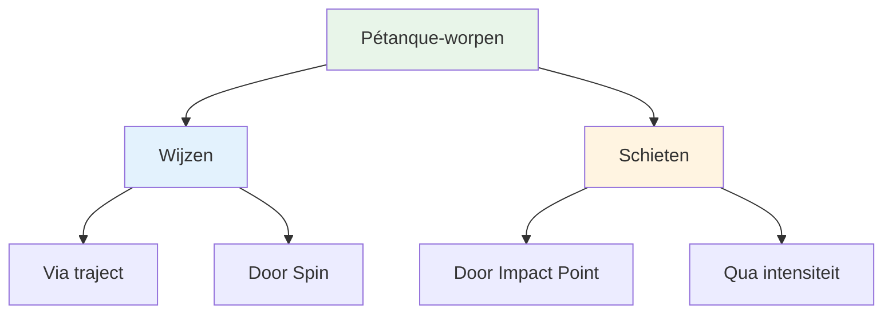
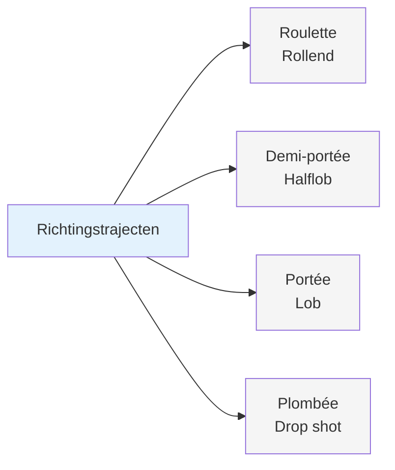
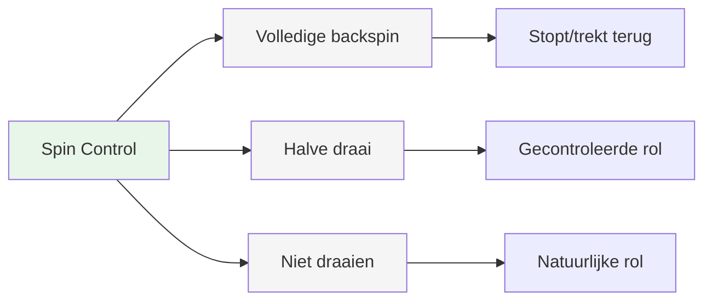
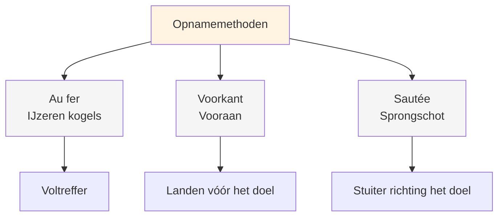
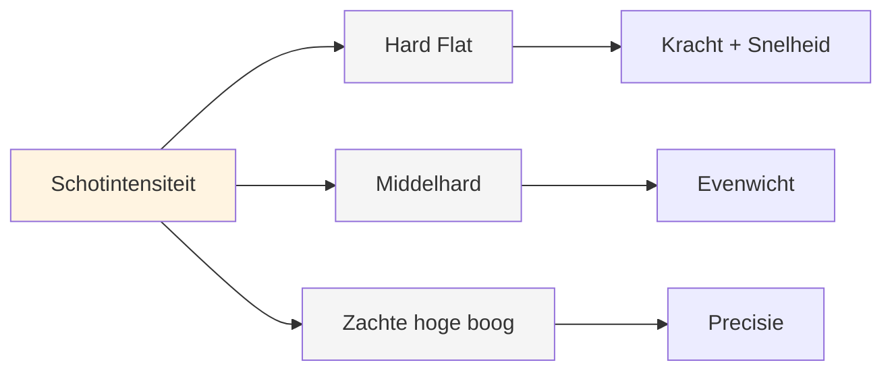
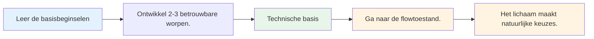

# Kleurenpalet van plaids

## Het complete technische repertoire

Dit is een overzicht van de worpen die je bij pétanque kunt gebruiken. Je hoeft ze niet allemaal te beheersen, maar als je weet welke worpen er zijn, begrijp je de volledige mogelijkheden van het spel beter.

::: tip Het grote geheel
**Inzicht in het volledige palet helpt je weloverwogen keuzes te maken over wat je wilt ontwikkelen.** Je hoeft niet alles te beheersen - focus op wat werkt voor jouw spel.
:::

## Aanwijstechnieken

### Via traject

| Gooien | Franse term | Traject | Wanneer te gebruiken |
|-------|-------------|------------|-------------|
| **Aan het rollen** | Roulette | Laag, rolt het grootste deel van de weg | Vlak terrein, korte afstand |
| **Half-lob** | Demi-portée | Middelgroot, landt halverwege | Meest voorkomend, veelzijdig |
| **Lob** | Portée | Hoog, landt in de buurt van het doelwit | Obstakels, ruig terrein |
| **Dropshot** | Plombée | Zeer hoog, valt verticaal naar beneden. | Nauwkeurige plaatsing in krappe ruimtes |

### Door Spin

| Spintype | Effect op de landing | Wanneer te gebruiken |
|-----------|-------------------|-------------|
| **Volledige spin (achterwaartse spin)** | Stopt of trekt zich terug bij de landing | Snel stoppen, voorkom dat je er voorbij rolt |
| **Halve draai** | Matige backspin, gecontroleerde rol | Meest veelzijdig, voorspelbaar |
| **Geen spin** | Neutrale, natuurlijke rolbeweging bij de landing. | Laat het terrein de rol bepalen |

## Opnametechnieken

### Door Impact Point

| Techniek | Franse term | Impactpunt | Kenmerken |
|-----------|-------------|--------------|-----------------|
| **IJzeren kogel** | Au fer | Een directe worp op de boule. | Meestal gaat het om schoon contact. |
| **Vooraan** | Voorkant | Landing vlak voor het doel. | Veiliger, minder precisie nodig |
| **Sprongschot** | Sautée | Met een stuiterende beweging richting het doel. | Gevorderd, voor obstakels |

### Qua intensiteit

| Intensiteit | Traject | Wanneer te gebruiken |
|-----------|------------|-------------|
| **Hard en vlak schot** | Direct, krachtig, vlak | Duidelijke lijn, afstand nodig bij het raken. |
| **Middelhard** | Evenwichtige kracht en controle | Meest veelzijdig |
| **Zachte voetboog met hoge voetboog** | Lob shot, valt van bovenaf | Obstakels, krappe ruimtes |

## Het complete palet

::: details Snel naslagwerk: Alle worpen
**Aanwijzen:**
- Roulette (rollen)
- Demi-portée (half-lob)
- Portée (lob)
- Plombée (drop shot)
- Volledige draai / Halve draai / Geen draai

**Opnames:**
- Au fer (ijzeren kogel)
- Devant (vooraan)
- Sautée (sprongschot)
- Hard plat / Medium / Zachte hoge boog
:::

## Meesterschapspad

::: tip Herinneren
**Het doel is niet om alles te beheersen.** Het gaat erom een voldoende technische basis te hebben, zodat je in de juiste flow kunt komen en je lichaam op natuurlijke wijze de juiste worp kan kiezen.

Focus op:
1. **2-3 aanwijstechnieken** waarop je kunt vertrouwen
2. **1-2 opnamemethoden** die voor jou werken
3. **Consistente uitvoering** onder druk
4. **Mentale oefening** om de flowtoestand te bereiken
:::

::: info Volgende stappen
Als je eenmaal een solide techniek beheerst, komt de echte groei voort uit:
- **[De Zone](/en/education/the-zone/)** - Consistent toegang krijgen tot flow-toestanden
- **[Trainingsmethoden](/en/education/training/)** - Hoe effectief te oefenen
- **[Mentale kracht](/en/education/mental-strength/)** - Presteren onder druk
:::

