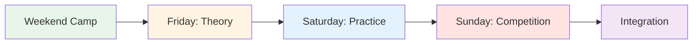
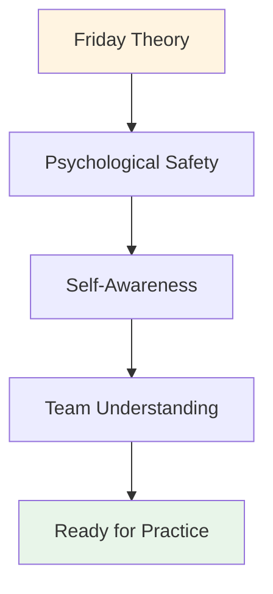

# Trainingskamp: Weekendgids

## Hoe organiseer je een weekendtrainingskamp voor 10-20 spelers?

Deze uitgebreide gids helpt je bij het organiseren en uitvoeren van een trainingsweekend waarin theorie, praktijk en competitie gecombineerd worden. Combineer de mentale aspecten van deze website met de toepassing ervan op de piste voor maximaal effect.

::: tip De trainingskampfilosofie
**Theorie zonder praktijk is slechts informatie. Praktijk zonder theorie is slechts herhaling. Competitie zonder reflectie is slechts spelen.** Dit weekend worden alle drie gecombineerd voor een transformerende leerervaring.
:::

## Voorbereiding op het kamp

### Groepsgrootte en -structuur

**Optimaal:** 10-20 spelers
- **Klein kamp (10-12 personen):** Intiemere, diepgaande uitwisseling.
- **Groot kamp (16-20 personen):** Meer diverse perspectieven, vereist subgroepen.

**Teamstructuur:**
- Verdeel je in teams van 3-4 personen voor de training en de wedstrijd.
- Mix van verschillende vaardigheidsniveaus en speelstijlen
- Wissel de teams gedurende het weekend.

### Personeelsbehoeften

| Rol | Verantwoordelijkheden | Aantal |
|------|------------------|----------|
| **Coördinator Mentale Prestaties** | Begeleiden van theoriesessies en groepsdynamiek | 1 |
| **Technische coach** | Begeleiden van de training, feedback geven | 1-2 |
| **Wedstrijdleider** | Toernooi organiseren, logistiek regelen | 1 |
| **Ondersteunend personeel** | Maaltijden, voorbereiding, administratie | 1-2 |

### Locatievereisten

::: info over faciliteitsbehoeften
**Piste:**
- Meerdere terreinen (minimaal 3-4 pistes)
- Verschillende ondergronden indien mogelijk (grind, zand, harde ondergrond)
- Verlichting voor avondspel

**Binnenruimte:**
- Ruimte voor 20 personen in een kringopstelling (theoriesessies)
- Gescheiden van de piste
- Whiteboard/projector
- Comfortabele zitplaatsen

**Accommodatie:**
- Op locatie of in de buurt (op loopafstand)
- Gedeelde kamers bevorderen onderlinge banden.
- Een rustige plek om te reflecteren

**Catering:**
- Maaltijden met de nadruk op voeding (zie [Voedingsgids](./food))
- Voorkom suikerdips
- Hydratatiestations
:::

### Materialenlijst

::: details Complete materiaallijst
**Theoriesessies:**
- [ ] Stoelen voor een kring (geen tafels)
- [ ] Jeu de boules en cochonnet voor het midden
- [ ] Flipcharts en stiften
- [ ] Plakbriefjes
- [ ] Werkbladen (Gebruikershandleiding, Innerlijke Criticus, enz.)
- [ ] Papier en pennen
- [ ] Projector (voor websitecontent)

**Oefensessies:**
- [ ] Meetlint
- [ ] Kegels/markeringen voor oefeningen
- [ ] Videocamera/statief
- [ ] Klembord en papier (voor het bijhouden van gegevens)
- [ ] Fluit

**Concurrentie:**
- [ ] Scoreformulieren
- [ ] Toernooischema
- [ ] Prijzen/erkenning
- [ ] EHBO-kit

**Logistiek:**
- [ ] Naamlabels
- [ ] Deelnemerslijst met contactpersonen
- [ ] Contactgegevens voor noodgevallen
- [ ] Waterflessen
- [ ] Zonnebrandcrème
- [ ] Zakdoekjes (voor emotioneel werk!)
:::

## Weekendprogramma

### Vrijdagavond (3 uur)

**18:00-18:30 - Aankomst en welkom**
- Inchecken
- Kamerindeling
- Overzicht van het weekend

**18:30-19:30 - Diner**
- Maaltijd met focus op voeding
- Informele kennismakingen

**19:30-22:30 - Theoriesessie: Basisprincipes**

Gebruik de [Workshopgids](./workshop) voor gedetailleerde instructies:

1. **Basisregels (15 min)** - Zorg voor psychologische veiligheid
2. **Check-in matrix (20 min)** - Beoordeel de energie van de groep
3. **De ijsberg (30 min)** - Verken je innerlijke gedachten
4. **Gebruikershandleiding (45 min)** - Bevorder teaminzicht
5. **Angst in een hoed (45 min)** - Doorbrek de isolatie.
6. **Uitchecken (15 min)** - Rond de cirkel af

**22:30 - Vrije tijd**
- Informeel sociaal contact
- Rust en bezinning

### Zaterdag (hele dag - theorie + praktijk)

**08:00-09:00 - Ontbijt &amp; Mindfulness**
- Rustig ontbijt
- Optionele begeleide meditatie van 15 minuten
- Stel je intenties voor de dag vast

**09:00-10:30 - Theoriesessie: Inhoud verbinden met ervaring**

Kies 3-4 onderwerpen van de Academy-website en verken het innerlijke spel:

**Voorbeelden van onderwerpen:**

1. **[Voeding](./education/nutrition/)** (20 min)
   - &quot;Hoe verandert je voedselkeuze onder druk?&quot;
   - &quot;Eet je wat je lichaam nodig heeft of wat je angst je ingeeft?&quot;
   - Oefening: Plan je voeding op de wedstrijddag.

2. **[Mentale kracht](./education/mental-strength/)** (25 min)
   - &quot;Wat is jouw relatie met falen?&quot;
   - &quot;Hoe praat je tegen jezelf na een gemiste kans?&quot;
   - Activiteit: Herformuleer je innerlijke criticus naar je innerlijke coach

3. **[Mindfulness](./education/mindfulness/)** (25 min)
   - &quot;Waar gaan je gedachten heen tijdens de pauze voordat je gooit?&quot;
   - &quot;Wat haalt je uit het huidige moment?&quot;
   - Oefening: 5 minuten lichaamsscan

4. **[Tactieken](./education/tactics/)** (20 min)
   - &quot;Is je schotkeuze gebaseerd op strategie of angst?&quot;
   - &quot;Wanneer kies je voor de veilige optie en wanneer neem je risico&#39;s?&quot;
   - Bespreking: Risicoprofielen binnen de groep

**10:30-10:45 - Pauze**

**10:45-12:30 - Integratie op de piste: Oefeningen met mentale focus**

**Oefening 1: Bepaal je schot (30 min)**

Uit de [Workshophandleiding](./workshop) - oefen met het erkennen van intentie en twijfel:

1. Kondig het doel aan: &quot;Ik schiet op het ijzeren geweer&quot;
2. Geef aan hoe zelfverzekerd ik ben: &quot;Ik geef mezelf een 7 op 10&quot;.
3. Benoem de innerlijke gedachte: &quot;Mijn innerlijke stem maakt zich zorgen over backspin&quot;
4. Voer het schot uit
5. Reflecteer: &quot;Wat is er gebeurd? Wat heb je ervan geleerd?&quot;

**Oefening 2: Cognitieve interferentie (30 min)**

Test of de techniek automatisch is geworden:
- De coördinator stelt complexe vragen terwijl de speler schiet.
- &quot;Noem 5 hoofdsteden&quot; of &quot;Tel terug vanaf 100 met stappen van 7&quot;
- Succes = de techniek is impliciet, niet bewust verwerkt

**Oefening 3: Oefening met de gebruikershandleiding (30 min)**

Gebruik de gebruikershandleidingen vanaf vrijdag:
- Speel in teams van 3
- Na elk schot reageren teamgenoten volgens de gebruikershandleiding.
- &quot;Marc heeft stilte nodig na een gemiste kans&quot; - het team respecteert dat.
- Nabespreking: &quot;Hoe voelde het om begrepen te worden?&quot;

**12:30-14:00 - Lunch &amp; Rust**
- Maaltijd met focus op voeding
- Rustig moment om na te denken
- Optioneel: Individuele contactmomenten met de coördinator

**14:00-17:00 - Oefensessie: Terreinaanpassing**

**Doel:** Aanpassingsvermogen en mentale flexibiliteit ontwikkelen

**Installatie:**
- Roteer door 3-4 verschillende terreinen/pistes
- 45 minuten per terrein
- Focus op mentale aanpassing, niet alleen op technische aanpassing.

**Rotatiestructuur:**

| Terrein | Mentale focus | Oefening |
|---------|--------------|----------|
| **Terrein 1: Zacht/Zand** | Acceptatie van onzekerheid | &quot;De donnée - accepteer wat is&quot; |
| **Terrein 2: Hard/Grind** | Precisie onder druk | &quot;Vertrouw op je techniek&quot; |
| **Terrein 3: Oneffen** | Emotionele regulatie | &quot;Blijf kalm als het oneerlijk is&quot; |
| **Terrein 4: Competitie** | Toegang tot de flow-toestand | &quot;Vind de zone&quot; |

**Begeleiding:**
- De technische coach geeft feedback op de techniek.
- MPC vraagt: &quot;Wat speelt er zich op dit moment in je gedachten af?&quot;
- Spelers houden een logboek bij tussen de rotaties.

**17:00-18:00 - Pauze &amp; Reflectie**
- Individueel dagboek bijhouden
- &quot;Wat heb je vandaag over jezelf geleerd?&quot;
- &quot;Wat ga je morgen anders doen?&quot;

**18:00-19:00 - Diner**

**19:00-21:00 - Avondtheorie: Diepe kwetsbaarheid**

**Activiteit 1: De innerlijke criticus herkaderen (45 min)**

Zie [Workshophandleiding](./workshop) voor het volledige protocol:
1. Identificeer de exacte formulering van de criticus.
2. Herformuleer jezelf als innerlijke coach.
3. Praktijk in samenwerking met een partner

**Activiteit 2: Wedstrijdvoorbereiding (45 min)**

Morgen is de wedstrijddag. Bereid je mentaal voor:

1. **Visualisatie (15 min)**
   - Sluit je ogen
   - Stel je de perfecte foto voor
   - Voel het zelfvertrouwen
   - Merk de rust op

2. **Teamprotocollen (20 min)**
   - Creëer signalen voor ondersteuning
   - &quot;Ik heb een reset nodig&quot; = touch boules
   - &quot;Ik heb aanmoediging nodig&quot; = vuistje
   - &quot;Ik heb ruimte nodig&quot; = een stap terug

3. **Intenties vaststellen (10 min)**
   - &quot;Morgen zal ik me concentreren op...&quot;
   - &quot;Mijn doel is niet om te winnen, maar om...&quot;
   - &quot;Ik ga oefenen...&quot;

**Uitchecken (30 min)**
- Deel één angst voor morgen
- Deel één intentie
- Groepsondersteuning

**21:00 - Vrije tijd**
- Vroeg naar bed (morgen een wedstrijd!)
- Stille reflectie

### Zondag (Wedstrijddag)

**08:00-09:00 - Ontbijt &amp; mentale voorbereiding**
- Licht ontbijt (zie [Voedingsgids](./education/nutrition/))
- 15 minuten mindfulness-oefening
- Teamoverleg

**09:00-09:30 - Briefing over de wedstrijd**

**Format:** Round-robin toernooi
- Teams van 3
- Speel tot 13 punten
- Iedereen speelt tegen iedereen
- Focus op het proces, niet op het resultaat

**De twist: Beoordeling op basis van mentale prestaties**

::: tip Dubbel scoresysteem
**Traditioneel:** Punten gewonnen
**Mentale prestaties:** Beoordeeld door MPC

Mentale prestatiepunten (0-5 per wedstrijd):
- Gebruikte gebruikershandleiding
- Teamgenoten effectief ondersteund
- Innerlijke criticus onder controle gehouden
- Bleef in het moment (bleef niet stilstaan bij eerdere gebeurtenissen)
- Aangetoond psychologische veiligheid

**Winnaar:** Beste gecombineerde score (traditioneel + mentaal)
:::

**09:30-13:00 - Ochtendwedstrijd**
- Round-robin wedstrijden
- MPC observeert en scoort
- De technisch coach geeft tussen de wedstrijden door korte feedback.
- Hydratatie- en snackpauzes

**13:00-14:00 - Lunch**
- Voedingsgericht
- Informele reflectie
- Rest

**14:00-17:00 - Middagwedstrijd**
- Ga door met de round-robin
- Halve finales en finales
- Toenemende druk
- Pas de geleerde lessen van vanochtend toe

**17:00-17:30 - Prijsuitreiking en erkenning**

**Categorieën:**
- Traditionele winnaar
- Winnaar mentale prestaties
- Meest verbeterd
- Beste teamgenoot
- Moedprijs (meest kwetsbaren)

**17:30-19:00 - Eindreflectiesessie**

**Cruciaal:** Hier wordt het geleerde verankerd.

**Structuur:**

**1. Individuele reflectie (15 min)**
Schrijf in je dagboek:
Wat heb je dit weekend over jezelf geleerd?
- Wat heeft je verrast?
- Wat ga je anders doen?
- Wat neem je mee naar huis?

**2. Delen in kleine groepjes (30 min)**
Groepen van 4-5 personen:
- Deel belangrijke inzichten
Wat sprak je het meest aan?
Wat was het moeilijkst?
Wat was het meest waardevol?

**3. Volledige groepsintegratie (30 min)**
Vorm een kring:
- Iedereen deelt ÉÉN belangrijk inzicht.
- MPC valideert en verbindt thema&#39;s
- Bespreek: &quot;Hoe ga je dit toepassen?&quot;

**4. Verplichtingen (15 min)**
- Iedere persoon verklaart één toezegging.
- &quot;Bij mijn volgende wedstrijd zal ik...&quot;
- Groepsgetuigen en -ondersteuners

**5. Afsluiting (15 min)**
- Dank aan de deelnemers voor hun moed
- Herinner aan de vertrouwelijkheid
- Contacten uitwisselen
- Plan een vervolgsessie (optionele online sessie)

**19:00 - Diner en vertrek**

## Tips voor het begeleiden van een sessie

### Theorie en praktijk in balans brengen

::: waarschuwing: Overbelast de theorie niet
**De fout:** Te veel praten, te weinig doen.

**De balans:**
- Theorie schept bewustzijn
- Oefening baart kunst.
- Integratie van concurrentietests
- Reflectie versterkt het leerproces

**Vuistregel:** 30% theorie, 40% praktijk, 20% competitie, 10% reflectie
:::

### Groepsdynamiek beheren

**De Competitieve Alfa:**
- Wil koste wat kost winnen
- Bestand tegen kwetsbaarheden
- **Strategie:** Zet competitiviteit om in een score voor mentale prestaties.

**De stille waarnemer:**
- Neemt alles in zich op, maar deelt niets.
- **Strategie:** Creëer laagdrempelige instapmomenten en valideer observatie als participatie.

**De scepticus:**
- &quot;Dat sentimentele gedoe werkt niet.&quot;
- **Strategie:** Verbale Aikido - uitlijnen en draaien (zie [Workshophandleiding](./workshop))

**De persoon die alles te veel deelt:**
- Domineert de discussie
- **Strategie:** &quot;Bedankt, we horen graag van anderen&quot;

Omgaan met emotionele momenten

**Iemand huilt tijdens Fear in a Hat:**
- ✅ Normaliseer: &quot;Tranen zijn een teken van moed, geen zwakte&quot;
- ✅ Bied een servetje aan, maar neem de tijd.
- ✅ Vraag: &quot;Wat heb je nu nodig?&quot;
- ❌ Niet doen: &quot;Het is oké, niet huilen&quot;

**Conflict tussen spelers:**
- ✅ Pauzeer en beantwoord de vraag
- ✅ &quot;Wat gebeurt er op dit moment?&quot;
- ✅ Gebruik dit als leermoment
- ❌ Niet doen: Negeer of minimaliseer

**Iemand schakelt uit:**
- ✅ Check privé in tijdens de pauze
- ✅ &quot;Ik merkte dat je stil was. Wat is er aan de hand?&quot;
- ✅ Bied opties aan: op een andere manier deelnemen, een pauze nemen
- ❌ Niet doen: Openlijk aan de kaak stellen

## Nazorg na het kamp

### Direct (24-48 uur)

**Verstuur naar alle deelnemers:**
- Bedankbericht
- Samenvatting van de belangrijkste conclusies
- Foto&#39;s van het weekend
- Contactenlijst (met toestemming)
- Link naar bronnen op de website

**Individuele check-ins:**
- Stuur een bericht naar iedereen die veel heeft gedeeld.
- &quot;Hoe voel je je over het weekend?&quot;
- Pak eventuele kwetsbaarheden aan die nog steeds aanwezig zijn.

### Kortdurend (2 weken)

**Optionele online sessie (60-90 min):**
- Hoe heb je de opgedane kennis toegepast?
Wat werkt goed? Wat is een uitdaging?
- Peerondersteuning en probleemoplossing
- Bevestig afspraken

### Lange termijn (1-3 maanden)

**Deelnemers aan de enquête:**
Wat is er anders aan jouw spel?
Welke tools gebruikt u nog steeds?
Wat zou het volgende trainingskamp verbeteren?
Zou je het anderen aanbevelen?

**Impact van het spoor:**
- Wedstrijdresultaten
- Zelfgerapporteerd vertrouwen
- Teamdynamiek
- Voortdurende betrokkenheid

## Aanpassen voor verschillende groepsgroottes

### Klein kamp (10-12 spelers)

**Voordelen:**
- Dieper delen
- Meer individuele aandacht
- Sterkere banden

**Aanpassingen:**
- Eén groep voor alle theorieën
- Meer tijd per persoon voor activiteiten
- Intiem wedstrijdformaat

### Groot kamp (16-20 spelers)

**Voordelen:**
- Diverse perspectieven
- Meer variatie in de competitie
- Schaalvoordelen

**Aanpassingen:**
- Voor sommige theorielessen worden we in twee groepen verdeeld.
- We hebben 2 MPC&#39;s/facilitatoren nodig
- Groter toernooischema
- Meer gestructureerde rotaties

## Budgetoverwegingen

### Winst

| Artikel | Prijs per persoon | 20 personen | 10 personen |
|------|------------------|-----------|-----------|
| **Registratie** | €150-250 | €3.000-5.000 | €1.500-2.500 |

### Uitgaven

| Categorie | Kosten | Opmerkingen |
|----------|------|-------|
| **Faciliteitshuur** | €500-1.000 | Weekendtarief |
| **Accommodatie** | €40-60 per persoon per nacht | Gedeelde kamers |
| **Maaltijden** | €30-40 per persoon per dag | 6 maaltijden |
| **Personeel** | €500-1.000 | MPC + coaches |
| **Materialen** | €100-200 | Werkbladen, benodigdheden |
| **Prijzen** | €100-200 | Erkenningartikelen |

**Totaal per persoon:** €120-180
**Winstmarge:** €30-70 per persoon (of quitte spelen voor gemeenschapsopbouw)

## Successtatistieken

### Directe indicatoren

- [ ] Psychologische veiligheidsscore (1-10, gemiddelde &gt;7)
- [ ] Deelnamepercentage (&gt;80% actief delen)
- [ ] Voltooiingspercentage (&gt;90% verblijft volledig weekend)
- [ ] Tevredenheidsscore (1-10, gemiddelde &gt;8)

### Indicatoren voor de lange termijn

- [ ] Gedragsverandering (gebruik van hulpmiddelen in de competitie)
- [ ] Prestatieverbetering (zelfgerapporteerd)
- [ ] Gemeenschapsopbouw (contact houden)
- [ ] Doorverwijzingen (aanbevelen aan anderen)

## Veelvoorkomende fouten die je moet vermijden

::: gevaarlijke valkuilen
**1. Te veel inhoud**
- Proberen alles te behandelen
- **Oplossing:** Focus op diepgang, niet op breedte

**2. Reflectie overslaan**
- Haasten naar de volgende activiteit
- **Oplossing:** Verwerkingstijd inbouwen

**3. Weerstand negeren**
Door scepsis heen breken
- **Oplossing:** Pak het direct aan met Verbale Aikido

**4. Technische begeleiding tijdens de theorielessen**
- Rollen combineren
- **Oplossing:** Duidelijke afbakening tussen MPC en technische coach

**5. Geen vervolg**
Het weekend is voorbij, het leren stopt.
- **Oplossing:** Plan contactmomenten na het kamp.
:::

## Bronnen

### Van deze site

- [Workshophandleiding](./workshop) - Gedetailleerde begeleidingsprotocollen
- [Handleiding voor trainingssessies](./training-session) - Voor voortdurende oefening
- [Voeding](./educatie/voeding/) - Protocollen voor de wedstrijddag
- [Mentale kracht](./education/mental-strength/) - Innerlijke spelconcepten
- [Mindfulness](./education/mindfulness/) - Aanwezigheidstechnieken
- [Tactieken](./education/tactics/) - Strategisch denken

### Aanbevolen lectuur

- *Het innerlijke spel van tennis* door Timothy Gallwey
- *Mindset* van Carol Dweck
- *De Onverschrokken Organisatie* van Amy Edmondson

