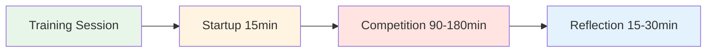

# Trainingssessie: Handleiding voor wedstrijdvoorbereiding

<AdBanner />

## Hoe 4 spelers regelmatig samen kunnen trainen

Deze handleiding laat zien hoe je een vaste trainingsgroep van 4 spelers kunt opzetten die 2 tot 4 uur lang tegen elkaar spelen op verschillende ondergronden en in diverse omgevingen. Zo simuleer je een echte wedstrijd en bouw je tegelijkertijd een gevoel van veiligheid en mentale prestatieverbetering op.

::: tip De trainingssessiefilosofie
**Competitie zonder reflectie is gewoon spelen. Training zonder competitie is gewoon oefenen.** Deze aanpak combineert beide: hard strijden, en vervolgens diepgaand reflecteren.
:::



Waarom 4 spelers?

**Het perfecte getal:**
- **2 tegen 2-formaat** - Weerspiegelt echte wedstrijden
- **Rotatiemogelijkheden** - Wissel van partner, speel enkelspel
- **Leren van elkaar** - Diverse speelstijlen
- **Verantwoordelijkheid** - Moeilijk om bij 3 personen af te zeggen
- **Intimiteit** - Klein genoeg voor diepgaande uitwisseling.

::: info De groepsdynamiek
Met 4 spelers ontstaat de ideale balans tussen competitie-intensiteit en psychologische veiligheid. Je strijdt hard, maar je ondersteunt elkaar ook in je groei.
:::

## Je groep vinden

### Ideale groepssamenstelling

**Vaardigheidsniveau:**
- Vergelijkbaar niveau (binnen 1-2 niveaus)
- Allen zetten zich in voor verbetering
- Een mix van aanwijzers en schutters
- Verschillende speelstijlen

**Denkwijze:**
- Kwetsbaar
- Bereid om te reflecteren
- Competitief maar ondersteunend
- Groei-georiënteerd

**Logistiek:**
- Woon binnen 30 minuten van elkaar
- Kan zich aan een vast schema houden
- Vergelijkbare beschikbaarheid

### Werving voor jouw groep

**Waar vind je spelers:**
- De topspelers van jouw club
- Regelmatige deelnemers aan regionale toernooien
- Online jeu de boules-gemeenschappen
- Vraag je coach om aanbevelingen

**De uitnodiging:**
&quot;Ik ben een kleine trainingsgroep aan het samenstellen met 4 spelers die regelmatig willen spelen en aan hun mentale spel willen werken. We komen wekelijks 2-3 uur samen, spelen intensief en reflecteren vervolgens op wat we hebben geleerd. Interesse?&quot;

## Sessiestructuur

### Sessie van 2 uur

| Tijd | Activiteit | Duur |
|------|----------|----------|
| **Opstarten** | Inchecken en instellen | 15 min |
| **Competitie** | 2 tegen 2 wedstrijden | 90 min |
| **Reflectie** | Nabespreking en leerpunten | 15 min |

### Sessie van 3 uur

| Tijd | Activiteit | Duur |
|------|----------|----------|
| **Opstarten** | Inchecken en instellen | 15 min |
| **Competitieronde 1** | 2 tegen 2 wedstrijden | 60 min |
| **Pauze** | Rust &amp; informeel gesprek | 15 min |
| **Wedstrijdronde 2** | Wissel van partner | 60 min |
| **Reflectie** | Diepgaande nabespreking | 30 min |

### Sessie van 4 uur

| Tijd | Activiteit | Duur |
|------|----------|----------|
| **Opstarten** | Inchecken en instellen | 20 min |
| **Competitieronde 1** | 2 tegen 2 wedstrijden | 75 min |
| **Pauze** | Rust &amp; snack | 15 min |
| **Wedstrijdronde 2** | Wissel van partner | 75 min |
| **Pauze** | Rust | 10 min |
| **Wedstrijdronde 3** | Individueel of uitdaging | 45 min |
| **Reflectie** | Grondige nabespreking en planning | 30 min |

<AdInArticle />

## Opstartprotocol (15-20 minuten)

### 1. Fysieke installatie (5 min)

**Kies het terrein:**
- Wissel elke week van ondergrond.
- Verschillende moeilijkheidsgraden en omstandigheden
- Kies soms bewust voor oncomfortabel terrein.

**De ruimte inrichten:**
- Markeer de grenzen duidelijk.
- Meetinstrumenten klaarmaken
- Waterstation
- Schaduw indien nodig

### 2. Mentale check-in (10 min)

**De incheckcirkel:**

Ga in een cirkel staan (nog geen jeu de boules) en loop eromheen:

**Iedere persoon deelt:**
1. **Energieniveau** (1-10): &quot;Vandaag zit ik op een 7&quot;
2. **Mentale toestand**: &quot;Ik voel me geconcentreerd&quot; of &quot;Ik word afgeleid door werkstress&quot;
3. **Doel**: &quot;Vandaag wil ik oefenen om kalm te blijven na missers&quot;

**Waarom dit belangrijk is:**
- Bevordert het bewustzijn van de mentale toestand
- Bevordert empathie in de groep
- Stelt de individuele focus voor de sessie vast
- Het normaliseert het gevoel dat je soms &quot;niet lekker&quot; bent.

**Tip voor de begeleider:** Wissel elke week af wie als eerste aan de beurt is.

### 3. Herinnering aan de huisregels (5 min)

**Herhaal tijdens elke sessie kort het volgende:**

::: tip Sessie Basisregels
1. **Ga de strijd aan** - Speel om te winnen, zonder je in te houden.
2. **Ondersteun groei** - Help elkaar leren
3. **Respecteer de gebruikershandleidingen** - Houd rekening met hoe elke persoon behandeld wil worden.
4. **Blijf geconcentreerd** - Geen telefoons tijdens het spelen.
5. **Reflecteer eerlijk** - Deel wat er werkelijk vanbinnen speelt.
6. **Vertrouwelijkheid** - Wat hier gedeeld wordt, blijft hier.
:::

**De balans:**
&quot;We strijden alsof het een toernooi is, maar we steunen elkaar als teamgenoten. Hard op het spel, zacht voor de persoon.&quot;

## Gedragsregels voor de wedstrijd

### Wedstrijdformaat

**Standaard 2 tegen 2:**
- Speel tot 13 punten
- Standaard pétanque-regels
- Houd de score eerlijk bij
- Meet alleen wanneer nodig (ga niet gokken)

**Rotatieopties:**

**Week 1:** A+B versus C+D
**Week 2:** A+C versus B+D
**Week 3:** A+D versus B+C
**Week 4:** Singles round-robin

### Het creëren van een competitieve omgeving

::: warning Kritiek: Maak het echt
**Dit is geen ontspannen oefening.** Behandel het als een toernooi:

✅ **Doe het volgende:**
- Houd de officiële score bij
- Nauwkeurig meten
- Meld voetfouten
- Neem het serieus
- Vier de goede schoten
- Toon teleurstelling bij gemiste kansen

❌ **Niet doen:**
- Geef herkansingen
- Wees te nonchalant
- Laat slechte beslissingen door de vingers zien
- Maak de hele wedstrijd door grappen.
- Verzin excuses
:::

### De mentale prestatietwist

**Track twee scores:**

1. **Traditionele score** - Behaalde punten
2. **Score voor mentale prestaties** - Hoe goed je je innerlijke spel hebt beheerst

**Criteria voor mentale prestaties (zelfbeoordeling 1-5 na elke wedstrijd):**

| Criterium | 1 (Slecht) | 3 (Goed) | 5 (Uitstekend) |
|-----------|----------|----------|---------------|
| **Bleef in het moment** | Nadacht over eerdere foto&#39;s | Voornamelijk in het moment | Volledig in het nu |
| **Innerlijke criticus onder controle gekregen** | Harde zelfpraat | Geconfronteerd en geherformuleerd | Innerlijke coach ingeschakeld |
| **Emotionele regulatie** | Zichtbare frustratie | Bleef grotendeels kalm | De hele tijd kalm |
| **Ondersteunde partner** | Genegeerd of de schuld gegeven | Basisondersteuning | Gebruikte gebruikershandleiding |
| **Focus** | Afgeleid, ongefocust | Grotendeels gefocust | Haarscherp gefocust |

**Totaal:** /25 per spel

**Waarom dit belangrijk is:**
- Verlegt de focus van het resultaat naar het proces
- Vergroot het bewustzijn van het mentale spel
- Creëert verantwoordelijkheid voor innerlijk werk
- Viert mentale prestaties, niet alleen winnen

### Variatie in de omgeving

**Wissel af tussen verschillende uitdagingen:**

**Week 1: Thuisbasis**
- Uw vaste piste
- Comfortabele omstandigheden
- Focus: Zelfvertrouwen opbouwen

**Week 2: Moeilijk terrein**
- Oneffen, uitdagend oppervlak
- Focus: Emotionele regulatie, acceptatie

**Week 3: Andere locatie**
- De piste van een andere club
- Focus: Aanpassingsvermogen

**Week 4: Drukcondities**
- Toeschouwers (nodig anderen uit om te komen kijken)
- Focus: Omgaan met externe druk

**Week 5: Weeruitdaging**
- Wind, hitte of kou
- Focus: Mentale veerkracht

**Week 6: Tijdsdruk**
- Schotklok (30 seconden per worp)
- Focus: Besluitvorming onder druk

```mermaid
graph TD
    A[Vary Environment] --> B[Different Surfaces]
    A --> C[Different Locations]
    A --> D[Different Conditions]
    A --> E[Different Pressures]

    B --> F[Build Adaptability]
    C --> F
    D --> F
    E --> F

    style A fill:#e8f5e9
    style F fill:#fff4e1


## Reflection Protocol (15-30 minutes)

**Critical:** This is where the learning happens. Don't skip it!

### Short Reflection (15 min)

**After each game, quick debrief:**

**Go around the circle, each person shares:**

1. **Mental Performance Score** (1-5): "I give myself a 4 today"
2. **One thing that went well mentally**: "I stayed calm after my miss in the 3rd end"
3. **One thing to work on**: "I need to catch my inner critic faster"

**Group discussion:**
- "What did you notice about your inner game today?"
- "When did you feel most in the zone?"
- "When did you lose focus?"

### Deep Reflection (30 min)

**After final game, deeper debrief:**

**Structure:**

**1. Individual Journaling (5 min)**

Write privately:
- What happened in my mind during pressure moments?
- When did I use my Inner Coach vs. Inner Critic?
- How did I support my partner?
- What pattern am I noticing about myself?

**2. Pair Sharing (10 min)**

Partner up, share:
- One insight from journaling
- One question you're sitting with
- One commitment for next session

**3. Group Integration (15 min)**

Full circle:
- Each person shares ONE key learning
- Group identifies themes
- Discuss: "What are we learning as a group?"
- Set focus for next session

**Closing:**
- Thank each other for showing up
- Confirm next session date/time
- One-word check-out: "How are you leaving?"

<AdInArticle />

## User Manual Integration

### Creating Your User Manuals

**In your first session together, each person completes:**

| Section | Prompt | Example |
|---------|--------|---------|
| **My Stress Signature** | "When I'm anxious, I..." | "...go completely quiet" |
| **How to Support Me** | "After a miss, I need..." | "...silence, not encouragement" |
| **My Trigger** | "I get defensive when..." | "...someone questions my shot choice" |
| **My Reset Signal** | "When I need a mental reset, I..." | "...touch my boules and take 3 breaths" |

**Share with the group and keep copies.**

### Using User Manuals During Play

**During competition:**
- Partner knows how to support you
- Teammates respect your needs
- No guessing about what helps

**Example:**
- Marc's User Manual says: "After a miss, I need 30 seconds of silence"
- His partner knows: Don't immediately encourage, give space
- Result: Marc feels understood, recovers faster

**This is psychological safety in action.**

## Advanced Variations

### The Mental Challenge Week

**Once a month, add a mental challenge:**

**Week 1: Silent Game**
- No talking during play
- Only non-verbal communication
- Focus: Internal awareness

**Week 2: Positive Self-Talk Only**
- Catch and reframe every negative thought
- Say Inner Coach phrase out loud
- Focus: Cognitive restructuring

**Week 3: Pressure Simulation**
- Play with spectators
- Announce score loudly
- Focus: External pressure management

**Week 4: Gratitude Game**
- After each end, state one thing you're grateful for
- Focus: Positive mindset

### The Vulnerability Round

**Every 4-6 weeks, dedicate a session to deeper sharing:**

**Format:**
- 30 min: Play one game
- 60 min: Deep reflection using [Workshop](./workshop) activities
- 30 min: Play final game applying insights

**Activities to use:**
- Fear in a Hat
- Reframing Inner Critic
- The Iceberg
- User Manual updates

**Why this matters:**
- Prevents the group from becoming just "playing buddies"
- Maintains psychological safety
- Deepens learning
- Builds authentic connection

## Tracking Progress

### Individual Tracking

**Keep a training journal:**

After each session, record:
- Date, location, conditions
- Partners and opponents
- Traditional score
- Mental performance score (1-5)
- Key insights
- Patterns noticed
- Commitments for next time

**Monthly review:**
- What's improving?
- What patterns keep showing up?
- What's my mental performance trend?
- What do I need to focus on?

### Group Tracking

**Shared document (Google Sheet):**

| Date | Location | Teams | Score | Mental Perf | Key Learning |
|------|----------|-------|-------|-------------|--------------|
| Jan 7 | Club A | A+B vs C+D | 13-11 | 4.2 avg | Staying calm in wind |
| Jan 14 | Club B | A+C vs B+D | 13-8 | 3.8 avg | Managing inner critic |

**Benefits:**
- See progress over time
- Notice group patterns
- Celebrate improvements
- Identify focus areas

## Sustaining the Group

### Commitment Agreement

**At the start, agree on:**

**Frequency:**
- Weekly? Bi-weekly? Monthly?
- Same day/time each week?
- How many sessions committed to? (suggest minimum 8-12)

**Cancellation Policy:**
- 24-hour notice required
- Maximum 2 cancellations per person per quarter
- If someone cancels repeatedly, have a conversation

**Rotation:**
- Who chooses location each week?
- Who facilitates reflection?
- How do we keep it fresh?

### Handling Conflicts

**When tension arises:**

::: warning Address It, Don't Avoid It
**The mistake:** Letting resentment build

**The solution:** Use it as a learning moment

**Script:**
> "I notice some tension. Can we pause and talk about what's happening? This is exactly the kind of moment we can learn from."
:::

**Common conflicts:**
- Disagreement on calls
- Perceived unfairness
- Personality clashes
- Competitive intensity

**Resolution process:**
1. Pause the game
2. Each person shares their perspective
3. Group validates both sides
4. Agree on how to move forward
5. Return to play

**This builds psychological safety.**

### Keeping It Fresh

**Avoid stagnation:**

**Every 8-12 weeks, change something:**
- Invite a 5th player for variety
- Play at a tournament together
- Do a mini training camp (full day)
- Bring in a guest coach
- Try a new format (singles, different scoring)
- Do a deep vulnerability session

**The goal:** Keep learning, keep growing, keep it interesting

## Integration with Tournaments

### Pre-Tournament Prep

**2 weeks before a major tournament:**

**Session focus:**
- Play on similar terrain
- Simulate tournament pressure
- Practice competition-day nutrition
- Rehearse pre-shot routines
- Visualize success

**Mental preparation:**
- What's your intention for the tournament?
- What's your Inner Coach phrase?
- What's your reset signal?
- How will you handle pressure?

### Post-Tournament Debrief

**After a tournament:**

**Dedicate a session to reflection:**

**Structure:**
- 30 min: Share tournament experience
- 30 min: What worked? What didn't?
- 30 min: What did you learn about yourself?
- 30 min: Play a game applying learnings

**Questions:**
- When did you feel most in the zone?
- When did you lose it?
- How did you handle pressure?
- What would you do differently?
- What are you proud of?

**This cements learning and builds resilience.**

## Resources & Tools

### From This Site

- [Workshop Guide](./workshop) - Deep facilitation protocols
- [Training Camp Guide](./training-camp) - Weekend intensive format
- [Nutrition](./education/nutrition/) - Competition-day protocols
- [Mental Strength](./education/mental-strength/) - Inner game concepts
- [Mindfulness](./education/mindfulness/) - Presence techniques
- [Tactics](./education/tactics/) - Strategic thinking

### Recommended Tools

**Journaling:**
- Physical notebook or digital app
- Prompt: "What happened in my mind today?"

**Video Analysis:**
- Phone camera on tripod
- Review technique and body language
- Notice patterns

**Meditation Apps:**
- Headspace, Calm, Insight Timer
- 5-10 minutes before sessions

**Tracking:**
- Google Sheets for group data
- Personal spreadsheet for trends

## Success Stories

### Example: The Stockholm Four

**Group:** 4 elite players, ages 28-45
**Frequency:** Weekly, 3 hours
**Duration:** 18 months

**Results:**
- All 4 improved tournament rankings
- 2 made national team
- Mental performance scores increased from 3.2 to 4.5 average
- Group still meets 3 years later

**Key factors:**
- Consistent commitment
- Deep vulnerability work
- Honest reflection
- Mutual support

### Example: The Barcelona Crew

**Group:** 4 club players wanting to compete regionally
**Frequency:** Bi-weekly, 2 hours
**Duration:** 6 months

**Results:**
- Confidence increased dramatically
- All 4 entered first regional tournament
- 1 placed in top 8
- Group expanded to 8 players

**Key factors:**
- Started small and built trust
- Focused on mental game
- Celebrated small wins
- Kept it fun

## Common Challenges

### "We just end up playing, not reflecting"

**Solution:**
- Set a timer
- Designate a "reflection keeper"
- Make reflection non-negotiable
- Start with just 10 minutes

### "One person dominates"

**Solution:**
- Use structured sharing (everyone gets 2 minutes)
- Rotate who speaks first
- Gently redirect: "Let's hear from others"

### "It's getting stale"

**Solution:**
- Change locations
- Try new formats
- Do a vulnerability session
- Invite a guest
- Take a break and come back fresh

### "Someone's not committed"

**Solution:**
- Have an honest conversation
- Revisit commitment agreement
- Consider finding a replacement
- It's okay if someone leaves

## Getting Started Checklist

::: details Your First Session Checklist

**Before Session 1:**
- [ ] Find your 4 players
- [ ] Agree on frequency and duration
- [ ] Choose first location
- [ ] Share this guide with everyone
- [ ] Create group chat

**Session 1 Agenda:**
- [ ] Introductions and intentions
- [ ] Agree on ground rules
- [ ] Complete User Manuals
- [ ] Play first game
- [ ] Short reflection
- [ ] Schedule next 4 sessions

**Ongoing:**
- [ ] Rotate locations
- [ ] Track progress
- [ ] Deep reflection every 4-6 weeks
- [ ] Adjust format as needed
- [ ] Celebrate improvements
:::

## Final Thoughts

::: tip The Power of Regular Practice
**Consistency beats intensity.** Four players meeting regularly, competing hard, and reflecting deeply will improve faster than sporadic tournament play alone.

**Why?**
- Regular feedback loop
- Psychological safety to experiment
- Accountability and support
- Deliberate practice on mental game
- Community and connection

**The result:** You don't just get better at pétanque. You become a more complete competitor.
:::

<AdBanner />

