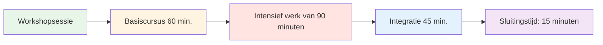
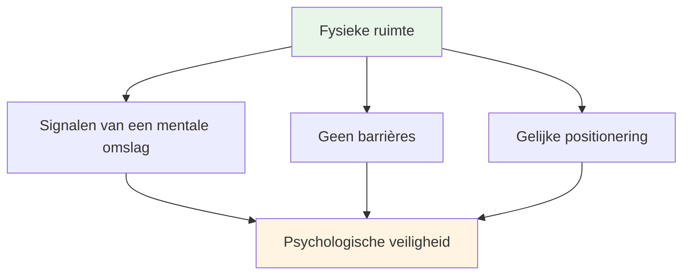
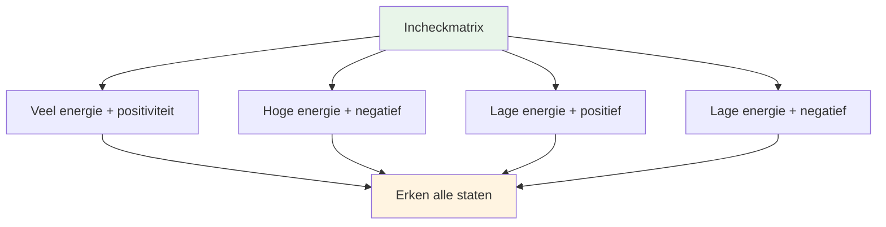
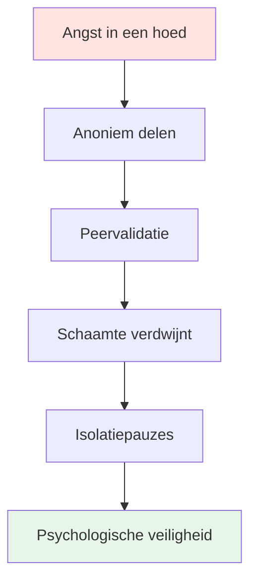

# Workshop: Geavanceerde mentale speltraining (3-4 uur)

## Overzicht

Deze workshop is een geavanceerde theoretische sessie van 3-4 uur voor 6-8 topspelers, gericht op diepgaand psychologisch werk en leren vanuit kwetsbaarheid. Het gaat verder dan basis mentale vaardigheden en verkent het innerlijke spel op een diepgaand niveau.

::: tip Deze handleiding bestaat uit twee secties.
- **[Voor deelnemers](#voor-deelnemers)** - Wat spelers zullen ervaren en leren
- **[Voor begeleiders](#voor-begeleiders)** - Hoe geef je de workshop als coördinator mentale prestaties?
:::

**Verschil met de beginnerssessie:**
- **Beginners (2-3 uur):** Introductie tot mentale spelconcepten → [Zie Mentale Reisgids](/nl/mental-journey/session-guide)
- **Gevorderd (3-4 uur):** Diepgaand psychologisch werk met kwetsbaarheidsoefeningen (deze pagina)

## Sneltoegang

| Sectie | Doel | Toegang |
|---------|---------|--------|
| **Voor deelnemers** | Wat je kunt verwachten en hoe je je kunt voorbereiden | [Sectie bekijken](#voor-deelnemers) |
| **Voor begeleiders** | Complete sessiehandleiding en oefeningen | [Sectie bekijken](#voor-facilitatoren) |
| **Sessiematerialen** | Oefeningen en werkbladen | [Materialen bekijken](#facilitator-materials) |
| **Gerelateerde handleidingen** | Andere trainingsvormen | [Mentale Reis](/nl/mental-journey/) • [Trainingskamp](/nl/training-camp) |

---

## Voor deelnemers

### Wat kun je verwachten?

Dit is geen doorsnee trainingssessie. Je neemt deel aan diepgaande discussies over de mentale en emotionele aspecten van pétanque die zelden openlijk besproken worden.

**Deze workshop is:**
- ✅ Een veilige plek om je innerlijke gedachten en angsten te verkennen
- ✅ Leren van kwetsbaarheden samen met teamgenoten
- ✅ Het verband tussen mentale patronen en prestaties
- ✅ Het opbouwen van psychologische intelligentie binnen het team

**Deze workshop is NIET:**
- ❌ Technische coaching of tactische training
- ❌ Therapie of begeleiding
- ❌ Toespraken over positief denken of motivatie
- ❌ Oordeel of kritiek

### Sessiestructuur

**Totale duur:** 3-4 uur
**Groepsgrootte:** 6-8 spelers
**Format:** Kringgesprek met gestructureerde oefeningen

### Wat je zult leren

#### Fase 1: Basis (60 min)
- Basisregels voor psychologische veiligheid
- De &quot;Check-in Matrix&quot; - het erkennen van je huidige toestand.
- De &quot;IJsberg van Pétanque&quot; - het verkennen van verborgen gedachten

#### Fase 2: Intensief werk (90 min)
- Een handleiding voor je teamgenoten maken
- Het verband tussen mentale patronen en prestaties.
- &quot;Angst in een hoed&quot; - isolatie doorbreken door gedeelde kwetsbaarheid

#### Fase 3: Integratie (45 min)
- Je innerlijke criticus omvormen tot een innerlijke coach.
- Teamprotocollen opstellen voor wedstrijden
- Praktische tips voor op de piste

#### Fase 4: Afronding (15 min)
- Reflectie en toewijding
- Nazorg

### Basisregels

Voordat de sessie begint, stemmen alle deelnemers ermee in om:

::: tip De Container - Essentiële basisregels
1. **Vertrouwelijkheid** - Wat hier gezegd wordt, blijft hier.
2. **De Vegas-regel** - Lessen verlaten de kamer, verhalen blijven.
3. **Niet repareren** - Wees getuige en probeer te begrijpen, probeer het niet op te lossen.
4. **Recht om te passeren** - Kwetsbaarheid kan niet worden afgedwongen
5. **Respecteer het proces** - Vertrouw op het ongemak
:::

### Wat mee te nemen

**Vereist:**
- Een open houding en de bereidheid om te delen
- Jouw eigen ervaringen en uitdagingen
- Respect voor de kwetsbaarheid van anderen

**Optioneel:**
- Notitieboekje voor persoonlijke reflecties
- Vragen over specifieke psychische problemen

### Belangrijkste activiteiten die je zult ervaren

#### De incheckmatrix
Plaats jezelf op een raster van energie en stemming. Accepteer dat we allemaal verschillende gemoedstoestanden hebben.

#### De ijsberg van pétanque
Ontdek wat er onder de oppervlakte speelt - de gedachten en angsten die niemand ziet.

#### De gebruikershandleiding
Maak een handleiding voor jezelf, zodat je teamgenoten begrijpen hoe ze je kunnen ondersteunen.

#### Angst in een hoed
Deel anoniem je diepste angsten en hoor hoe ze worden bevestigd door lotgenoten. Doorbrek het isolement.

#### Herkadering van de innerlijke criticus
Transformeer negatieve zelfpraat in ondersteunende coachingstaal.

### Na de workshop

Je gaat naar huis met:
- Een dieper inzicht in je mentale patronen
- Teamprotocollen voor onderlinge ondersteuning
- Herformuleringen van innerlijke coach-uitdrukkingen
- Verbinding met teamgenoten door gedeelde kwetsbaarheid
- Praktische instrumenten voor concurrentie

::: warning Kwetsbaarheidskater
Na een openhartig gesprek kun je je blootgesteld voelen of spijt hebben. Dat is normaal. De begeleider neemt binnen 24 uur contact met je op. Onthoud: wat je hebt gedeeld, heeft iedereen geholpen.
:::

---

## Voor begeleiders

### Jouw rol als coördinator mentale prestaties

Als **Mental Performance Coordinator (MPC)** faciliteer je diepgaande gesprekken over het mentale aspect van de wedstrijd, waardoor een veilige psychologische omgeving ontstaat die zich vertaalt in prestaties op de piste.

::: warning Kritisch concept
**Je bent geen technische coach of therapeut.** Jouw rol is het faciliteren van op kwetsbaarheid gebaseerd leren, waardoor spelers het verband tussen hun innerlijke gedachten en hun prestaties leren begrijpen.
:::

### Jouw verantwoordelijkheden

::: info Belangrijkste verantwoordelijkheden
- **Begeleid de discussie, geef geen college** - Je stuurt de discussie, je leert geen technieken aan.
- **Bescherm de ruimte** - Creëer en behoud psychologische veiligheid
- **Verbind theorie met praktijk** - Verbind website-inhoud met innerlijke ervaring.
- **Houd de groepsdynamiek in de gaten** - Let op wie betrokken is en wie weerstand biedt.
- **Bewaar grenzen** - Weet wanneer je professionele hulp moet inschakelen.
:::

### Voorbereiding voorafgaand aan de workshop

### Essentiële competenties

| Competentie | Wat het betekent | Hoe te ontwikkelen |
|------------|---------------|----------------|
| **Emotionele intelligentie** | Detecteer micro-uitdrukkingen van ongemak | Oefen actieve observatie. |
| **Neutrale Autoriteit** | Dwing respect af zonder technische vaardigheid. | Bouw geloofwaardigheid op door aanwezigheid. |
| **Sportcontext** | Inzicht in drukmechanismen | Leer de terminologie en cultuur van pétanque. |
| **Verbale Aikido** | Ga mee in het verzet, vecht er niet tegen. | Oefen niet-defensieve communicatie. |

::: details Belangrijke pétanque-termen die je moet kennen
- **Carreau** - Perfecte stoot die de boule van de tegenstander verplaatst.
- **Bibber** - De &quot;yips&quot; - onvrijwillige trilling tijdens het loslaten
- **Donnée** - Het &quot;gegeven&quot; - het terrein accepteren zoals het is
- **Portée** - Werpen zonder stuiteren
- **Roulette** - Rollende opname
- **Cochonnet** - De doelbal (jack)
:::

## Fysieke opstelling: De magische cirkel

### Locatievereisten

::: warning Kritieke configuratie
**Kies een neutrale plek, weg van de piste.** Dit geeft aan dat je van fysiek naar mentaal werk overgaat.

Vereisten:
- ✅ Geluidsdicht of privé
- ✅ Comfortabele temperatuur
- ✅ Geen afleiding (telefoons uit)
- ✅ Natuurlijk licht indien mogelijk
- ✅ Gescheiden van het trainingsgebied
:::

### De cirkelconfiguratie

**Zitplaatsen:**
- Een perfecte cirkel van stoelen
- **GEEN TAFELS** - Tafels vormen barrières en verbergen lichaamstaal.
- Alle stoelen op dezelfde hoogte (geen elektrische verstelmogelijkheden)
- De coördinator zit in een kring (niet vooraan).

**Centrale artefacten:**
- Leg de boules en cochonnet in het midden
- Verankert het werk aan de sport.
- Visuele herinnering aan een gedeeld doel

## Sessie-indeling (3-4 uur)

### Fase 1: Basis (60 minuten)

#### 1. Welkom en huisregels (15 min)

**Het sociale contract:**

::: tip De Container - Essentiële basisregels
Voordat er informatie wordt gedeeld, moet de groep het eens zijn over het volgende:

1. **Vertrouwelijkheid** - Wat hier gezegd wordt, blijft hier.
2. **De Vegas-regel** - Lessen verlaten de kamer, verhalen blijven.
3. **Niet repareren** - Wees getuige en probeer te begrijpen, probeer het niet op te lossen.
4. **Recht om te passeren** - Kwetsbaarheid kan niet worden afgedwongen
5. **Respecteer het proces** - Vertrouw op het ongemak
:::

**Jouw script:**
> &quot;Welkom. Deze ruimte is anders dan de piste. Hier onderzoeken we wat er *vanbinnen* gebeurt als je boven die perfecte slag staat. Alles wat hier gedeeld wordt, is vertrouwelijk. De lessen die je leert, mag je meenemen, maar de persoonlijke verhalen blijven. Je bent hier niet om elkaar te repareren, maar om elkaar te begrijpen. En je mag altijd passen. Zijn jullie het hiermee eens?&quot;

#### 2. Activiteit: De incheckmatrix (20 min)

**Doel:** Het normaliseren van het toegeven van vermoeidheid of stress.

**Materialen:** Whiteboard of flipchart, plakbriefjes

**Procedure:**
1. Teken een 2x2 matrix: Hoge/Lage energie (verticaal), Positief/Negatief (horizontaal)
2. Elke speler schrijft zijn of haar naam op een plakbriefje.
3. Plaats de notitie in hun huidige kwadrant.
4. Bespreking: &quot;We hebben drie mensen in de &#39;lage energie/negatieve&#39; stemming. Welke invloed heeft dit op onze sessie van vandaag?&quot;

**Tips voor de begeleiding:**
- Beoordeel geen enkel kwadrant als &quot;slecht&quot;.
- Vraag jezelf af: &quot;Wat heeft je lichaam op dit moment nodig?&quot;
- Let op patronen: &quot;Jullie drieën bevinden zich in dezelfde ruimte - hoe komt dat?&quot;

#### 3. Activiteit: De ijsberg van petanque (25 min)

**Doel:** Verborgen innerlijke gedachten visualiseren

**Materialen:** Groot papier, stiften

**Procedure:**
1. Teken een ijsberg op papier.
2. **Boven water:** Schrijf &quot;Techniek, De worp, Het resultaat&quot; op.
3. **Onder water:** Vraag: &quot;Wat speelt er zich af in je hoofd dat niemand ziet?&quot;

**Aanwijzingen:**
- &quot;Waar ben je bang voor als je op het punt staat te schieten?&quot;
- &quot;Voor welk oordeel bent u bezorgd?&quot;
- &quot;Wat zegt je innerlijke stem als je mist?&quot;

**De inzichtvraag:**
> &quot;Wat gebeurt er met je werparm als de &#39;onderwater&#39;-oefeningen te zwaar worden?&quot;

Dit koppelt mentale belasting aan fysieke spanning (de bibber/yips).

::: details Veelvoorkomende reacties &quot;onder water&quot;
- Angst om het team teleur te stellen
- Maak je zorgen dat je er dom uitziet
- Twijfel over het vermogen
- Vergelijking met anderen
- Druk om je waarde te bewijzen
- Angst voor oordeel van coach/teamgenoten
- Impostersyndroom
:::

### Fase 2: Geconcentreerd werk (90 minuten)

#### 4. Activiteit: De gebruikershandleiding (30 min)

**Doel:** Empathie in de praktijk brengen - teamleden helpen elkaar te begrijpen

**Materialen:** Werkbladen (één per speler)

**Het sjabloon voor de gebruikershandleiding:**

| Sectie | Snel | Voorbeeld |
|---------|--------|---------|
| **Mijn stressprofiel** | &quot;Als ik angstig ben, dan...&quot; | &quot;...helemaal stil worden&quot; |
| **Hoe moet je met mij omgaan?** | &quot;Als ik een cruciale kans mis, moet ik...&quot; | &quot;...stilte, geen aanmoediging&quot; |
| **Mijn innerlijke gedachte** | &quot;De leugen die ik mezelf vertel is...&quot; | &quot;...dat ik niet goed genoeg ben&quot; |
| **Mijn trigger** | &quot;Ik ga in de verdediging als...&quot; | &quot;...iemand stelt mijn schotkeuze ter discussie&quot; |

**Procedure:**
1. Geef de spelers 10 minuten om de opdracht in stilte af te ronden.
2. Ga de ronde doen - iedereen deelt ÉÉN gedeelte.
3. Anderen kunnen verduidelijkende vragen stellen (geen advies!).
4. De coördinator valideert elk aandeel.

**Facilitatiescript:**
> &quot;Dit is je handleiding. Als je teamgenoot weet dat je stil wordt als je nerveus bent, zal hij of zij het niet persoonlijk opvatten. Als ze weten dat je stilte nodig hebt na een gemiste kans, zullen ze niet proberen je te &#39;corrigeren&#39;. Zo bouwen we aan teamintelligentie.&quot;

#### 5. De link leggen tussen websitecontent en innerlijke gedachten (30 min)

**Doel:** De kloof overbruggen tussen technische inhoud en psychologische ervaring.

Kies 2-3 onderdelen van de Academy-website en verken het innerlijke spel:

**Voorbeeld 1: Techniek - De greep en het loslaten**

**De vertrouwensvraag:**
> &quot;Voelt je hand bij een stand van 12-12 in een toernooi dan ook aan zoals in de techniekbeschrijving? Zijn het de spieren die veranderen, of de gedachte &#39;Laat hem niet vallen&#39;, die je grip verandert?&quot;

**De microtremor:**
> &quot;Wie van jullie voelt de &#39;microtrilling&#39; van angst? Welke innerlijke gedachte veroorzaakt dat?&quot;

**Voorbeeld 2: Tactiek - Richten versus Schieten**

**Risicoprofiel:**
> &quot;Als de gids zegt &#39;Schiet om te winnen&#39;, is je reactie dan opwinding of angst? Wat zegt dat over jouw relatie met risico?&quot;

**De bedrieger:**
> &quot;Richt je wel eens terwijl je *weet* dat je zou moeten schieten, puur om de schaamte van een misser te voorkomen? Wat is de prijs van die veiligheid?&quot;

**Voorbeeld 3: Voeding - Wedstrijddag**

**De valkuil van troostvoedsel:**
> &quot;Eet je wat je lichaam nodig heeft of wat je angst je ingeeft? Hoe weet je het verschil?&quot;

::: tip Facilitatietechniek
Geef geen college over de inhoud. Stel vragen die de technische informatie verbinden met hun eigen ervaringen. Het inzicht komt van HEN, niet van jou.
:::

#### 6. Activiteit: Angst in een hoed (30 min)

**Doel:** Doorbreek de isolatiecirkel - laat zien dat lotgenoten dezelfde diepe onzekerheden delen.

**Materialen:** Papier, pen, hoed/tas

**Procedure:**
1. Iedereen schrijft anoniem een diepe angst over zijn of haar carrière of team op.
2. Vouw de papieren en meng ze in een hoed.
3. Iedere speler trekt een briefje (niet van zichzelf).
4. Lees het hardop voor
5. Onderbouw het: &quot;Ik begrijp waarom iemand zich zo zou voelen, want...&quot;

**Voorbeelden van angsten:**
- &quot;Ik ben bang dat ik mijn hoogtepunt heb bereikt en nooit meer beter zal worden.&quot;
- &quot;Ik ben bang dat mijn teamgenoten denken dat ik overschat word.&quot;
- &quot;Ik ben bang dat ik op het cruciale moment zal bezwijken onder de druk.&quot;
- &quot;Ik ben bang dat ik vervangen word door jongere spelers.&quot;

**De kracht:**
Wanneer spelers hun geheime angst hardop horen voorlezen en bevestigd zien door leeftgenoten, verdwijnt de schaamte. Ze beseffen: &quot;Ik ben niet alleen. Dit is normaal.&quot;

**Rol van de coördinator:**
- Erken ELKE angst als legitiem
- Bagatelliseer het niet: &quot;Dat is niet waar!&quot; ontkracht het gevoel.
- Vraag: &quot;Hoeveel van jullie hebben iets soortgelijks meegemaakt?&quot;

### Fase 3: Integratie (45 minuten)

#### 7. Activiteit: De innerlijke criticus herformuleren (25 min)

**Doel:** Cognitieve herstructurering - verandering van de interne dialoog

**Materialen:** Werkblad

**Procedure:**

**Stap 1: Identificeer de criticus (10 min)**
> &quot;Schrijf de PRECIES de woorden op die je innerlijke criticus zegt na een mislukking. Niet de beleefde versie, maar de keiharde.&quot;

Voorbeelden:
- &quot;Je faalt altijd&quot;
- &quot;Iedereen kijkt toe hoe je faalt&quot;
- &quot;Je maakt jezelf belachelijk&quot;
- &quot;Je hoort hier niet thuis&quot;

**Stap 2: Herkaderen als innerlijke coach (10 min)**
> &quot;Herschrijf dat nu als je innerlijke coach - streng maar ondersteunend.&quot;

Voorbeelden:
- Criticus: &quot;Je faalt altijd&quot; → Coach: &quot;Neem even rust en haal diep adem. Volgende poging.&quot;
- Criticus: &quot;Iedereen kijkt toe hoe je faalt&quot; → Coach: &quot;Focus op het doel, niet op het publiek&quot;
- Criticus: &quot;Je maakt jezelf belachelijk&quot; → Coach: &quot;Eén slag tegelijk. Je hebt dit al eerder gedaan.&quot;

**Stap 3: Oefening met een partner (5 min)**
> &quot;Deel je coachzin met een partner. Die zal je eraan herinneren wanneer de criticus in je naar boven komt.&quot;

#### 8. Brug naar de piste (20 min)

**Doel:** Ontwikkel concrete protocollen voor de competitie.

**Discussievragen:**
1. &quot;Wat is ÉÉN ding van vandaag dat je in je volgende wedstrijd zult gebruiken?&quot;
2. &quot;Hoe weten je teamgenoten dat je ondersteuning nodig hebt?&quot;
3. &quot;Wat is jouw signaal voor &#39;Ik heb een mentale reset nodig&#39;?&quot;

**Stel teamprotocollen op:**

| Situatie | Protocol | Voorbeeld |
|-----------|----------|---------|
| **Na een misser** | Raadpleeg de gebruikershandleiding. | &quot;Marc heeft stilte nodig, Lisa heeft een high five nodig.&quot; |
| **Druk voelen** | Gebruik de coach-uitdrukking. | &quot;Reset en haal diep adem&quot; |
| **Teamspanning** | Oproep time-out | &quot;Laten we 2 minuten nemen&quot; |
| **Innerlijke criticus luidt zijn stem** | Fysieke reset | Raak de boules aan, haal diep adem |

### Fase 4: Afsluiting (15 minuten)

#### 9. De uitcheckprocedure (10 min)

**Procedure:**
Ga de kring rond, iedereen deelt:
1. **Wat neem je mee?** &quot;Welk inzicht of welke tool neem je mee naar huis?&quot;
2. **Eén ding dat je achterlaat:** &quot;Waar laat je afscheid van?&quot;

**Rol van de coördinator:**
- Bedank iedereen voor hun bijdrage.
- Valideer het uitgevoerde werk.
- Herinner aan de vertrouwelijkheid.

#### 10. Vervolgprotocol (5 min)

::: warning Cruciaal: Voorkom een kater na een kwetsbaarheid.
Diepgaand werk kan een &quot;kwetsbaarheidskater&quot; veroorzaken - spijt of schaamte over het delen van ervaringen.

**Uw 24-uursprotocol:**
- Stuur een bericht naar iedereen die binnen 24 uur veel berichten heeft gedeeld.
- Bericht: &quot;Dankjewel voor je moed gisteren. Wat je deelde heeft iedereen geholpen.&quot;
- Vraag: &quot;Hoe voelt u zich na de sessie?&quot;
:::

**Afsluitend script:**
> &quot;Wat hier vandaag is gebeurd, vergde moed. Jullie waren er, jullie stelden je open en jullie vertrouwden op het proces. Diezelfde moed laten jullie ook zien op de piste. Onthoud: de lessen verlaten deze ruimte, maar de verhalen blijven. Dank jullie wel.&quot;

## Hanteerweerstand

### De &quot;te coole&quot; atleet

**Scenario:** Een speler rolt met zijn ogen tijdens een kwetsbaarheidsoefening.

**Strategie:** Verbale Aikido (Uitlijnen en Draaien)

**Script:**
> &quot;Ik zie die reactie, [Naam]. Eerlijk gezegd snap ik het. Praten over gevoelens voelt soft. Maar de piste is oncomfortabel. Als we het ongemak van deze ruimte niet aankunnen, trainen we onze tolerantie voor het ongemak van het spel niet. Kun je me 20 minuten vertrouwen?&quot;

### De stille deelnemer

**Scenario:** Iemand heeft al 45 minuten niets gezegd.

**Strategie:** Creëer een laagdrempelig instapmoment.

**Script:**
> &quot;[Naam], ik merk dat je alles in je opneemt. Wat is één ding dat je tot nu toe het meest is bijgebleven? Al is het maar één woord.&quot;

### De persoon die alles te veel deelt

**Scenario:** Iemand domineert met lange verhalen

**Strategie:** Zachte omleiding

**Script:**
> &quot;Dankjewel daarvoor, [Naam]. Ik wil ervoor zorgen dat iedereen de ruimte krijgt. Laten we eens horen van iemand die nog niets heeft gedeeld.&quot;

### De Oplosser

**Scenario:** Iemand probeert de problemen van anderen op te lossen.

**Strategie:** Versterk de basisregels

**Script:**
> &quot;Ik waardeer je bereidheid om te helpen, maar onthoud onze regel: observeer en probeer te begrijpen, los het niet op. [Oorspronkelijke spreker], wat heb je nu nodig?&quot;

## Materialenlijst

::: details Workshopmaterialen
**Fysieke opstelling:**
- [ ] Stoelen (6-8, geen tafels)
- [ ] Jeu de boules en cochonnet voor het midden
- [ ] Flipchart of whiteboard
- [ ] Markeringen

**Activiteiten:**
- [ ] Plakbriefjes (Incheckmatrix)
- [ ] Groot papier (IJsbergactiviteit)
- [ ] Werkbladen voor de gebruikershandleiding
- [ ] Papier en pennen (Angst in een hoed)
- [ ] Werkbladen voor de innerlijke criticus/coach

**Logistiek:**
- [ ] Water voor de deelnemers
- [ ] Zakdoekjes (emotioneel werk!)
- [ ] Timer (houd je aan het schema)
- [ ] Contactlijst van deelnemers (voor follow-up)
:::

## Coördinator Zelfzorg

::: warning Jij hebt ook ondersteuning nodig.
Ruimte bieden aan kwetsbaarheid is emotioneel veeleisend.

**Na de workshop:**
- Bespreek de resultaten met een collega of leidinggevende.
- Schrijf op wat er bij je opkwam.
- Maak een wandeling of neem een fysieke pauze.
- Neem hun verhalen niet mee naar huis.
:::

## Impact meten

### Directe feedback

Stel tot slot de volgende vraag:
1. &quot;Op een schaal van 1 tot 10, hoe veilig voelde je je vandaag om iets te delen?&quot;
2. &quot;Wat is één ding dat de volgende sessie zou verbeteren?&quot;

### Langetermijnmonitoring

Vervolgconsult na 2-4 weken:
- &quot;Heb je al gereedschap uit de werkplaats gebruikt?&quot;
- &quot;Hoe is je relatie met je innerlijke criticus veranderd?&quot;
- &quot;Wat is er anders aan jullie mentaliteit ten aanzien van de wedstrijd?&quot;

## Volgende stappen

::: tip Voortbouwend op dit fundament
Deze workshop is fase 1. Overweeg het volgende:
- **Vervolgsessies** (online of persoonlijk)
- **Integratie op de piste** (zie handleiding trainingssessie)
- **Teamprotocollen** (Gebruikershandleidingen implementeren tijdens de wedstrijd)
- **Individuele check-ins** (voor spelers die meer ondersteuning nodig hebben)
:::

