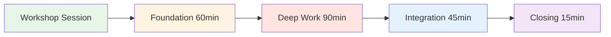
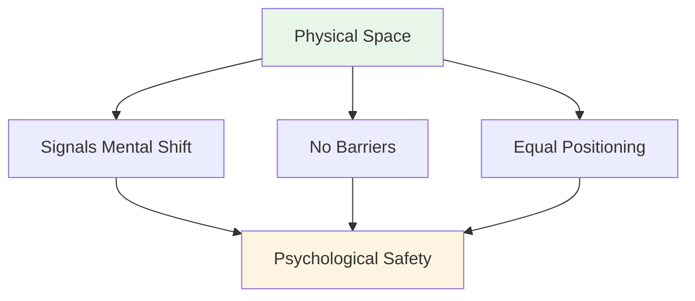
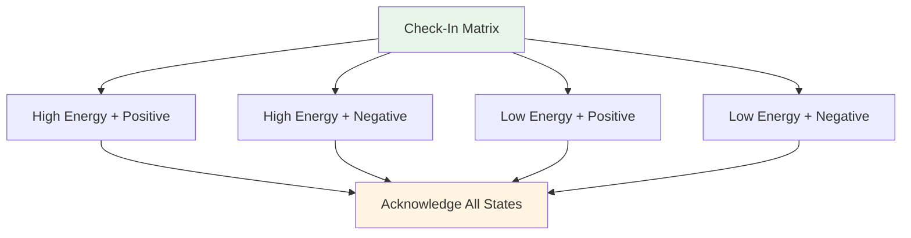
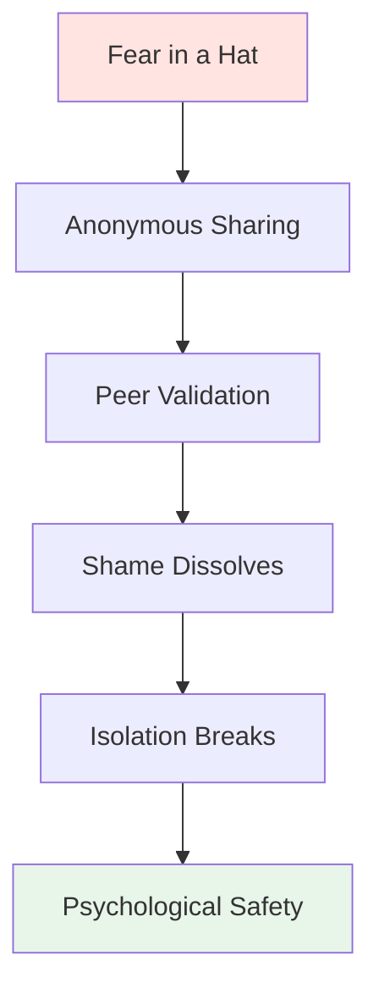

# Workshop: Handleiding voor de theoretische sessie

<AdBanner />

## Een uitgebreide handleiding voor coördinatoren

Deze handleiding helpt je bij het geven van een theoretische workshop van 3-4 uur aan 6-8 topspelers. Als **Mental Performance Coordinator (MPC)** begeleid je diepgaande discussies over het mentale aspect van het spel, waardoor een veilige omgeving ontstaat die zich vertaalt in prestaties op de piste.

::: warning Kritisch concept
**Je bent geen technische coach of therapeut.** Jouw rol is het faciliteren van op kwetsbaarheid gebaseerd leren, waardoor spelers het verband tussen hun innerlijke gedachten en hun prestaties leren begrijpen.
:::

## Voorbereiding vóór de workshop

De rol van de coördinator

::: info Jouw verantwoordelijkheden
- **Begeleid de discussie, geef geen college** - Je stuurt de discussie, je leert geen technieken aan.
- **Bied een veilige ruimte** - Creëer en behoud psychologische veiligheid
- **Verbind theorie met praktijk** - Verbind website-inhoud met innerlijke ervaring
- **Bewaak de groepsdynamiek** - Let op wie betrokken is en wie weerstand biedt.
- **Bewaar grenzen** - Weet wanneer je professionele hulp moet inschakelen
:::

### Essentiële competenties

| Competentie | Wat het betekent | Hoe te ontwikkelen |
|------------|---------------|----------------|
| **Emotionele intelligentie** | Micro-uitdrukkingen van ongemak herkennen | Actieve observatie oefenen |
| **Neutrale autoriteit** | Dwing respect af zonder technische macht | Bouw geloofwaardigheid op door aanwezigheid |
| **Sportcontext** | Inzicht in drukmechanismen | Leer de terminologie en cultuur van pétanque |
| **Verbale Aikido** | Stem je af op de weerstand, vecht er niet tegen | Oefen niet-defensieve communicatie |

::: details Belangrijke pétanque-termen om te kennen
- **Carreau** - Perfecte stoot die de boule van de tegenstander verplaatst
- **Bibber** - De &quot;yips&quot; - onvrijwillige trilling tijdens het loslaten
- **Gegevens** - Het &quot;gegeven&quot; - het terrein accepteren zoals het is
- **Portée** - Werpen zonder stuiteren
- **Roulette** - Rollende opname
- **Cochonnet** - De doelbal (jack)
:::

## Fysieke opstelling: De magische cirkel

### Locatievereisten

::: warning Kritieke configuratie
**Kies een neutrale plek, weg van de piste.** Dit geeft aan dat je van fysiek naar mentaal werk overgaat.

Vereisten:
- ✅ Geluidsdicht of privé
- ✅ Comfortabele temperatuur
- ✅ Geen afleiding (telefoons uit)
- ✅ Natuurlijk licht indien mogelijk
- ✅ Gescheiden van het trainingsgebied
:::

### De cirkelconfiguratie

**Zitplaatsen:**
- Een perfecte cirkel van stoelen
- **GEEN TAFELS** - Tafels vormen barrières en verbergen lichaamstaal.
- Alle stoelen op dezelfde hoogte (geen elektrische verstelmogelijkheden)
- De coördinator zit in een kring (niet vooraan).

**Centrale artefacten:**
- Leg de boules en cochonnet in het midden
- Verankert het werk aan de sport
- Visuele herinnering aan een gedeeld doel

## Sessie-indeling (3-4 uur)

### Fase 1: Basis (60 minuten)

#### 1. Welkom &amp; Huisregels (15 min)

**Het sociale contract:**

::: tip De Container - Essentiële basisregels
Voordat er informatie wordt gedeeld, moet de groep het eens zijn over het volgende:

1. **Vertrouwelijkheid** - Wat hier gezegd wordt, blijft hier.
2. **De Vegas-regel** - Lessen verlaten de kamer, verhalen blijven.
3. **Niet repareren** - Wees getuige en probeer te begrijpen, probeer niet op te lossen.
4. **Recht om te passeren** - Kwetsbaarheid kan niet worden afgedwongen
5. **Respecteer het proces** - Vertrouw op het ongemak.
:::

**Jouw script:**
&quot;Welkom. Deze ruimte is anders dan de piste. Hier onderzoeken we wat er *vanbinnen* gebeurt als je boven die perfecte slag staat. Alles wat hier gedeeld wordt, is vertrouwelijk. De lessen die je leert, mag je meenemen, maar de persoonlijke verhalen blijven. Je bent hier niet om elkaar te repareren, maar om elkaar te begrijpen. En je kunt altijd passen. Gaat iedereen hiermee akkoord?&quot;

2. Activiteit: De incheckmatrix (20 min)

**Doel:** Het normaliseren van het toegeven van vermoeidheid of stress.

**Materialen:** Whiteboard of flipchart, plakbriefjes

**Procedure:**
1. Teken een 2x2 matrix: Hoge/Lage energie (verticaal), Positief/Negatief (horizontaal)
2. Iedere speler schrijft zijn of haar naam op een plakbriefje.
3. Plaats de notitie in het kwadrant waarin deze zich bevindt.
4. Bespreek: &quot;We hebben drie mensen in de categorie &#39;Weinig energie/Negatieve stemming&#39;. Welke invloed heeft dit op onze sessie van vandaag?&quot;

**Tips voor de begeleiding:**
- Beoordeel geen enkel kwadrant als &quot;slecht&quot;.
- Vraag: &quot;Wat heeft je lichaam op dit moment nodig?&quot;
- Let op patronen: &quot;Jullie drieën bevinden zich in dezelfde ruimte - hoe komt dat?&quot;

3. Activiteit: De ijsberg van petanque (25 min)

**Doel:** Verborgen innerlijke gedachten visualiseren

**Materialen:** Groot papier, stiften

**Procedure:**
1. Teken een ijsberg op papier.
2. **Boven water:** Schrijf &quot;Techniek, De worp, Het resultaat&quot; op.
3. **Onder water:** Vraag: &quot;Wat speelt er zich af in je hoofd dat niemand ziet?&quot;

**Aanwijzingen:**
- &quot;Waar ben je bang voor als je op het punt staat te schieten?&quot;
- &quot;Voor welk oordeel bent u bezorgd?&quot;
- &quot;Wat zegt je innerlijke stem als je mist?&quot;

**De inzichtvraag:**
&quot;Wat gebeurt er met je werparm als de &#39;onderwater&#39;-oefeningen te zwaar worden?&quot;

Dit koppelt mentale belasting aan fysieke spanning (de bibber/yips).

::: details Veelvoorkomende reacties &quot;onder water&quot;
- Angst om het team teleur te stellen
- Bezorgd zijn om er dom uit te zien
- Twijfel over het vermogen
- Vergelijking met anderen
- Druk om je waarde te bewijzen
- Angst voor oordeel van coach/teamgenoten
- Impostersyndroom
:::

<AdInArticle />

### Fase 2: Geconcentreerd werk (90 minuten)

4. Activiteit: De gebruikershandleiding (30 min)

**Doel:** Empathie in de praktijk brengen - teamleden helpen elkaar te begrijpen

**Materialen:** Werkbladen (één per speler)

**Het sjabloon voor de gebruikershandleiding:**

| Sectie | Opdracht | Voorbeeld |
|---------|--------|---------|
| **Mijn stresspatroon** | &quot;Als ik angstig ben, word ik...&quot; | &quot;...helemaal stil&quot; |
| **Hoe moet je met me omgaan?** | &quot;Als ik een cruciale shot mis, heb ik...&quot; | &quot;...stilte nodig, geen aanmoediging&quot; |
| **Mijn innerlijke gedachte** | &quot;De leugen die ik mezelf vertel is...&quot; | &quot;...dat ik niet goed genoeg ben&quot; |
| **Mijn trigger** | &quot;Ik word defensief als...&quot; | &quot;...iemand mijn schotkeuze in twijfel trekt&quot; |

**Procedure:**
1. Geef de spelers 10 minuten om de opdracht in stilte af te ronden.
2. Ga de ronde - iedereen deelt ÉÉN gedeelte.
3. Anderen kunnen verduidelijkende vragen stellen (geen advies!).
4. De coördinator valideert elk aandeel.

**Facilitatiescript:**
&quot;Dit is je handleiding. Als je teamgenoot weet dat je stil wordt als je nerveus bent, zal hij of zij het niet persoonlijk opvatten. Als ze weten dat je stilte nodig hebt na een gemiste kans, zullen ze niet proberen je te &#39;corrigeren&#39;. Zo bouwen we aan teamintelligentie.&quot;

5. De verbinding tussen websitecontent en innerlijke gedachten (30 min)

**Doel:** De kloof overbruggen tussen technische inhoud en psychologische ervaring.

Kies 2-3 onderdelen van de Academy-website en verken het innerlijke spel:

**Voorbeeld 1: Techniek - De greep en het loslaten**

**De vertrouwensvraag:**
&quot;Als je bij 12-12 staat in een toernooi, voelt je hand dan aan zoals in de techniekbeschrijving? Zijn het de spieren die veranderen of de gedachte &#39;Laat hem niet vallen&#39; die je grip verandert?&quot;

**De microtremor:**
&quot;Wie van jullie voelt de &#39;microtrilling&#39; van angst? Welke innerlijke gedachte veroorzaakt dat?&quot;

**Voorbeeld 2: Tactiek - Richten versus Schieten**

**Risicoprofiel:**
&quot;Als de gids zegt &#39;Schiet om te winnen&#39;, is je reactie dan opwinding of angst? Wat zegt dat over jouw relatie met risico?&quot;

**De bedrieger:**
&quot;Richt je wel eens terwijl je *weet* dat je zou moeten schieten, puur om de schaamte van een misser te voorkomen? Wat is de prijs van die veiligheid?&quot;

**Voorbeeld 3: Voeding - Wedstrijddag**

**De valkuil van troostvoedsel:**
&quot;Eet je wat je lichaam nodig heeft of wat je angst je ingeeft? Hoe weet je het verschil?&quot;

::: tip Facilitatietechniek
Geef geen college over de inhoud. Stel vragen die de technische informatie verbinden met hun eigen ervaringen. Het inzicht komt van HEN, niet van jou.
:::

6. Activiteit: Angst in een hoed (30 min)

**Doel:** Doorbreek de isolatiecirkel - laat zien dat lotgenoten dezelfde diepe onzekerheden delen.

**Materialen:** Papier, pen, hoed/tas

**Procedure:**
1. Iedereen schrijft anoniem een diepe angst over zijn of haar carrière/team op.
2. Vouw de papieren en meng ze in een hoed.
3. Iedere speler trekt een briefje (niet van zichzelf).
4. Lees het hardop voor.
5. Bevestig het: &quot;Ik begrijp waarom iemand zich zo zou voelen, want...&quot;

**Voorbeelden van angsten:**
- &quot;Ik ben bang dat ik mijn hoogtepunt heb bereikt en nooit meer beter zal worden.&quot;
- &quot;Ik ben bang dat mijn teamgenoten denken dat ik overschat word.&quot;
- &quot;Ik ben bang dat ik op het cruciale moment zal bezwijken onder de druk.&quot;
- &quot;Ik ben bang dat ik vervangen word door jongere spelers&quot;

**De kracht:**
Wanneer spelers hun geheime angst hardop horen voorlezen en bevestigd zien door leeftgenoten, verdwijnt de schaamte. Ze beseffen: &quot;Ik ben niet alleen. Dit is normaal.&quot;

**Rol van de coördinator:**
- Erken ELKE angst als legitiem
- Bagatelliseer het niet: &quot;Dat is niet waar!&quot; ontkracht het gevoel.
- Vraag: &quot;Hoeveel van jullie hebben iets soortgelijks meegemaakt?&quot;

### Fase 3: Integratie (45 minuten)

7. Activiteit: De innerlijke criticus herformuleren (25 min)

**Doel:** Cognitieve herstructurering - verandering van de interne dialoog

**Materialen:** Werkblad

**Procedure:**

**Stap 1: Identificeer de criticus (10 min)**
&quot;Schrijf de PRECIES de zin op die je innerlijke criticus zegt na een mislukking. Niet de beleefde versie, maar de keiharde.&quot;

Voorbeelden:
- &quot;Je faalt altijd&quot;
- &quot;Iedereen kijkt toe hoe je faalt&quot;
- &quot;Je maakt jezelf belachelijk&quot;
- &quot;Je hoort hier niet thuis&quot;

**Stap 2: Herkaderen als innerlijke coach (10 min)**
&quot;Herschrijf dat nu als je innerlijke coach - streng maar ondersteunend.&quot;

Voorbeelden:
- Criticus: &quot;Je faalt altijd&quot; → Coach: &quot;Neem even rust en haal diep adem. Volgende poging.&quot;
- Criticus: &quot;Iedereen kijkt toe hoe je faalt&quot; → Coach: &quot;Focus op het doel, niet op het publiek&quot;
- Criticus: &quot;Je maakt jezelf belachelijk&quot; → Coach: &quot;Eén shot tegelijk. Je hebt dit al eerder gedaan.&quot;

**Stap 3: Oefening met een partner (5 min)**
&quot;Deel je coachzin met een partner. Die zal je eraan herinneren wanneer de criticus in je naar boven komt.&quot;

8. Brug naar de piste (20 min)

**Doel:** Ontwikkel concrete protocollen voor de competitie.

**Discussievragen:**
1. &quot;Wat is ÉÉN ding van vandaag dat je in je volgende wedstrijd zult gebruiken?&quot;
2. &quot;Hoe weten je teamgenoten dat je ondersteuning nodig hebt?&quot;
3. &quot;Wat is voor jou het signaal om even mentaal tot rust te komen?&quot;

**Stel teamprotocollen op:**

| Situatie | Protocol | Voorbeeld |
|-----------|----------|---------|
| **Na een misser** | Raadpleeg de gebruikershandleiding | &quot;Marc heeft stilte nodig, Lisa een high five&quot; |
| **Druk voelen** | Gebruik de coachzin | &quot;Reset en adem&quot; |
| **Teamspanning** | Time-out aanvragen | &quot;Laten we 2 minuten nemen&quot; |
| **Luister naar je innerlijke criticus** | Fysieke reset | Raak de boules aan, haal diep adem |

Fase 4: Afsluiting (15 minuten)

9. De uitcheckprocedure (10 min)

**Procedure:**
Ga de kring rond, iedereen deelt:
1. **Wat neem je mee?** &quot;Welk inzicht of welke tool neem je mee naar huis?&quot;
2. **Eén ding dat je achterlaat:** &quot;Waar laat je afscheid van?&quot;

**Rol van de coördinator:**
- Bedank iedereen voor hun bijdrage
- Valideer het uitgevoerde werk
- Herinner aan de vertrouwelijkheid

10. Vervolgprotocol (5 min)

::: Kritieke waarschuwing: Voorkom een kwetsbaarheidsprobleem
Diepgaand werk kan een &quot;kwetsbaarheidskater&quot; veroorzaken - spijt of schaamte over het delen van ervaringen.

**Uw 24-uursprotocol:**
- Stuur een bericht naar iedereen die binnen 24 uur veel heeft gedeeld.
- Bericht: &quot;Bedankt voor je moed gisteren. Wat je deelde heeft iedereen geholpen.&quot;
- Check-in: &quot;Hoe voelt u zich na de sessie?&quot;
:::

**Afsluitend script:**
&quot;Wat hier vandaag is gebeurd, vergde moed. Jullie waren er, jullie stelden je open en jullie vertrouwden op het proces. Diezelfde moed laten jullie ook zien op de piste. Onthoud: de lessen verlaten deze ruimte, maar de verhalen blijven. Dankjewel.&quot;

<AdInArticle />

## Weerstand hanteren

### De &quot;te coole&quot; atleet

**Scenario:** Een speler rolt met zijn ogen tijdens een kwetsbaarheidsoefening.

**Strategie:** Verbale Aikido (Uitlijnen en Draaien)

**Script:**
&quot;Ik zie die reactie, [Naam]. Eerlijk gezegd snap ik het. Praten over gevoelens voelt makkelijk. Maar de piste is oncomfortabel. Als we het ongemak van deze ruimte niet aankunnen, trainen we onze tolerantie voor het ongemak van het spel niet. Kun je me 20 minuten vertrouwen?&quot;

### De stille deelnemer

**Scenario:** Iemand heeft al 45 minuten niets gezegd.

**Strategie:** Creëer een laagdrempelig instapmoment.

**Script:**
&quot;[Naam], ik merk dat je alles in je opneemt. Wat is één ding dat je tot nu toe het meest is bijgebleven? Al is het maar één woord.&quot;

### De persoon die alles te veel deelt

**Scenario:** Iemand domineert met lange verhalen

**Strategie:** Zachte omleiding

**Script:**
&quot;Dankjewel daarvoor, [Naam]. Ik wil ervoor zorgen dat iedereen de ruimte krijgt. Laten we eens horen van iemand die nog niets heeft gedeeld.&quot;

### De Oplosser

**Scenario:** Iemand probeert de problemen van anderen op te lossen.

**Strategie:** Versterk de basisregels

**Script:**
&quot;Ik waardeer je bereidheid om te helpen, maar onthoud onze regel: observeer en begrijp, los het niet op. [Oorspronkelijke spreker], wat heb je nu nodig?&quot;

## Materialenlijst

::: details Workshopmaterialen
**Fysieke opstelling:**
- [ ] Stoelen (6-8, geen tafels)
- [ ] Jeu de boules en cochonnet voor het midden
- [ ] Flipchart of whiteboard
- [ ] Markeringen

**Activiteiten:**
- [ ] Plakbriefjes (Incheckmatrix)
- [ ] Groot papier (IJsbergactiviteit)
- [ ] Werkbladen voor de gebruikershandleiding
- [ ] Papier en pennen (Angst in een hoed)
- [ ] Werkbladen voor de innerlijke criticus/coach

**Logistiek:**
- [ ] Water voor deelnemers
- [ ] Zakdoekjes (emotioneel werk!)
- [ ] Timer (volgens schema)
- [ ] Contactlijst van deelnemers (voor follow-up)
:::

## Zelfzorg voor de coördinator

::: warning Jij hebt ook ondersteuning nodig
Ruimte bieden aan kwetsbaarheid is emotioneel veeleisend.

**Na de workshop:**
- Bespreek de resultaten met een collega of leidinggevende.
- Schrijf op wat er bij je opkwam.
- Maak een wandeling of neem een fysieke pauze
- Neem hun verhalen niet mee naar huis.
:::

## Impact meten

### Directe feedback

Stel tot slot de volgende vraag:
1. &quot;Op een schaal van 1 tot 10, hoe veilig voelde je je vandaag om iets te delen?&quot;
2. &quot;Wat is één ding dat de volgende sessie zou verbeteren?&quot;

### Langetermijnmonitoring

Vervolgconsult na 2-4 weken:
- &quot;Heb je al gereedschap uit de werkplaats gebruikt?&quot;
- &quot;Hoe is je relatie met je innerlijke criticus veranderd?&quot;
- &quot;Wat is er anders aan jullie mentaliteit ten aanzien van de wedstrijd?&quot;

## Volgende stappen

::: tip: Voortbouwen op dit fundament
Deze workshop is fase 1. Overweeg het volgende:
- **Vervolgsessies** (online of persoonlijk)
- **Integratie op de piste** (zie handleiding trainingssessie)
- **Teamprotocollen** (Gebruikershandleidingen implementeren tijdens de wedstrijd)
- **Individuele check-ins** (voor spelers die meer ondersteuning nodig hebben)
:::

<AdBanner />

