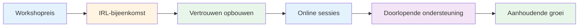
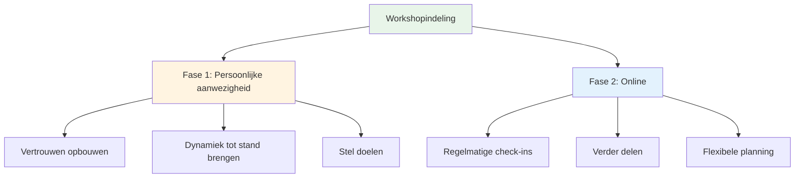
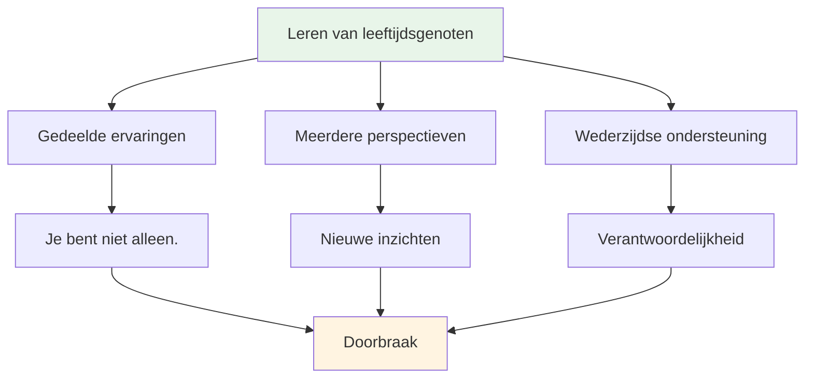

# Workshop

## Forums voor topspelers

Onze workshops zijn intieme fora waar topspelers ervaringen delen en openhartig praten over het spel, prestaties en mentale uitdagingen.

::: tip Wat maakt onze workshops anders?
**Kleine, zorgvuldig geselecteerde groepen topspelers in een veilige omgeving voor openhartige discussie.** Dit is geen college, maar een leerervaring waarbij je samen ervaringen deelt, leert en groeit.
:::

## Formaat

### Kleine groepen
::: info Groepsgrootte
- **6-8 spelers** per workshop
- Zorgvuldig samengestelde groepen voor optimale dynamiek.
- Een veilige ruimte voor openhartige discussie.
- Iedereen draagt bij, iedereen leert.
:::

### Hybride aanpak

| Fase | Formaat | Doel | Voordelen |
|-------|--------|---------|----------|
| **Eerste ontmoeting** | Persoonlijk (IRL) | Fundament bouwen | Vertrouwen, verbondenheid, groepsdynamiek |
| **Doorlopende sessies** | Online | Houd het momentum vast | Regelmatige ondersteuning, flexibiliteit, verantwoordelijkheid |

::: details Fase 1: Persoonlijke ontmoeting
**Waarom eerst een persoonlijke ontmoeting?**
- Bouw vertrouwen en een band op door elkaar persoonlijk te ontmoeten.
- Zorg voor een goede groepsdynamiek en veiligheid.
- Stel samen intenties en doelen vast.
- Creëer de basis voor eerlijke uitwisseling.

**Wat er gebeurt:**
- Introductie en doelstellingen
- Initiële oefeningen en discussies
- Het vaststellen van groepsnormen
- Het opbouwen van een goede verstandhouding
:::

::: details Fase 2: Online sessies
**Waarom online voor doorlopende procedures?**
- Regelmatig inchecken zonder te reizen
- Blijven delen en ondersteunen
- Flexibele planning voor drukke spelers
- Behoud de vaart erin tussen de fysieke bijeenkomsten.

**Wat er gebeurt:**
- Voortgangsupdates en uitdagingen
- Ondersteuning door lotgenoten en probleemoplossing
- Controlemomenten om de verantwoordelijkheid te waarborgen
- Voortdurend leren en groeien
:::

## Wat u kunt verwachten

### Onderwerpen die we onderzoeken

| Gebied | Focus | Resultaten |
|------|-------|----------|
| **Mentale training** | Stroomtoestand, druk, focus | Constante topprestaties |
| **Persoonlijke uitdagingen** | Angsten, blokkades, frustraties | Doorbraken en oplossingen |
| **Leren van elkaar** | Gedeelde ervaringen | Nieuwe perspectieven en inzichten |
| **Praktische hulpmiddelen** | Technieken en oefeningen | Directe aanvraag |
| **Gemeenschap** | Doorlopende ondersteuning | Groei op lange termijn |

::: tip Workshopervaring
- 🧠 Diepgaande discussies over de mentale aspecten van het spel
- 💬 Het delen van persoonlijke ervaringen en uitdagingen
- 🤝 Peerondersteuning en verantwoording
- 🛠️ Praktische oefeningen en technieken
- 👥 Een community van spelers die zich inzetten voor groei
:::

## Wie kan zich aansluiten?

::: info Ideale deelnemers
- **Topspelers** die de volgende stap willen zetten
- Spelers die de techniek **onder de knie hebben**, maar meer willen.
- Voor wie geïnteresseerd is in het **mentale spel**.
- Spelers die openstaan voor **eerlijke zelfreflectie**.
- Toegewijd aan **persoonlijke groei**
:::

::: warning Niet geschikt als
- Je bent alleen op zoek naar technische coaching.
- Je vindt het niet prettig om in een groep te delen.
- Je bent niet bereid om je kwetsbaar op te stellen.
- Je wilt snelle oplossingen zonder er zelf werk aan te hoeven besteden.
:::

## De waarde van leren van leeftijdsgenoten

::: tip Waarom peer groups werken
Topspelers staan voor unieke uitdagingen die anderen niet begrijpen. In een workshop ben je samen met mensen die het wél snappen: de druk, de verwachtingen, de mentale strijd. Dit creëert een veilige omgeving voor echte groei.
:::

## Klaar om mee te doen?

::: info Volgende stappen
Workshops worden aangekondigd in onze [Nieuws](/en/news/) sectie. Houd onze website in de gaten voor aankomende data en registratie-informatie.
:::

