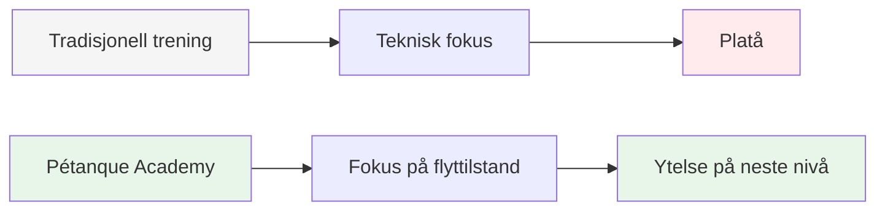
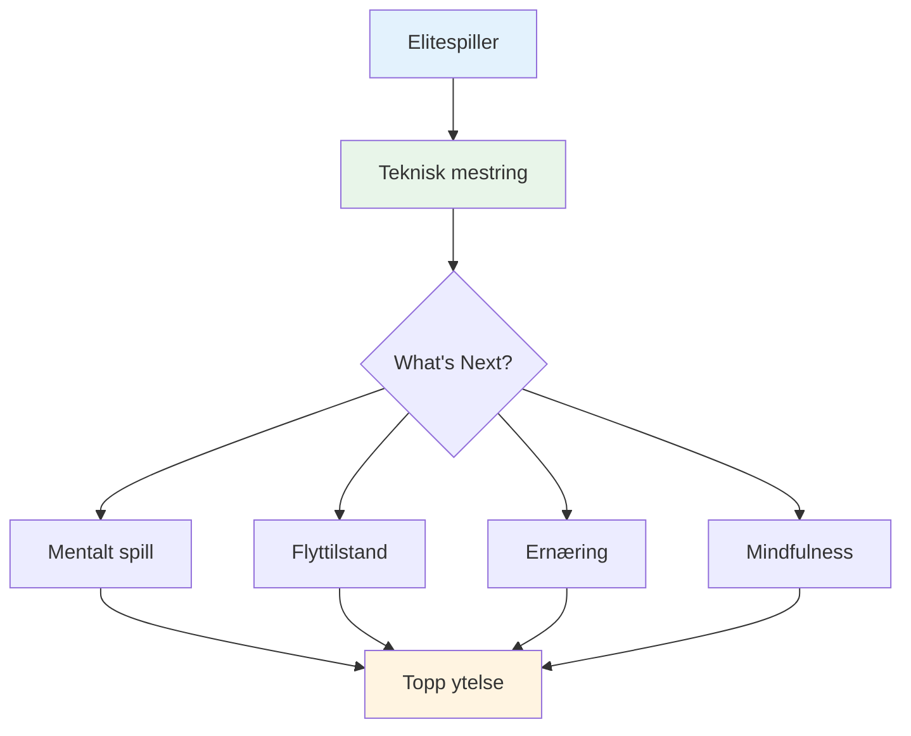

# Ambisjon

<AdBanner />

Vårt oppdrag er å hjelpe elitespillere med å ta det neste steget i sin utvikling.

::: tip Vår visjon
**Forvandle elitespillere fra teknisk dyktige til mentalt ustoppelige.** Vi hjelper deg med å komme til flyttilstanden der perfekte boules blir et naturlig uttrykk for mestringen din.
:::

## Går utover teknikk

Tradisjonell trening fokuserer sterkt på tekniske aspekter – grep, holdning og slipp. Selv om disse grunnleggende elementene er viktige, har elitespillere allerede mestret dem.

::: info Gjennombruddet
**Det neste nivået handler ikke om å perfeksjonere teknikk – det handler om å komme inn i flyttilstanden.**

Vi hjelper spillere med å gå fra et teknisk treningsperspektiv til et **flytperspektiv (i sonen)**, hvor perfekte boules blir et naturlig uttrykk for mestring snarere enn en bevisst innsats.
:::

## Reisen

## Hva vi tilbyr

| Tilbud | Beskrivelse | Påvirkning |
|----------|-------------|--------|
| **Workshops** | Små grupper av elitespillere (6–8) | Dyp læring og støtte fra likemenn |
| **Utdannelse** | Mentale aspekter ved topprestasjon | Praktiske teknikker du kan bruke umiddelbart |
| **Fellesskap** | Likesinnede spillere som tøyer grenser | Ansvarlighet og delt vekst |
| **Helhetlig tilnærming** | Ernæring, tankesett og mental trening | Fullstendig ytelsesoptimalisering |

::: tip Hvorfor det fungerer
Elitespillere har allerede det tekniske grunnlaget. Det som skiller god fra stor er evnen til å oppnå best mulig ytelse under press. Det er det vi fokuserer på.
:::

## Vår tilnærming

### 1. Trening i flyttilstand
Lær å gå inn i &quot;sonen&quot; konsekvent, ikke ved et uhell.

### 2. Mental styrke
Utvikle rutiner, mindfulness og pressmestring.

### 3. Smart ernæring
Gi hjernen din drivstoff for stabilt fokus og stødige hender.

### 4. Læring fra likemenn
Del erfaringer med andre elitespillere i et trygt og støttende miljø.

::: info Klar til å ta neste steg?
Utforsk vår [Utdanning](/no/utdanning/)-seksjon eller lær om våre [Workshops](/no/workshop).
:::

<AdBanner />

