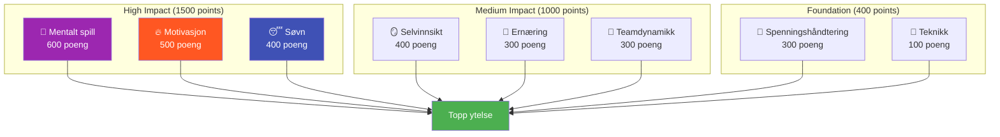

# Ambisjon

Vårt oppdrag er å hjelpe elitespillere med å ta det neste steget i sin utvikling.

::: tip Vår visjon
**Forvandle elitespillere fra teknisk dyktige til mentalt ustoppelige.** Vi bruker en datadrevet tilnærming for å identifisere forbedringsområder med størst effekt.
:::

## 8-faktor ytelsesmodellen

Forskning og erfaring viser at prestasjoner på elitepétanque avhenger av **8 sammenkoblede faktorer**. De fleste spillere investerer for mye i teknikk, samtidig som de neglisjerer faktorene som faktisk skiller bra fra storslått.

### Hvorfor teknikk har den laveste vekten

::: warning Den ubehagelige sannheten
**Teknikk står bare for 100 av totalt 2900 poeng** i modellen vår.

Dette er ikke fordi teknikk ikke betyr noe – det er fordi elitespillere allerede har utviklet tilstrekkelig teknikk. Den marginale forbedringen fra å perfeksjonere utløsningen er liten sammenlignet med å optimalisere søvnen, håndtere spenninger eller styrke det mentale spillet.
:::

## Avkastningsprinsippet

Ikke alle forbedringer er like. Vi bruker **Avkastning på investeringen (ROI)**-beregninger for å identifisere hvor opplæringstiden din vil ha størst innvirkning.

| Ditt nivå | Faktorvekt | Avkastningspotensial |
|------------|---------------|---------------|
| Lav ferdighet i høyvektsområde | Høy (f.eks. 600) | **Maksimum** |
| Høy ferdighet i høyvektsområde | Høy (f.eks. 600) | Lav (avtagende avkastning) |
| Lav ferdighet i lavvektsområde | Lav (f.eks. 100) | Moderat |
| Høy ferdighet i lavvektsområde | Lav (f.eks. 100) | **Minimal** |

**Eksempel:** Å forbedre søvnen din fra 30 % til 60 % (høy vektfaktor, lav nåværende ferdighet) vil sannsynligvis ha større effekt enn å forbedre teknikken fra 75 % til 85 % (lav vektfaktor, allerede høy ferdighet).

## De 8 faktorene forklart

| Faktor | Vekt | Hva det dekker |
|--------|--------|----------------|
| 🧠 **Mentalt spill** | 600 | Tankemønstre, fokus, selvtillit, tilgang til flyttilstand |
| 🔥 **Motivasjon** | 500 | Drivkraft, formål, målorientering, utholdenhet |
| 😴 **Søvn og restitusjon** | 400 | Kvalitetshvile, protokoller før konkurranse, energihåndtering |
| 🪞 **Selvinnsikt** | 400 | Nøyaktig selvoppfatning, blindsonegjenkjenning, bruk av tilbakemeldinger |
| 🥗 **Ernæring** | 300 | Blodsukkerstabilitet, hydrering, drivstofftilførsel til konkurranser |
| 🤝 **Teamdynamikk** | 300 | Kommunikasjon, tillit, rolleklarhet, teambidrag |
| 💆 **Spenningsmestring** | 300 | Fysisk avslapning, pustekontroll, optimal oppvåkning |
| 🎯 **Teknikk** | 100 | Fysisk mekanikk, kasterepertoar, konsistens |

## Oppdag din vei

Vi har laget et **gratis vurderingsverktøy** som analyserer dine nåværende nivåer på tvers av alle 8 faktorer og beregner dine personlige forbedringsprioriteringer.

::: info Ta vurderingen
**[→ Start din spillerutviklingsvurdering](/no/vurdering/)**

Om 5 minutter får du:
- Radardiagrammet ditt på tvers av alle 8 faktorene
- Anbefalinger rangert etter avkastning for hva man bør jobbe med
- Lenker til spesifikt utdanningsinnhold for dine toppprioriteringer
- Mulighet for å få tilbakemeldinger fra kolleger/lagkamerater
:::

## Hva vi tilbyr

| Tilbud | Beskrivelse | Lenke |
|----------|-------------|------|
| **Vurderingsverktøy** | Identifiser forbedringsområder med høyest avkastning | [Ta vurdering](/no/vurdering/) |
| **Utdanningsmoduler** | Dyptgående innhold om alle 8 faktorene | [Bla gjennom Utdanning](/no/utdanning/) |
| **Workshops** | 3–4 timers økter for grupper på 6–8 spillere | [Verkstedguide](/no/guider/verksted/) |
| **Treningsleirer** | Helgeintensivkurs som blander teori og praksis | [Leirguide](/no/guider/treningsleir/) |

## Vår tilnærming

### 1. Vurder først
Start med ærlig selvevaluering. Få tilbakemeldinger fra fagfeller for å identifisere blinde flekker.

### 2. Prioriter etter avkastning
Fokuser på faktorer med høy vekt, der du har rom for å vokse – ikke det som føles komfortabelt.

### 3. Lær vitenskapen
Forstå *hvorfor* noe fungerer, ikke bare *hva* man skal gjøre.

### 4. Øv bevisst
Bruk teknikker i trening før konkurranse. Bygg vaner, ikke bare kunnskap.

### 5. Vurder regelmessig
Følg med på fremgangen din. Prioriteringene dine vil endre seg etter hvert som du forbedrer deg.

::: tip Klar til å ta neste steg?
**[→ Start med vurderingen](/no/vurdering/)** — Det er gratis og tar 5 minutter.

Eller utforsk vår [Utdanning](/no/utdanning/)-seksjon for å dykke ned i hvilken som helst av de 8 faktorene.
:::

