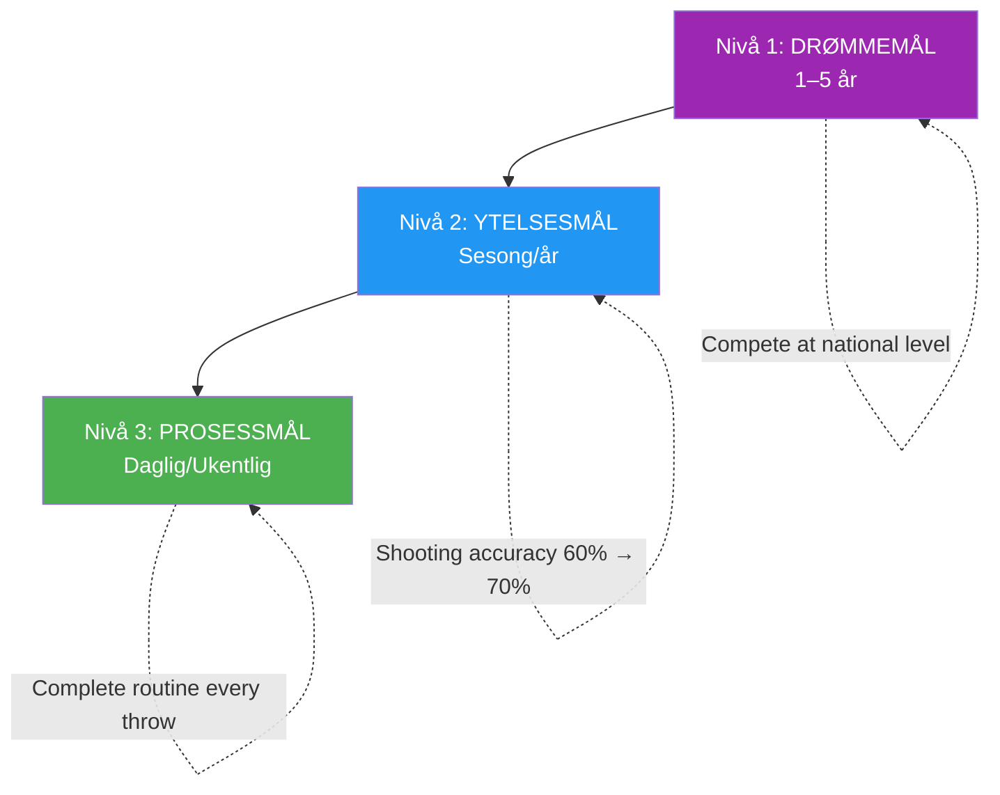

# Målsetting for eliteutøvere

> «De riktige målene akselererer utviklingen; de gale målene skaper frustrasjon og stagnasjon.»

Målsetting virker enkelt: bestem deg for hva du vil, og jobb mot det. Men målsetting på elitenivå er mer nyansert.

::: warning Vanlig feil
**De fleste spillere setter seg bare resultatmål** («Vinn mesterskapet»). Du kan ikke kontrollere resultatene – bare prosessen som fører til dem.
:::

---

## Utover grunnleggende mål

| Problemer med resultatmål | Hvorfor det er et problem |
|----------------------|-------------------|
| Kan ikke kontrollere resultatene fullt ut | Skaper hjelpeløshet |
| Skaper press uten retning | Angst uten handling |
| Suksess eller fiasko er binært | Ingen delvise seire |
| Veileder ikke daglig praksis | Hva gjør du egentlig? |

Elitemålsetting går dypere.

---

## Målhierarkiet

### Nivå 1: Drømmemål (1–5 år)
Dine ultimate ambisjoner:
- &quot;Konkurrer på nasjonalt nivå&quot;
- &quot;Bli anerkjent som en eliteskytter&quot;
- &quot;Vinne et stort mesterskap&quot;

::: info Retning, ikke handling
Disse gir retning og motivasjon, men er ikke handlingsrettede i det daglige.
:::

### Nivå 2: Prestasjonsmål (sesong/år)
Målbare forbedringer i spillet ditt:
- &quot;Øk skytepresisjonen fra 60 % til 70 %&quot;
- &quot;Reduser upålagte feil med 25 %&quot;
- &quot;Utvikle en pålitelig plombée&quot;

Disse er innenfor din kontroll og målbare.

### Nivå 3: Prosessmål (daglig/ukentlig)
Tiltakene som driver forbedring:
- &quot;Komplett rutine før skuddet på hvert kast&quot;
- &quot;Øv visualisering i 10 minutter daglig&quot;
- &quot;Tren skyteteknikk 3 ganger i uken&quot;

::: tip Full kontroll
**Prosessmålinger er 100 % kontrollerbare.** Fokuser her for maksimal effekt.
:::

## SMART+-rammeverket

Gå utover grunnleggende SMART-mål:

### Spesiell
Ikke «forbedre pekingen min», men «utvikle en konsistent demiportée som lander innenfor 30 cm fra målet fra 8 meter».

### Målbar
Definer hvordan du skal spore fremdriften:
- Suksessrateprosenter
- Konsistensmålinger
- Videoanalysemarkører

### Oppnåelig, men utfordrende
Målet bør kreve vekst, men være realistisk. En skytter på 60 % som sikter mot 65 % er oppnåelig; en sikting mot 90 % er fantasi.

### Relevant
Mål må knyttes til dine større ambisjoner og adressere faktiske svakheter, ikke bare det som er lett å forbedre.

### Tidsbundet
Sett tydelige tidsfrister:
- &quot;Innen sesongslutt&quot;
- &quot;Innen 3 måneder&quot;
- &quot;Ved det nasjonale mesterskapet&quot;

### + Personlig meningsfull
Målet må bety noe for DEG, ikke bare treneren eller lagkameratene dine. Indre motivasjon opprettholder innsatsen når fremgangen er langsom.

## Prosess vs. resultatfokus

### Problemet med resultatmål

«Å vinne kampen» skaper problemer:
- Angst for ting du ikke kan kontrollere
- Distraksjon fra utførelsen
- Alt-eller-ingenting-tenkning
- Press uten veiledning

### Kraften i prosessmål

«Utfør rutinen min før bruk perfekt» tilbyr:
- Full kontroll
- Klart fokus
- Umiddelbar tilbakemelding
- Bygger naturlig mot resultater

### Balansen

Bruk resultatmål for motivasjon og retning. Bruk prosessmål for daglig fokus og gjennomføring.

## Målsetting for ulike faser

### Lavsesong
Fokus på utviklingsmål:
- Tekniske forbedringer
- Fysisk kondisjonering
- Mental ferdighetsbygging
- Utvider palett av pledd

### Før-sesong
Overgang til integrering:
- Kombinere ferdigheter i kamplignende forhold
- Testing av forbedringer i vennskapelig konkurranse
- Raffinering av strategier

### Konkurransesesong
Skift til ytelse og prosess:
- Å gjennomføre det du har utviklet
- Prosess mål for hver kamp
- Minimale tekniske endringer

### Etter konkurransen
Refleksjon og planlegging:
- Analyser hva som fungerte
- Identifiser områder for vekst
- Sett mål for neste syklus

## Vanlige feil ved målsetting

### For mange mål
Fokus er makt. 2–3 viktige mål slår 10 spredte mål.

### Kun resultatmål
Uten prosessmål har du ingen plan.

### Ingen fleksibilitet
Mål bør tilpasses ny informasjon. Streng overholdelse av utdaterte mål er sløsing med innsats.

### Sammenligningsbaserte mål
«Vær bedre enn [spiller]» legger suksessen din i andres hender.

### Forsømmelse av mentale mål
Tekniske og fysiske mål dominerer, men mentale ferdigheter avgjør ofte hvem som vinner.

## Implementeringsstrategier

### Skriv dem ned
Det er betydelig større sannsynlighet for at skriftlige mål blir nådd.

### Gjennomgå regelmessig
Ukentlig gjennomgang holder målene presentert og gir mulighet for justeringer.

### Del selektivt
Del med de som vil støtte, ikke undergrave.

### Visualiser prestasjon
Se regelmessig for deg at du når målene dine – følelsen, øyeblikket.

### Spor fremgang
Det som blir målt, blir håndtert. Hold oversikt.

## Når målene ikke blir nådd

Uoppnådde mål er ikke feil – de er data:

1. **Analyser**: Hvorfor ble det ikke oppnådd?
2. **Lær**: Hva lærer dette deg?
3. **Juster**: Endre målet eller tilnærmingen
4. **Fortsett**: Utholdenhet slår perfeksjon

## Det mentale spillet om mål

Mål påvirker psykologien:
- **For lett**: Kjedsomhet, selvtilfredshet
- **For vanskelig**: Angst, motløshet
- **Akkurat passe**: Engasjement, flyt, vekst

Finn det optimale punktet der målene utfordrer uten å bli overveldende.

---

| *Relatert: [Introduksjon til målsetting](/no/utdanning/motivasjon/) | [SMART-mål](/no/utdanning/motivasjon/smarte-mål) | [Planlegging av utviklingen din](/no/utdanning/motivasjon/planlegging)* |

