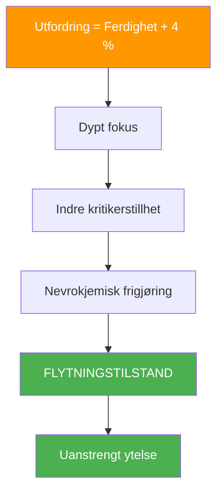
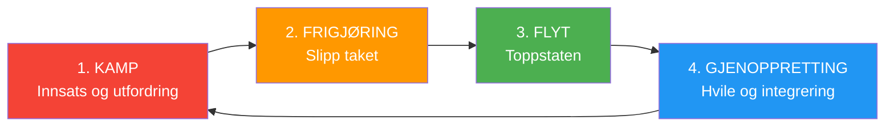

# Vitenskapen bak flyttilstander

> «Flyttilstand – den magiske sonen der alt klikker, tiden går saktere og ytelsen føles uanstrengt.»

Det er ikke mystisk; det er nevrologisk. Å forstå vitenskapen bak flyt kan hjelpe deg med å få tilgang til det mer konsekvent.

::: tip Viktig innsikt
Flyt er ikke noe du kan tvinge frem – men du kan skape forholdene som gjør det mer sannsynlig at det dukker opp.
:::

---

## Hva er flyt?

Psykolog Mihaly Csikszentmihalyi definerte flyt som «en tilstand av fullstendig fordypning i en aktivitet». I petanque har du opplevd det: kast som føles automatiske, avgjørelser som kommer umiddelbart, en følelse av at du og spillet er ett.

### Strømningsegenskaper

| Karakteristisk | Hvordan det føles |
|----------------|-------------------|
| **Fullstendig absorpsjon** | Spillet er alt som finnes |
| **Tap av selvbevissthet** | Ingen indre kritiker |
| **Forvrengt tid** | Timer føles som minutter |
| **Intrinsisk motivasjon** | Spiller for gledens skyld |
| **Følelse av kontroll** | Selvtillit uten arroganse |
| **Øyeblikkelig tilbakemelding** | Øyeblikkelig justering |

## Nevrovitenskapen om flyt

### Hjerneendringer under flyt

Når du går inn i flyt, gjennomgår hjernen din målbare endringer:

**Forbigående hypofrontalitet**
Den prefrontale cortexen – ansvarlig for selvkritikk, tvil og overtenking – blir mindre aktiv. Dette er grunnen til at flyt føles uanstrengt: din indre kritiker blir stille.

**Nevrokjemisk cocktail**
Flyt utløser en kraftig blanding av nevrokjemikalier:
- **Dopamin**: Forbedrer fokus og mønstergjenkjenning
- **Noradrenalin**: Øker opphisselse og oppmerksomhet
- **Endorfiner**: Skaper følelser av velvære
- **Anandamid**: Fremmer lateral tenkning
- **Serotonin**: Produserer ettergløden av blodstrømmen

**Hjernebølgeskift**
Flyt korrelerer med skifter fra betabølger (normal våken bevissthet) til alfa- og thetabølger (avslappet årvåkenhet og kreativitet).

## Flytutløserne

Forskning har identifisert forhold som gjør flyt mer sannsynlig:

### 1. Balanse mellom utfordring og ferdigheter

Flyt oppstår når utfordringen litt overstiger ditt nåværende ferdighetsnivå – omtrent 4 % utenfor komfortsonen din. For lett fører til kjedsomhet; for vanskelig fører til angst.

**I petanque:**
- Søk motstandere litt bedre enn deg selv
- Sett personlige utfordringer i kampene
- Varier praksisen din for å opprettholde engasjementet

### 2. Klare mål

Du må vite hva du prøver å oppnå. Vage intensjoner utløser ikke flyt.

**I petanque:**
- Definer intensjonen din for hvert kast
- Ha klare kampmål
- Kjenn din rolle i teamet

### 3. Umiddelbar tilbakemelding

Flyt krever at du vet hvordan du gjør det i sanntid.

**I petanque:**
- Resultatet av hvert kast er umiddelbart synlig
- Les terrengresponsen
- Legg merke til kroppens tilbakemeldinger

### 4. Dyp konsentrasjon

Flyt krever fokusert oppmerksomhet uten distraksjoner.

**I petanque:**
- Utvikle rutinen din før bruk
- Øv på mindfulness
- Eliminer eksterne distraksjoner

### 5. Følelse av kontroll

Følelsen av at handlingene dine betyr noe, og at du kan påvirke resultatene.

**I petanque:**
- Stol på treningen din
- Fokuser på hva du kan kontrollere
- Aksepter usikkerhet i utfall

---

## Hvorfor du ikke kan tvinge frem flyt

::: warning Flytparadokset
**Å prøve å komme inn i flyt hindrer det.** Flyt oppstår når du slutter å prøve å oppnå den og rett og slett engasjerer deg fullt ut i aktiviteten.
:::

Dette er fordi:
- Å prøve aktiverer prefrontal cortex (det motsatte av flyt)
- Selvovervåking forstyrrer fordypningen
- Målfokus erstatter prosessfokus

## Skape betingelser for flyt

Selv om du ikke kan tvinge frem flyt, kan du skape forhold som gjør det mer sannsynlig:

### Før konkurransen
- Tilstrekkelig søvn og ernæring
- Riktig oppvarming
- Positiv mental tilstand
- Klare intensjoner

### Under konkurransen
- Hold fokus på nåtiden
- Bruk rutinen din før bruk
- Gi slipp på resultatene
- Stol på kroppen din

### Miljøfaktorer
- Minimer distraksjoner
- Komfortabel fysisk tilstand
- Passende utfordringsnivå
- Støttende teamdynamikk

---

## Flytsyklusen

Strømning er ikke konstant – den følger en syklus:

Å forstå denne syklusen hjelper deg med å:
- Ikke tving flyt i kampfasen
- Gjenkjenne når man skal gi slipp
- Tillat riktig gjenoppretting mellom strømningstilstander

## Flyt i Team Pétanque

Flyt kan være smittsomt. Når én spiller går inn i flyt, kan det spre seg til lagkamerater gjennom:
- Positiv energi og kroppsspråk
- Redusert press på andre
- Økt kollektiv selvtillit
- Synkronisert lagrytme

## Bygge flytkapasitet

Som med alle ferdigheter, forbedres tilgangen til flyt med øvelse:

### Daglige praksiser
- Mindfulness-meditasjon (bygger oppmerksomhetskontroll)
- Visualisering (primerer nevrale baner)
- Fysisk trening (bygger ferdighetsgrunnlaget)

### I trening
- Øv på grensen av din evne
- Oppretthold fullt engasjement selv i øvelser
- Legg merke til når flyt oppstår og hva som gikk forut for den

### Langsiktig utvikling
- Øk utfordringsnivåene gradvis
- Utvikle robuste rutiner før inntak
- Bygg mental motstandskraft for kampfasen

---

| *Relatert: [Sonen](/no/utdanning/mentalt spill/sonen/) | [Å gå inn i sonen](/no/utdanning/mentalt spill/sonen/å gå inn i sonen) | [Mindfulness-teknikker](/no/utdanning/mentalt-spill/mindfulness/teknikker)* |

